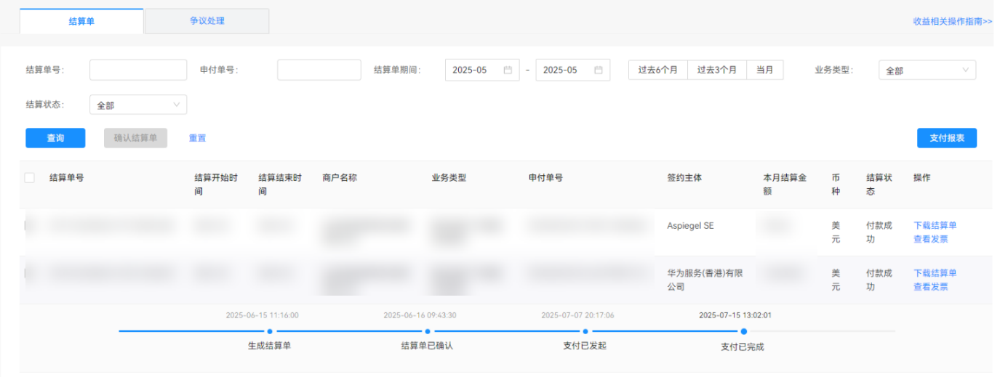
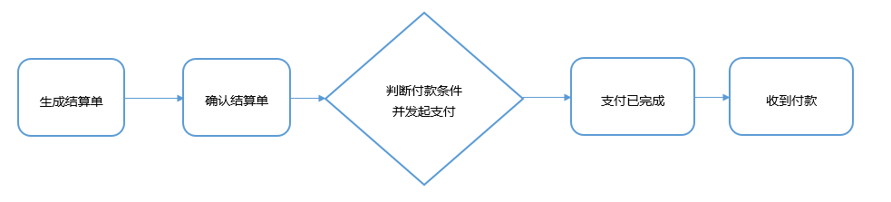
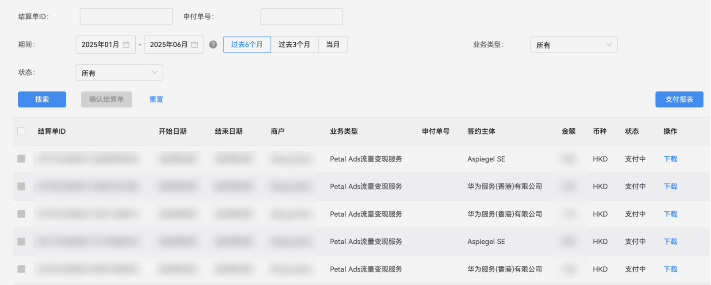

#### 概述

变现服务中产生收益之后，您可以在[开发者联盟管理中心](https://developer.huawei.com/consumer/cn/console#/serviceCards/)页面中，点击右上角的“管理中心”，进入后选择**我的账户> 收益****>****结算单**，选择您需要确认的结算单，核对收益信息。

#### 结算流程

开发者分成收入的结算分成为5个步骤：

流量变现平台的预估收益是近期收益的估算值，并不一定与最终收益一致，具体以结算单收益数据为准。

#### 操作步骤

1. 生成结算单

   根据您已经签署的[《华为开发者商户服务协议》](https://developer.huawei.com/consumer/cn/doc/start/merchantserviceagreement-0000001052848245)，每个日历月为一个结算期，在结算期的第15天华为会提供结算单。系统会根据不同[签约主体](https://developer.huawei.com/consumer/cn/doc/start/agreement-0000001052728169#ZH-CN_TOPIC_0000001052728169__section193661656462)：Aspiegel SE和华为服务（香港）有限公司，分别发起支付申请，您可能会收到多份结算单，按照多个结算单汇总的金额才是对应月份的全部收益。
2. 确认结算单

   在[开发者联盟管理中心](https://developer.huawei.com/consumer/cn/console#/serviceCards/)页面中，点击右上角的“管理中心”进入后选择“我的账户>收益>结算单”，选择您所要确认的结算单，核对收益信息，若核对无误，请确认结算单。如果您未在15个日历日内进行任何操作，系统将自动确认结算单；若金额核对有异议或需要暂缓支付，可以发起争议。
3. 判断付款条件并发起支付

   如果确认结算单后，单击“结算单”显示“支付已发起”，表示华为已经在申请支付。

   如果确认结算单后，单击“结算单”未显示“支付已发起”，表示没达到付款条件或被暂缓支付。

   **付款条件：**

   * 如果您的单个主体累计交易金额满足200欧元或者累计达到6个月，华为将在您确认结算单后的30个日历日发起支付，支付到“商户服务>跨境收款账户”，您可以单击每个结算单，查看申付单号。
   * 如果您的单个主体累计交易金额小于200欧元，则结算日期会顺延至累计满200欧元。如果6个月内未达到200欧元，华为将按6个月内累计的金额进行结算。详细结算流程请参照 [自助结算指南](https://developer.huawei.com/consumer/cn/doc/start/checkoutguide-0000001053128363)。

   **暂缓支付：**

   * 中国大陆开发者在中国大陆区域以外进行流量变现服务业务，必须在商户服务中添加并维护跨境收款账户（即可以接收外币的中国大陆银行收款账号），如果未维护跨境收款账户，华为将暂缓支付，需维护好之后再发起支付。
   * 如果您收到银行问询邮件（因银行政策问题，会对收款行进行问询）未及时回复，华为将暂缓支付。您需查看您在开发者联盟账户[实名认证时填写的邮箱](https://developer.huawei.com/consumer/cn/doc/start/itrna-0000001076878172)是否收到邮件并及时回复。

   

   中国大陆出海开发者在维护跨境收款账户时，需与银行确认收款是否强制要求提供合作证明（带有公章的协议）。若要求提供合作证明，请下载协议模板（协议模板请参考：[香港协议模板](https://alliance-communityfile-drcn.dbankcdn.com/FileServer/getFile/cmtyPub/011/111/111/0000000000011111111.20260105162005.49088459759258370705716952887136%3A50001231000000%3A2800%3A9F9907A960222E9F4F44DF522E553918B669194D17B77ADA3ACBA04AC61DF220.docx?needInitFileName=true)、[阿斯比格协议模板](https://alliance-communityfile-drcn.dbankcdn.com/FileServer/getFile/cmtyPub/011/111/111/0000000000011111111.20260105162005.69365109467873636542115201515465%3A50001231000000%3A2800%3A2FF7042B41EC010E9FA2671870F93E2472F3FAF8E45CE882D6937A4E293B6978.docx?needInitFileName=true)），并按照分发区域分开填写合作证明（分发区域和签约主体说明请参考：**[分发区域和签约主体](https://developer.huawei.com/consumer/cn/doc/start/agreement-0000001052728169#section193661656462)**）。填写完成后，请提[工单](/docs/monetize/monetization/support-0000001061434261)给华为申请盖章协议，并附上以下信息：《鲸鸿动能媒体服务协议》PDF原件、填写完毕的协议，收款银行名称，您的邮箱地址（盖章审核时间30个自然日，后续会通过邮箱给予反馈，请注意查收）。
4. 支付已完成

   您想查看已确认的结算单进行到哪一步流程，您可直接点击结算单号，然后看到对应的结算单的状态。

   

   * 支付已完成未收到付款，您可以检查您维护的收款银行信息是否失效，也可以在您维护的开发者实名认证邮箱里面查看下是否有付款失败的邮件通知，确认没问题后可以发邮件给petalads@huawei.com， 我们按照这个确认邮件来申请重新发起支付，若还是有疑问的话，可以[联系我们](/docs/monetize/monetization/support-0000001061434261)。
   * 支付已完成已收到付款，但收到的款和结算单不一致，是因为在支付过程中可能存在中转行或您的收款行收取手续费的情况（因各银行政策不一样，付款到不同的地方、不同的汇路方式，都可能有不同的百分比，需要自行咨询您的收款银行），华为的付款行是不收取手续费，如果涉及退款的话，退款会有手续费。
5. 收到付款

   当结算单的页面中显示支付已完成的状态时，是指通过银行已经发起了付款，但是因为中转行等原因可能过几天才能到您维护的收款账户。

   若核对汇款通知后仍存在金额不一致的情况，建议向您的收款行咨询是否存在手续费扣除的情况。
