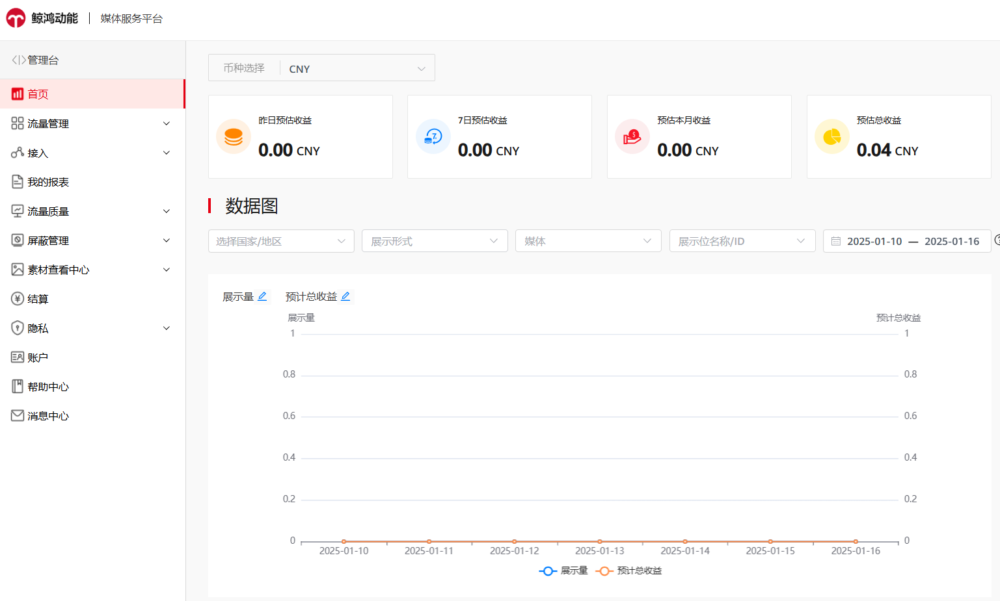
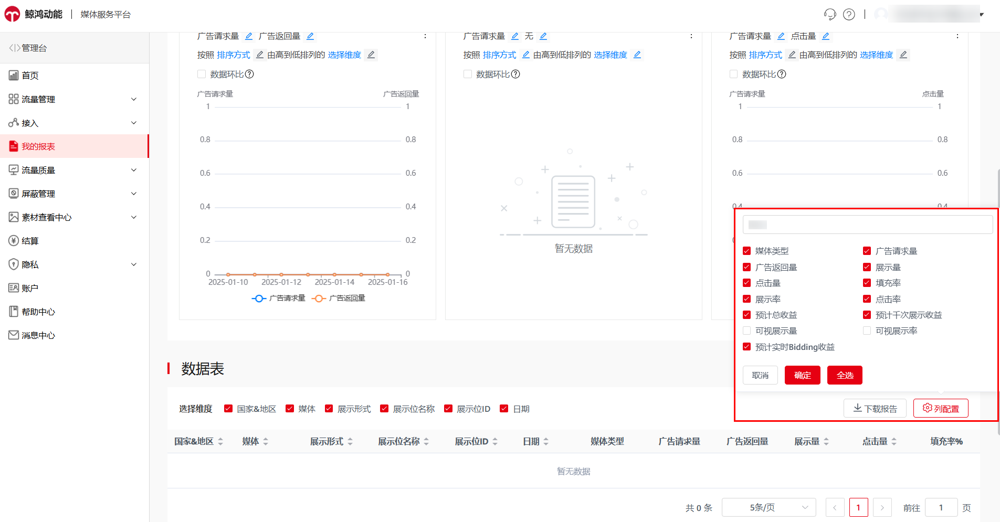
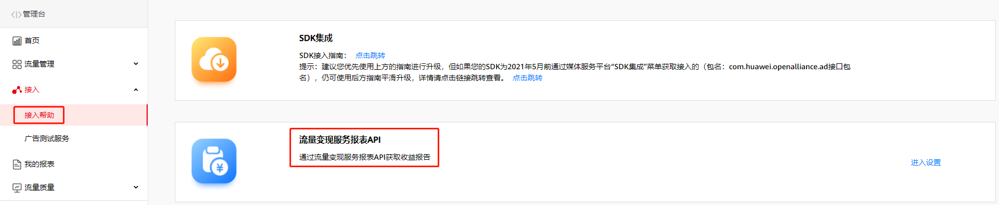

#### 1. 数据报表

1. 【首页】为预估收益数据总览，该数据是分成后的预估收益，而非实际结算的收益。

   
2. 【我的报表】为预估收益数据总览和广告明细数据表，支持查看截止当日的实时数据、列指标自主配置并可一键下载。

   

#### 2. 流量变现服务报表API

开发者可以通过调用报表API获取收益数据，包括请求量、返回量、点击率等。

1. 入口为【鲸鸿动能媒体服务平台】-【接入帮助】-【流量变现服务报表API】- 点击【进入设置】。

   
2. 在设置中，点击【启用】以获取客户端ID和密钥。
3. 调用流量变现服务报表API。
4. 获取变现报表数据。

详细文档请参考[流量变现服务报表API](https://developer.huawei.com/consumer/cn/doc/development/HMSCore-Guides/reporting-api-dev-process-0000001051294727)

#### 3. 指标定义

1. 广告请求量：向广告服务器请求的广告的个数。
2. 广告返回量：广告服务器返回的广告的个数。
3. 填充率：广告返回量与广告请求量的比率。
4. 展示量：可视展示量经过平台线上规则过滤后的实际展示。
5. 展示率：展示量与广告返回量的比率。
6. 点击量：应用中展示的广告所获得的有效点击次数。
7. 点击率：点击量与展示量的比率。
8. 可视展示量：广告（图片或者视频）露出50%，并且时长500ms记为一次可视展示量。
9. 可视展示率：可视展示量与广告返回量的比率。
10. 预估总收益：这笔金额是估算值，会在结算日前进行调整，以确保准确性。
