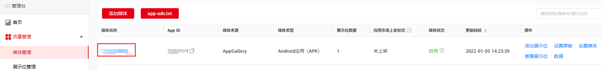
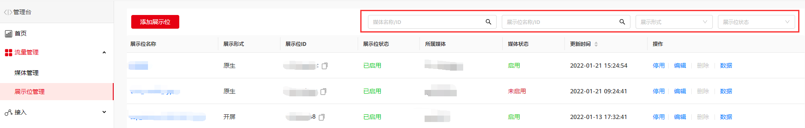
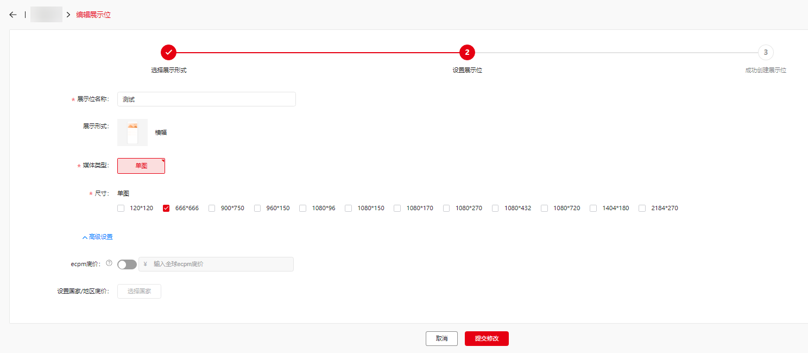
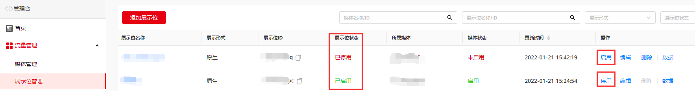

#### 展示位操作

在媒体信息详情页中，你可以执行展示位的查询、停用、编辑和删除操作。

#### 查看展示位信息

选择**媒体管理**，单击媒体名称，进入媒体信息详情页，查看展示位信息。

#### 搜索展示位

若同时接入了很多展示位，您可以使用右上角的搜索框，支持按照展示位名称或者ID、展示位形式以及状态对展示位进行筛选。

#### 编辑展示位

在**展示位列表**中，单击**编辑**，进入展示位编辑页面。调整需要变更的信息，单击**提交修改**，完成展示位编辑。

#### 启用/停用展示位

单击**启用/停用**完成展示位的启用和停用，展示位的状态也会随之更改为**已启用/已停用。**

#### 删除展示位

单击“**删除**”完成对展示位的删除，只有在**“已停用”**状态下的展示位才可被删除。
