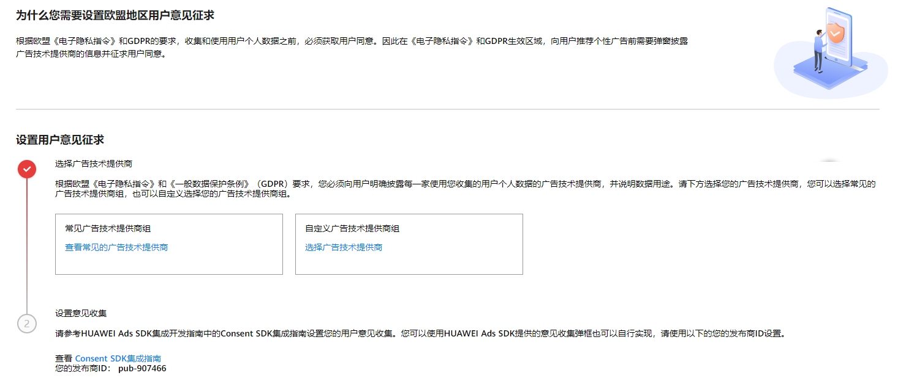

设置欧盟地区用户意见征求是根据欧盟《电子隐私指令》和GDPR的要求，收集和使用用户个人数据之前，必须获取用户同意。因此在《电子隐私指令》和GDPR生效区域，向用户推荐个性化广告前需要弹窗披露广告技术提供商的信息并且征求用户的同意。

在此设置中，您可以选择个性化广告提供方，其中HUAWEI DSP必选，其他广告提供方为可选。默认选择常见广告技术提供商，流量变现服务平台接入的所有三方DSP。

1. 单击**隐私**，选择**欧盟地区隐私设置**进入设置界面。
2. 选择**常见广告技术提供商组**或者**自定义广告技术提供商组**，在**自定义广告技术提供商组**中华为DSP位必选，其他为可选，保存选择。

   
3. 设置**意见收集，**详情参考：[高级设置](https://developer.huawei.com/consumer/cn/doc/development/HMSCore-Guides/publisher-service-advanced-settings-0000001050064972)。

根据欧盟《电子隐私指令》和《一般数据保护条例》（GDPR）要求，收集和使用用户个人数据前需获得用户同意。因此在向用户推送个性化广告前需要弹窗通知用户，告知用户将使用其个人数据的广告技术提供商和数据用途，并获取同意。否则只能推送非个性化广告。
