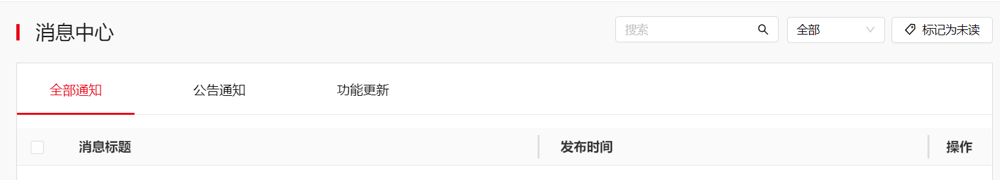

消息中心分为全部通知、公告通知、功能更新三个类型，点击页签可切换查看不同类型下的消息。

* 可以筛选已读与未读的消息。
* 可以选中当前页面中全部展示的所有消息，然后标记为已读。也支持单独选中某条消息然后标记为已读。

  未读的消息有红点提示，已读后红点会消失。
* 消息支持删除，但会弹出二次确认界面。
* 单击某条消息从左到右区域中的任一区域，左滑出现消息详情框。未读消息变为已读。点击详情框右上角的X，或者点击详情框外的任何区域，详情框收起。同一时间只能展示一条消息。
* 最多展示200条消息，默认删除发布时间超过一年的消息（不管消息是否已读）。
