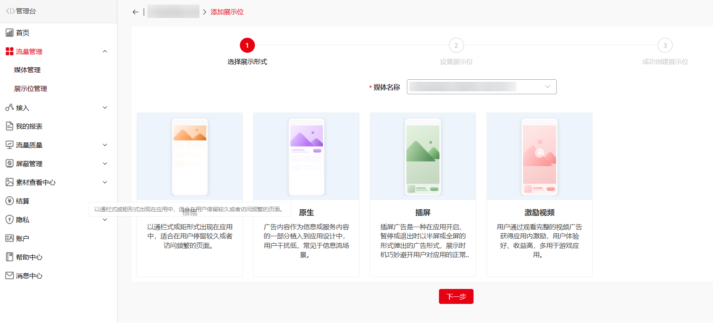
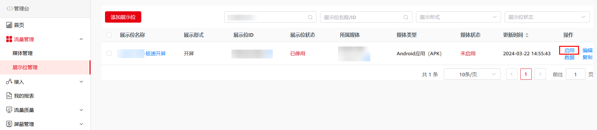
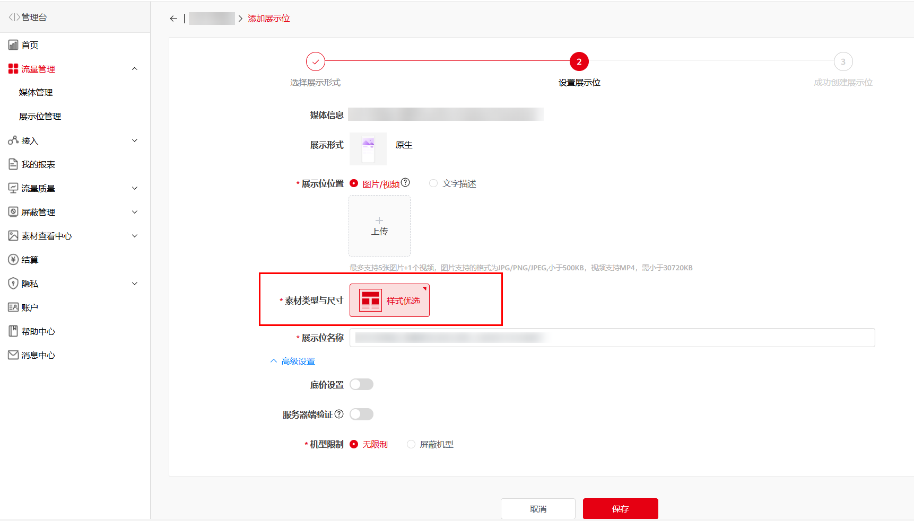

1. 添加展示位

* Android应用（APK）可创建“开屏”、“横幅”、“原生”、“插屏”、“激励视频”展示位。
* 快应用/快游戏可创建“横幅”“原生”、“激励视频”、“插屏”展示位，如需开屏，可在原生展示位下创建自渲染。
* 鸿蒙应用可创建“开屏”、“横幅”、“原生”、“插屏”、“激励视频”、“视频贴片”展示位。
* 元服务可创建“横幅”、“原生”、“插屏”、“激励视频”、“视频贴片”展示位

  

2. 展示位管理规范

* 展示位名称规范为“XX（应用完整名称）XX场景XX样式”，例如：华为视频信息流大图。
* 多个相似场景的位置可使用同一个展示位ID，建议无需创建多个展示位ID。
* 选择展示位的形式和尺寸，填写 “展示位名称”，提交后即可集成自测。

3. Android应用（APK）/快应用/快游戏的展示位设置

   1）极速开屏

   * 极速开屏展示位在Android应用（APK）媒体创建成功后自动生成，无需创建，仅需【启用】极速开屏开关。

     
   * 竖版应用图片支持1080\*1620和1080\*1920，视频支持720\*1280和1080\*1920，建议全选。
   * 横版应用图片支持1920\*1080，视频支持1280\*720，建议全选。

   2）开屏

   * 竖版应用图片支持1080\*1620和1080\*1920，视频支持720\*1280和1080\*1920，建议全选。
   * 横版应用图片支持1920\*1080，视频支持1280\*720，建议全选。

   3）横幅

   * 横幅的自动刷新时间间隔，支持在媒体服务平台灵活设置【媒体管理-展示位】，该功能的生效条件是集成鲸鸿动能SDK时不调用setBannerRefresh接口。
   * 横幅请求间隔默认值60s，尺寸选择1080\*170。

   4）原生

   * 应用/快应用的信息流场景，“原生”下可选择图文1080\*607（推荐），225\*150（单图），225\*150（三图），720\*1280和1080\*1620，视频可选640\*360。
   * 应用图标场景在“原生”形式下选择图文160\*160。
   * 快游戏互推盒子场景在“原生”形式下选择图文160\*160。

   5）插屏

   * 插屏视频支持640\*360、720\*1280和1280\*720，建议全选。
   * 插屏场景的图片形式可使用“原生”创建并自渲染，尺寸选择1080\*607；也可创建独立插屏样式，图片尺寸选择1080\*1920和1920\*1080。

   6）激励视频

   * 展示位支持视频格式，选择640\*360、720\*1280和1080\*1920尺寸，利于填充。

4. 鸿蒙应用/元服务的展示位设置

   展示位支持多种模版样式，持续上新，按需选用即可。

   
