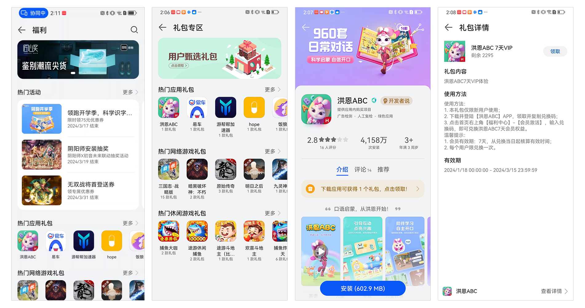
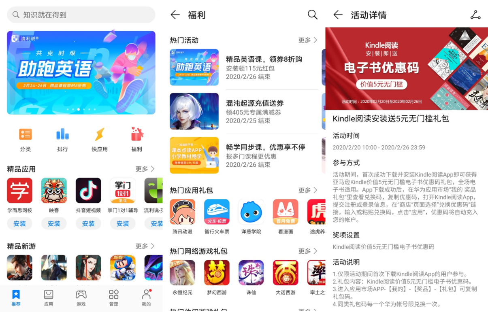

华为礼包主要是联运应用及游戏开发者提供给用户的权益，如代金券、打折券、VIP特权等。根据礼包活动性质及发放对象可分为：新机礼包和常规礼包。

# 1. 新机礼包

新机开机礼包作为终端产品销售卖点，礼包的发放对象为具体的终端机型用户。入选的应用除可以获得多方位的营销宣传（包括但不限于产品发布会、产品介绍页面、官方微博等）外，还会在用户首次开机联网时进行push推广。

注意：

鉴于终端产品销售期较长，因此参与开机礼包的应用需要保证在终端产品销售期内都能提供礼包。

# 2. 常规礼包

常规礼包分为普通礼包和活动礼包，上线后将通过应用市场、游戏中心的资源进行推广（包括但不限于礼包专区页面、应用详情页、福利页等）。

## 2.1 普通礼包

## 2.2 活动礼包

