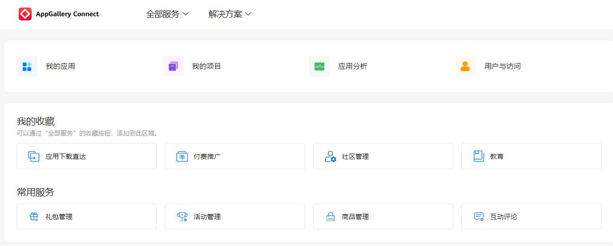
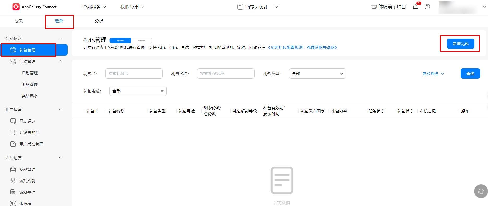
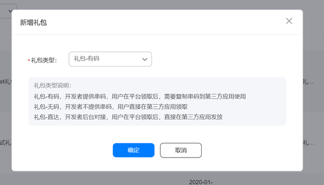

礼包管理面向联运应用及游戏开发者开放，支持全球化礼包配置。礼包创建并通过审核后，在华为应用市场、游戏中心展示。符合条件的礼包，将额外获得曝光位置。功能入口：华为开发者联盟 &gt; 管理中心 &gt; 应用服务 &gt; AppGallery Connect &gt; 我的应用 &gt; 运营 &gt; 礼包管理”

<strong>1. 普通礼包</strong>

（1）礼包-有码：以串码（兑换码）形式向用户派发礼包，用户领取后获得一个串码，根据使用说明在应用（游戏）中兑换获取福利。

（2）礼包-无码：在应用详情页仅展示礼包相关信息，用户下载安装应用成功后，可根据礼包介绍领取使用。

（3） 礼包-直达：不以串码形式呈现，用户在游戏中心（游戏详情页、游戏浮标等）完成领取动作后，开发者在游戏内直接为该用户账号的指定区服/角色发放礼包内容。

<strong>2. 礼包创建流程</strong>

AppGallery&gt;[AppGallery Connect](http://developer.huawei.com/consumer/cn/service/josp/agc/index.html "AppGallery Connect") &gt; 我的应用 &gt; 运营 &gt; 活动运营 &gt; 礼包管理 。2.1 新增礼包

2.2 选择礼包类型

2.3 操作说明

（1）礼包不能跨区域发布，若应用发布了海外区域，一个礼包只能在中国大陆站点、对应海外区域等其中的一个区域发布，同一个区域下支持多选国家。

（2）创建礼包-直达，需要提前做好服务器对接并通过相关测试，对接文件参考[《礼包-直达对接流程及相关说明》](https://communityfile-drcn.op.dbankcloud.cn/FileServer/getFile/cmtyManage/011/111/111/0000000000011111111.20200709174658.92268211240541710525056070294079:50001231000000:2800:02439B8E8F080D26344C7F42147D73680BF0C13055FD78DC696CB76BD7723310.zip?needInitFileName=true))。如您没有通过服务器对接测试，则创建的礼包-直达将不会被审批通过。

（3）查询礼包审核意见：AppGallery Connect &gt; 我的应用 &gt; 运营 &gt; 活动运营 &gt; 礼包管理 ，将鼠标放置于审核意见缩略文字上方，可查看具体审核意见。

<strong>3. 礼包状态查询</strong>

礼包创建成功后，开发者可以通过【礼包管理】界面查询礼包状态/审核意见等；也可以通过礼包筛选条件（如礼包ID/应用ID/礼包类型等）查询。查询礼包审核意见：AppGallery Connect &gt; 我的应用 &gt; 运营 &gt; 活动运营 &gt; 礼包管理 ，将鼠标放置于审核意见缩略文字上方，可查看具体审核意见。

<strong>4. 礼包任务状态说明</strong>

|  |  |  |
| --- | --- | --- |
| 任务状态 | 礼包状态 | 开发者可做操作 |
| 草稿 | 未上线 | 编辑（保存、提交）删除 |
| 新建驳回 | 未上线 | 编辑（保存、提交）删除 |
| 新建通过 | 上线 | 追加礼包、编辑（保存、提交）、下线 |
| 更新驳回 | 上线 | 追加礼包、编辑（保存、提交）、下线 |
| 下线驳回 | 上线 | 追加礼包、编辑（保存、提交）、下线 |
| 下线通过 | 已下线 | 编辑（保存、提交） |
| 更新待提交 | 上线 | 追加礼包、编辑（保存、提交）、下线 |

<strong>5. 礼包字段配置说明及审核规范</strong>（以礼包-有码为例）

|  |  |
| --- | --- |
| 礼包字段 | 说明 |
| 应用名称 | 可选择已经上架或审核通过未上架的应用（游戏）。 |
| 礼包价值 | 非必填项，按照单用户礼包实际价值填写，输入数字需保留小数点两位。 |
| 礼包发布区域和国家 | 国内礼包统一勾选中国大陆。 |
| 礼包串码文件 | 1.创建时上传数量不得少于3000份。  2.文件格式必须是ANSI编码的txt格式。  3.文件中每行一条数据排列，请勿添加其他注释。  4.礼包串码只能由英文大小写字母、数字和少量特殊符号（仅支持英文下划线和英文分隔符）组成。  5.文件中不能存在重复码。  6.文件大小不能超过100MB。 |
| 礼包有效期（展示时间） | 礼包在平台的实际展示时间段，统一勾选“有效期为发布地当地时间”。应用类：不可少于15天；游戏类：不可少于7天。 |
| 礼包解封等级 | 应用品类上传礼包时，礼包解封等级默认L1，置灰不可更改；游戏品类可参照[《游戏礼包分类说明》](http://obs.cn-north-1.myhwclouds.com/consumer/docattachment/e3705120568f9c4b11c4701cfbbe71d9dc85a53d184313e5013aed8a41680ddc/%E6%B8%B8%E6%88%8F%E7%A4%BC%E5%8C%85%E5%88%86%E7%B1%BB%E8%AF%B4%E6%98%8E.docx)设置对应礼包解封等级。 |
| 已添加语言 | 如果礼包发布区域为中国大陆时，已添加语言默认“简体中文”；选择非中国大陆时，已添加语言默认“美式英语”。 |
| 礼包名称 | 应用（游戏）名称+礼包名称，中间以空格隔开，不超过20字符。  示例：唯品会 30元优惠券             恋与制作人 新手礼包 |
| 展示排序 | 礼包在该应用内详情页的展示位排序，1表示展示在第一位，以此类推。 |
| 礼包图片 | 非必填项，如果没有上传则默认以应用（游戏）ICON展示。需上传完整正方形图标，尺寸：216x216px，图片不大于512KB，图片格式：png（上传jpg格式文件无效）。 |
| 礼包描述 | 应用礼包内的商品描述，格式为应用名称+商品名称，如有多个则一行显示一个（不得提供非本应用使用的礼包）。  示例：唯品会满300减30元券             唯品会满200减20元券  游戏礼包内的奖品描述，不同道具用中文顿号隔开，奖品与数量之间用星号“\*”隔开，不可手动换行。  示例：金币x1000、加速令x1H、华为专属皮肤（7天） |
| 礼包领取/使用描述 | 礼包在应用内的领取步骤、具体路径和使用说明，描述尽量详细简单明了（不得出现第三方应用商店名称；礼包领取/使用描述需与实际情况相符）。  示例：  领取方式：  1. 下载安装飞常准APP,打开客户端点击我的—活动中心—接送机用飞常准，惊喜优惠等你来领进入领取页面。  2. 登录/注册飞常准后，即可自动领取，领取成功后在我的优惠券中查看。  使用说明：  1. 限预订国内接送机使用。  2. 每个订单仅限使用一张优惠券，不可与其他优惠同时使用。  3. 优惠券仅可在有效期内使用，逾期作废。 |
