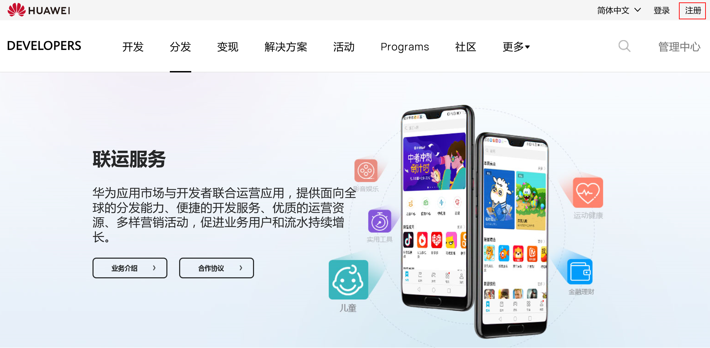

# 操作指南

## 1. 注册账号

如您还没有华为账号，请先点击“注册”按钮，进行账号注册。

账号注册分为“手机号”注册和“电子邮箱”注册。登录分为“账号登录”和“扫码登录”。

详细注册及登录流程请查看：[注册认证](https://developer.huawei.com/consumer/cn/doc/help/registerandlogin-0000001052613847)。

## 2. 企业实名认证

1. 注册成功后可直接进行实名认证，以便使用华为开发者联盟的全方位能力服务。详情流程参考[实名认证](https://developer.huawei.com/consumer/cn/doc/help/identityverfication-0000001053292680)。
2. 在访问联盟官网时，如果确认是登录状态，可以点击“立即前往实名认证”进入“企业实名认证”页面，选择“企业开发者”进行实名认证。详情流程参考[实名认证](https://developer.huawei.com/consumer/cn/doc/help/identityverfication-0000001053292680)。

## 3. 开通商户服务

在开发者联盟管理中心点击“设置”，选择“商户服务”，根据页面提示完善相关信息，确认信息无误且仔细阅读[《华为开发者商户服务协议》](https://developer.huawei.com/consumer/cn/devservice/doc/20202)后提交审核。开发者联盟将在1-2个工作日内完成审核，我们将会发送邮件至联系人邮箱通知审核结果，请注意查收。

 

请准确填写银行信息，华为将依据您填写的银行账户付款。如因您填写了错误的银行信息，或银行信息变更后未及时通知华为而带来付款延迟、付款错误等风险，您将自行承担，并赔偿因此给华为造成的损失。如果无法选取到对应的开户银行信息，请联系客服。

## 4. 接入SDK

### 华为应用内购买

如果应用内包含虚拟商品购买服务，您需要按照联运服务的要求接入华为账号和华为支付SDK，详细接入指导请参考[“联运应用SDK接入指南”](https://developer.huawei.com/consumer/cn/doc/AppGallery-connect-Guides/appgallerykit-devguide-0000001055436887)。如为游戏，请参考[“联运游戏SDK接入指南”](https://developer.huawei.com/consumer/cn/doc/development/AppGallery-connect-Guides/appgallerykit-devguide-game-0000001055156905)。

### 付费下载

如果应用为付费应用，则需要接入付费下载SDK。（华为付费下载服务在用户使用应用时提供购买校验，只授权用户使用购买的应用，从而保护应用的版权。）详细接入指导请进入“[华为付费下载服务](https://developer.huawei.com/consumer/cn/doc/development/AppGallery-connect-Guides/appgallerykit-paydownload-introduction)”华为付费下载服务”查看。 如果应用内有账号体系，请接入[“华为账号服务”](https://developer.huawei.com/consumer/cn/hms/huawei-accountkit)（即用户在应用内进行登录时可选择华为账号登录）。

## 5. 提交审核并上架

自行测试并验证应用各项功能服务后，在华为开发者联盟管理后台提交应用，通过审核并上架联运应用。 操作指导：点击查看[发布应用](https://developer.huawei.com/consumer/cn/doc/distribution/app/agc-release_app)。

### 联运应用上架前Checklist

| 检查项 | 检查子项 | 是否必选  (中国大陆) | 是否必选  (非中国大陆) | 审核要求 |
| --- | --- | --- | --- | --- |
| 基本信息 | 应用ID | 是 | 是 | 必须为创建应用时AppGallery Connect分配的应用ID。 |
| 包名 | 否 | 否 | 不强制以.huawei/.HUAWEI结尾。 |
| 华为账号 | 集成华为Account Kit SDK | 有条件必选 | 否 | <strong>中国大陆发布的应用</strong>：有账号体系则必须接入华为账号SDK。  <strong>中国大陆以外发布的应用</strong>：不强制要求。 |
| 账号登录入口 | 是 | 否 | <strong>中国大陆发布的应用</strong>：登录页面允许多种账号服务并存，且华为账号排在登录页面首位。  <strong>中国大陆以外发布的应用</strong>：允许有多种账号登录入口，但华为账号登录入口建议排在首位。 |
| 华为账号登录图标使用规范 | 是 | 是 | 使用华为账号登录图标必须遵守[《华为账号登录图标使用规范》](https://developer.huawei.com/consumer/cn/doc/development/HMSCore-Guides/dev-specifications-0000001050048916) |
| 应用内支付 | 集成华为IAP SDK | 是 | 是 | 必须集成华为IAP SDK。 |
| 支付渠道 | 是 | 是 | 支付仅能使用华为应用内支付。 |
| 升级 | 接口调用 | 是 | 否 | <strong>中国大陆发布的应用</strong>：应用启动时强制调用检测更新接口。  <strong>中国大陆以外发布的应用：</strong>不强制要求。 |

### 联运游戏上架前Checklist

| 检查项 | 检查子项 | 是否必选  (中国大陆) | 是否必选  (非中国大陆) | 审核要求 |
| --- | --- | --- | --- | --- |
| 基本信息 | 版权、版号资质 | 是 | 否 | <strong>中国大陆发布的游戏</strong>：参考华为应用市场[版权、版号资质](https://developer.huawei.com/consumer/cn/devservice/doc/80301)要求提交相关资质材料。  <strong>中国大陆以外发布的游戏：</strong>不强制要求。 |
| 应用ID | 是 | 是 | 必须为创建应用时AppGallery Connect分配的应用ID。 |
| 包名 | 是 | 是 | 必须以.huawei/.HUAWEI结尾。 |
| 开机标识 | 是 | 否 | <strong>中国大陆发布的游戏</strong>：游戏开始前需标明备案号、游戏著作权人、出版单位、批准文号、出版物号、健康游戏忠告信息（页面停留时间不宜过短，发布国家中包含中国大陆的游戏必须提供）。  <strong>中国大陆以外发布的游戏：</strong>不强制要求。 |
| 第三方SDK | 是 | 否 | <strong>中国大陆发布的游戏</strong>：  − 不允许接入任何第三方广告SDK。  − 不允许接入任何第三方聚合SDK。  − 不允许接入任何第三方支付SDK（应用有特殊情况，不能满足要求的，需向华为运营申请）。  <strong>中国大陆以外发布的游戏：</strong>  − 可以集成第三方SDK，但是华为手机只能使用华为应用内支付。 |
| 华为账号 | 集成华为Account Kit SDK | 有条件必选 | 有条件必选 | 应用有账号体系则必须接入华为账号服务SDK。 |
| 账号登录入口 | 是 | 否 | <strong>中国大陆发布的游戏</strong>：只允许有华为账号登录入口。  <strong>中国大陆以外发布的游戏</strong>：允许有多种账号登录入口，但华为账号登录入口建议排在首位。 |
| 华为账号登录图标使用规范 | 是 | 是 | 使用华为账号登录图标必须遵守[《华为账号登录图标使用规范》](https://developer.huawei.com/consumer/cn/doc/development/HMSCore-Guides/dev-specifications-0000001050048916) |
| 应用内支付 | 集成华为IAP SDK | 是 | 是 | 必须集成华为IAP SDK。 |
| 支付渠道 | 是 | 是 | 支付只能使用华为支付或者短代支付。 |
| 游戏服务 | 集成华为Game Service SDK | 是 | 否 | <strong>中国大陆发布的游戏</strong>：必须集成华为游戏服务SDK。  <strong>中国大陆以外发布的游戏</strong>：不强制要求。 |
| 游戏退出 | 是 | 否 | <strong>中国大陆发布的游戏</strong>：游戏必须具备用户退出按钮，退出功能由应用自行开发。  <strong>中国大陆以外发布的游戏</strong>：不强制要求。 |
| 升级 | 接口调用 | 是 | 否 | <strong>中国大陆发布的游戏</strong>：应用启动时强制调用检测更新接口。  <strong>中国大陆以外发布的游戏：</strong>不强制要求。 |

## 6. 评论维护

您的应用上架后，请注意每天监测并维护评论。评论功能入口：[AppGallery Connect](https://developer.huawei.com/consumer/cn/service/josp/agc/index.html#/)&gt; 我的应用&gt; 运营 &gt; 用户运营 &gt; 互动评论，即可方便快捷地查看用户评论、进行评论回复和发表/更新评论。详细文档请查看：[互动评论操作指南](https://developer.huawei.com/consumer/cn/doc/distribution/app/20400)。
