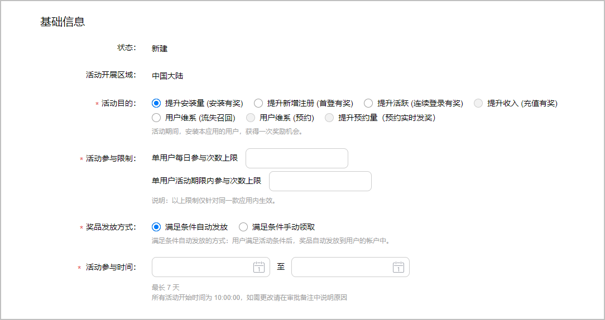
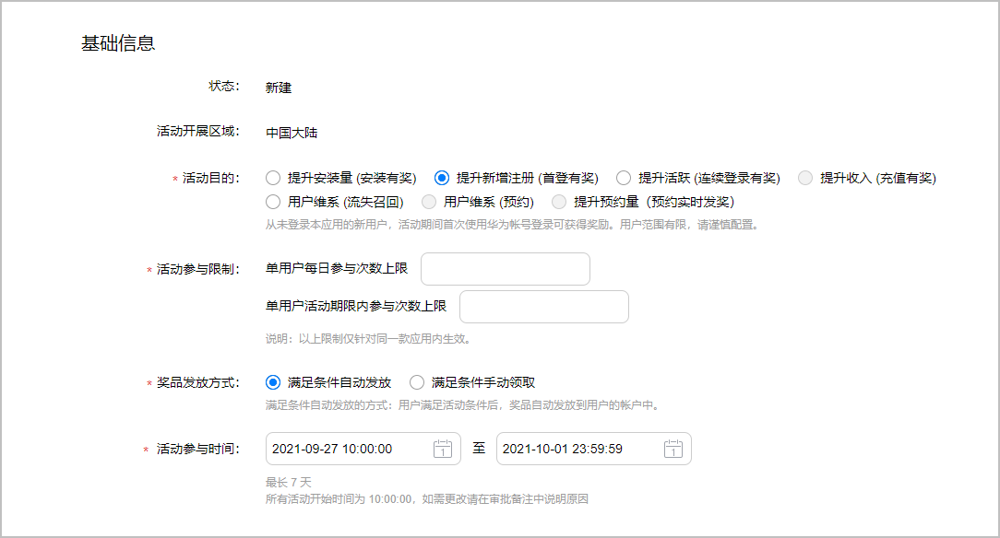
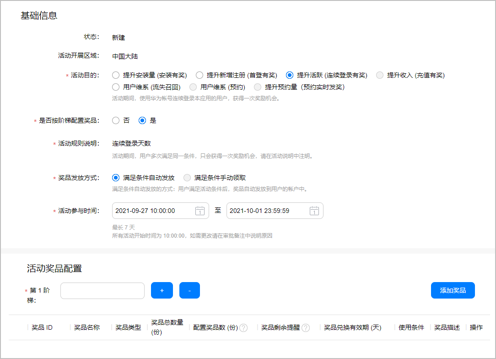
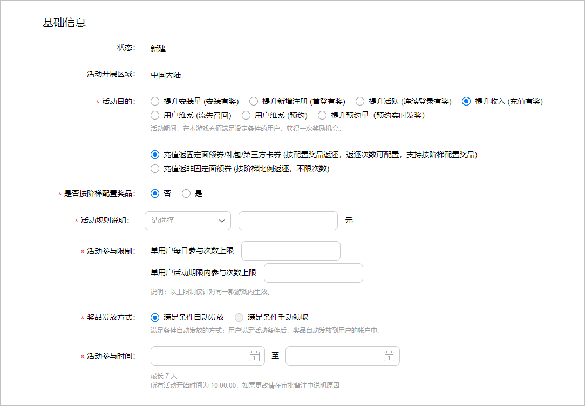
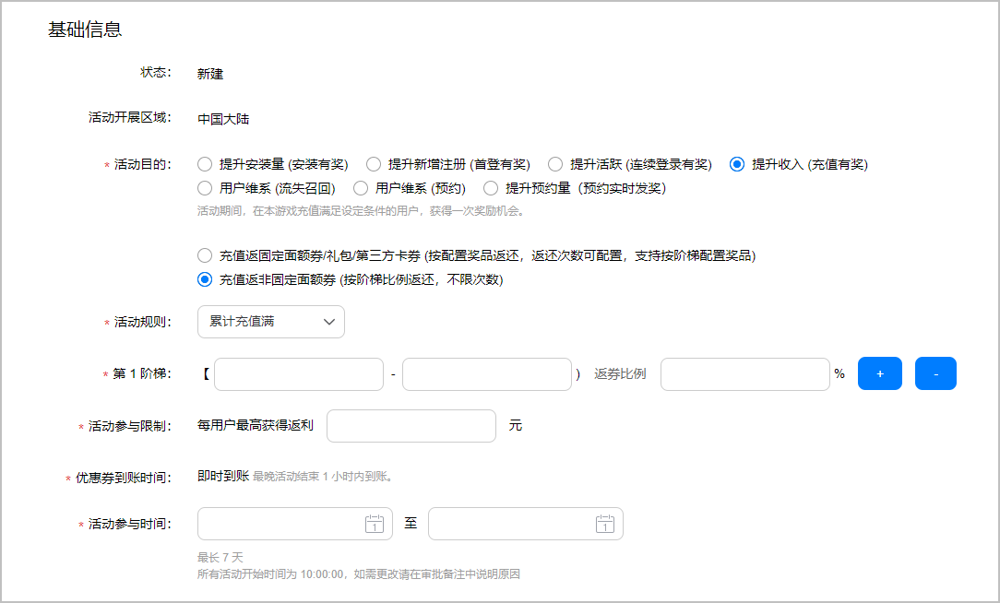
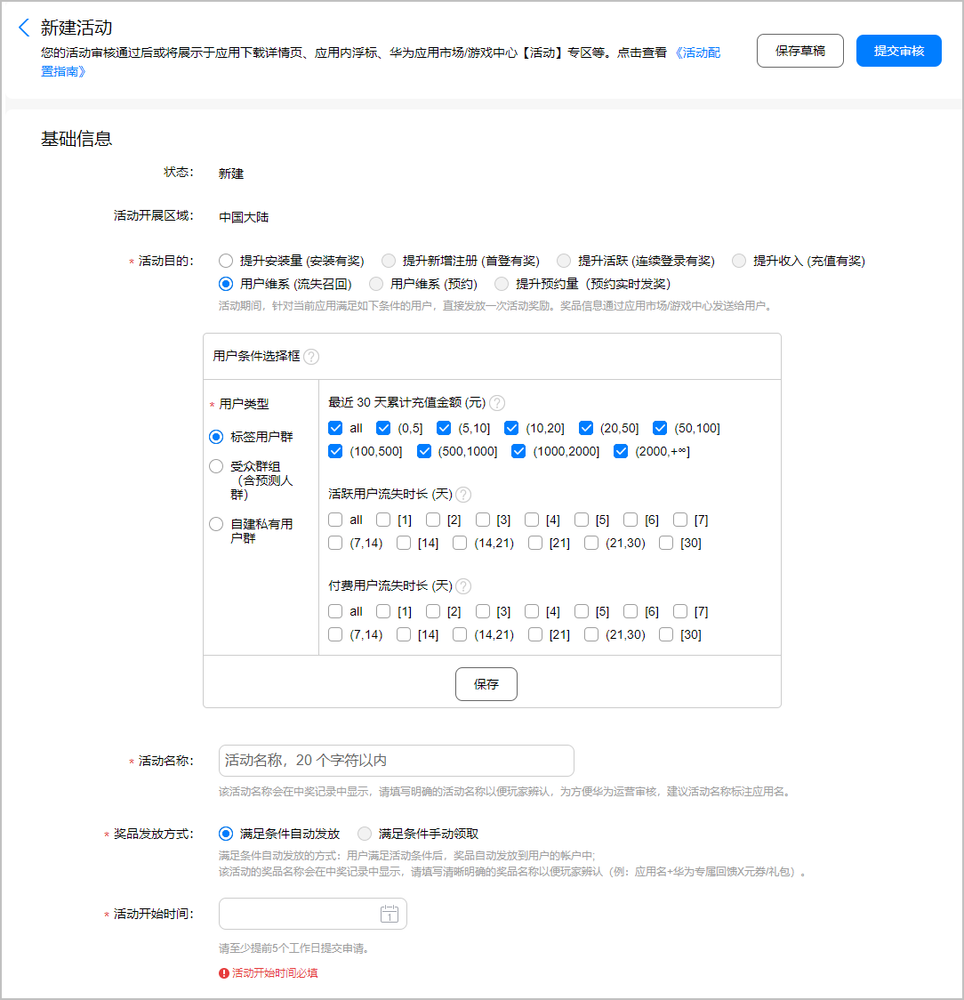
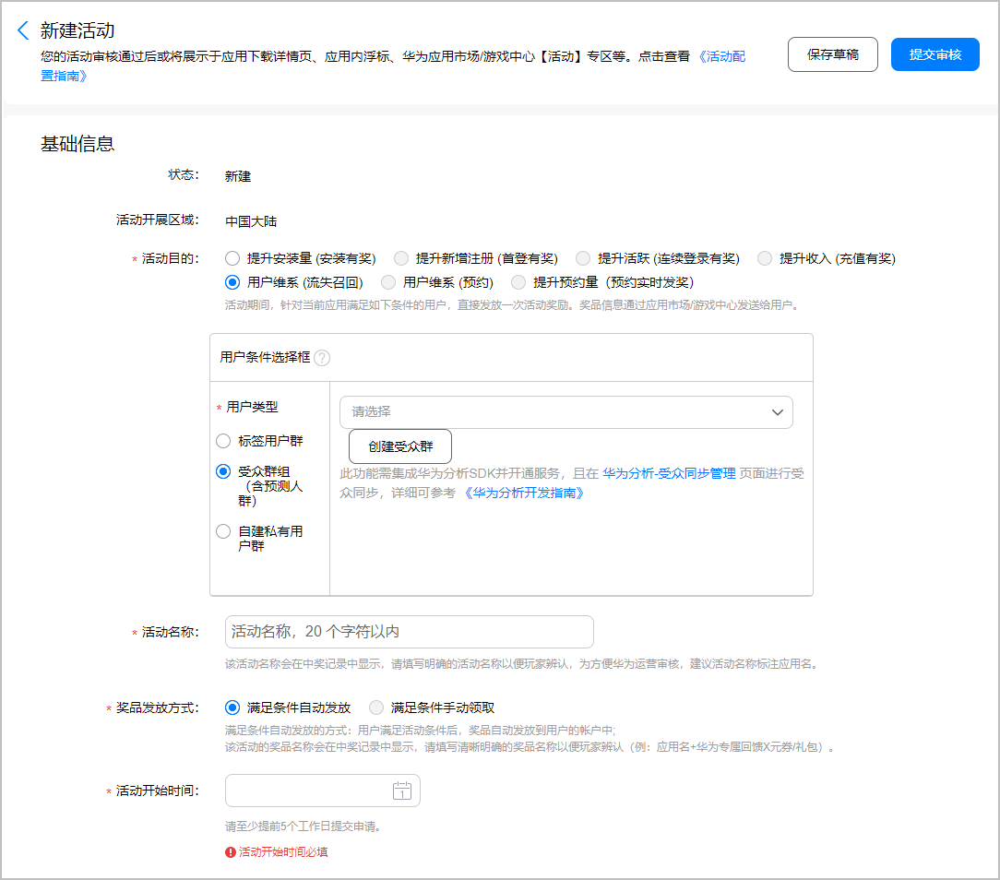
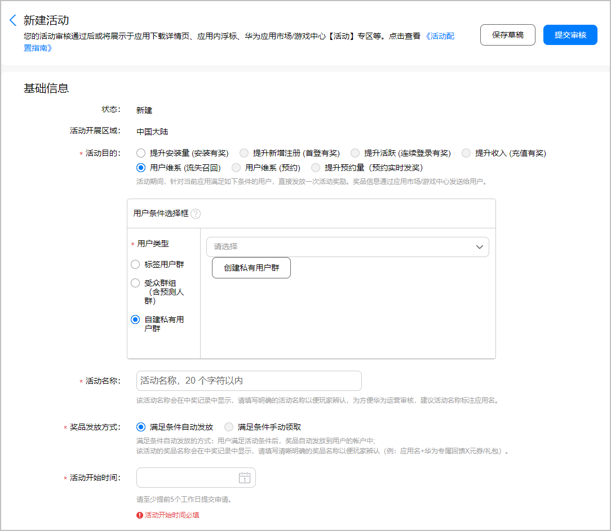
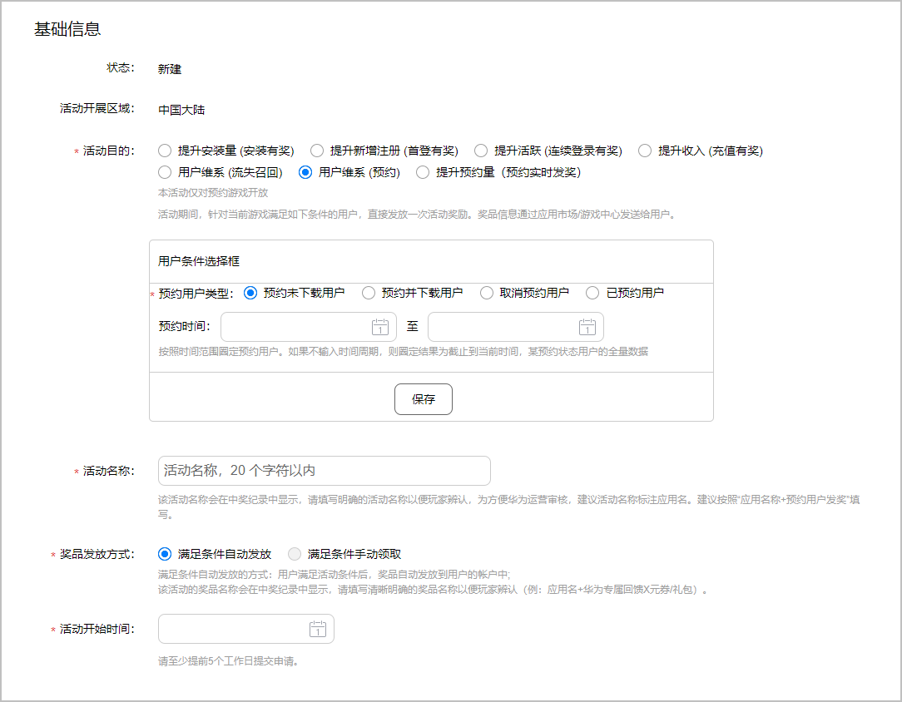
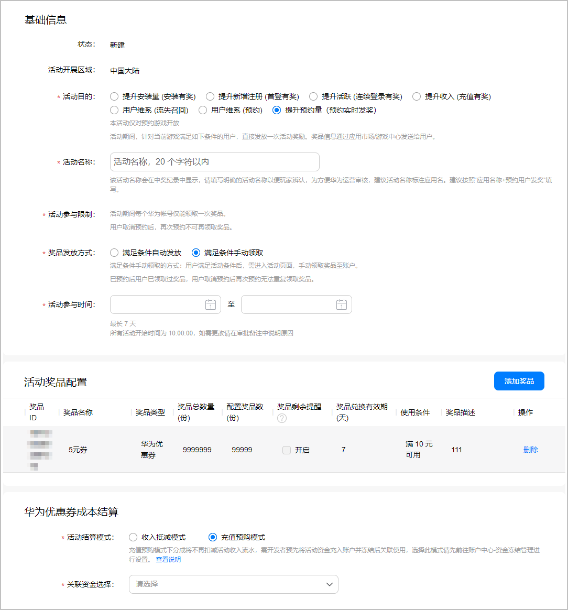

# 具体类型活动示例

## 安装有奖

活动期间，首次安装本应用的用户，获得一次奖励机会。

| 参数 | 说明 |
| --- | --- |
| 活动目的 | 选择“提升安装量（安装有奖）”。 |
| 活动参与限制 | “单用户每日参与次数上限”与“单用户活动期限内参与次数上限”均仅能填1。 |
| 奖品发放方式 | - 满足条件自动发放：若用户满足获奖条件后，奖品自动发放到用户的帐户中。 - 满足条件手动领取：用户满足获奖条件后，需进入活动页面手动领取奖品。 |
| 活动参与时间 | - 活动时间最长7天。 - 所有活动开始时间为10:00:00，如需更改请在审批备注中说明原因。 |

## 首登有奖

从未登录本应用的新用户，活动期间首次使用华为帐号登录可获得奖励。用户范围有限，请谨慎配置。

## 连续登录有奖

登录有奖：活动期间，使用华为帐号连续登录本应用的用户，获得一次奖励机会。

连续登录有奖：活动期间，使用华为帐号连续登录本应用的用户，获得一次奖励机会。

| 参数 | 说明 |
| --- | --- |
| 活动目的 | 选择“提升活跃活动（连续登录有奖）”。 |
| 是否按阶梯配置奖品 | - 否：表示您不按阶梯配置奖品。 - 是：表示您按阶梯配置奖品，可在“活动奖品配置”区域进行配置。 |
| 活动规则说明 | 若用户在活动期同时满足多个条件，只会获得一次奖励机会，请在活动规则中明确告知用户。 |
| 活动奖品配置 | 若选择按阶梯配置奖品，您需要进行如下操作：   - 在阶梯框里填写满足该阶梯需要连续登录的天数，数据取值范围1-9999999，仅支持整数。 - 点击“”，为该类型活动添加更高阶梯的奖品规则。后面阶梯的数字必须大于前面阶梯的数值，最多配置10个阶梯。 - 点击“”，删除任一阶梯，但至少保留一个阶梯。 - 点击“添加奖品”，为满足不同阶梯条件的用户添加对应的奖品。要求每个阶梯必须配置奖品且互不相同。 |
| 奖品发放方式 | - 满足条件自动发放：若用户满足获奖条件后，奖品自动发放到用户的帐户中。 - 满足条件手动领取：用户满足获奖条件后，需进入活动页面手动领取奖品。   说明：  若您选择按阶梯配置奖品，则该活动类型仅支持“满足条件自动发放”方式。 |

## 充值有奖

活动期间，在应用充值满足指定条件的用户，获得一次奖励机会。

- 奖品配置支持阶梯或非阶梯配置。
- 奖品分为固定面额与非固定面额。

### 充值返固定面额奖品

用户充值一定金额后，应用可以返还定额优惠券、礼包、第三方卡券。奖品配置支持阶梯或非阶梯配置。

| 参数 | 说明 |
| --- | --- |
| 活动目的 | - 活动目的选择“提升收入 (充值有奖)”。 - 返还方式选择“充值返固定面额券/礼包/第三方卡券 (按配置奖品返还，返还次数可配置，支持按阶梯配置奖品)”。 |
| 是否按阶梯配置奖品 | - 否：表示您不按阶梯配置奖品。 - 是：表示您按阶梯配置奖品，可在“活动奖品配置”区域进行配置。 |
| 活动规则说明 | 您可以配置如下任一充值类型：   - 单笔充值：活动期间，单笔现金充值达到指定额度，便可获得奖励。 - 首次充值：活动期间，首笔充值金额达到指定额度，便可获得奖励。建议您配置金额小于等于10元的首次充值门槛。  - 累计充值：活动期间，累计现金充值达到指定额度，便可获得奖励。   完成充值类型的选择后，需填写对应充值金额的门槛。 |
| 奖品发放方式 | 该活动类型仅支持“满足条件自动发放”方式。 |

### 充值返非固定面额券

用户充值一定金额后，应用只能返还非定额的优惠券，这些优惠券按照充值金额\*返券比例计算。若用户充值金额超过配置的最高阶梯，则按最高阶梯返还优惠券。

| 参数 | 说明 |
| --- | --- |
| 活动目的 | - 活动目的选择“提升收入 (充值有奖)”。 - 返还方式选择“充值返非固定面额券 (按阶梯比例返还，不限次数)”。 |
| 活动规则 | 您可以配置如下任一充值类型：   - 单笔充值：活动期间，单笔现金充值达到指定额度，便可获得奖励。 - 首次充值：活动期间，首笔充值金额达到指定额度，便可获得奖励。建议您配置金额小于等于10元的首次充值门槛。  - 累计充值：活动期间，累计现金充值达到指定额度，便可获得奖励。 |
| 第一阶梯 | 按阶梯配置奖品，您需要进行如下操作：   - 输入充值金额范围和返券比例。  - 点击“”，为该类型活动添加更高阶梯的奖品规则。后面阶梯的数字必须大于前面阶梯的数值，最多配置10个阶梯。 - 点击“”，删除任一阶梯，但至少保留一个阶梯。 |
| 活动参与限制 | 您需要填写每位用户最高获得返利的金额数，取值范围1-9999999。 |

## 流失召回

针对标签用户群、受众群组（包含付费标签用户群、活跃流失标签用户群、付费流失标签用户群、卸载受众群组等）、自建私有用户群直接发放一次活动奖励。

- 标签用户群

| 参数 | 说明 |
| --- | --- |
| 活动目的 | 选择“用户维系 (流失召回)”。 |
| 用户条件选择框 | - 最近 30 天累计充值金额 (元) ："all"表示最近30天有付费的用户，不含未付费用户。示例：7天所有流失用户——不要勾选此栏！不要勾选all！勾选此栏不包含未付费用户！ - 活跃用户流失时长 (天)：有使用过应用的，一段时间内未使用服务的用户群体。 说明：  仅可筛选流失1天至30天的用户。勾选“all”也不包括流失30天以上的用户。  - 付费用户流失时长 (天)：在联运应用或游戏中有过付费行为，一段时间内未付费的用户群体。仅筛选付费行为，包括不再登录所以没有付费行为的用户和正常登录但不再付费的用户。示例：筛选流失7日的付费用户——勾选活动用户流失时长[1]、[2]、[3]、[4]、[5]、[6]、[7]+付费流失时长[1]、[2]、[3]、[4]、[5]、[6]、[7]。 |
| 活动名称 | 该活动名称会在中奖记录中显示，请填写明确的活动名称以便用户辨认。为方便华为运营审核，建议活动名称标注应用名称。要求1-20个字符。 |
| 奖品发放方式 | 该活动类型仅支持“满足条件自动发放”方式。 |

- 受众群组（含预测人群）

此功能需集成华为分析SDK并开通服务，且在“华为分析 &gt; 受众分析”页面进行受众同步，详细可参考 [《华为分析开发指南》](https://developer.huawei.com/consumer/cn/doc/development/HMSCore-Guides/service-enabling-0000001050745155)。

| 参数 | 说明 |
| --- | --- |
| 用户条件选择框 | 选择“支持受众群组（含预测人群）”：   - 若您未创建过受众群组，您可以点击“创建受众群”，页面跳转至“华为分析 &gt; 受众分析”创建受众群组。 - 若您已创建过受众群组，您可以根据下拉框中的“受众群组名称”或“数量信息”选择受众群组。完成选择后，展示受众群组的相关信息，包括“受众群组说明”、“受众群组条件”、“用户预估数量”。   说明：  - 只能选择状态为“READY”的受众群组。 - 受众群组的用户预估人数必须大于您手动配置的人数，否则活动无法保存或提交。 |

- 自建私有用户群

  

  | 参数 | 说明 |
  | --- | --- |
  | 用户条件选择框 | 选择“自建私有用户群”：  - 若您未创建私有用户群，您可以点击“创建私有用户群”，页面跳转至“画像分析 &gt; 自定义分析”创建私有用户群。 - 若您已创建私有用户群，您可以通过下拉框选择关联的用户群。 说明：  - 下拉框展示私有用户群名与识别分析出的用户数，而非您最初上传的用户数。 - 一次流失召回活动仅支持勾选一个私有用户群。 |

### 用户典型案例

在9.29~10.5活动期间，“斗罗大陆”游戏使用“用户维系(流失召回)”功能后，在华为的回流率是友商平台的两倍多。

流失召回的优势是：

- 灵活高效，无需线下勾兑配置，可分层分标签维护流失/预流失用户。
- 数据齐全，有详细回流数据，利于活动优化分析。

流失召回的流程是：

1. 筛选目标用户：十一期间，我们在后台筛选了条件为“近30天累计充值金额”的用户。
2. 回流福利配置：配置登录礼包、满减代金券作为奖励，刺激目标用户回归并充值。
3. 回流效果反馈：后台有回流数据可供查询，此次回流率达19.45%，回流付费率达35.38%。

| 渠道 | 推送人数 | 回流人数 | 回流率 | 回流付费率 |
| --- | --- | --- | --- | --- |
| 华为平台 | 57608 | 11203 | 19.45% | 35.38% |
| 友商平台1 | 84981 | 4095 | 4.82% | 12.72% |
| 友商平台2 | 75234 | 6139 | 8.16% | 10.38% |
| 友商平台3 | 18298 | 1051 | 5.74% | 9.32% |
| 友商平台4 | 53346 | 2517 | 4.72% | 10.09% |

## 预约有奖

活动期间，针对游戏满足条件的用户，直接发放一次活动奖励。获奖的信息会通过应用市场或游戏中心推送给用户。

 

本活动类型仅对预约游戏开放。

| 参数 | 说明 |
| --- | --- |
| 活动目的 | 选择“用户维系 (预约)”。 |
| 用户条件选择框 | 您可以选择如下任一用户类型：   - 预约未下载用户 - 预约并下载用户 - 取消预约用户 - 已预约用户   按照时间范围圈定预约用户。如果不输入时间周期，则圈定结果为截止到当前时间，某预约状态用户的全量数据。 |
| 活动名称 | 该活动名称会在中奖记录中显示，请填写明确的活动名称以便玩家辨认，为方便华为运营审核。建议按照“应用名称+预约用户发奖”填写。要求1-20字符。 |

## 预约实时发奖

活动期间，针对游戏满足条件的用户，直接发放一次活动奖励。获奖的信息会通过应用市场或游戏中心推送给用户。

 

本活动类型仅对预约游戏开放。

| 参数 | 说明 |
| --- | --- |
| 活动目的 | 选择“提升预约量（预约实时发奖）”。 |
| 活动名称 | 该活动名称会在中奖记录中显示，请填写明确的活动名称以便玩家辨认。为方便华为运营审核，建议按照“应用名称+预约用户发奖”填写。要求1-20字符。 |
| 奖品发放方式 | - 满足条件自动发放：若用户满足获奖条件后，奖品自动发放到用户的帐户中。 - 满足条件手动领取：用户满足获奖条件后，需进入活动页面手动领取奖品。   说明：  若您选择“满足条件手动领取”方式，已预约的用户取消预约时未领取奖品即视为放弃领奖资格，再次预约后将无法领取奖品。 |
| 华为优惠券成本结算 | 此选项仅在您添加的奖品中包含“华为优惠券”奖品时显示。   - 充值预购模式：表示您需要选择余额大于所有优惠券面额总和的账户。 - 收入抵减模式：表示系统在活动结束之后统一结算您的成本消耗。 |
