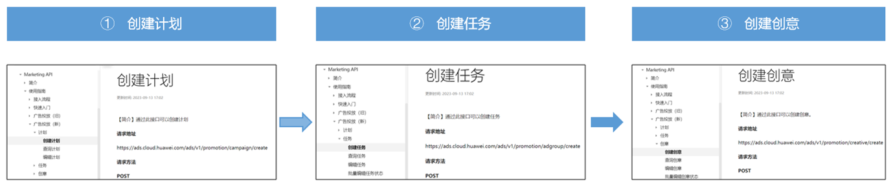
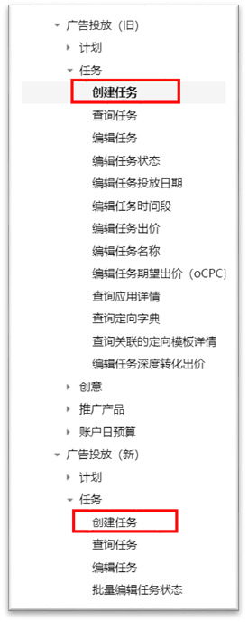
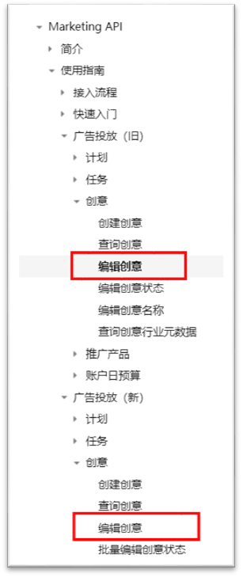

# 通过Marketing API创建全域智投广告

## 功能简介

当前Marketing API接口已支持创建、编辑、查看全域智投计划、任务、创意，您可通过Marketing API高效创编，在提效保成本的前提下快速扩量，使用新版位拿到更多的量，通过Marketing API查询和取数，无论是做cid校验还是快速分析，接口化进行数据的洞察更高效便捷！

详情请查看[全域智投支持Marketing API进行创编查视频课程](https://ads.shixizhi.huawei.com/course/1502116313077112833/application-learn?status=&courseId=1719283896949972993&id=1719290440957603841&appId=1719290440932438017&classId=1719290440932438018&courseType=1&sxz-lang=zh_CN&headershow=false)。

## 操作步骤



 

- <strong>【创建计划】</strong>新版位支持的计划类型、推广产品等信息请见文档。
- <strong>【创建创意】</strong>视频类需要上传同一尺寸的封面图片，上传图片/视频时，一个元素组最多可上传10张图片、5个视频，creative\_size\_sub\_type和creative\_size字段非必填。
- <strong>【编辑创意】</strong>编辑创意时，需要回传所有字段，修改value值进行更新，不更新的value值需要保留并发送，不支持修改创意行业、标签。

<strong>温馨提示：</strong>除了以上4个接口略有调整，新版位在其他接口如查询计划、查询任务、查询创意等，使用方式和参数调用等，均无变化。

1. <strong>创建计划</strong>
   1. 请求地址：&lt;https://ads.cloud.huawei.com/ads/v1/promotion/campaign/create&gt;，文档链接：https://developer.huawei.com/consumer/cn/doc/distribution/promotion/ads\_new\_api03-0000001456040061
   - 不涉及接口参数的变动；
   - 支持的campaign\_type计划类型：

   |  |  |
   | --- | --- |
   | 值 | 描述 |
   | CAMPAIGN\_TYPE\_DISPLAY | 展示广告 |

   - 全域智投支持的product\_type推广产品如下：

   |  |  |
   | --- | --- |
   | 值 | 描述 |
   | WEB | 网页 |
   | ANDROID\_APP | 应用 |
   | QUICK\_APP | 快应用/快游戏 |
   | PROMOTION | 促销活动 |
   | MINI\_APP | 微信小程序 |
2. <strong>创建任务</strong>

   

   - 依然使用旧接口进行计划的创建：
   1. 请求地址：&lt;https://ads.cloud.huawei.com/openapi/v2/promotion/adgroup/create&gt;，文档链接：https://developer.huawei.com/consumer/cn/doc/distribution/promotion/ads\_api24-0000001058086553
   2. 请求地址：&lt;https://ads.cloud.huawei.com/ads/v1/promotion/adgroup/create&gt;，文档链接：https://developer.huawei.com/consumer/cn/doc/promotion/ads\_new\_api07-0000001405680240
   - 不涉及接口参数的变动；
   - 全域智投不支持版位查询接口查询版位信息，新版位的详细信息如下：
   - 版位id：creative\_size\_id

   |  |  |
   | --- | --- |
   | <strong>值</strong> | <strong>描述</strong> |
   | 1187579382240174464 | 信息流资讯 |
   | 1187582054901014784 | 娱乐与生活 |
   | 1173027624247651072 | 精品游戏联盟 |
   | 1159340117433805696 | 鸿蒙生态应用 |
   | 1198502153635846016 | 智能优选 |
   | 1278796325500130176 | HarmonyOS服务 |
3. <strong>创建创意</strong>
   - 依然使用旧接口进行计划的创建：
   1. 请求地址：``https://ads.cloud.huawei.com/openapi/v2\_1/promotion/creative/create``，文档链接：https://developer.huawei.com/consumer/cn/doc/distribution/promotion/ads\_api37new-0000001119500528
   2. 请求地址：&lt;https://ads.cloud.huawei.com/ads/v1/promotion/adgroup/create&gt;，文档链接：https://developer.huawei.com/consumer/cn/doc/distribution/promotion/ads\_new\_api13-0000001455960413
   - 不涉及接口参数的变动；
   - 因为全域智投的功能升级，所以部分参数限制会有不同，不同的地方做了标红处理，需要特别注意一下。
     1. 带视频的话，image字段必填且二者尺寸需一致，页面展示位视频+封面。
     2. 不带视频字段，只有image字段，只支持上传标准图，页面展示为图片，）。
     3. <strong>Images</strong> <strong>：</strong>
        1. "16:9":"1080\*607",
        2. "9:16":"1080\*1920",
        3. "2:3":"1080\*1620",
        4. "3:2":"225\*150",
        5. "1:1":"900\*900"
        6. "6.35:1":"1080\*170"
        7. "3:4":"720\*960"

         

        宽高比3：4（720\*960）需要选择“信息流资讯“或”智能优选”版位。

        若您的图片素材尺寸不满足上述标准图要求，可通过[创建素材](https://developer.huawei.com/consumer/cn/doc/promotion/ads_new_api30-0000001455880057)接口对图片尺寸进行预处理。
     4. <strong>Video</strong> <strong>：</strong>视频类的支持同比例多尺寸上传，与投放端一致：
        1. 16:9（640\*360&lt;=尺寸&lt;=1920\*1080；1s ~ 120s ；大小&lt;=50 MB）、
        2. 9:16 （720\*1280&lt;=尺寸&lt;=1080\*1920；1s ~ 120s ；大小&lt;=50 MB）
        3. 2:3（720\*1080&lt;=尺寸&lt;=720\*1080；1s ~ 120s ；大小&lt;=10 MB）
        4. 1:1（640\*640&lt;=尺寸&lt;=640\*640；2s ~ 60s ；大小&lt;=10 MB）
     5. icon图标必传：1:1，160\*160&lt;=尺寸&lt;=512\*512，大小&lt;=150KB
     6. 文字类的长度范围如下：
        1. title标题：1~22
        2. description文案：1~24
        3. corporate品牌名称：1~7
        4. ad\_button\_text按钮文案：

        |  |  |
        | --- | --- |
        | <strong>selected\_text\_id</strong> | <strong>按钮文案</strong> |
        | 1 | 参加活动 |
        | 2 | 参与活动 |
        | 3 | 查看更多 |
        | 4 | 打开 |
        | 5 | 点击咨询 |
        | 6 | 发现更多 |
        | 7 | 观看视频 |
        | 8 | 获取报价 |
        | 9 | 了解详情 |
        | 10 | 立即报名 |
        | 11 | 立即查看 |
        | 12 | 立即打开 |
        | 13 | 立即加入 |
        | 14 | 立即开始 |
        | 15 | 立即领取 |
        | 16 | 立即申请 |
        | 17 | 立即试玩 |
        | 18 | 立即体验 |
        | 19 | 立即预定 |
        | 20 | 立即咨询 |
        | 21 | 立刻抢购 |
        | 22 | 联系我们 |
        | 23 | 领取福利 |
        | 24 | 领取优惠 |
        | 25 | 马上预定 |
        | 26 | 免费试用 |
        | 27 | 免费阅读 |
        | 28 | 抢先体验 |
        | 29 | 去购买 |
        | 30 | 去看看 |
        | 31 | 去领红包 |
        | 32 | 去玩玩 |
        | 33 | 玩游戏 |
        | 34 | 现在购买 |
        | 35 | 预约 |
        | 36 | 点击预约 |
        | 37 | 立刻预约 |
        | 38 | 预约游戏 |
        | 39 | 预约福利 |
        | 40 | 预约豪礼 |
        | 41 | 预约领奖 |
        | 42 | 点击赢礼 |
     7. creative\_size\_sub\_type和creative\_size字段非必填（非全域智投版位会有校验）
     8. 投放端创意界面的智能拓展开关默认关闭，如果需要开启请联系对应的运营同学配置
     9. 返回的code有creative\_id,作为元素组id，可记录，方便编辑创意数据、查询该创意的报表数据
   - 参考报文如下：

     ```
         {
             "adgroup_id": 1111111,
             "creative_name": "lzc-创意-003",
             "content_struct": {},
             "element_group": {
                 "element_struct_list": [
                     {
                         "element_type": "images",
                         "element_struct": {
                             "images": [
                                 {
                                     "file": {
                                         "asset_id": 1111111
                                     }
                                 }
                             ]
                         }
                     },
                     {
                         "element_type": "images",
                         "element_struct": {
                             "images": [
                                 {
                                     "file": {
                                         "asset_id": 1111111
                                     }
                                 }
                             ]
                         }
                     },
                     {
                         "element_type": "video",
                         "element_struct": {
                             "images": [
                                 {
                                     "file": {
                                         "asset_id": 11027408
                                     }
                                 }
                             ],
                             "video": {
                                 "file": {
                                     "asset_id": 11027217
                                 }
                             }
                         }
                     },
                     {
                         "element_type": "video",
                         "element_struct": {
                             "images": [
                                 {
                                     "file": {
                                         "asset_id": 11027409
                                     }
                                 }
                             ],
                             "video": {
                                 "file": {
                                     "asset_id": 11027213
                                 }
                             }
                         }
                     },
                     {
                         "element_type": "icon",
                         "element_struct": {
                             "icon": {
                                 "file": {
                                     "asset_id": 11027349
                                 }
                             }
                         }
                     },
                     {
                         "element_type": "title",
                         "element_struct": {
                             "title": {
                                 "text": "{地点}{日期}"
                             }
                         }
                     },
                     {
                         "element_type": "description",
                         "element_struct": {
                             "description": {
                                 "text": "{日期}{地点}"
                             }
                         }
                     },
                     {
                         "element_type": "corporate",
                         "element_struct": {
                             "corporate": {
                                 "text": "DDDS12"
                             }
                         }
                     },
                     {
                         "element_type": "ad_button_text",
                         "element_struct": {
                             "ad_button_text": {
                                 "selected_text_id": 2022103101
                             }
                         }
                     },
                     {
                         "element_type": "selling_point",
                         "element_struct": {
                             "selling_point": {
                                 "tag": "123"
                             }
                         }
                     },
                     {
                         "element_type": "landing_page",
                         "element_struct": {
                             "landing_page": {
                                 "landing_page": "https://lfcontentcenterdev.hwcloudtest.cn/cch5/PPS/9653724e45374bcc878e67398204e6a3/202509151739410f33648ae96a4412b3a47f29cf285b0d.html?oaid=__OAID1__&udid=__UDID__&appIcon=__APPICON__&appName=__APPNAME__",
                                 "landing_page_type": "LANDING_PAGE_TYPE_APP"
                             }
                         }
                     },
                     {
                         "element_type": "industry_labels",
                         "element_struct": {
                             "industry_labels": [
                                 {
                                     "label": "加湿器"
                                 },
                                 {
                                     "label": "吹风机"
                                 },
                                 {
                                     "label": "挂烫机/熨斗"
                                 }
                             ]
                         }
                     },
                     {
                         "element_type": "industry_id",
                         "element_struct": {
                             "industry_id": {
                                 "category": "100100020002"
                             }
                         }
                     }
                 ]
             }
         }
     ]
     ```
4. <strong>编辑创意</strong>

   

   - 依然使用旧接口进行计划的创建：
   1. 请求地址：``https://ads.cloud.huawei.com/openapi/v2/promotion/creative/update``，文档链接：https://developer.huawei.com/consumer/cn/doc/distribution/promotion/ads\_api39-0000001058566540
   2. 请求地址：``https://ads.cloud.huawei.com/ads/v1/promotion/creative/update``，文档链接：https://developer.huawei.com/consumer/cn/doc/distribution/promotion/ads\_new\_api15-0000001405680244
   - 不涉及接口参数的变动；
   - 编辑场景需要带新建的所有字段，修改value值进行更新，不支持修改创意行业、标签。
     - 参考报文如下：

     ```
     [
     {
     "creative_id": 62352707,
     "creative_name": "openapi-【测试】浏览器小视频3.0测试版位-11修改",
     "content_struct": {
     "icon": {
     "sequence": 0,
     "file": {
     "asset_id": "13826835"
     }
     },
     "video": {
     "sequence": 2,
     "file": {
     "asset_id": "13836211"
     }
     },
     "images": [
     {
     "file": {
     "asset_id": "13836210"
     }
     }
     ],
     "title": {
     "text": "yang"
     },
     "description": {
     "text": "{地点}xg"
     },
     "corporate": {
     "text": "brandopenaixiu"
     },
     "ad_button_text": {
     "selected_text_id": "10"
     },
     "landing_page": {
     "landing_page": "https://www.baidu.com",
     "?landing_page_type": "LANDING_PAGE_TYPE_USER_DEFINED"
     },
     "deeplink": {
     "deeplink": "https://www.baidu.com"
     }
     },
     "creative_size_sub_type": "SPLASH_PICTURE",
     "creative_size": "1080*607"
     }
     ]
     ```
