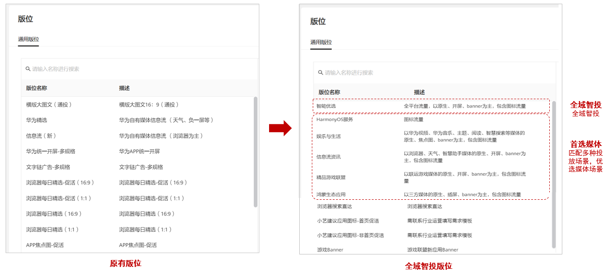
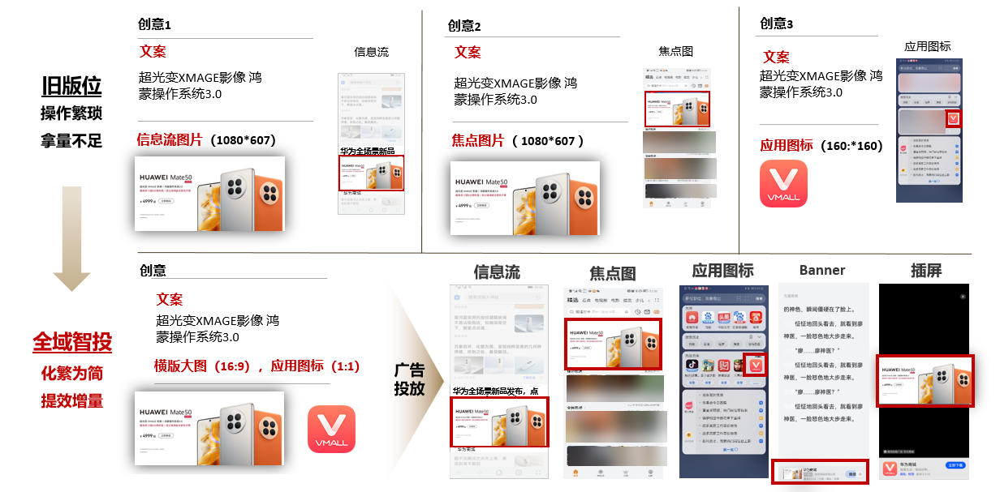
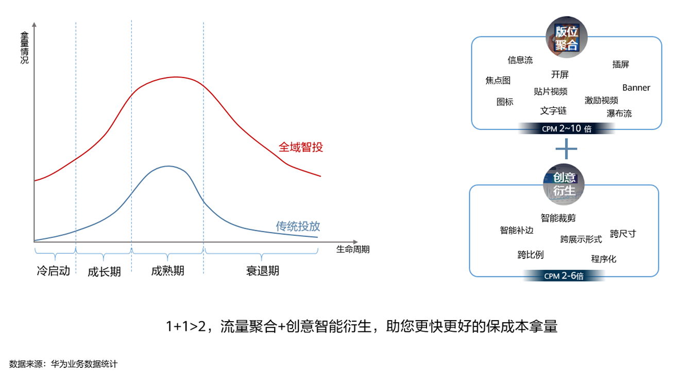
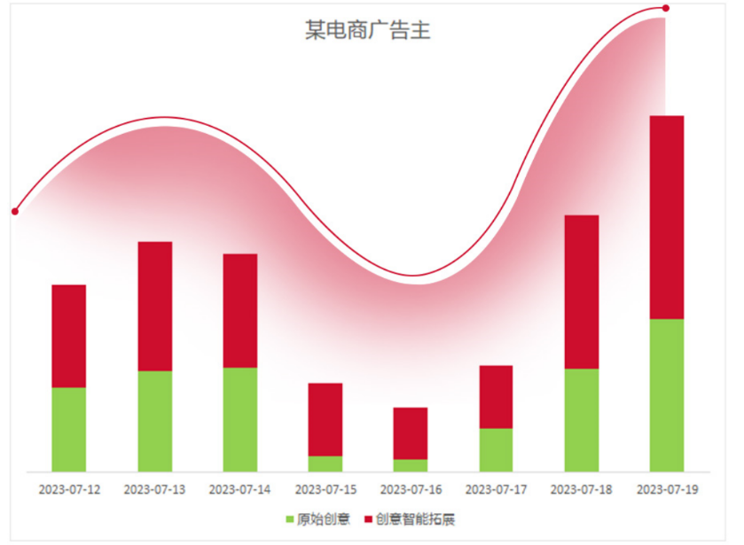

# 全域智投广告简介

## 功能简介

鲸鸿动能广告将原单规格版位合并为全域智投、首选媒体等新版位，聚合流量，少量的创意即可触达更多流量。

<strong>全域智投版位</strong>

您的全域智投广告将主要投放在核心流量样式上，同时为了帮助广告计划更好的跑量和优化成本，系统在每个版位中都有可能将广告拓展投放到其他流量样式场景，如涉及结算建议按照实际的流量样式消耗进行核算。

|  |  |  |  |
| --- | --- | --- | --- |
| <strong>版位名称</strong> | <strong>媒体流量</strong> | <strong>流量明细</strong> | <strong>流量样式</strong> |
| <strong>智能优选</strong> | ALL | 自有+三方媒体流量 | 以原生、开屏、焦点图、banner为主，可能会在保证效果前提下投放到图标流量 |
| <strong>信息流资讯</strong> | 华为自有媒体 | 浏览器、天气、智慧助手·今天等 | 以原生、开屏、banner为主，可能会在保证效果前提下投放到图标流量 |
| <strong>娱乐与生活</strong> | 华为自有媒体 | 华为视频、华为音乐、主题、阅读、智慧搜索等 | 以原生、焦点图、banner为主，可能会在保证效果前提下投放到图标流量 |
| <strong>精品游戏联盟</strong> | 联运游戏媒体 | 联运游戏、快游戏 | 以联运游戏媒体的原生、开屏、banner为主，可能会在保证效果前提下投放到图标流量 |
| <strong>鸿蒙生态应用</strong> | 三方媒体流量 | 三方应用、快应用、联运游戏、快游戏 | 以三方媒体的原生、插屏、banner为主，可能会在保证效果前提下投放到图标流量 |
| <strong>HarmonyOS服务</strong> | 华为自有媒体 | 自有媒体图标流量 | 以应用图标、激励场景图标为主 |

<strong>全域智投创意衍生能力</strong>

使用全域智投方式投放时，您只需要添加元素，系统会根据您提供的图片、视频、图标、标题、文案、品牌名称等元素，为您自动生成适合开屏、信息流大图、焦点图、激励视频、插屏视频等多个展示形式的创意，覆盖多个广告样式，增加元素丰富度，极大的提高了广告优化空间（请确保您的标题和描述能够与任意素材搭配使用）。

## 功能优势

1. <strong>保成本快速拿量</strong>：更大更广的流量样本，拿量更快更稳，更丰富的创意形态，使算法成本预估更精准稳定。
2. <strong>流量聚合，自动选择流量池</strong>：不再局限于单一的流量版位，全域智投机制下，使您的产品在合适的流量域中找到适合您的客户。
3. <strong>创意智能衍生</strong>：系统基于您上传的创意智能衍生，助您触达额外的流量。
4. <strong>提升冷启动成功率</strong>：在多行业、多客户的使用数据上，冷启动成功率提升。
5. <strong>覆盖计划全周期</strong>：从创建计划到衰退期内，流量优选+创意优选，让计划更茁壮成长和稳定。

## 使用案例

电商行业某广告主开启智能拓展后，消耗提升59%，拿量增加57% 。

1. <strong>客户背景</strong>：电商行业，诉求为推广应用，只有典型的16:9和9:16素材。
2. <strong>投放方式</strong>：
   - 前期使用16:9和9:16素材投放，拿量一直达不到预期。
   - 拿量到达瓶颈之后，鲸鸿动能推出了全域智投-智能创意拓展，广告主开启了“智能拓展”的开关。
3. <strong>投放效果</strong>：智能创意拓展帮助广告主智能生成了更多创意（如2:3等），成本基本持平，投放周期累计增加消耗59%预算，转化数增加57%。

数据来源：华为业务数据统计，仅供参考
