# 子客账户注册

## 概述

新增子客账户时，您可以通过以下的方式注册子客账户：

- [添加方式](#section1767613343218)：通过服务商平台添加子客并由服务商完成注册，注册成功后，子客可直接登录广告账户。
- [邀请方式](#section28511158518)：通过服务商账户/子客服务商账户发起邀请，子客通过邀请邮件中的链接完成账户注册。

如果您从鲸鸿动能广告官网直接注册，您将会注册成直客。

如果您已经使用邓白氏号码注册过服务商账户或者子客服务商账户，且当前需要使用同一个企业注册子客，只能使用营业执照注册；仅有子客支持广告投放。

## 添加方式注册

1. 在服务商平台添加子客。

   登录服务商账户，单击“”-&gt;"添加成员"，填写成员信息：

   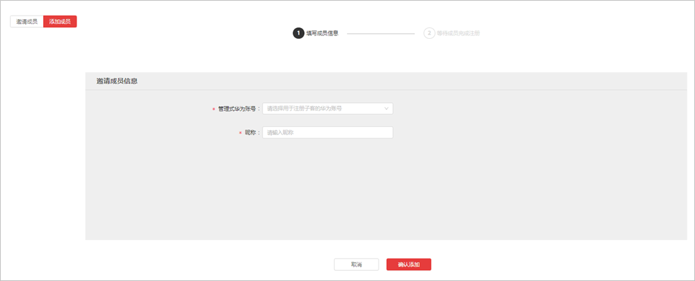

   - <strong>管理式华为账号：</strong>可展示服务商账号下可以注册子客的成员账号信息，详情可参考[管理式华为账号](/docs/monetize/promotion/managed-id-0000001337931828)。

      

     您下拉选择的华为账号必须未注册过其它鲸鸿动能广告账户（包括直客、服务商、子客服务商）。
   - <strong>昵称：</strong>请填写子客的昵称，建议与企业名称一致。
2. 完成子客注册流程。

   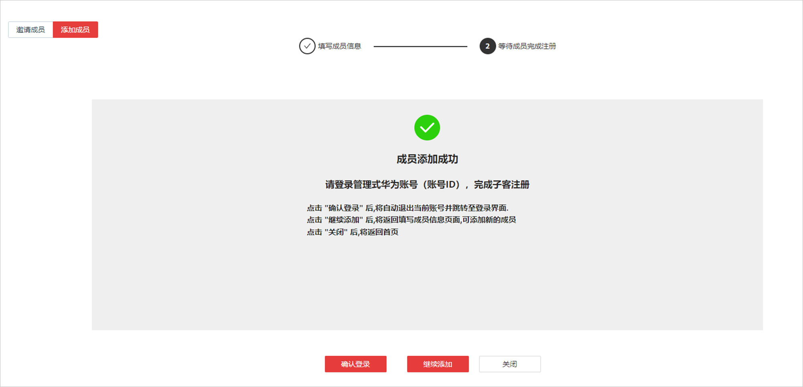

   - <strong>确认登录：</strong>单击后，自动登出当前广告账户并跳转至华为账号登录界面，输入<strong>成员账号</strong>的华为账号密码后，进入子客信息填写界面，完成注册信息填写后，进入审核环节。

     <strong>成员账号</strong>的华为账号如下图所示，如果成员忘记密码，可以让组织管理者重置密码，密码会发到之前创建成员时留的邮箱/手机内。

     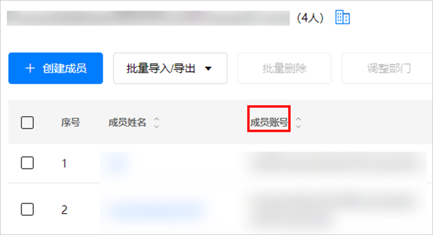

      

     - 由于子客账户注册国家/地区不同，账户开通流程也不同，详情请参考[管理式华为账号](/docs/monetize/promotion/managed-id-0000001337931828#ZH-CN_TOPIC_0000001337931828__zh-cn_topic_0000001321238810_li4232113217217)。
     - 子客注册时，仅支持使用营业执照进行注册，无法使用邓白氏进行注册。
   - <strong>继续添加：</strong>单击后，返回填写成员信息页面，可添加新的成员。
   - <strong>关闭</strong>：单击后，返回服务商首页。

## 邀请方式注册流程

 

如果您的企业注册地为中国大陆地区，且广告投放区域为非中国大陆地区时，需要进行实名认证，实名认证方式分为“<strong>对公银行打款认证</strong>”或“[企业资料人工审核认证](https://developer.huawei.com/consumer/cn/doc/start/mracoei-0000001062678404)”，建议您优先选择“<strong>企业资料人工审核认证</strong>”方式。非中国大陆注册流程请参考[非中国大陆区域子客注册流程](https://developer.huawei.com/consumer/en/doc/distribution/promotion/addadvertiser-0000001059081952)。

### 企业注册地为中国大陆区域时的子客注册流程

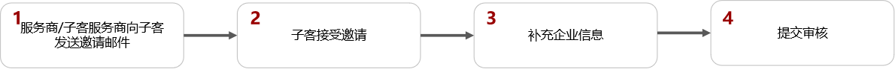

### 企业注册地为中国大陆区域时的子客注册步骤

1. 服务商/子客服务商向子客发送邀请邮件。

   登录服务商/子客服务商账户，单击“”&gt;“邀请成员”，填写成员信息；发送邀请后，等待子客接收邀请，您同时还可以继续邀请其他子客：

   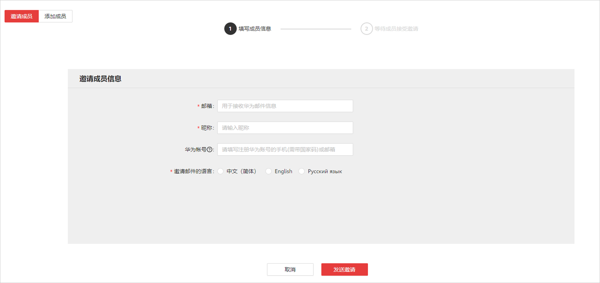

   - <strong>邮箱：</strong>此邮箱用于接收子客注册邀请。
   - <strong>昵称：</strong>请填写子客的昵称，建议填写企业名称。
   - <strong>华为账号：</strong>
     - 如果子客没有华为账号，此处不必填，子客可以在接受邀请的时候注册华为账号。
     - 如果子客已有华为账号，请填写被邀请的子客华为账号的手机号（需要带国家码）或邮箱。被邀请的华为账号必须未注册过其它鲸鸿动能广告账户（包括直客、服务商、子客服务商、子客、协作者、团队账号、经理账户），否则可能导致邀请失败。
   - <strong>邀请邮件的语言：</strong>子客接收到邮件的语言。
2. 子客接受邀请。

   单击邀请邮件中的链接，请确认其他华为账号已经退出登录，建议使用Chrome/Firefox浏览器打开，否则可能会导致邀请失败。
   - <strong>如果服务商/子客服务商在邀请邮件中指定了华为账号</strong>：

     您需要使用指定的华为账号登录并完成鲸鸿动能广告账户注册。如果注册报错，请确保您的华为账号必须未注册过其他鲸鸿动能广告账户（包括直客、服务商、子客服务商、子客、协作者、团队账号、经理账户），否则会导致开户失败，此时您需要使用新的华为账号完成鲸鸿动能广告账户注册。
   - <strong>如果服务商/子客服务商在邀请邮件中未指定华为账号</strong>：
     - 您可以使用手机号或者邮箱进行注册。同时注册的国家/地区需要与您企业注册的国家/地区保持一致，否则会导致子客账户注册失败。
       - 如果您使用手机号/邮箱注册，登录的时候必须使用这个手机号/邮箱登录。
       - 如果您想灵活使用手机号或邮箱登录，需要在[华为帐号管理界面](https://id7.cloud.huawei.com/AMW/portal/userCenter/index.html?themeName=red&loginChannel=7000000&countryCode=de&loginUrl=https://id7.cloud.huawei.com/CAS/commonLogin.html&reqClientType=7&lang=zh-cn#/security)完成邮箱或手机号关联。

         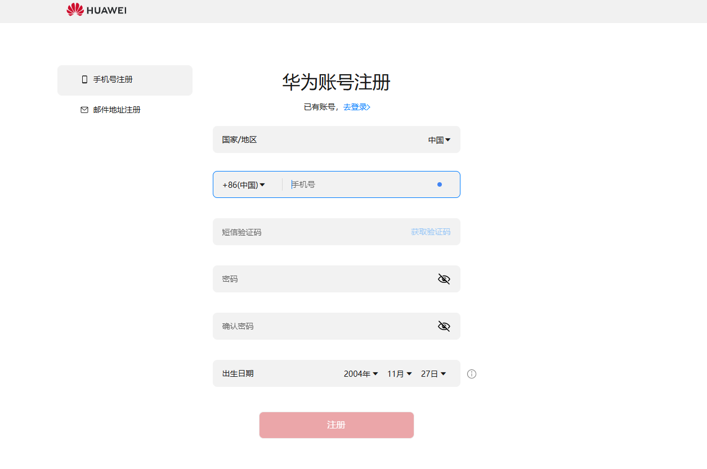

         - 请注意以下参数，如果配置不正确<strong>，</strong>否则会导致鲸鸿动能广告账户注册失败。
           - <strong>国家/地区</strong>：请选择“中国“，需要和您企业注册国家/地区保持一致。
           - <strong>出生日期</strong>：需要填写您的出生年月。
     - 如果您已经有华为账号，希望使用此华为账号注册，单击“<strong>登录</strong>”完成鲸鸿动能广告账户注册。此时您需要注意，您的华为账号必须未注册过其它鲸鸿动能广告账户（包括直客、服务商、子客服务商、子客、协作者、团队账号、经理账户），否则会导致注册失败。

      

     若注册鲸鸿动能广告账户过程中，在完成华为账号的注册或登录之后，由于任何原因中途退出，导致未完成注册流程的，可以在鲸鸿动能广告首页使用该华为账号登录后继续完成后续注册流程。
3. 选择认证方式。

   您完成华为账号注册之后，需要进行实名认证，认证方式可选“[对公银行打款认证](https://developer.huawei.com/consumer/cn/doc/promotion/register-0000001052264353#ZH-CN_TOPIC_0000001052264353__section579210538220)”或“[企业资料人工审核认证](https://developer.huawei.com/consumer/cn/doc/start/mracoei-0000001062678404)”，建议您优先选择“<strong>企业资料人工审核认证</strong>”方式。认证方式提交后不可修改。
4. 提交审核，审核通过后即可进入子客账户。

### 企业注册地为非中国大陆区域时的子客注册流程

 

- 如果您在注册过程中，遇到白屏/报错情况时，您需要上级服务商重新邀请并重新注册。如有疑问，可[在线提单](https://developer.huawei.com/consumer/cn/support/feedback/#/)联系我们，此时您需要在工单中提供以下信息：
  - 上级服务商账户ID或上级服务商公司名称，请联系您的上级服务商获取。
  - 上级服务商邀请时填写邀请信息的截图。
  - 白屏或报错时具体的截图，以及描述清楚出现错误的场景。
  - 提供报错日志：获取方式请参考[获取日志](https://developer.huawei.com/consumer/cn/doc/promotion/register-0000001052264353#ZH-CN_TOPIC_0000001052264353__li2259121017217)。
- 如果您在注册子客过程中出现了让您选择“直客”或者“服务商”界面时，代表本次注册流程失败，您需要先注销子客的华为账号（注销流程请参考[如何注销广告账户？](https://developer.huawei.com/consumer/cn/doc/promotion/register-0000001052264353#ZH-CN_TOPIC_0000001052264353__li1115171141719)），然后让您的上级服务商重新邀请您，并重新进行子客流程注册。

  

### 企业注册地为非中国大陆区域时的子客注册步骤

1. 服务商/子客服务商向子客发送邀请邮件。

   登录服务商/子客服务商账户，单击“”-&gt;“邀请成员”，填写成员信息；发送邀请后，等待子客接收邀请，您同时还可以继续邀请其他子客：

   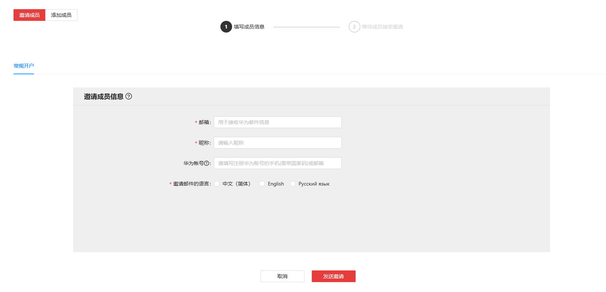

   - <strong>邮箱：</strong>此邮箱用于接收子客注册邀请。
   - <strong>昵称：</strong>请填写子客的昵称，建议填写企业名称。
   - <strong>华为账号：</strong>
     - 如果子客没有华为账号，此处不必填，子客可以在接受邀请的时候注册华为账号。
     - 如果子客已有华为账号，请填写被邀请的子客华为账号的手机号（需要带国家码）或邮箱。被邀请的华为账号必须未注册过其它鲸鸿动能广告账户（包括直客、服务商、子客服务商、子客、协作者、团队账号、经理账户），否则可能导致邀请失败。
   - <strong>邀请邮件的语言：</strong>子客接收到邮件的语言。
2. 子客接受邀请。

   单击邀请邮件中的链接，请确认其他华为账号已经退出登录，建议使用Chrome/Firefox浏览器打开，否则可能会导致邀请失败。
   - <strong>如果服务商/子客服务商在邀请邮件中指定了华为账号</strong>：

     您需要使用指定的华为账号登录并完成鲸鸿动能广告账户注册。如果注册报错，请确保您的华为账号必须未注册过其他鲸鸿动能广告账户（包括直客、服务商、子客服务商、子客、协作者、团队账号、经理账户），否则会导致开户失败，此时您需要使用新的华为账号完成鲸鸿动能广告账户注册。
   - <strong>如果服务商/子客服务商在邀请邮件中未指定华为账号</strong>：
     - 您可以使用手机号或者邮箱进行注册。同时注册的国家/地区需要与您企业注册的国家/地区保持一致，否则会导致子客账户注册失败。
       - 如果您使用手机号/邮箱注册，登录的时候必须使用这个手机号/邮箱登录。
       - 如果您想灵活使用手机号或邮箱登录，需要在[华为账号管理界面](https://id7.cloud.huawei.com/AMW/portal/userCenter/index.html?themeName=red&loginChannel=7000000&countryCode=de&loginUrl=https://id7.cloud.huawei.com/CAS/commonLogin.html&reqClientType=7&lang=zh-cn#/security)完成邮箱或手机号关联。

         
     - 如果您已经有华为账号，希望使用此华为账号注册，单击“<strong>登录</strong>”完成鲸鸿动能广告账户注册。此时您需要注意，您的华为账号必须未注册过其它鲸鸿动能广告账户（包括直客、服务商、子客服务商、子客、协作者、团队账号、经理账户），否则会导致注册失败。

      

     若注册鲸鸿动能广告账户过程中，在完成华为账号的注册或登录之后，由于任何原因中途退出，导致未完成注册流程的，可以在鲸鸿动能广告首页使用该华为账号登录后继续完成后续注册流程。
3. 填写企业信息。
   - <strong>企业信息：</strong>

     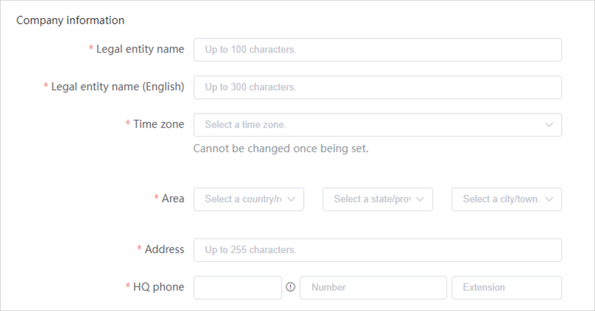

     - <strong>企业全称：</strong>请填写您营业执照上的企业名称，企业名称一旦提交注册，则无法修改，请保证您的企业名称填写准确。
     - <strong>企业全称（English）：</strong>英文名称会用在给您开具的发票上，请准确填写，确保与营业资质上的英文名称一致，企业名称内不允许包含除26个英文字母、英文标点符号及阿拉伯数字之外的任何字符。
     - <strong>实名认证方式：</strong>
       - 对注册时需要认证的国家/地区，您需要按照界面提示上传认证信息。
         - 当您的注册地为中国时，实名认证时可选“对公银行打款认证”或“企业资料人工审核认证”。
         - 当您的注册地为非中国大陆区域时，实名认证时可选“邓白氏码”和“营业执照”，建议使用营业执照进行实名认证。
       - 对于注册时不需要认证的国家/地区，如果您的广告任务，在审核的时候，被审核判定为涉及敏感行业，系统会要求您在鲸鸿动能广告平台，单击“工具”-&gt;”账户中心”补充实名认证信息。认证方式提交后不可修改，详情可参考[实名认证](/docs/monetize/promotion/basic-account-information-0000001224473383#ZH-CN_TOPIC_0000001224473383__li1924817115137)。
     - <strong>投放时区：</strong> <strong>账户注册后时区不能更改</strong>，请慎重选择。系统会按照您在此处选择的时区进行任务投放时间控制、预算控制、报表统计（不包含财务报表，财务报表时区为：UTC+08:00）和展示等。
     - <strong>地区</strong>：国家/地区默认使用您华为账号的注册地，同时需要与您企业营业执照的注册国家/地区一致，另外需要配置省和城市。
     - <strong>地址</strong>：详细地址信息请按照您营业执照上的注册地址填写，两者不一致可能导致账户注册失败。
     - <strong>总部电话：</strong>请填写您的企业电话。
   - <strong>推广内容</strong>：

     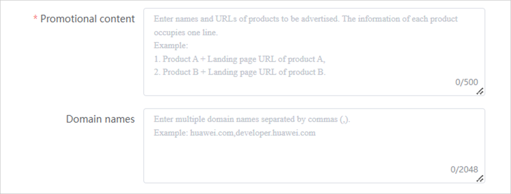

     - <strong>推广内容：</strong>推广产品填写您即将做广告的产品/服务。为了让审核更清楚地知道推广内容，您需要提供链接。
     - <strong>域名：</strong>如果您的产品有域名，请补充，如果没有请忽略。
   - <strong>授权信息</strong>：

     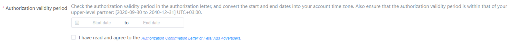
     - <strong>授权有效期</strong>：请务必保证授权有效期与授权书中的起止时间保持一致，且不超过上级服务商的授权有效期范围。若您之前已注册过子客，但是授权过期了，您可以参考[常见问题](/docs/monetize/promotion/faq4-0000001122334402#ZH-CN_TOPIC_0000001122334402__li1840314639)。
     - <strong>授权文件</strong>：

       如果未要求您提供授权文件，此时您需要阅读并勾选[鲸鸿动能广告主授权确认函](/docs/monetize/promotion/ad-agreements-0000001169499170#ZH-CN_TOPIC_0000001169499170__li16322105618244)。

       如果要求您提供授权文件，您需要下载并填写[授权模板](/docs/monetize/promotion/attachments-0000001532611905#ZH-CN_TOPIC_0000001532611905__li26931113141613)，授权模板中，甲方为子客，乙方为子客服务商，当您的子客服务商和子客为同一个公司时，授权书甲方、乙方可以一致。

        

       授权模板需公司签署后方可有效。公章与法人签字是否有效需根据具体国家等情况判断效力，例如中国大陆需公章。
   - <strong>行业资质：</strong>按照您的产品选择对应的行业即可，此时您需要阅读并勾选[Industries that are prohibited or restricted](https://alliance-communityfile-drcn.dbankcdn.com/FileServer/getFile/cmtyPub/011/111/111/0000000000011111111.20260526164016.88822582357463254786685772331890:20260531101509:2800:BFCCB118DB301C356F74A87EF2C3C697B9AAA9248CED7DE17D97C276F404431B.xlsx?needInitFileName=true)。

     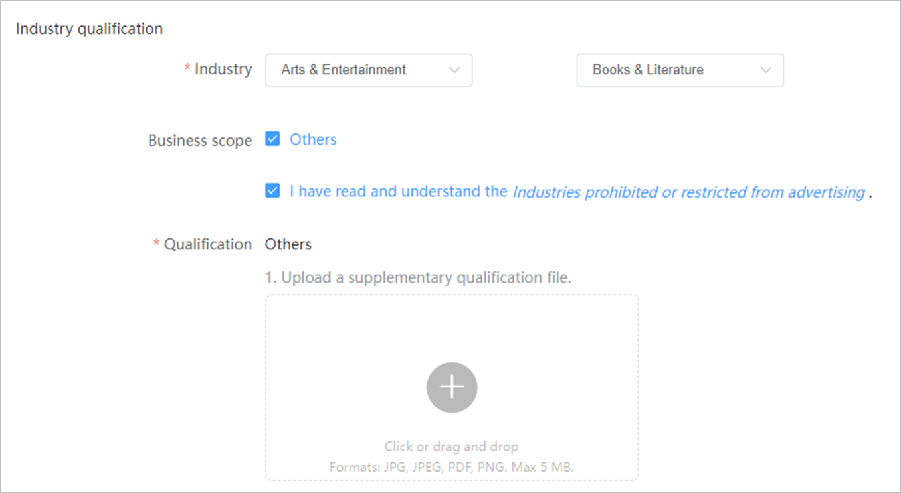
   - <strong>联系人信息</strong>：

     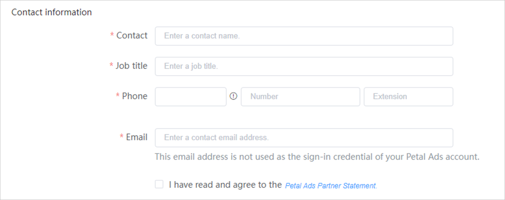

     - <strong>联系人姓名</strong>：请填写联系人姓名<strong>。</strong>
     - <strong>职位</strong>：请填写您的职位信息。
     - <strong>联系人电话</strong>：请填写联系人的手机号，系统的通知短信会发送到此电话，请确保号码可以正常接收短信。此处的电话不作为子客账户登录凭证。
     - <strong>联系人邮箱</strong>：请填写联系人的邮箱，系统的通知邮件会发送到此邮箱，请确保邮箱可以正常接收邮件。此处的邮箱不作为子客账户登录凭证。
     - 此时您需要阅读并勾选[鲸鸿动能广告服务商声明](/docs/monetize/promotion/ad-agreements-0000001169499170#ZH-CN_TOPIC_0000001169499170__li11624185952416)。
4. 提交审核，审核通过后即可进入子客账户。
