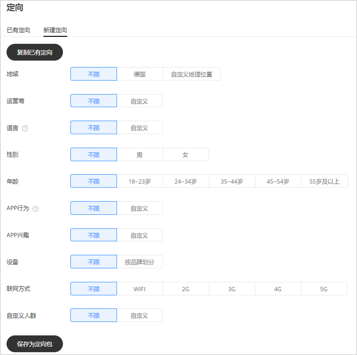
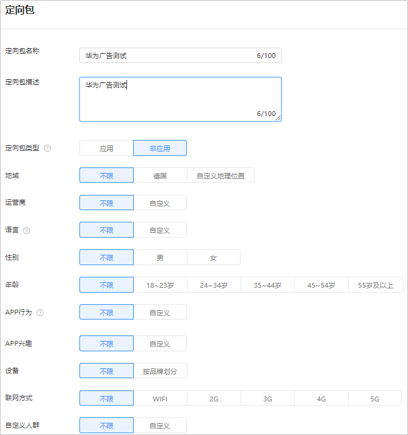
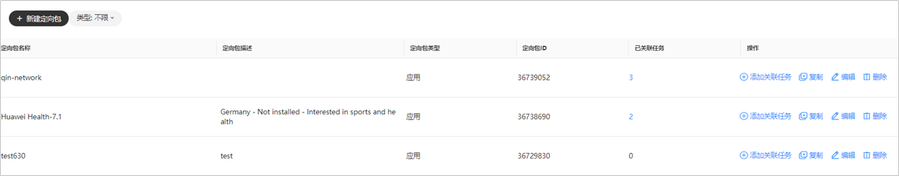

# 定向包管理

## 概述

在投放过程中您经常需要对同一个定向人群创建多个投放任务，通过将定向条件保存在定向包您可以方便的将定向条件应用到多个任务并进行管理。如果您修改定向包内容，那么会对已绑定该定向包的所有任务生效。

## 新建定向包

- <strong>在创建任务时新建定向包。</strong>

  单击“<strong>新建定向</strong>”，选择定向条件后，可选择是否保存为定向包，若您不进行“<strong>保存为定向包</strong>”操作，则当前定向仅对该任务生效；若您单击“<strong>保存为定向包</strong>”且完成操作，系统将为您生成该定向包，可在多个任务中使用。

  
- <strong>在工具新建定向包。</strong>

  单击“<strong>工具</strong>”-&gt;“<strong>定向包管理</strong>”-&gt;“<strong>新建定向包</strong>”，填写定向包名称、定向包描述，选择定向包类型和具体定向条件，单击“<strong>提交</strong>”，完成定向包的新建。其中定向包名称、定向包类型为必填，定向包描述为选填。

  

## 管理定向包

- <strong>复制定向包</strong>：
  - 新建任务时复制定向包：单击“<strong>新建定向</strong>”-&gt;“<strong>复制已有定向</strong>”，选择已有定向包，并单击“<strong>确认</strong>”，系统自动选择该定向包内定向信息，您可对当前定向条件进行修改，生成新的定向条件，修改操作不影响原已有定向包。
  - 在工具复制定向包：单击“<strong>工具</strong>”-&gt;“<strong>定向包管理</strong>”，单击“<strong>复制</strong>”，您可以修改定向条件及定向包名称，生成新的定向包。
- <strong>编辑定向包</strong>：

  单击“<strong>工具</strong>”-&gt;“<strong>定向包管理</strong>”，单击“<strong>编辑</strong>”，您可以修改定向包的定向条件（包含：增加投放区域、修改语言定向）。修改后已关联任务将会重新审核，审核通过后继续投放广告。
- <strong>添加关联的任务</strong>：

  单击“<strong>工具</strong>”-&gt;“<strong>定向包管理</strong>”，单击“<strong>添加关联任务</strong>”，输入相关计划或任务名称，勾选需要关联的任务，单击“<strong>确认</strong>”。

  如果您的任务已选择过定向，关联后，您之前的任务定向将会被替换成新的定向包，如果您的定向包涉及增加地域或者增加排除地域，只会重新触发相关国家/地区的审核，如果您修改、增加语言定向会重新触发任务审核。
- <strong>查看关联任务</strong>：

  单击“<strong>工具</strong>”-&gt;“<strong>定向包管理</strong>”，选择已关联任务列显示的任务数并单击数字，即可查看已关联任务列表。
- <strong>解除关联任务</strong>：

  单击“<strong>工具</strong>”-&gt;“<strong>定向包管理</strong>”，选择已关联任务列显示的任务数并单击数字，右侧跳出“<strong>解除关联</strong>”界面，单击“<strong>解除关联</strong>”，完成解除关联操作。解除关联仅解除定向包和任务的绑定关系，任务继续按照已选中的定向条件生效。
- <strong>删除定向包</strong>：

  当定向包关联的任务为0时，可删除。
