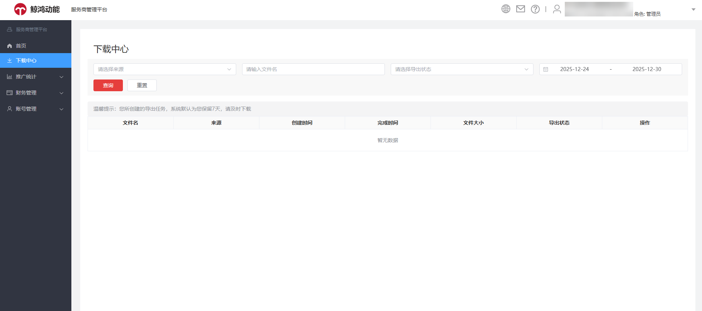
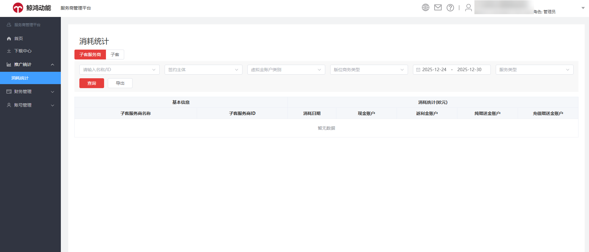
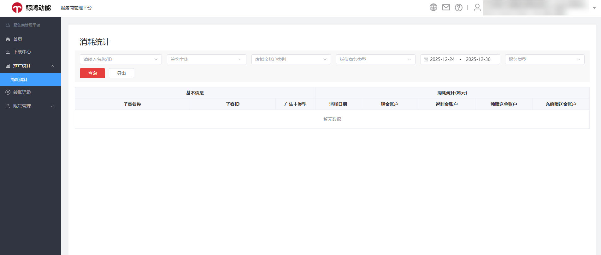

# 数据查看

支持服务商和子客服务商查看下载中心数据。

您可通过下载中心对导出数据所生成的下载任务进行集中管理，通过筛选来源、文件名和导出状态等条件查看首页清单、转账记录和消耗统计等数据。

注：列表展示历史生成的导出文件数据记录且从创建时间起默认保留7天历史数据。

支持服务商和子客服务商查看自己账户下关联账户的消耗。

- <strong>服务商消耗统计</strong>：单击“<strong>推广统计</strong>” -&gt; “<strong>消耗统计</strong>”，您可以查看对应主体覆盖区域下的<strong>子客服务商</strong>和<strong>子客</strong>的消耗统计数据。
  - 您可以通过消耗主体类型、签约主体、账户名称/ID、虚拟金账户类别、版位商务类型、服务类型进行数据筛选。
  - 签约主体（阿斯比格、华为服务（香港））是根据<strong>子客</strong>的投放地区来区分的。

  
- <strong>子客服务商消耗统计</strong>：单击“<strong>推广统计</strong>” -&gt; “<strong>消耗统计</strong>”，您可以查看对应账户下<strong>子客</strong>的消耗统计数据。
  - 您可通过签约主体、账户名称/ID、虚拟金账户类别、版位商务类型、服务类型进行数据筛选。
  - 签约主体（阿斯比格、华为服务（香港））是根据<strong>子客</strong>的投放地区来区分的。

  
