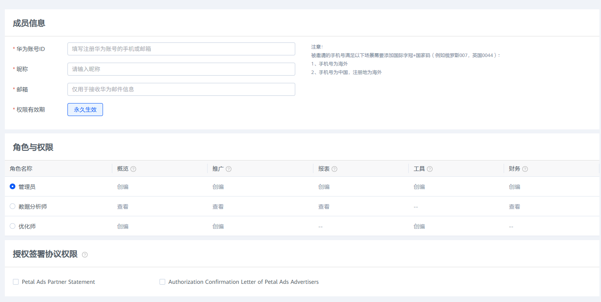
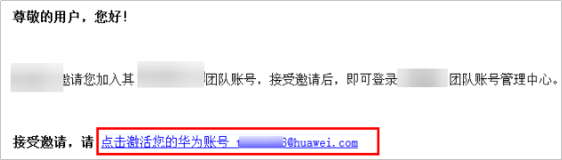
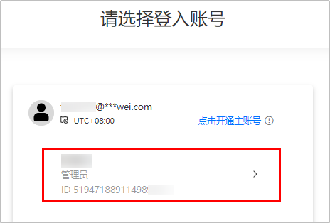
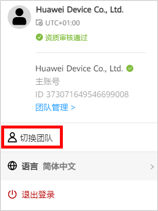
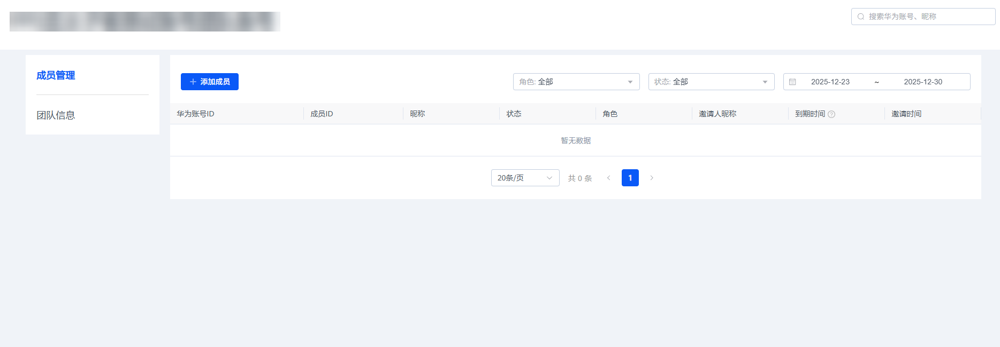
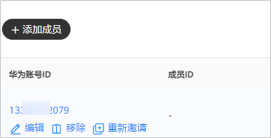

# 团队管理

## 概述

鲸鸿动能广告平台提供的团队账号，让您（即，账号持有者）与团队成员可以共同有效地管理您的广告账户。您可以为所有成员分配角色，让他们帮您完成推广，报表，工具，以及财务等工作。

- 每个团队可以拥有100个成员。每个华为账号可以被添加到50个鲸鸿动能广告团队账号中。
- 只有直客与子客可以使用团队账号，服务商和子客服务商账号不支持添加团队成员。
- 被邀请的成员使用自己的华为账号登录，但不要求该华为账号完成[实名认证](https://developer.huawei.com/consumer/cn/doc/start/itrna-0000001076878172)。
- 团队成员支持以下3种角色，不支持自定义角色：

  | 角色名称 | 推广（创建广告计划/任务/创意） | 报表（查看广告消耗） | 工具（使用营销提供辅助工具） | 财务（查看充值及结算信息） |
  | --- | --- | --- | --- | --- |
  | 管理员 | √ | √ | √ | √ |
  | 优化师 | √ | - | √ | - |
  | 数据分析师 | - | √ | - | - |
- 账号持有者能邀请管理员、优化师和数据分析师。每个管理员只能管理自己所邀请的成员，账号持有者可以管理账号内的所有成员。

 

鲸鸿动能广告平台的团队账号功能与华为开发者联盟的团队账号功能无关。

## 添加团队成员

1. 邀请团队成员。
   1. 登录[鲸鸿动能广告平台](https://ads.huawei.com/usermgtportal/home/index.html#/)，单击<strong>“工具“</strong>，下拉选择“<strong>团队管理</strong>”，进入团队账号的主界面。
   2. 单击“<strong>添加成员</strong>”，填写成员信息，选择角色和权限，单击“<strong>发送邀请</strong>”。

      
      - 成员信息：
        - 华为账号ID：如果您添加的华为账号为手机号，您需要补充国际字冠+该成员所在国家/地区的编码，例如俄罗斯007，英国0044，中国0086。如果您的手机号为中国，那么您手机号的华为账号注册地必须为非中国大陆区域，否则您将无法邀请成功。
        - 昵称：您可以为您邀请的成员取名，用于辨识您的成员。
        - 邮箱：仅用于接收团队成员邀请邮件，不作为登录凭证。
        - 权限有效期：如果您是账号持有者添加成员，此处权限有效期默认为永久生效；如果您是管理员添加成员，此处权限有效期可以进行日期设置。
      - 角色与权限：如果您是账号持有者添加成员，此处角色与权限默认为管理员；角色与权限还可以选择优化师或者数据分析师。

      - 授权签署协议权限：您可以为当前被邀请的管理员授权签署以下协议，授权后，若协议更新，管理员可以基于您的授权为您签署协议。若您想取消管理员签署协议的权限，您可以在“编辑”中取消勾选，保存后即可生效。
2. 团队成员接受邀请。
   - 团队成员需要在10天有效期内接受邀请；如果超出10天有效期，状态将会变为“<strong>已失效</strong>”，需要账号持有者或者管理员重新发起邀请。
   - 成员必须通过单击邮件中的链接接受邀请，进入华为账号登录界面，输入邀请邮件 “<strong>激活华为账号(XXXXXXX)</strong>”中指定的华为账号进行登录<strong>。</strong>

     如果已经注册了该华为账号，则可直接登录；如果未注册华为账号，成员需要在10天内先注册再接受邀请，然后用注册的华为账号进行登录。

     
   - 登录之后，在自动弹出的协议界面，签署协议。随后，进入团队账号选择界面；从列表中选择您要加入的团队账号。请<strong>不要</strong>单击“点击开通主账号”。

      

     如果您单击了“点击开通主账号”，此时您将不能成为被邀请者开通团队成员账号，您将会重新注册开通一个新的广告账户，作为主账号使用，此时您需要提供企业资质等信息，详情请参考[直客广告主账号注册](https://developer.huawei.com/consumer/cn/doc/promotion/register-0000001052264353)，新的广告账户注册完成后，您可以自己邀请团队成员账号。

     
   - 如果您加入了两个团队，登录之后可以单击右上角“<strong>切换团队</strong>”，示意图如下：

     

## 团队成员管理

- 账号持有者可以对账号下的所有成员进行管理，比如可以查看“成员管理”和“团队信息”菜单下的数据，支持编辑，移除，重新邀请等操作。

  
  - 所有的投放数据、结算等都是跟持有者账号相关联，与其他成员账号无关。
  - 若账号持有者邀请成员未得到成员反馈，可以重新邀请，不限制邀请次数。

    
- 成员包括管理员，优化师，数据分析师。每个成员只能看到与自己角色及权限相关的信息。
- 每个成员都有权退出团队。成员退出后，邀请该成员的管理员以及账号持有者将收到邮件通知。
- 管理员只能操作（编辑/删除）自己邀请的成员信息；如果管理员要退出团队，但是账号下还存在其他成员，则无法退出。
- 数据分析师或者优化师的账号到期后，需要联系管理员申请延期。

## 常见问题

1. <strong>一个华为账号可以同时加入多个鲸鸿动能广告团队吗？</strong>

   可以，每个华为账号可以被添加到50个鲸鸿动能广告团队。
2. <strong>接收到团队账号邀请邮件，但登录后提示“未被邀请”</strong>。

   请检查登录的华为账号是否与邀请邮件里“激活华为账号(XXXXXXX)”中指定的华为账号一致。只有一致的华为账号，才能确认接受邀请。
3. <strong>已被邀请的团队账户成员，支持修改角色权限么</strong>？

   团队成员加入团队后，不支持修改角色权限。
4. <strong>添加团队成员，成员收不到邀请邮件，如何处理？</strong>

   邮件可能被屏蔽，请通过邮件垃圾箱查找；若仍然无法获取，请通过[在线提单](https://developer.huawei.com/consumer/cn/support/feedback/#/)处理。
5. <strong>被邀请的成员在收到邀请后，使用华为账号登录鲸鸿动能广告平台，却被提示要补充公司信息？</strong>

   因为登录的账号不是被邀请的账号，或者没有被邀请成功。只有在成功接收团队账号邀请之后才可以使用邀请的华为账号登录鲸鸿动能广告，请核实检查。
6. <strong>管理员添加团队成员后，能否转让管理员的权限？</strong>

   权限不可以转让。
7. <strong>如果人员更换，已添加的成员账号如何更换登录手机/邮箱？</strong>

   详情可参考[华为账号常见问题](https://id1.cloud.huawei.com/AMW/portal/faq/zh-cn_faq.html?version=china&regionCode=en&lang=zh-en&reqClientType=90&loginChannel=90000300&clientID=101476933)。
