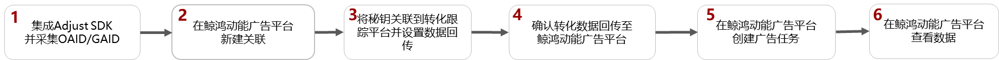

# Adjust

## 概述

Adjust根据不同的归因方式，支持的SDK版本如下，详情请参考[官网链接](https://www.adjust.com)：

- OAID/GAID归因支持的SDK版本为4.2.2以上版本；
- Referrer归因支持的SDK版本为4.28.6及以上版本。注：SDK V5及以上版本需要额外添加插件。

## 操作流程

## Adjust操作步骤

1. 集成Adjust SDK并采集OAID/GAID和referrer。
   - 集成：详细操作请参照[Adjust SDK集成](https://github.com/adjust/android_sdk)；若已集成，可跳过此步。
   - 采集OAID/GAID：三方监测事件必须使用OAID/GAID跟踪归因，请确保您的应用已加入OAID采集代码，否则可能将无法正确跟踪。
     - 如果您跟踪的应用是华为应用市场的应用，请按照Adjust的开发指南[采集OAID](https://dev.adjust.com/en/sdk/android/plugins/oaid-plugin)。
     - 如果您跟踪的应用是非华为应用市场的应用，GAID会自动采集。
   - 采集referrer：如果您集成的Adjust SDK版本不低于V5，那么您需要额外添加[插件](https://dev.adjust.com/zh/sdk/android/plugins/huawei-referrer-plugin)，否则可能无法正常跟踪。
2. 关联鲸鸿动能，获取监测链接。

   为了实现Adjust与鲸鸿动能的数据关联，您需要在Adjust完成‘Partners’设置，选择要回传给鲸鸿动能的转化事件，并获取‘Link URLs’。

   1. 在‘Campaign Lab’模块点击‘New partner’，选择‘鲸鸿动能|Petal Ads’。
   2. 启用数据分享，秘钥可以填入任何值（鲸鸿动能与Adjust已经实施更简便的鉴权方式，不依赖广告主秘钥）
   3. 选择您想发送至鲸鸿动能的转化事件，点击‘Map event’具体可参考[事件映射](/docs/monetize/promotion/tracking-shu-0000001139892541)；如需回传付费事件请打开‘In-app revenue’和‘Parameters’。
   4. 完成‘Partners’配置，获取‘Link URLs’。

## 鲸鸿动能操作步骤

1. 在鲸鸿动能关联事件资产。
   1. 您需要在‘事件资产管理’工具里面‘新建资产’，将上一步中获取的‘Link URLs’填入‘有效触点监测链接’和‘曝光监测链接’。
   2. 点击‘新建事件’选择您需要回传的事件类型；如果您在‘新建资产’时开启了智能跟踪，鲸鸿动能会保存所有接收到的数据，并为您创建事件。
   3. 如果您想在广告投放前对您创建的转化事件进行测试，那您可以进行[手动测试](/docs/monetize/promotion/tracking-app-overview-0000001209244840#section152255480210)。如果测试失败可参考[常见问题](/docs/monetize/promotion/faq2-0000001168892523)。
2. 在广告投放中关联监测配置。

   在您创建应用广告时，您可以在创意/元素界面看到‘监测配置’，默认情况下使用‘关联监测地址’，即为您在‘事件资产管理’填写的监测链接；如果您有自定义需求，可在此处选择‘自定义’，但建议您慎重修改监测链接，以免跟踪异常。

 

- 如果您后期修改了关联分析工具中的曝光/点击监测链接，您需要重新对任意一个指标进行手动测试，测试成功后新的曝光/点击监测链接才生效，其他的指标启用状态，与修改链接前保持一致。
- 确保您的监测链接包含Referrer参数（external\_click\_id=\_\_REFERRER\_\_），如果缺失会造成跟踪异常。
- Adjust会提供多种监测链接域名，如果您想在应用市场进行投放，则域名必须为``https://s2s.adjust.com``，且包含s2s=1参数。
- 在oCPC任务关联某些转化目标的时候必须先将事件‘转化状态’变为‘已启用’，才能进行关联。
