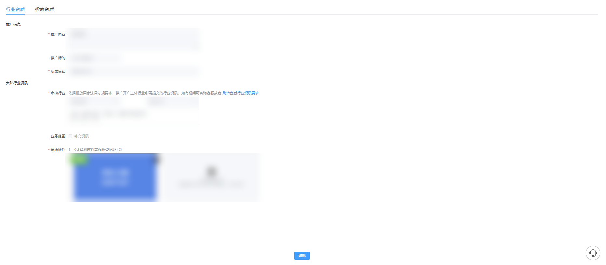
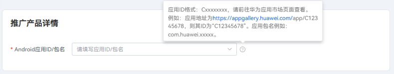

# 2025年12月高频问题Q&A

<strong>Q1：怎么查看自己开户的时候推广的是哪个产品？</strong>

<strong>A：</strong>可以登录广告投放平台：工具-广告账户管理-资质信息-行业资质-推广内容处查看对应账户的推广产品。当前专户专投，如需新增产品投放，需新开广告账户。

<strong>Q2：广告账户开好后，联系人邮箱怎么修改</strong> <strong>？</strong>

<strong>A：</strong>可以按照以下方式进行修改:

子客账户：工具-广告账户管理-企业信息页面下拉到最底下单击编辑，进行联系人邮箱修改。

服务商账户：账号管理-账户信息-企业信息页面下拉到最底下单击重新编辑，跳转至开发者联盟页面进行联系人邮箱修改。

子客服务商账户：账号管理-账户信息-进行联系人邮箱修改。

直客账户：工具-广告账户管理-实名信息页面下拉到最底下单击重新编辑，跳转至开发者联盟页面进行联系人邮箱修改。

<strong>Q3：户已经开好了，应该怎么进行广告投放？</strong>

<strong>A：</strong>如需进行广告投放，可按照文档进行任务搭建即可：&lt;https://developer.huawei.com/consumer/cn/doc/promotion/ads-cjgg-0000001055134493&gt

<strong>Q4：如需新开一个鲸鸿动能广告账户，是一定要在华为开发者联盟也同步完成账号开户和认证吗？</strong>

<strong>A：</strong>鲸鸿动能广告账户跟开发者联盟账户是两块业务，如果仅需开通鲸鸿动能广告账户，那么可以直接进行广告账户开设，无需在开发者联盟同步进行开户与认证。

<strong>Q5：广告账户开户的时候，所属集团应该怎么填？</strong>

<strong>A：</strong>所属集团这个字段，开户页面如果系统默认填写置灰了，那就以系统默认为主。如果系统没有默认填写，需要手动填写，那这个字段就按照营业执照上面的企业主体名称填写即可。

<strong>Q6：合约任务的素材数量到达最大值，可以替换或者删除旧的素材吗？</strong>

<strong>A：</strong>如果合约任务的素材数量到达10个上限，那只能新建新的任务。如果素材数量没有达到上限，任务开始投放前，可以删除/暂停/新增；任务开始投放中则不支持删除或者替换，只能新增。

<strong>Q7：账户名称怎么修改？</strong>

<strong>A：</strong>账户名称修改不触发审核，提交即生效，修改路径：

① 直客户/子客户：工具-广告账户管理-账户信息

② 一级服务商账户：账号管理-账户信息

<strong>Q8：广告账户日预算是针对竞价任务设置的还是竞价任务+合约任务一起设置的？</strong>

<strong>A：</strong>账户日预算是针对整个账户竞价任务设置的，竞价任务和合约任务的预算是分开的。

<strong>Q9：在单出价的情况下，oCPC任务是不是只有过了学习期才能有赔付？</strong>

<strong>A：</strong>oCPC任务是否有赔付和学习期状态无关。除了转化数需要达到要求外，也需要修改次数等达到激励门槛要求。更多oCPC规则介绍可查看对应文档：&lt;https://developer.huawei.com/consumer/cn/doc/promotion/ads_jlzc_ocpc2-0000001880794312&gt

<strong>Q10：上传的OAID人群包，显示覆盖人群为0是什么原因？</strong>

<strong>A：</strong>可以通过以下方式排查：

①目前仅支持以下几种数据类型上传：OAID原值、OAID\_SHA256、OAID\_MD5（32位）、11位手机号\_SHA256、11位手机号\_MD5（32位）；

②请再次确认上传的数据类型跟选择的类型是否一致。目前大部分覆盖数为0都是类型匹配不上。

如果以上排查都没有问题，提供账户ID,人群包ID，对应截图给到客服协助排查。

<strong>Q11：创建任务的时候，输入推广应用链接，为什么识别不出来应用？</strong>

<strong>A：</strong>创建应用推广任务的时候，推广产品详情处填写的是应用ID不是应用链接，应用ID格式：Cxxxxxxxx，请前往华为应用市场页面查看。 例如：华为浏览器应用地址为“ ``https://appgallery.huawei.com/app/C100170981”``，则其ID为“C100170981”。

<strong>Q12：</strong> <strong>关于Marketing API使用中同一个客户端ID，同一个账户多次获取授权，会不会覆盖之前的授权？</strong>

<strong>A：</strong>同一个客户端ID，同一个账户多次获取授权，在有效期内均生效，不会冲突，不受影响。

<strong>Q13：已经充值且显示已开票，但是没有收到邮寄的发票？</strong>

<strong>A：</strong>2025年上线数电发票，不再进行纸质发票的邮寄。已开具的数电发票将通过电子发票服务平台自动交付。可登录自己的电子发票服务平台后，可进行发票查验以及用途勾选等系列操作。（发票业务-发票查询统计-全量发票查询-查询类型：取得发票，可通过开票日期或数电票号码等进行查询下载）

获取发票方法一：可在开发者联盟后台“我的账户-账单” 中查看对应的发票情况。在这里获取到开票日期+发票号后，可前往电子税务平台查看数电发票情况；

获取发票方法二：2025年2月份之后开的数电发票，会发送到系统维护的邮箱中（若需要修改接收邮箱，可在开发者联盟后台中进行修改后并及时同步至运营/客服），可直接进行查看。
