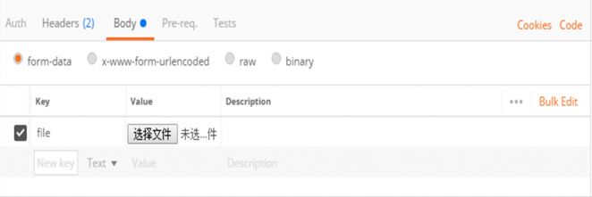
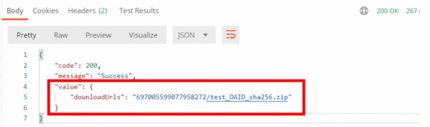

# 人群包上传

【简介】通过API方式在广告DMP上创建人群包，需要您先通过API方式将包含设备ID的文件上传至Ads的OBS中

<strong>请求地址</strong>

https://svc-drcn.ads.huawei.com/opendmp/v1/audience/file/upload

<strong>请求方法</strong>

<strong>POST</strong>

<strong>请求参数</strong>

|  |  |  |  |
| --- | --- | --- | --- |
| <strong>参数名称</strong> | <strong>类型</strong> | <strong>是否必选</strong> | <strong>描述</strong> |
| file | multipart/form-data | 是 | 文件流 |
| deviceIDType | String | 是 | 类型 |

文件大小及格式要求

文件是zip压缩包

zip文件内是一个txt文件,txt文件不为空

txt文件大小超过1G，行数小于3000万

文件内容说明

示例:

55bde5906cf4c621XXXe81e1fadb58683d7053594a68d

74875906cf4c621XXXe81e1fadb58683d705359474895

说明：

1)Txt文件中，每行代表一个设备ID

2)文件只能包含一种设备ID类型，使用 deviceIDType传参值 标识整个文件的设备ID 类型 （当设备ID类型非3的时候，deviceIDType 必传）

3)目前支持以下几种设备ID及类型：

|  |  |
| --- | --- |
| <strong>设备ID</strong> | <strong>设备</strong> <strong>ID类型</strong> |
| OAID-sha256 | 3 |
| GAID-sha256 | 4 |
| OAID-MD5 | 6 |
| GAID-MD5 | 7 |
| 手机号-MD5 | 8 |
| 手机号-sha256 | 9 |

<strong>请求示例</strong>

POST https://$\\{base\_address\\}/opendmp/v1/audience/file/upload HTTP/1.1 Headers:

Content-Type: application/json

Authorization：Bearer DAEAAIX7ISfTb+NErs\*\*\*\*\*hPPri5SbmCiZ0g0Hw2PryODiEnUiJkub FRe4TQtxNeGPQphveHdUMACAjDxduayVZWe+FOSsdoNV/H6TRM3g3Pd81PDmWiM1KS 2

Body:

<strong>响应字段</strong>

|  |  |  |  |  |
| --- | --- | --- | --- | --- |
| <strong>参数名</strong> | <strong>类型</strong> | <strong>长度</strong> | <strong>是否必填</strong> | <strong>说明</strong> |
| code | int | - | Y | 响应码 |
| message | String | 2048 | N | 描述 |
| value | object | - | N | NA |
| downloadUrls | String | - | Y | 人群包地址（格式：dmpid/ 文件名.zip） |

常见状态码

| HTTP状态码 | 结果码 | 结果码说明 | 响应消息 |
| --- | --- | --- | --- |
| 200 | - | - | - |
| 400 | 请参考错误码说明 | 请参考错误码说明 | 请参考错误码说明 |
| 401 | 请参考错误码说明 | 请参考错误码说明 | 请参考错误码说明 |

错误码说明

|  |  |  |
| --- | --- | --- |
| HTTP状态码 | 结果码 | 结果码说明 |
| 200 | 200 | 成功 |
| 400 | 1000009001 | 参数错误 Parameter request error. |
| 400 | 1000009555 | request obtain access token error |
| 400 | 1000009033 | Site id is invalid! |
| 400 | 1000009034 | Update type is invalid |
| 400 | 1000009035 | Scale value is invalid |
| 400 | 1000009036 | Site id required |
| 400 | 1000009037 | Audiences name is required |
| 400 | 1000009038 | Audiences url is required |
| 401 | 1000009020 | 非法token Invalid client id |
| 401 | 1000009030 | 非法token Invalid token bearer |
| 401 | 1000009022 | No Authorization header exist |
| 401 | 1000009023 | Request header does not contain Digest username |
| 401 | 1000009024 | App Id could not be determined |
| 401 | 1000009025 | User type does not match with version in the dmp-mapping（dmp-mapping没有配置周全） |
| 401 | 1000009027 | Algorithm name is invalid |
| 401 | 1000009029 | Invalid Realm |
| 429 | 1000009011 | 请求频率过高 Too many request |
| 500 | 1000009000 | 系统内部错误 Huawei internal server error (General) |

<strong>应答示例</strong>

