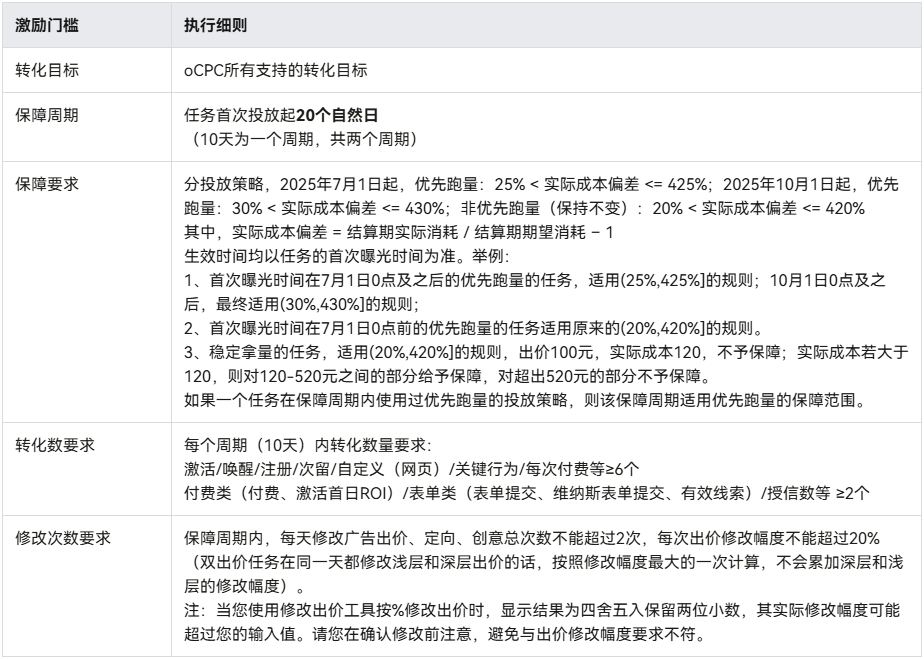

# 2025年5月高频问题Q&A

<strong>Q1：客户变更华为应用市场的应用开发者主体，是否影响在投账户？</strong>

<strong>A：</strong>不影响在投账户，如涉及资质更新（如软著等）需新开账户提供新资质以供审核。

<strong>Q2：如果推广产品涉及AI，开户的时候有资质要求吗？</strong>

<strong>A：</strong>除了产品需要的所属行业资质，AI类应用还需补充以下相关资质：

1.《增值电信业务经营许可证》（B25互联网信息服务业务）；

2.互联网信息服务算法备案截图；

3.互联网信息服务安全评估报告；

4.如提供具有舆论属性或社会动员能力的生成式人工智能服务，需完成生成式人工智能（大语言模型）上线备案，请提供备案截图。

<strong>Q3：我删除了广告计划，那么这次操作会计算在oCPC赔付的修改次数之内吗？</strong>

<strong>A：</strong>oCPC激励政策针对的是单个任务，只有修改了任务的出价、定向、创意才会影响修改次数，所以删除计划并不会计算在oCPC的修改次数之内。更多详情可查看[oCPC产品激励政策](/docs/monetize/promotion/ads_jlzc_ocpc2-0000001880794312)。

<strong>Q4：可以批量导出多个子客ID的返利金的余额有效期？</strong>

<strong>A：</strong>目前暂不支持该功能。

<strong>Q5：可以用维纳斯落地页投企业微信加粉吗？</strong>

<strong>A：</strong>维纳斯落地页是支持设置外跳的，除二类电商外，其他行业支持跳转企业微信加粉的形式。具体能否过审需以实际提交任务的审核结果为准，更多详情可查看[维纳斯落地页简介](/docs/monetize/promotion/ads_gongju14_1-0000001477131173)。

<strong>Q6：经理账户可以绑定不同服务商开户的同一个客户的账户吗？</strong>

<strong>A：</strong>不可以，经理账户可以绑定不同主体的客户账户。

注：同一经理账户下的账户必须属于同一个服务商账户名下，1个账户只能关联1个经理账户，且经理账户下仅能关联同一账户类型（子客/直客）的账户。

<strong>Q7：怎么判断广告账户是否过审？</strong>

<strong>A：</strong>可以通过账户密码，直接登录[鲸鸿动能平台](https://ads.huawei.com/usermgtportal/home/index.html#/)查看对应账户状态即可。

<strong>Q8：极速开户的账户，不能修改或者增加账户管理里面的资质吗？</strong>

<strong>A：</strong>不可以，极速开户的账户中企业信息和行业资质信息复用来源账户的资质，来源账户新增行业补充资质并审核通过后，极速开户的账户将会一并同步新增；极速开户的账户中投放资质/广告资质信息独立管理，可以由每个账户单独新增广告资质。

<strong>Q9:养生类的图书或课程可以开户投放广告吗？</strong>

<strong>A：</strong>目前鲸鸿动能平台是支持推广书籍售卖类广告的，需直接投放第三方电商平台的商品购买链接。如涉及养生、食补等内容，需注意不得涉及减肥、中医、疾病诊疗等禁投内容，开户需要提交商品链接以供审核，以最终审核结果为准。

<strong>Q10:浏览器搜索直达一定要加关键词吗？</strong>

<strong>A：</strong>不一定，请按投放平台要求操作。

<strong>Q11:通过Marketing API获取报表数据，是需要每个账户发邮件申请一遍吗？</strong>

<strong>A：</strong>关于Marketing API，客户端ID、回调地址、密钥、所有账户都支持共用的，您可以用一个账户去开发者联盟做实名认证，获取客户端ID，然后发邮件申请即可。只要客户端id申请了权限，在使用Marketing API拉取账户数据时，想拉取哪个账户的数据，只需登录对应账户并获取access\_token即可。更多MarketingAPI功能介绍可参考帮助中心文档：&lt;https://developer.huawei.com/consumer/cn/doc/promotion/ads_api02-0000001058566534&gt

<strong>Q12:我的经理账户是使用手机号注册的，那么我该如何绑定邮箱呢？</strong>

<strong>A：</strong>鲸鸿动能的账户都是基于华为账号注册开通来的，如需进行绑定邮箱、修改手机号和邮箱等操作，请登录[华为账号中心](https://id.cloud.huawei.com/AMW/portal/home.html)操作即可。

<strong>Q13:用手机号注册的华为账号只能手机号登陆吗？</strong>

<strong>A：</strong>如果您同时设置了登录邮箱地址，那么您可以通过手机号、邮箱、账号名进行登录。

<strong>Q14:在鲸鸿动能开户时，什么情况下需要提供软著？</strong>

<strong>A：</strong>一般来说，推广应用、快应用/快游戏、还有小程序这类都需要软著，其他场景是否需要软著，需以开户时提交的推广内容进行判断。

<strong>Q15:我的oCPC任务投放了一、两天之后，做了删除或者暂停的操作，这样会正常赔付吗？还是说必须先投放满十天（一个赔付结算周期）才不会影响赔付？</strong>

<strong>A：</strong>若达到了赔付要求和标准，即便未投满一个赔付结算周期，在正常情况下也是会进行赔付的，但需要等到赔付结算周期结束后统一结算，具体可点击查看[oCPC产品激励政策](/docs/monetize/promotion/ads_jlzc_ocpc2-0000001880794312)。（注：从任务首次投放起，十天为一个赔付结算周期）
