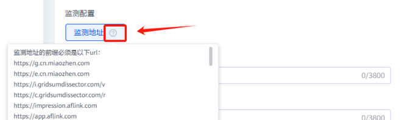

# 2025年6月高频问题Q&A

<strong>Q1：在申请Marketing API的使用权限时，是否需要进行邮件申请？</strong>

<strong>A：</strong>需要，请提供需要使用该功能的鲸鸿动能账户ID，并向行业运营发送邮件进行申请。若无法确定行业运营的邮箱，可提供鲸鸿动能账户ID并说明具体事由发送至鲸鸿动能[人工客服](https://smartrobot-drcn.platform.dbankcloud.cn/?appId=31000)咨询。具体申请邮件模板可参考：&lt;https://developer.huawei.com/consumer/cn/doc/promotion/ads_api08-0000001059204274&gt; 。

<strong>Q2：如何判断Marketing API的token是否有效？</strong>

<strong>A：</strong>若token无效，在使用过程中会出现一个无效的信息提示，比如失效、超时、过期 ；如果没有以上无效信息的提示且可以正常使用，那就说明依然在有效期内。

<strong>Q3：为什么我们已经做了打款操作并显示打款成功，但后台却显示未到账？</strong>

<strong>A：</strong>需要先确认在服务商/直客后台有没有创建充值订单，若没有创建，可按照充值流程进行操作（选择对应账户类型的文档指导进行操作）：&lt;https://developer.huawei.com/consumer/cn/doc/promotion/ads_fws01-0000001141843155&gt;。若已经创建，可提供020的订单号与账户ID，转至[人工客服](https://smartrobot-drcn.platform.dbankcloud.cn/?appId=31000)处理。

<strong>Q4：充值后的发票可以在哪里进行查看？</strong>

<strong>A：</strong>共2种查看方法：

1. 可在[开发者联盟](https://developer.huawei.com/consumer/cn/)后台“我的账户-账单” 中查看对应的发票情况。在这里获取到开票日期+发票号后，可前往电子税务平台查看数电发票情况；

2. 2025年2月份之后开的数电发票，会发送到系统维护的邮箱中（若需要修改接收邮箱，可在开发者联盟后台中进行修改后并及时同步至运营/客服），可直接进行查看。

<strong>Q5：为什么在服务商管理平台新增了一个子客，却没有出现在我的子客清单中？</strong>

<strong>A：</strong>需要先确认您登录的服务商账户是否为管理员账户，若登录的是操作员、财务、观察员等角色的协作者账户，在进行新增对应子客后，管理员并未把新增的子客分配给您当前所登录的这个协作者账户，那么在您的协作者账户子客清单中便看不到对应的子客账户。

<strong>Q6：在投放过程中，鲸鸿动能平台是否支持对已经展现过或者点击过的用户，使用重定向或者频控之类的特殊策略？</strong>

<strong>A：</strong>1.可在搭建任务时进行投放频次设置：设置针对单一用户在指定时长内的广告展示次数上限，在搜索广告场景不生效；

2.可针对广告行为人群打包做屏蔽操作：支持按广告计划、选取创意、广告任务维度，对该计划/任务/创意投放带来的曝光、点击、下载、激活、表单提交等多种行为创建人群包；

3.可向行业运营做频控申请与人群包打包，并推送至后台使用。

<strong>Q7：请问账户人群管理中媒体推送的人群包，该如何推送到其他账户中？</strong>

<strong>A：</strong>可通过经理账户把关联账户下的自定义人群包、商品库、维纳斯落地页共享给其他关联广告账户使用。更多操作流程可参考：&lt;https://developer.huawei.com/consumer/cn/doc/promotion/ads-jinlizhanghu-0000001878420417#section257950185210&gt;

需注意：同一经理账户下的账户必须属于同一个服务商账户名下，1个账户只能关联1个经理账户，且经理账户下仅能关联同一账户类型（子客/直客）的账户。

<strong>Q8:鲸鸿动能信息流广告需要在创意层级添加点击监测链接，是否需要进行申请白名单？</strong>

<strong>A：</strong>若监测地址的前缀在后台显示中，可直接使用，不需要加白；若不在，则需要找行业运营申请加白。

<strong>Q9:开户时在推广内容处填写的链接与广告投放时提供的链接是否必须一致？</strong>

<strong>A：</strong>暂时没有强制要求，但需要保证推广产品保持一致，例如，开户时提供的产品为淘宝，投放时推广的产品为天猫，则任务将会被驳回。

<strong>Q10:荣耀手机是否可以刷到试预览的广告？</strong>

<strong>A：</strong>建议使用华为手机刷试投放广告。

<strong>Q11:为什么有的账户在任务层级有自定义监测链接参数，而有的账户没有？</strong>

<strong>A：</strong>若想在任务层级填写自定义监测链接参数，需要满足以下2个条件：

1. 需同时满足选择展示广告、展示广告网络 、 安卓应用这3个前提；

2. 事件资产管理处配置有监测链接，该资产下选择的事件是已启用状态。

<strong>Q12:一个账户内是否仅支持创建200个人群包？</strong>

<strong>A：</strong>当前后台仅支持自主创建200个人群包，若数量已达200个但还想继续添加，需要先删除历史过期/无效/不用的人群包，等次日再进行添加操作。

（注意，鲸鸿动能运营人员推送的人群包数量，不计入其中）
