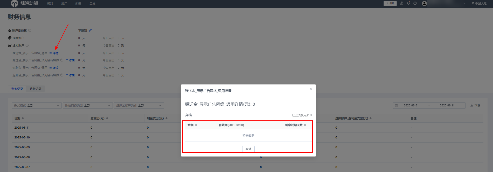

# 2025年7月高频问题Q&A

<strong>Q1：合约广告的投放数据，在子客账户后台能看到吗？</strong>

<strong>A：</strong>当前子客账户后台可以看到合约的曝光，点击数据，但是看不到消耗（花费）的数据，财务报表也不体现。如需查看消耗数据可在上一级服务商后台查看。

<strong>Q2：投应用促活，在创建任务-创意这一步还需要填写落地页跟deeplink链接，那广告曝光后用户打开的是哪个页面？</strong>

<strong>A：</strong>投应用促活，定向选择已安装，在搭建创意时需同时填写落地页和deeplink链接。广告曝光后，用户点击广告会优先跳转dp链接，在dp链接跳转失败的情况下，才会跳转至设置的落地页。

<strong>Q3：中国电信、中国移动这类运营商客户属于哪个客户行业？</strong>

<strong>A：</strong>一般移动、电信、联通这类运营商是归属N2-便民生活-通讯服务。更多相关分类可查看[客户行业分类](/docs/monetize/promotion/ads-khhy-0000002317140653)。

<strong>Q4：我想要使用Marketing API功能，需要怎么操作？</strong>

<strong>A：</strong>1、需先去[华为开发者联盟](https://developer.huawei.com/consumer/en/console#/serviceCards/)，完成实名认证，认证成为开发者；

2、在联盟完成OAuth2.0认证；

3、申请应用权限：获取到客户端ID和密钥后，需要为客户端ID申请调用权限。这一步除了在开发者联盟后台申请需要调用的scope权限外，还需要给鲸鸿动能行业运营发送使用Marketing API功能的申请邮件；

4、权限申请通过后，scope申请权限状态变为已获取，此时通过文档示例地址，替换客户端id及回调地址，在登录页登录广告账号获取授权码，再调用接口获取access\_token；

5、调用业务接口即可使用。

注意：如果没有给行业运营发送申请邮件，则该功能无法使用！更多功能使用介绍可参考：[Marketing API使用指南接入流程](https://developer.huawei.com/consumer/cn/doc/promotion/ads_api05-0000001058436244)。

<strong>Q5：经理账户最多可以绑定多少个子客账户？</strong>

<strong>A：</strong>经理账户目前最多可以关联500个子客账户。超过这个数量想要继续关联新的子客，建议取消关联已经不使用的子客账户或者新开一个经理账户。

<strong>Q6：选择线下充值的方式，上传附件一直不成功，无法充值是怎么回事？</strong>

<strong>A：</strong>1、先排查上传图片的类型，可使用png、jpg格式的图片；

2、可能图片会带有符号而导致上传报错，可以先把水单放到微信里，再另存下来命名为数字，再进行上传；

3、着急充值，可使用一级服务商/直客账户账密登录开发者联盟进行充值；

如果上面3个方法还是出现报错，请提供账户ID，报错截图，上传的图片转人工客服排查。

<strong>Q7：使用Marketing API调用接口出现报错\\{"code":"50004","message":"invalid advertiserId"\\}</strong>

<strong>A：</strong>这个报错的原因是：授权账号和参数里的advertiser\_id不一致导致的，可先自查下。

<strong>Q8：鲸鸿动能虚拟账号里面的赠送金会过期吗？</strong>

<strong>A：</strong>具体可以查看虚拟金详情，一般都有对应的有效期情况：

1、服务商账户可以在服务商管理平台-账户概览-赠送金/返利金详情处查看；

2、子客账户可以在广告投放后台-右上角账户-查看财务信息-虚拟账户详情处查看。

<strong>Q9:投放合约广告，收到了结算单和发票，要怎么打款？</strong>

<strong>A：</strong>收到发票后应当在付款赎期内将结算费用以银行汇款方式汇入华为账户，华为收款账户信息以合同为准。转账备注：业务类型+结算期。

<strong>Q10:充值订单创建错了，已经提交了要怎么处理？</strong>

<strong>A：</strong>1、重新创建正确的充值订单；

2、之前错的充值订单提供020的订单号给到[客服/运营](/docs/monetize/promotion/ads_lxwm01-0000001192387242#在线咨询)反馈驳回。

<strong>Q11:现在在鲸鸿动能广告充值到账后，发票的开票内容是怎样的？</strong>

<strong>A：</strong>目前充值订单开的是：\*信息系统服务\*信息服务费。

<strong>Q12:在创建事件资产管理后新增了链接或者参数，还需要重新进行联调吗？</strong>

<strong>A：</strong>如果事件指标状态没变就不用重新联调，事件指标状态不是已启用就需要重新联调。

<strong>Q13：广告投放的时候，怎么排除已转化人群？</strong>

<strong>A：</strong>可以选择以下2种方法进行操作：

1、投放端后台在 工具-人群管理处根据广告行为人群进行打包，然后去排除；

2、也可以跟对接的行业运营沟通，打对应排除包进行排除。

<strong>Q14：鲸鸿动能平台新联调的点击监测, 新加了oaidMd5字段，oaid字段不下发了吗？</strong>

A：若同时选中“oaid”、“oaid\_md5”参数，则“oaid”参数将自动置灰，这表明“ oaid”已替换为“oaid\_md5”。当选择参数进行传输时，将不会传输“oaid”明文，改为传输加密后的“oaid\_md5”。

<strong>Q15：保障周期内价格改动对具体的赔付有没有影响？如果价格变动了，后面的赔付以最后一次的价格为准吗？如果在转化数达标的情况下，修改价格后转化数为0，那预期消耗就是实际的消耗吗？</strong>

<strong>A：</strong>修改次数要求：保障周期内的每天修改广告出价次数不能超过2次。在达到赔付要求的情况下，赔付周期内出价发生变化那么对应的预期总消耗也会变，结算返还金额也会变化。公式如下：赔付周期内总预期消耗=目标成本1\*赔付周期内对应总转化数1+目标成本2\*赔付周期内对应总转化数2+…

以稳定拿量的投放策略为例：1号出价10元，消耗50，获得了2个转化，2号出价12元，消耗60块，获得了3个转化，那计算公式就是：返还金额=总实际消耗-总预期消耗（1+成本偏差要求），也就是（50+60）-（10\*2+12\*3）\*1.2；

如果修改出价后转化为0，那么再举个例子：1号出价10块，消耗50块，获得了4个转化，2号出价12块，消耗60块，获得了0个转化。计算公式都是一样的，也就是（50+60）-（10\*4+12\*0）\*1.2；

需注意：

1、以上都是在转化数等其他条件达到赔付门槛要求的情况下；

2、当前赔付区间会根据选择的跑量方式有所不同，所以成本偏差要求可能会不太一样。

更多赔付规格可查看：[oCPC产品激励政策](/docs/monetize/promotion/ads_jlzc_ocpc2-0000001880794312)
