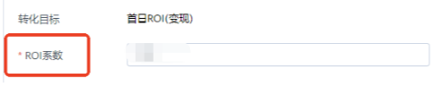
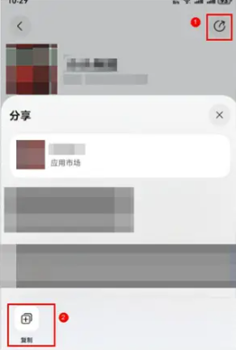

# 2025年9月高频问题Q&A

<strong>Q1：oCPC赔付政策中，是单次修改出价不能超过20%还是一天修改幅度不能超过20%？</strong>

<strong>A：</strong>保障周期内，每次出价修改幅度不能超过20%（双出价任务在同一天都修改浅层和深层出价的话，按照修改幅度最大的一次计算，不会累加深层和浅层的修改幅度）。更多oCPC产品激励政策可参考：&lt;https://developer.huawei.com/consumer/cn/doc/promotion/ads_jlzc_ocpc2-0000001880794312&gt

<strong>Q2：投放oCPC任务是怎么扣费的？</strong>

<strong>A：</strong>oCPC的计费发生在用户点击广告时。系统会将您的目标转化成本，结合对用户点击率（pCTR） 和转化率（pCVR） 的实时预估，换算成一个参与竞争的eCPM值。其计费也遵循广告平台的计费规则（如GSP第二价格拍卖）。

<strong>Q3：搭建oCPC任务转化目标选择首日ROI（变现），下面的ROI系数是什么意思？如果ROI系数从0.16调整到0.18，那么属于降价还是提价？</strong>

<strong>A：</strong>① ROI（Return on Investment） 指广告投入带来的回报。在oCPC模式下，ROI系数 = 目标回报率。您可以将其理解为，您希望每投入1元广告费，能带来多少倍的价值回报。系统会努力让实际ROI达到您设定的这个目标值；

② ROI系数从0.16调整到0.18，实际是属于降价。这种情况就相当于在投入产出不变的情况下，ROI提高，那么价格就要降低。意味着您希望用更低的成本获取每个转化。

<strong>Q4：创建广告任务时是否可以选择审核中的渠道包投放？</strong>

<strong>A：</strong>搭建任务需拉取已上架的应用，如果对应渠道包还在审核中，那么搭建任务的时候拉取不到，就无法正常搭建任务。

<strong>Q5：在投任务的渠道包处于更新审核中状态，当前任务是否可以继续正常投放？在投任务的渠道包因新版本未通过审核，当前任务是否可以继续正常投放？</strong>

<strong>A：</strong>在投任务渠道包这2个状态，并不影响任务的正常投放，都是投放的之前的渠道包。

<strong>Q6：为什么我用管理式华为账号功能来开户，开户步骤多了一个需要填写开票信息的地方？</strong>

<strong>A：</strong>

开户的时候需要填写开票信息的，只有开服务商账户和直客账户才会出现，如果您要开的是子客，初步判断是开错账户类型了。可以按照以下方式再次进行操作试一下：

① 用一个新的华为账号，再从邀请开始重新走一遍[子客开户](/docs/monetize/promotion/ads-zikezhuce-0000001814790812)流程；

② 清理浏览器缓存，用谷歌无痕浏览器重新登录再操作一遍开户；

需注意：在开户过程中，浏览器一定不要登录其他鲸鸿动能账号（经理账户、服务商账户等）。子客开户时请一定要通过邀请邮件中的邀请链接点击进入注册华为账号页面

如果以上2种方法都尝试，还是开户的时候需要填写开票信息，那就提供从邀请开始的开户全流程录屏，账户ID，操作时间点，转[人工客服](https://smartrobot-drcn.platform.dbankcloud.cn/?appId=31000)排查。

<strong>Q7：不同客户注册鲸鸿动能账户时能否使用同一邮箱接收开户邀请邮件？</strong>

<strong>A：</strong>可以用同一个邮箱接收开户邀请邮件，但是注册鲸鸿动能账户需要用不同华为账号来注册，当前规则一个手机号/邮箱注册一个华为账号开一个鲸鸿动能账户。

<strong>Q8：我想创建鸿蒙应用的推广计划，但是后台只能选择安卓应用。</strong>

<strong>A：</strong>当前如果想要在搭建任务的时候可以选到鸿蒙应用，需要跟行业运营申请权限。如果您是子客户，可以找服务商协助申请权限。如果您是直客户不知道行业运营的邮箱，可以提供账户ID给到[人工客服](https://smartrobot-drcn.platform.dbankcloud.cn/?appId=31000)帮忙查询。

<strong>Q9：想问下在原有的事件添加曝光监测链接也需要重新联调吗？如果需要重新联调，是把先前已联调的事件删掉吗？</strong>

<strong>A：</strong>如果本来没有填写，后面增加曝光监测链接需要重新手动联调才行。重新手动联调是在对应事件处，直接点联调按钮再走一遍联调，显示联调成功即可。

<strong>Q10：鲸鸿动能智能分包怎么做联调？</strong>

<strong>A：</strong>智能分包跟踪无法进行扫码联调，需要新建试试投放任务进行联调。更多智能分包跟踪，可以参考：

&lt;https://developer.huawei.com/consumer/cn/doc/promotion/asds-zhinengfenbao-0000001814202574&gt

<strong>Q11：落地页是否支持添加微信投放？</strong>

<strong>A：</strong>当前不支持投放添加个人微信，除二电外其他行业可以投放添加企业微信。具体任务能否过审，以实际提交的素材审核评估结果为准。

<strong>Q12：我的是鸿蒙应用，上架链接怎么获取？</strong>

<strong>A：</strong>鸿蒙应用市场链接可以参考如下方式获取：手机进入应用市场-搜索想要的应用-点击右上角的分享图标-点击复制，就可以复制到链接。

<strong>Q13：翡翠饰品等能否在鲸鸿动能开户投放？</strong>

A：资质齐全且合法经营均可开户投放，需要区分奢侈品和普通商品，如下：

1、奢侈品品牌以及高价值的珠宝黄金首饰等仅限品牌方开户，不支持授权经销商投放。审核行业选择“珠宝首饰-奢侈品及传统品牌”

2、其他小饰品类，如银饰、翡翠玉石、琥珀、佛珠手串等按普通商品可投放商品链接直接购买，涉及特殊材质的需提供鉴定证书、质检报告等资质文件。审核行业选择“珠宝首饰-饰品”

<strong>Q14：开户时的推广资质是否接受授权？</strong>

<strong>A：</strong>行业资质为广告主经营某一行业，国家相关部门为其颁发的专业资格，不得授权使用。如果广告主是代理或合作推广某个产品/服务，则需提供这个产品/服务所属主体持有的行业资质，并且补充广告主与该主体的合作协议/代理协议/经销协议等合作证明。
