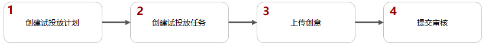
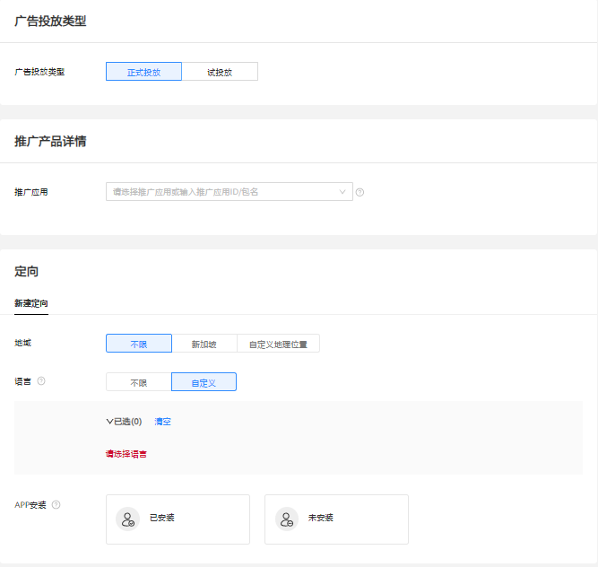
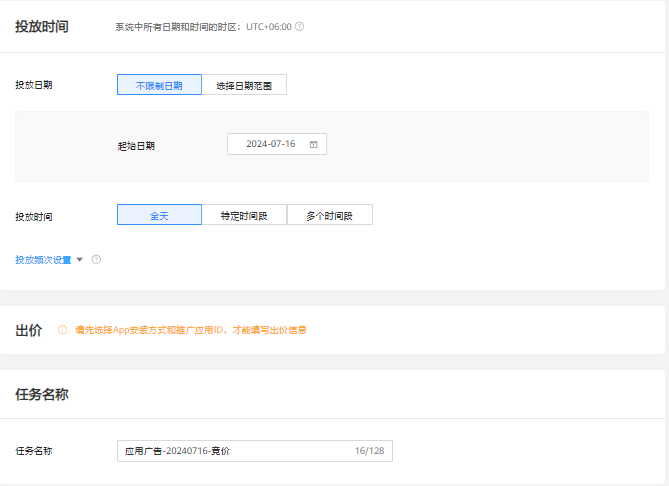
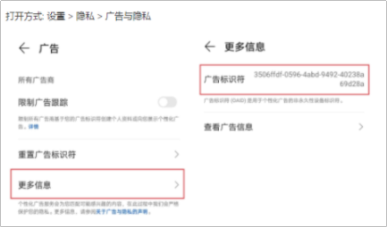
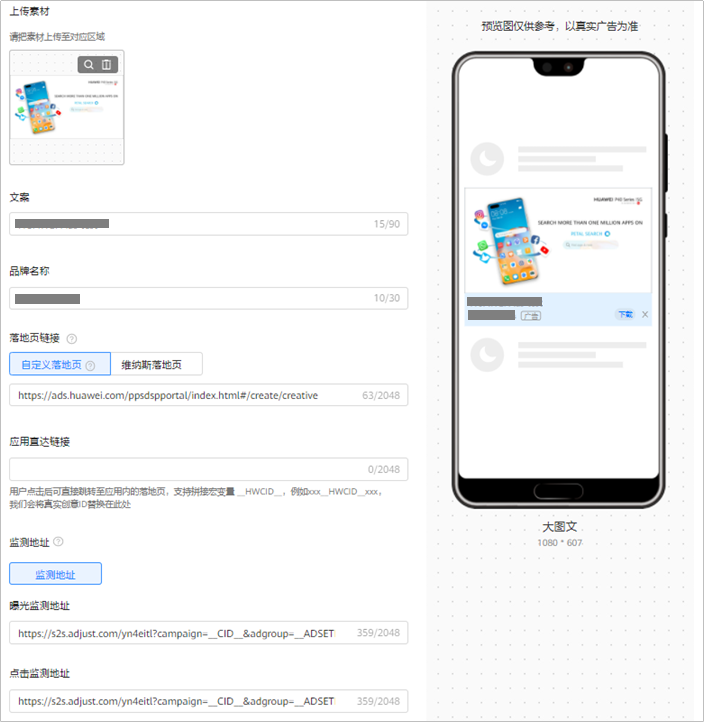

# 试投放广告

## 概述

在正式进行展示广告网络投放之前，您可能希望确认广告展示是否和预期一致、落地页是否可以正常展示、转化跟踪等是否工作正常。您可以通过创建试投放任务来实现。试投放任务只会展示到您在任务中指定的测试设备上，且试投放不会消耗账户余额。

试投放任务只支持展示广告网络。

## 操作流程

## 操作步骤

 

试投放创建之前，需要创建相关的事件资产和事件才能完成编辑，详情可以参考[事件资产管理](https://developer.huawei.com/consumer/cn/doc/promotion/tracking-zhuanhaugenzong-0000001943980532)。

1. 创建试投放计划。

   单击，选择“创建计划”。

   

   - <strong>营销目标：</strong>选择“销售转化”或者“无明确目的导向”，详情参考[营销目标](/docs/monetize/promotion/overview-cjjjgg-0000001182873508#ZH-CN_TOPIC_0000001182873508__zh-cn_topic_0000001205953939_zh-cn_topic_0000001105216776_li07111843183611)。
   - <strong>计划类型：</strong>选择“展示广告”，详情参考[计划类型](/docs/monetize/promotion/overview-cjjjgg-0000001182873508#ZH-CN_TOPIC_0000001182873508__zh-cn_topic_0000001205953939_zh-cn_topic_0000001105216776_li234211653411)。
   - <strong>投放网络：</strong>选择<strong>“</strong>展示广告网络<strong>”</strong>，详情参考[投放网络](/docs/monetize/promotion/overview-cjjjgg-0000001182873508#ZH-CN_TOPIC_0000001182873508__zh-cn_topic_0000001205953939_zh-cn_topic_0000001105216776_li93421166342)<strong>。</strong>
   - <strong>推广产品：</strong>选择<strong>“</strong>网页”或<strong>“</strong>Android应用<strong>”</strong>，详情参考[推广产品](/docs/monetize/promotion/overview-cjjjgg-0000001182873508#ZH-CN_TOPIC_0000001182873508__zh-cn_topic_0000001205953939_zh-cn_topic_0000001105216776_li8342416193416)<strong>。</strong>
   - <strong>计划日预算：</strong>详情参考[计划日预算](/docs/monetize/promotion/overview-cjjjgg-0000001182873508#ZH-CN_TOPIC_0000001182873508__zh-cn_topic_0000001205953939_zh-cn_topic_0000001105216776_li14342141615342)。
   - <strong>推广计划名称：</strong>详情参考[推广计划名称](/docs/monetize/promotion/overview-cjjjgg-0000001182873508#ZH-CN_TOPIC_0000001182873508__zh-cn_topic_0000001205953939_zh-cn_topic_0000001105216776_li1434211615342)。
2. 创建试投放任务。

   如果您希望在已有的计划下增加新的任务，请参考[已有计划下创建任务](/docs/monetize/promotion/overview-cjjjgg-0000001182873508#ZH-CN_TOPIC_0000001182873508__zh-cn_topic_0000001205953939_li5851143183912)。

   

   

   - <strong>广告投放类型：</strong>选择“试投放”。
   - <strong>推广产品详情：</strong>
     - 若推广产品为网页，输入自定义的HTTPS访问地址，即您需要推广的落地页，落地页默认使用webview打开。
     - 若推广产品为Android应用，您可以推广已在华为应用市场发布的应用或其他应用市场发布的应用。注意，如果您要推广其他应用市场发布的应用，您需要申请[特性通行名单](/docs/monetize/promotion/addtongxing-0000001128278195#ZH-CN_TOPIC_0000001128278195__li58021033171912)。

       <strong>应用所属平台：</strong>如果您的应用在多个应用市场上架，推荐您使用“多平台智能下载”，详情可参考[应用所属平台](/docs/monetize/promotion/displayad-0000001052424318#ZH-CN_TOPIC_0000001052424318__zh-cn_topic_0000001176471121_li115004572714)。
   - <strong>定向：</strong>
     - <strong>App安装</strong>：若您的推广产品为应用，您需要选择用户的应用状态，广告根据已安装和未安装该Android App的用户进行匹配。
       - 当选择已安装时，测试手机设备也必须已安装应用，否则广告将不会投放到测试设备上。
       - 当选择未安装时，测试手机设备也必须未安装应用，否则广告将不会投放到测试设备上。
     - <strong>设备：</strong>填入测试手机设备的OAID或者GAID。OAID或者GAID指的是一种非永久性设备标识符，可在保护用户个人数据隐私安全的前提下，向用户提供个性化广告。HMS手机一般用OAID，GMS手机一般用GAID。
       - HMS手机OAID获取方式：打开手机的设置，找到隐私功能，单击广告和隐私，单击更多信息，获取OAID。请注意因手机型号不一致，广告标识符所处的位置有所差别。

         
       - GMS手机GAID获取方式：打开手机的设置，找到谷歌，单击隐私，找到广告，获取GAID。请注意因手机型号不一致，广告标识符所处的位置有所差别。
   - <strong>版位：</strong>在版位选择中，您可以决定广告出现在什么位置。在选中某个版位后，右侧会出现对应的版位预览。
   - <strong>投放日期与投放时间：</strong>建议投放日期设置久一些，投放时间选择全天投放。
   - <strong>任务名称</strong>：详情参考[任务名称](/docs/monetize/promotion/overview-cjjjgg-0000001182873508#ZH-CN_TOPIC_0000001182873508__zh-cn_topic_0000001205953939_li237864312259)。
3. 上传创意（以应用为例）。

   根据您需要版位的不同，您需要先选择创意样式及尺寸，并添加对应的创意图片或视频、设置品牌名称和描述信息等。详情参见 [素材指导](/docs/monetize/promotion/overview_ggsczd-0000001182713584)。

   

   - 同一任务下只能选一种创意样式，一种创意样式可以添加5条创意，每条创意支持独立的素材，且每条创意尺寸类型只能选一个，如果您想要添加所有的尺寸类型，那您需要为每个尺寸类型添加创意。

     例如：您创意样式选择了纯图，纯图包含了以下尺寸类型：1080\*607、640\*360、1080\*432、720\*1280，您在创意1中选择了1080\*432，那么您在创意2中可以选择1080\*607，创意3中选择640\*360。

     

   | 应用所属平台 | 落地页链接 | 应用直达链接 |
   | --- | --- | --- |
   | 华为应用市场 | 选填 | 必填 |
   | GooglePlay | 无需填写 | 无需填写 |
   | 多平台智能下载 | 选填 | 必填 |
   | 其他安卓应用商店 | 选填 | 必填 |
   | 第三方监测渠道 | 无需填写 | 无需填写 |

   - <strong>落地页链接</strong>：落地页是您想要推广内容的信息承载页面，用户点击广告创意时，会优先打开落地页，再进行下载安装。您可以选择自定义落地页或者选择维纳斯落地页。如果您的推广目的为应用下载，此时如果您不填写落地页链接，平台会智能帮您生成一个落地页。
     - <strong>自定义落地页：</strong>填写自定义的HTTPS访问地址。例如：``https://ads.huawei.com/usermgtportal/home/index.html#/``。
     - <strong>维纳斯落地页：</strong>您也可以选择维纳斯落地页，用户点击您的广告后，进入您在维纳斯创建的落地页，具体请查看[落地页工具](/docs/monetize/promotion/venus-0000001063299665)。
   - <strong>应用直达链接</strong> <strong>：</strong>如果您投放的是应用促活广告，此字段必填，指定应用内内容的链接，如果您想获取应用首页，获取方式请参考<strong>[应用直达链接获取工具](/docs/monetize/promotion/overview-cjjjgg-0000001182873508#应用直达链接获取工具)；</strong>如果您想获取应用直达链接的指定页面，请联系您的研发同事获取。
   - <strong>监测地址</strong> <strong>（选填）</strong>：如果您使用三方监测进行转化跟踪，请先完成[三方监测](/docs/monetize/promotion/tracking-overview-0000001170938773)的对应操作，完成后在您创建任务的时候，系统将会自动关联监测地址（关联出来的链接建议不要修改，避免影响跟踪数据）。

     如果您修改了关联分析工具中的监测链接，系统将会自动同步到任务，任务中无需修改。

     如果您修改了任务创意中的监测链接，系统将会以任务创意中修改后的监测链接为准，此时关联分析工具的监测链接不会自动修改。
   - <strong>创意名称：</strong>详情参考[创意名称](/docs/monetize/promotion/overview-cjjjgg-0000001182873508#ZH-CN_TOPIC_0000001182873508__zh-cn_topic_0000001205953939_zh-cn_topic_0000001105216776_li1471941495513)。
4. 单击“提交”将会提交至系统自动审核，审核通过后可在测试设备上查看试投放广告。

   试投放任务只会展示在集成了对应广告类型的应用上，所以您根据试投放任务的版位，选择对应的应用查看广告。下表列出了一些备选应用供您参考：

   | 广告形式 | 备选应用 |
   | --- | --- |
   | 原生 | 智慧助手、HUAWEI Browser、VidMate，imo、 Likee、 Lark Player、 PLAYit、 华为视频、华为音乐、Jelly Stacking |
   | 横幅 | imo、 Snaptube、 AASTOCKS、 wetter.com、 KLSE Screener (Bursa)、 Bubble Shooter Original、 Subway Princess Runner、 Gspace、 Rescue The Girl 3D、 SofaScore、 Crazy Candy Bomb、 Puzzle Glass、 DualSpace、 Tetris Crush、 24sata、 Bubble Shooter 2、Block Puzzle Jewel |
   | 激励 | Golden Farm、 Brain Out、Subway Princess Runner、Bubble Shooter Original、 Crazy Candy Bomb、 Worms Zone、 Who is? Brain Teaser & Tricky Riddles |
   | 插屏 | imo、 VidMate、DualSpace、 PLAYit、 Block Puzzle Jewel、 Bubble Shooter Original、 Lark Player、 Crazy Candy Bomb、 Easy Urdu Keyboard 2021、 Happy Block Puzzle、 Draw Runner Racing |
   | 开屏 | 华为视频、华为音乐、华为阅读、VidMate、Draw Runner Racing、Epic Rush 3D |
   | 贴片 | 华为视频 |
