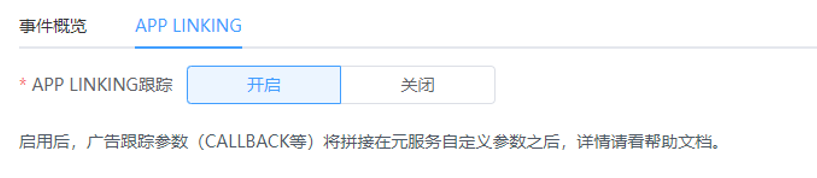
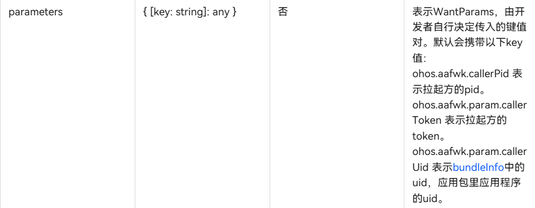

# App Linking跟踪

## 基本原理

APP LINKING跟踪可以帮忙广告主衡量鲸鸿动能投放元服务的转化效果；APP LINKING跟踪是借助元服务自定义参数能力传递广告跟踪参数（CALLBACK等），广告主通过Want接口在拉起元服务时获取广告跟踪参数，从而实现流量渠道跟踪，并支持将CALLBACK回传给鲸鸿动能完成转化数据回传。

## 业务流程

1. 广告主在鲸鸿动能创建元服务APP LINKING跟踪；
2. 广告投放，用户点击广告拉起元服务应用，广告跟踪参数随元服务自定义参数存入端侧；
3. 广告主元服务从端侧接口解析获取广告跟踪参数；
4. 广告跟踪参数随转化跟踪接口回传到鲸鸿动能，优化广告投放。

## 鲸鸿动能界面配置

操作入口：“工具”-&gt;“事件资产管理”-&gt;“新建资产”-&gt;“元服务”

关联分析工具：转化跟踪工具，此处请选择‘专属监测工具’，即广告主自主进行转化数据的跟踪和归因。

操作入口：“选择资产”-&gt;“APP LINKING”-&gt;“开启”

APP LINKING跟踪：启用后，广告跟踪参数将随广告点击写入端侧Ability Kit，广告跟踪参数包括：

contentid：创意ID（当存在元素组情况下拼接元素组ID）

taskid：任务ID

campaignid：计划ID

corpid：账号ID

callback：回传参数 。

## 广告主端侧获取广告跟踪参数

1. 广告主元服务通过端侧Ability Kit的[Want接口](https://developer.huawei.com/consumer/cn/doc/harmonyos-references-V5/js-apis-inner-ability-want-V5)获取parameters

   

   广告主解析parameters获取广告跟踪参数，例如：

   contentId=100058283&adgroupId=48222542&campaignId=38151235&corpId=701858094015079040&callback=48006662%26202412231116180142395%26701858094015079040%26com.atomicservice.5765880207845662281%26source%3Dopenlink"

## 转化回传

广告主解析parameters获得callback，通过[鲸鸿动能转化跟踪接口](https://alliance-communityfile-drcn.dbankcdn.com/FileServer/getFile/cmtyPub/011/111/111/0000000000011111111.20260529160257.34865182088271682394833643325485:20260531101420:2800:243677B6CE34013A1CABE7B466AF04294B42156898A87F6AD601E2300E2F962C.docx?needInitFileName=true)回传转化数据。

## 测试流程

当前元服务APP LINKING跟踪无法通过手动联调进行回传测试，请通过试投放广告进行测试。
