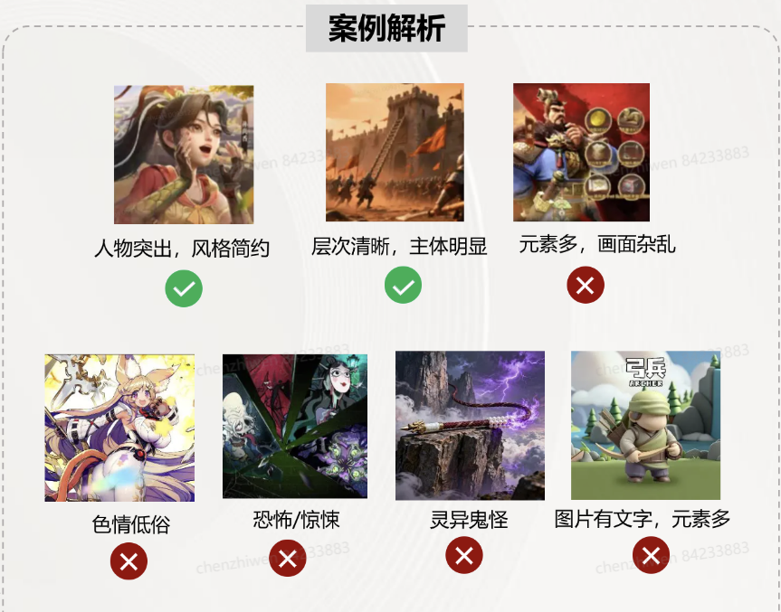
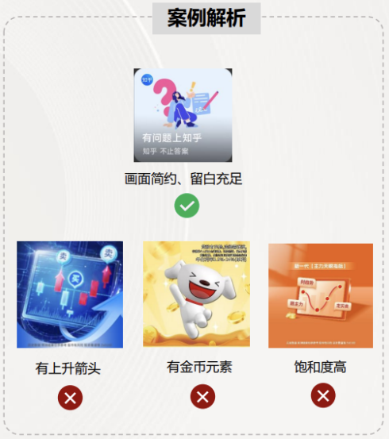
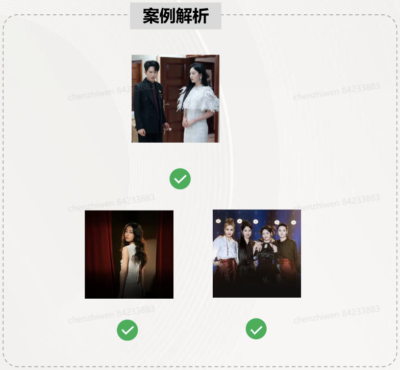
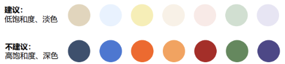
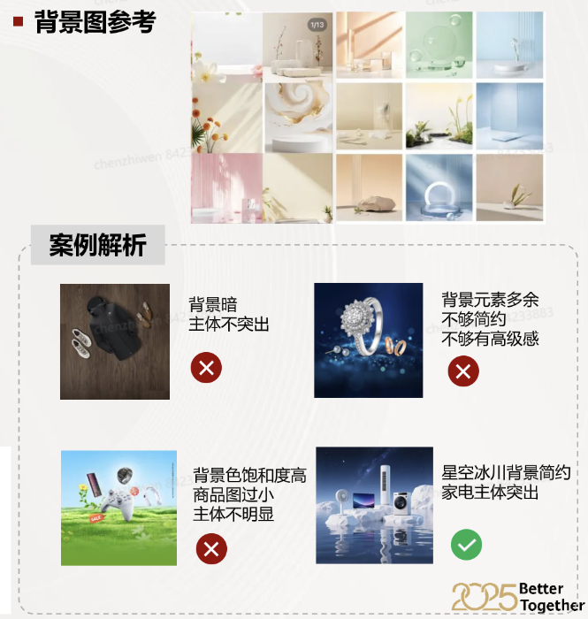
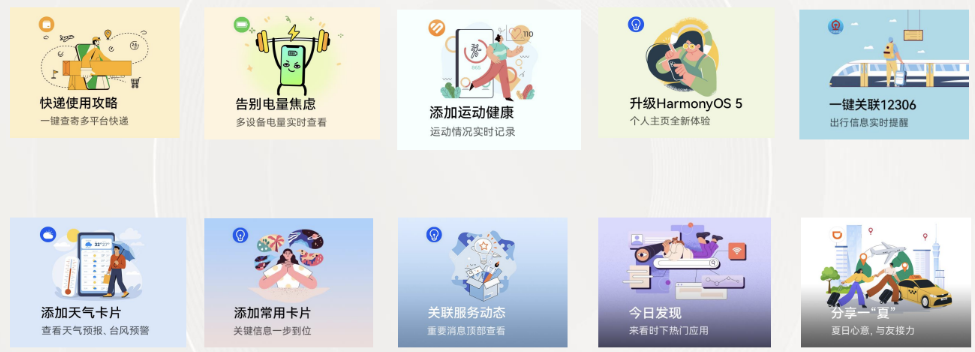

# 负一屏动态推荐卡

<strong>广告投放规范：游戏行业</strong>

- <strong>整体思路</strong>

人群定向需精准，整体设计需严格遵循合规底线，杜绝安全红线与功能混淆风险。

- <strong>文案要求</strong>

（一）禁止使用的文案内容

1、促销与价格类禁止：

禁止出现明确价格（如“0.01元”“×元飞"）、促销表述（如“很便宜”“限时”“免费）；

禁止使用真实货币符号（如$、∈、￥、f），避免引发诱导消费误解。

2、“安全红线”禁止：

禁止使用敏感词汇（如政治相关、宗教元素相关内容）、恐怖/惊悚、色情/低俗、暴力/危险行为内容元素。

3、功能性提示禁止：

禁止使用与系统／操作相关的文案（如“点击下载”"返回首页”），避免混淆功能认知。

4、电商行业的广告主标题禁止突出商品品牌名称（除华为），可以侧重活动，例如“双十一"

（二）建议使用的文案表达

营造利他感：聚焦用户实际获益，如“家务归我，生活归你”“新机到手不会玩？帮你整理好啦”。

<strong>广告投放规范：金融行业</strong>

金融行业把控较严格，广告的素材、可投放落地页需单独沟通确认 案例解析。

- <strong>整体思路</strong>

人群定向需精准

整体设计需遵循“插画风格”，保持色彩、图案与文案的视觉统一。

- <strong>行业要求</strong>

金融行业3个二级行业禁投，包括：小额贷款、贷超及助贷服务、证券投资顾问。

- <strong>文案要求</strong>

（一）禁止使用的文案内容

1、促销与价格类禁止：

禁止出现明确价格（如“0.01元”“×元飞"）、促销表述（如“很便宜”“限时”“免费）；

禁止使用真实货币符号（如$、∈、￥、f），避免引发诱导消费误解。

2、“安全红线”禁止：

禁止使用敏感词汇（如政治相关、宗教元素相关内容）、恐怖/惊悚、色情/低俗、暴力/危险行为内 容元素。

3、功能性提示禁止：

禁止使用与系统／操作相关的文案（如“点击下载”"返回首页”），避免混淆功能认知。

4、电商行业的广告主标题禁止突出商品品牌名称（除华为），可以侧重活动，例如“双十一"。

（二）建议使用的文案表达

营造利他感：聚焦用户实际获益，如“家务归我，生活归你”“新机到手不会玩？帮你整理好啦”。

- <strong>素材要求</strong>

1、避免高饱和度促销色调 (如大红/荧光黄) ；

2、画面需留白充足，避免元素堆砌 ；

3、画面需主体清晰，层次分明 ；

4、避免政治相关、宗教元素、恐怖/惊悚、色情/低俗、暴力/危险行为内容元素 有上升箭头 有金币元素 饱和度高 ；

5、<strong>不可出现红包、金条、元宝、金币、上升箭头等元素。</strong>

<strong>广告投放规范：影音娱乐行业 案例解析</strong>

- <strong>整体思路</strong>

人群定向需精准，整体设计需严格遵循合规底线，杜绝安全红线与功能混淆风险。

- <strong>人群定向要求</strong>

定向影音娱乐app高付费用户/经常使用该app的人。

- <strong>素材要求</strong>

1、避免高饱和度促销色调（如大红/荧光黄) ；

2、画面需留白充足，避免元素堆砌 ；

3、画面需主体清晰，层次分明 ；

4、避免政治相关、宗教元素、恐怖/惊悚、色情/低俗、暴力/危险行为内容元素。

- <strong>文案要求</strong>

（一）禁止使用的文案内容

1、促销与价格类禁止：

禁止出现明确价格（如“0.01元”“×元飞"）、促销表述（如“很便宜”“限时”“免费）；

禁止使用真实货币符号（如$、∈、￥、f），避免引发诱导消费误解。

2、“安全红线”禁止：

禁止使用敏感词汇（如政治相关、宗教元素相关内容）、恐怖/惊悚、色情/低俗、暴力/危险行为内 容元素。

3、功能性提示禁止：

禁止使用与系统／操作相关的文案（如“点击下载”"返回首页”），避免混淆功能认知。

4、电商行业的广告主标题禁止突出商品品牌名称（除华为），可以侧重活动，例如“双十一"。

（二）建议使用的文案表达

营造利他感：聚焦用户实际获益，如“家务归我，生活归你”“新机到手不会玩？帮你整理好啦”。

<strong>广告投放规范：电商行业（单个或多个SKU，有限开放）</strong>，

- <strong>适用场景</strong>

电商行业优先插图风格，若广告主有特殊诉求或特殊节点，基于<strong>精准广告投放人群</strong>，可制作实体图素材。要求背景简约，画面有质感。

- <strong>整体思路</strong>

整体设计美观大气，有高级感，保持色彩、图案与文案的视觉统一。

- <strong>文案要求</strong>

（一）禁止使用的文案内容

1、促销与价格类禁止：

禁止出现明确价格（如“0.01元”“×元飞"）、促销表述（如“很便宜”“限时”“免费）；

禁止使用真实货币符号（如$、∈、￥、f），避免引发诱导消费误解。

2、“安全红线”禁止：

禁止使用敏感词汇（如政治相关、宗教元素相关内容）、恐怖/惊悚、色情/低俗、暴力/危险行为内 容元素。

3、功能性提示禁止：

禁止使用与系统／操作相关的文案（如“点击下载”"返回首页”），避免混淆功能认知。

4、电商行业的广告主标题禁止突出商品品牌名称（除华为），可以侧重活动，例如“双十一"

（二）建议使用的文案表达

营造利他感：聚焦用户实际获益，如“家务归我，生活归你”“新机到手不会玩？帮你整理好啦”。

- <strong>素材要求</strong>

1、构图要求：商品主体在中间重点突出，背累不喧宾夺主，主次分明。

2、色彩要求：避免高饱和度促销色调（如大红/荧光黄），建议使用中 性色或低饱和度色调。

3、简约性要求：画面需留白充足，避免元素堆砌、低廉物品；以色彩和谐为核心，不够有高级感 保持整体简洁清爽的视觉效果，无冗余装饰元素。

- <strong>背景主题色建议</strong>

- <strong>背景图参考</strong>

<strong>动态推荐卡高CTR素材展示</strong>

