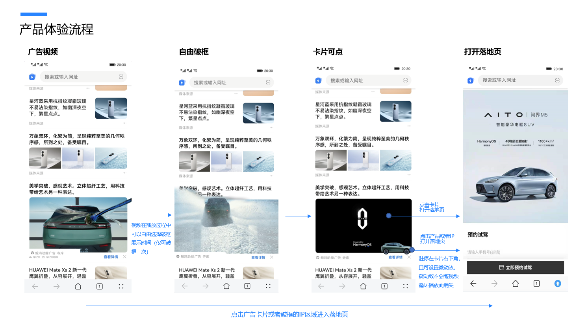
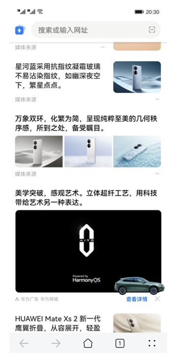
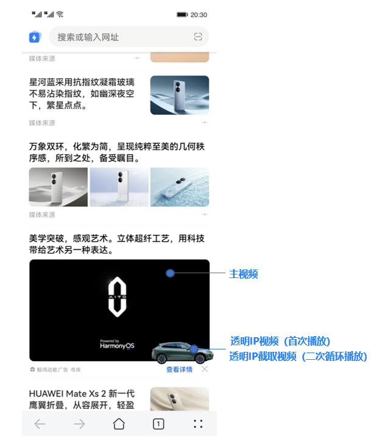
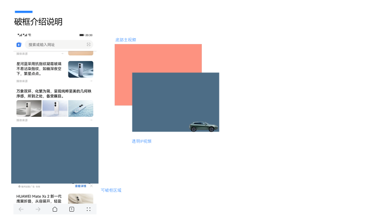
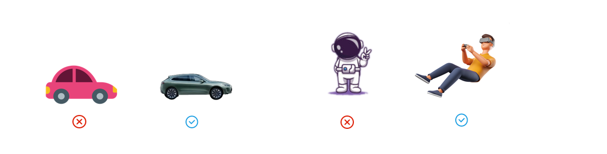
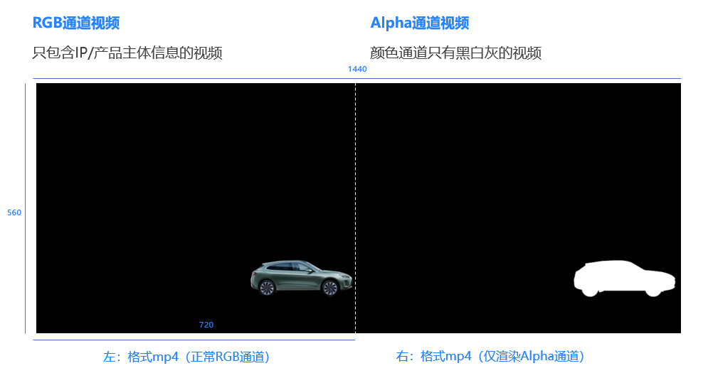
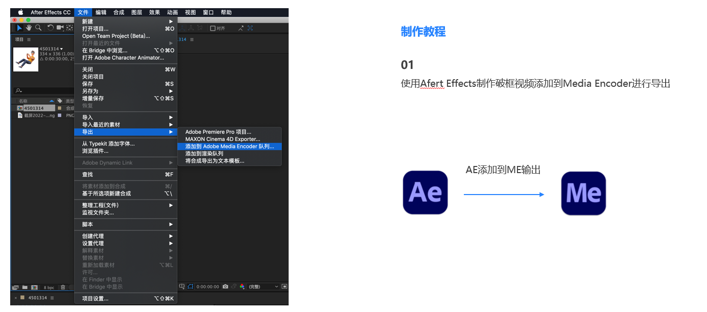
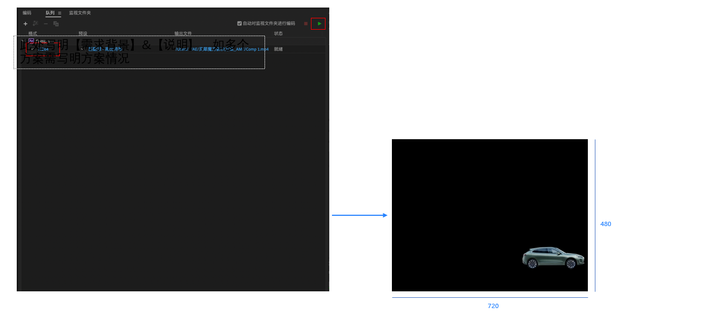
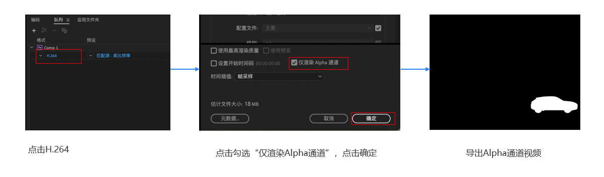

# 灵妙3D IP广告

## 灵妙3D IP广告体验流程

## 广告素材说明

<strong>主动破框</strong>：视频广告播放过程中可破框呈现。

<strong>IP/</strong> <strong>产品停留</strong>：破框呈现后IP形象或者广告产品可以停留在卡片右下角，与用户建立情感联系，提升品牌形象。

<strong>落地页跳转规则：</strong>单击卡片或者IP，均可打开落地页。

## 广告制作说明

<strong>主视频</strong>

比例：16 : 9 （ 推荐尺寸 640×360 像素）

时长：5 ～ 30 秒

格式：MP4

文件大小： &lt;= 10 MB

视频编码：H.264/AVC

视频帧率：建议&lt;= 24fps

视频码率： &lt;= 2000kbit/s

<strong>透明</strong> <strong>IP</strong> <strong>视频</strong>

制作比例： 3 : 2 （ 推荐尺寸 720×480 像素，制作后需拼接导出）

导出比例： 3 : 1 （ 若制作尺寸为720×480 像素，则导出1440×480 像素）

时长：5 ～ 25 秒

格式： MP4

文件大小： &lt;= 10MB

视频编码：H.264/AVC

视频帧率：建议&lt;= 24fps

视频码率： &lt;= 2000kbit/s

<strong>透明</strong> <strong>IP</strong> <strong>截取视频</strong>

制作比例： 3 : 2 （ 推荐尺寸 720×480 像素，制作后需拼接导出）

导出比例： 3 : 1 （ 若制作尺寸为720×480 像素，则导出1440×480 像素）

具体导出说明见P9

时长：3 ～ 10 秒

格式： MP4

文件大小： &lt;= 10MB

视频编码：H.264/AVC

视频帧率：建议&lt;= 24fps

视频码率： &lt;= 2000kbit/s

## 安全区示意图

## 破框介绍说明

<strong>破框实现方式：</strong>在底层视频基础上，覆盖一层IP/产品透明背景底的视频。

<strong>破框逻辑说明：</strong>当用户完全滑过该信息流广告的破框区域或者单击跳转落地页，返回该广告时需要重新破框触发破框动效IP形象才会出现并驻停在卡片右下角。

## 设置IP视频出现时段

<strong>透明IP视频</strong>：透明IP视频出现的时间段默认从0秒开始，支持设置IP开始播放的时间。

<strong>设置时长建议</strong>：透明IP视频出现时段在5S以上，透明IP截取视频需要在3S以上，建议IP开始播放时间+透明IP视频时长+透明IP截取片段时长=主视频时长。

<strong>透明IP截取视频</strong>：透明IP视频播放完成后，透明IP截取视频开始并循环播放。

(注：当用户停留在广告页面时间超过广告时长时，主视频会循环播放，透明IP视频仅播放一次，透明IP截取视频会在卡片右下方循环播放）

## 破框的创意建议

<strong>IP</strong> <strong>破框的创意建议</strong>：

1. IP形象建议风格是3D立体真实、表现适合的光影和材质，避免扁平化、手绘描边等风格。
2. 建议外层视频跟IP视频是独立展示的内容，不要出现交互的形式，避免IP视频循环播放时与外层视频无法达到交互，影响用户体验。

<strong>IP</strong> <strong>轨迹</strong>：支持自定义轨迹。

<strong>支持的</strong> <strong>IP形象</strong>：非写实的IP形象或者公司产品，建议是虚拟卡通形象IP、自制的品牌IP、合作IP、游戏IP等。

<strong>不支持的形象</strong>：不支持真人形象、品牌logo等。

## 视频制作建议

<strong>视频合成说明</strong>：透明IP视频通过RGB通道视频和Alpha通道视频合成。

<strong>步骤说明：</strong>

1.先导出含两种通道的mp4，一个为正常RGB通道的mp4，另一个为仅渲染Alpha通道的mp4，分别导出的视频尺寸为720 × 480 像素。

2.再把导出的两种通道视频左右拼接导出，按左：RGB通道，右：Alpha通道排列，拼接导出的视频尺寸为1440 × 480像素。

3.最后导出正常RGB的mp4即可。

<strong>如何导出透明IP视频</strong>：

1. 使用Afert Effects制作破框视频添加到Media Encoder进行导出。

   
2. <strong>RGB视频：</strong>选择H.264后，单击右上角开始图标按钮，即可导出RGB视频。

   
3. <strong>Alpha视频：</strong>单击H.264，下一步单击“仅渲染Alpha通道”，单击确定，再导出视频。

   
