# 智慧助手（小艺建议）

## 小艺建议场景卡设计规范

<strong>小艺建议2\*2卡片资源位介绍</strong>

推广能力： 应用促活\H5\快应用

素材规范：图片700\*600、JPG/JPEG/PNG

具体参照素材制作规范文档。

备注：支持DP链接拉起应用和H5，素材需要根据素材制作规范文档定制。

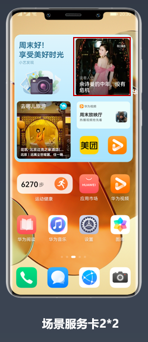

<strong>小艺建议2\*2卡片素材设计规范</strong>

<strong>素材组成与最终展示示例</strong>

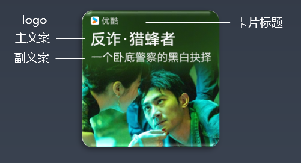

卡片标题：应用名称 (自动生成)

logo：应用图标 (自动生成)

主文案：建议最长7个字符

副文案：建议最长12个字符

背景底图：整张卡片背景图

注：背景底图为素材图，其他元素禁止呈现在素材图上。

<strong>背景地图尺寸与安全区域</strong>

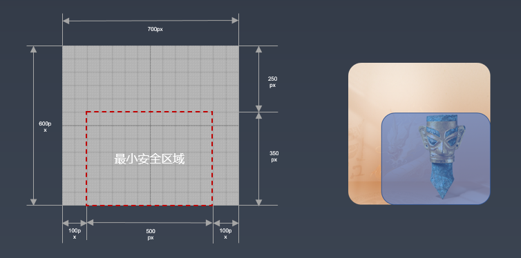

素材图输出尺寸：矩形700x600px

素材图大小：100k以内

资源输出格式：png

图案设计须体现服务内容相关元素，底图视觉元素适当靠右或靠下，避开文字遮挡。

<strong>小艺建议2\*4卡片资源位介绍</strong>

合约/竞价：CPM

推广能力： 应用促活\H5\快应用

素材规范：图片948x447 JPG/JPEG/PNG

具体参照素材制作规范文档

备注：支持DP链接拉起应用和H5，素材需要根据素材制作规范文档定制。

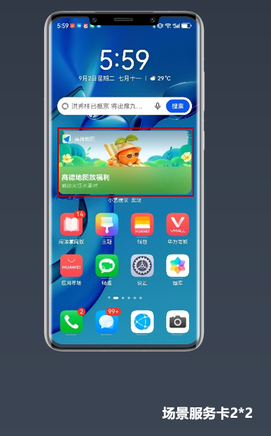

<strong>小艺建议2\*4卡片素材设计规范</strong>

<strong>素材组成与最终展示示例</strong>

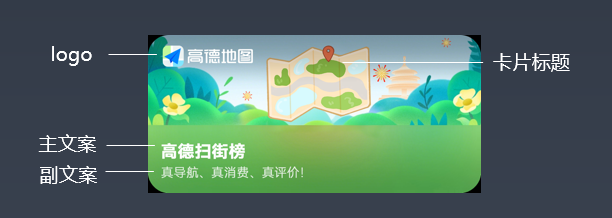

卡片标题：应用名称 (自动生成)

logo:应用图标 (自动生成)

主文案：建议最长7个字符

副文案：建议最长12个字符

背景底图：整张卡片背景图

注：背景底图为素材图，其他元素禁止呈现在素材图上。

<strong>背景底图尺寸与安全区域</strong>

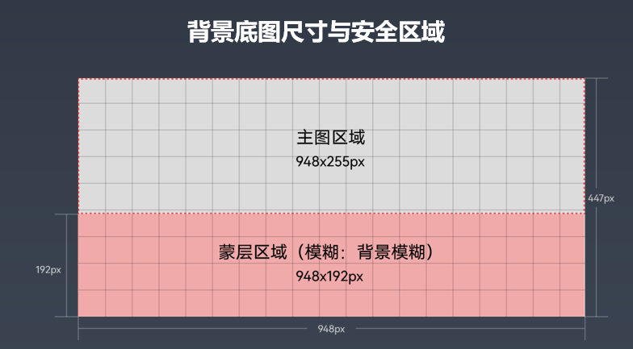

素材图输出尺寸：矩形948x447px

素材图大小：500k以内

资源输出格式：png

图案设计须体现服务内容相关元素,底图视觉元素适当靠右或靠下，避开文字遮挡。

## 小艺建议icon广告创意图标设计规范

<strong>设计原则</strong>

- icon创意素材需匹配落地页内容。创意素材与落地页关键信息一致。
- 通过icon创意素材能够明确是哪个APP的促活广告。

为了保障icon创意素材与小艺建议内其他应用icon在视觉上保持一致；

Icon创意素材设计需遵从“icon创意素材设计规范”。

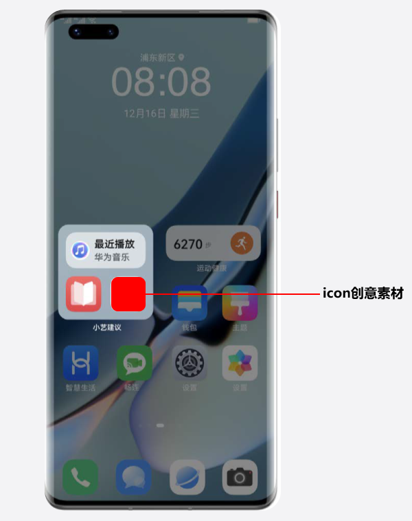

<strong>Icon</strong> <strong>创意素材基本规格</strong>

- 素材输出尺寸：矩形 192\*192 px
- 关键图形尺寸：168\*168 px
- 素材输出格式：png
- 关键图形与输出素材之间区域为透明像素
- 存储大小：不超过 150 kb

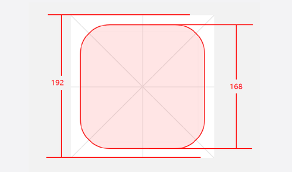

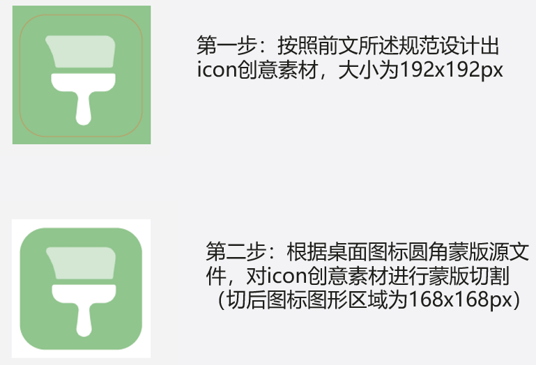

<strong>不加角标设计规范与尺寸规格</strong>

- 不加角标示意图

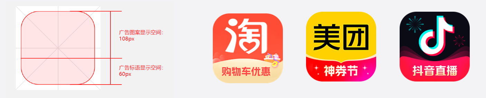

<strong>重要注意：</strong>

1、不加角标的设计，为了满足需要明确让用户知道是哪个APP广告的原则，<strong>只接受以</strong> <strong>APP</strong> <strong>原生</strong> <strong>icon</strong> <strong>为主要元素设计的</strong> <strong>icon</strong> <strong>创意素材</strong>。

<strong>2</strong> <strong>、审核会严格按照</strong> <strong>60px</strong> <strong>要求广告标语展示空间</strong>。

<strong>加角标设计规范与尺寸规格</strong>

- 加角标示意图

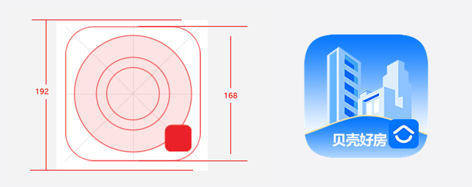

关键设计元素尽量控制在最外层圆圈范围内。

依据辅助线设计元素，可以保证所有icon创意素材保持一致的视觉比例。

右下角位置需要附上应用原生图标,位置距离关键图形，右边缘和下边缘12px,大小为43\*43px。

- 特殊设计

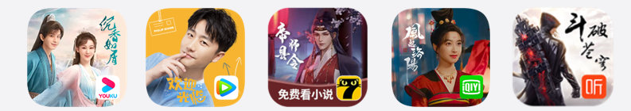

文娱内容等，允许一定范围内的特殊设计。

<strong>关键图形</strong>

关键图形需要呈现在规定圆形范围之内，可以使用<strong>线、面或者二者组合</strong>表现。

<strong>1</strong> <strong>、描边粗细</strong> <strong>12px</strong>

<strong>2</strong> <strong>、终点样式 圆头</strong>

<strong>3</strong> <strong>、外圆角</strong> <strong>(R) 32px</strong>

<strong>4</strong> <strong>、内圆角</strong> <strong>(R) 20px</strong>

<strong>5</strong> <strong>、断口宽度</strong> <strong>8px</strong>

允许两个图形的叠加使用，表示群、组、集的概念。

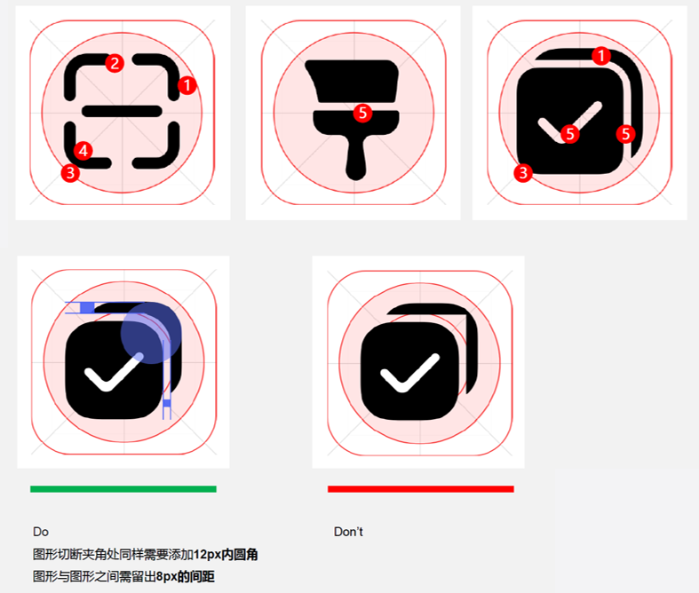

<strong>图标颜色</strong>

1、色彩使用图形<strong>主色、辅助色或者二者组合</strong>。

2、亦可使用品牌<strong>自定义</strong>色彩，注意需与背景色做区隔，保持关键图形可识别度。

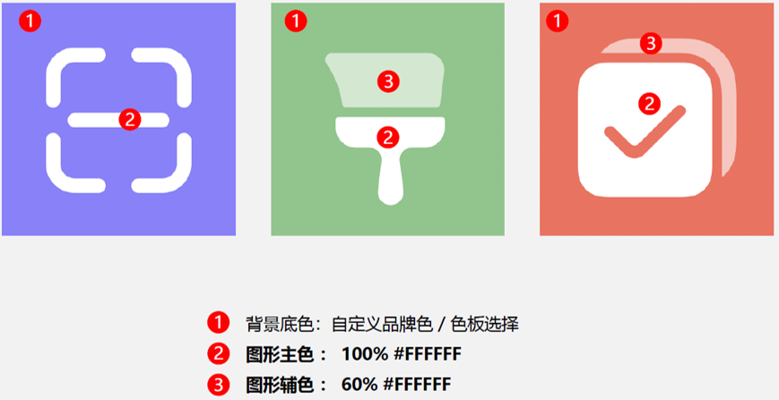

<strong>图标内容</strong>

图标内容和功能含义需要有关联。

图标能表达落地页内容，图标图形与元素。

与落地页内容需要有关联。

广告标语字数控制在3-5个字符。

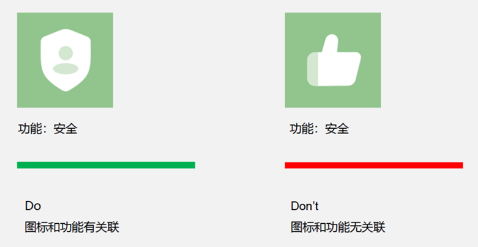

<strong>常见问题</strong>

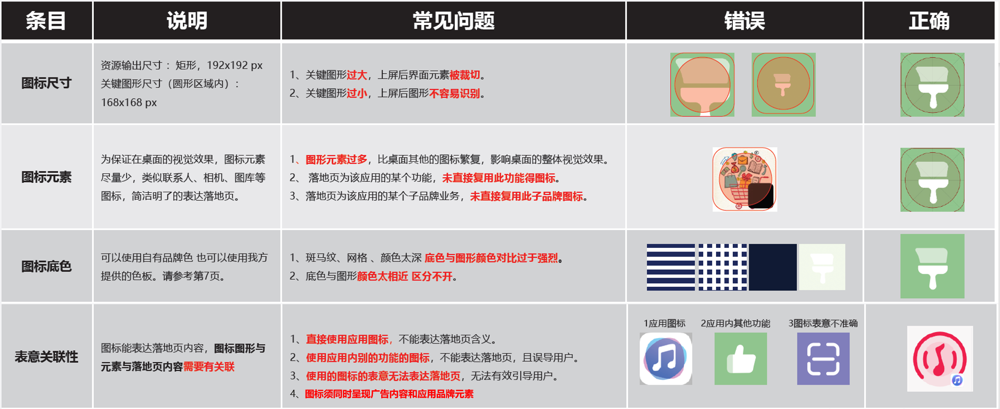
