# 财务管理

## 一级服务商账户

如您登录一级服务商账户，可在财务管理模块看到充值开票、充值记录、转账记录、返利结算单和虚拟金盘点功能。

### 充值开票

您可通过“财务管理”-&gt;“充值开票”进行账户充值，充值类型分为“线上充值”和“线下充值”。

<strong>线上充值</strong>

如您选择线上充值，您需要填写充值金额，并确认发票抬头及企业税号进行开票申请；填写完整后确认并提交。

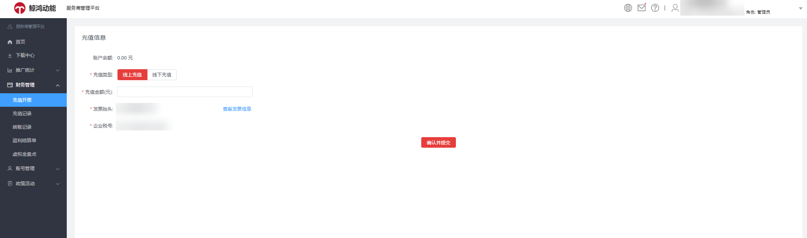

您可单击“查看发票信息”查看发票信息详情，如您需修改发票信息，单击“修改信息”即可编辑，编辑完成保存修改即可。

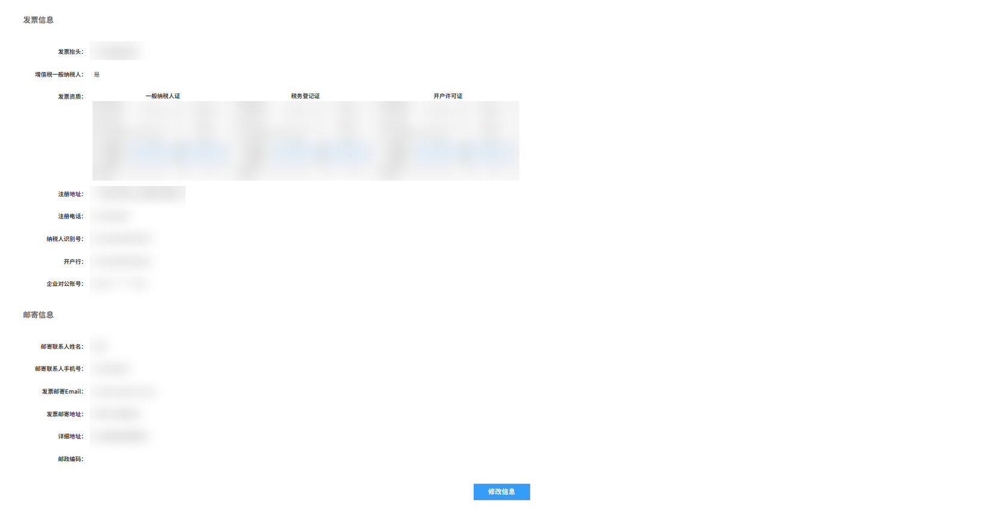

<strong>线下充值</strong>

如您选择线下充值，您需要确定收款账号信息，填写充值金额，上传打款凭证，确认发票抬头和企业税号进行开票申请。填写完整后确认付款即可。

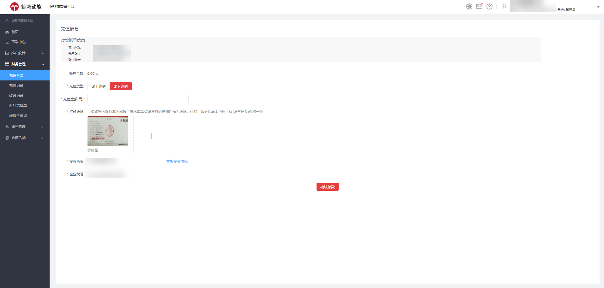

 

上传转账的银行截图或银行流水单等转账资料的扫描件作为凭证，付款主体必须与本协议主体(发票抬头)保持一致。

### 充值记录

您可通过“财务管理”-&gt;“充值记录”查看账户充值订单详情。

- 您可通过订单编号、充值类型、现金账户充值或虚拟金账户充值、订单状态、发票状态以及时间区间等条件筛选查看充值记录。

充值类型：线上充值、线下充值。

充值用途：现金账户充值、虚拟金账户充值。

资金账户类别：赠送金账户\_通用、赠送金账户\_华为自有媒体。

订单状态：全部、待付款、交易成功、交易已关闭、审核不通过、退款、待审核、退款成功、退款中。

发票状态：全部、未开发票、已开发票、未退发票、无需发票、开票中。

- 如您的订单为“待付款”状态，可单击操作栏的“付款”支付充值订单。

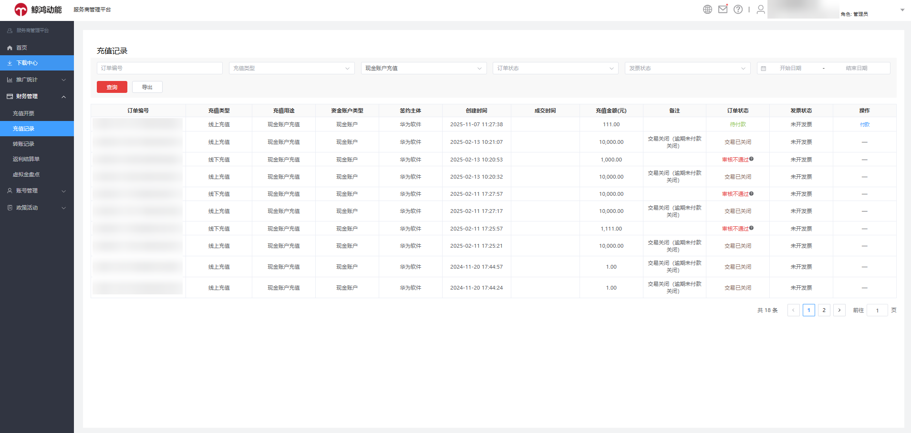

### 转账记录

您可通过“财务管理”-&gt;“转账记录”查看本账户的转账记录。

您可通过业务类型、转出方账户名称、转入方账户名称、账户类型以及时间区间等条件筛选查看转账记录。

业务类型：一级服务商转子客服务商、子客服务商转一级服务商、一级服务商转子客、子客转一级服务商。

账户类型：现金账户、赠送金账户、返利金账户。

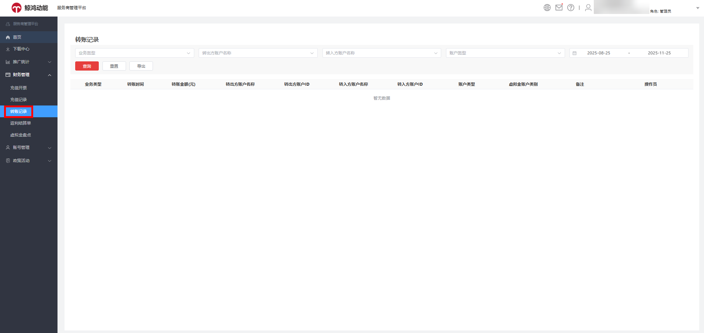

### 返利结算单

您可通过“财务管理”-&gt;“返利结算单”在平台内直接一键处理激励返利结算单，处理流程线上化，助您高效工作；并可查询历史返利结算单记录，便于管理。

- 在返利结算单管理列表中，您可以查看合同名称、币种、签约主体、激励政策名称、返利类型、版位商务类型、返利发放日期、激励发生时间、返利发放方式、返利计算账户消耗金额、应发返利金额、结算单状态（待确认、已确认、已驳回、返利发放中、返利已发放、返利发放失败）、返利结算单附件等内容。

- 您可通过合同名称、激励政策名称、版位商务类型、返利发放周期、激励发生时间、结算单状态等条件筛选过滤返利结算单。
- 您可在返利结算单列表筛选“待确认”的返利结算单，多选或单选待确认的结算单后进行“确认结算单”或“驳回结算单”操作，进行“驳回结算单”操作时请详述驳回理由。
- 若您对返利结算单无异议，请在返利合同约定的“返利结算单确认周期”内完成确认，逾期未确认系统将默认您已同意，并自动完成返利发放。
- 为避免您未能及时查看到返利结算单确认提醒消息，您可在服务商管理平台-&gt;“账号管理”-&gt;“消息设置”中，增加“返利结算单确认提醒”的通知渠道：邮箱与手机短信，届时提醒消息将会发送至该账户绑定的邮箱与手机上。

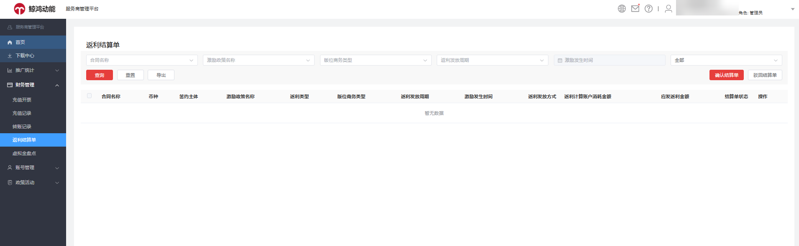

 

本功能上线后，将不再采用线下邮件的确认方式，统一在服务商管理平台上确认，请务必按照通知中截止时间及时对确认结算单进行处理，逾期未确认系统将默认您已同意，并自动完成返利发放。

### 虚拟金盘点

支持服务商自主查看虚拟金的收支明细、按订单ID查询虚拟金分布情况及有效期以推动服务商虚拟金有效期内使用，并支持查询一级服务商、子客服务商以及子客之间的虚拟金转账明细。

支持按资金账户类型与生效时间周期查询该服务商全部虚拟金订单，查询时间跨度最长为180天，并可依据订单ID检索具体订单分布情况。

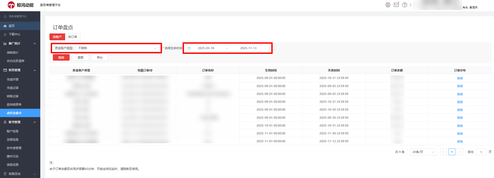

（服务商平台-虚拟经盘点-订单盘点（按账户查询）页面）

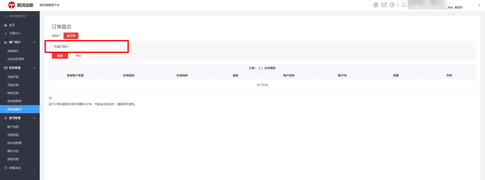

（服务商平台-虚拟经盘点-订单盘点（按订单查询）页面）

虚拟金盘点页面提供包含资金账户类型、充值订单ID、订单名称、生效与失效时间、订单余额及订单分布等关键指标的详情列表，<strong>若您想查看某个订单分布情况可点击订单分布列“查看”即可跳转至详情页面</strong>，进一步查看该订单对应的资金账户类型、生效日期、失效日期、角色、账户名称、账户ID、余额及币种等维度信息。

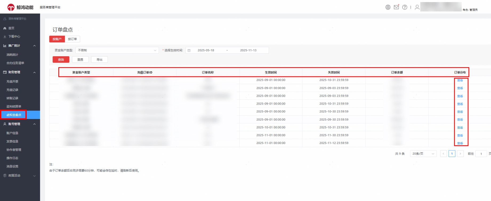

（服务商平台-虚拟经盘点-订单盘点列表页面）

- 虚拟金盘点页面订单盘点列表数据<strong>支持直接导出和异步导出</strong>，其中异步导出适用于处理超过5000条的大数据量场景，可有效避免任务超时；异步导出任务完成后，您可在下载中心统一查看并下载结果文件。

  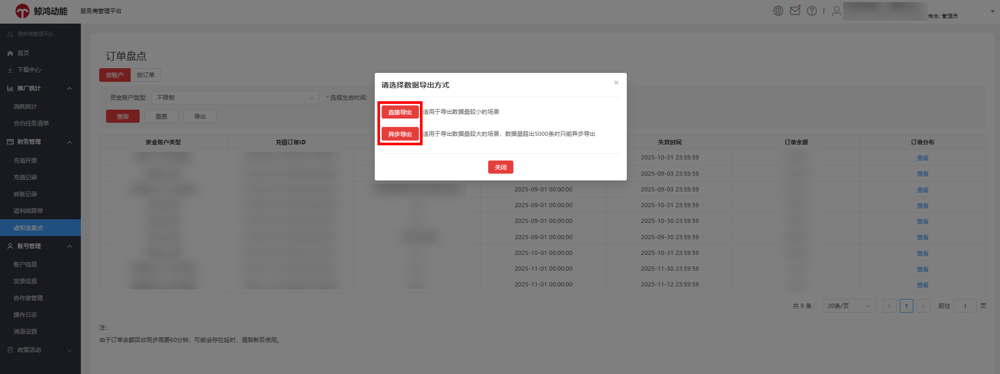

  （服务商平台-虚拟经盘点-订单盘点列表数据导出页面）

## 子客服务商账户

如您登录子客服务商账户，可查看“转账记录”。

您可通过选择业务类型、转出方账户名称、转入方账户名称、账户类型以及时间区间筛选查看转账记录。

业务类型：一级服务商转子客服务商、子客服务商转一级服务商、一级服务商转子客、子客转一级服务商、子客转子客。

账户类型：现金账户、赠送金账户、返利金账户。

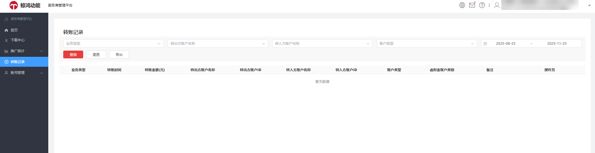
