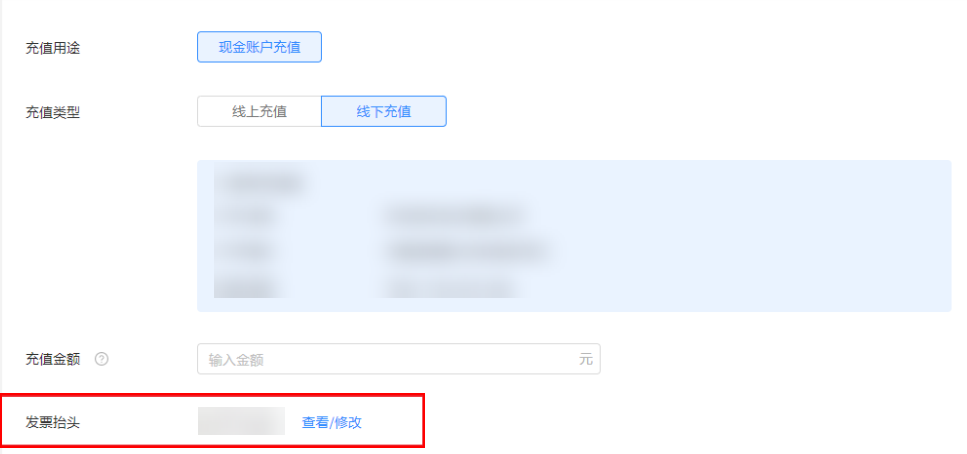

# FAQ

## 充值与开票

<strong>Q1：</strong> <strong>有几种充值方式？</strong>

<strong>A</strong>：支持线上充值和线下充值。线下充值需要企业对公转账，时效难以保证；线上充值使用企业网银即可，推荐您使用线上充值方式。

<strong>Q2：</strong> <strong>充值的到账时间？</strong>

<strong>A</strong>：线上充值后立即生效；线下打款，需要在系统上传单据，等待华为财务审核，审核时间1-3个工作日。

<strong>Q3：</strong> <strong>发票抬头和内容分别是什么？</strong>

<strong>A</strong>：子客发票请联系服务商开具；

直客发票抬头默认为企业认证名称，发票内容为信息服务费。若出现公司主体变更、三证合一营业执照更换、发票类型变更等特殊情况，请在后台立即刷新发票信息，将之前未触发开票申请的订单内开票信息同步更新，已触发开票申请的订单则按旧的开票信息开票，若因填写错误造成的发票问题将不再重新开票。

<strong>Q4：</strong> <strong>直客的发票什么时候寄出？</strong>

<strong>A</strong>：订单充值成功后，开发者可点击“申请开票”或等系统于15个工作日后自动触发开票申请。如果开发者有多条订单，当月订单会进行合并开票。开票周期为当月充值次月开出发票。

2025年上线数电发票，不再进行纸质发票的邮寄。已开具的数电发票将通过电子发票服务平台自动交付。开发者登录自己的电子发票服务平台后，可进行发票查验以及用途勾选等系列操作。（发票业务-发票查询统计-全量发票查询-查询类型：取得发票，可通过开票日期或数电票号码等进行查询下载）。

<strong>Q5：</strong> <strong>什么是虚拟账户余额？</strong>

<strong>A</strong>：虚拟账户余额 = 赠送金余额 + 返利金余额，请注意虚拟金存在有效期，到期后将会自动清零。

<strong>Q6：现金账户，赠送金，返利金的消耗顺序是怎样的？</strong>

<strong>A</strong>：纯赠送金-华为自有媒体&gt;纯赠送金-通用&gt;充值赠送金-华为自有媒体&gt;充值赠送金-通用&gt;返利金-华为自有媒体&gt;返利金-通用&gt;现金。如您的广告投放账户中同时拥有赠送金（分为华为自有媒体与通用）、返利金、现金，则优先消耗赠送金-华为自有媒体，以此类推。

<strong>Q7：数电发票是什么类型的发票？</strong>

<strong>A</strong>：数电发票是《中华人民共和国发票管理办法》中“电子发票”的一种，是将发票的票面要素全面数字化、号码全国统一赋予、开票额度智能授予、信息通过税务数字账户等方式在征纳主体之间自动流转的新型发票。数电发票与纸质发票具有同等法律效力。

<strong>Q8：数电发票的票面内容有什么？</strong>

<strong>A</strong>：数电发票的票面基本内容包括：发票名称、发票号码、开票日期、购买方信息、销售方信息、项目名称、规格型号、单位、数量、单价、金额、税率/征收率、税额、合计、价税合计、备注、开票人等。

<strong>Q9：数电票号码编码规则是什么？</strong>

<strong>A</strong>：数电发票的号码为20位，其中：第1-2位代表公历年度的后两位，第3-4位代表开票方所在的省级税务局区域代码，第5位代表开具渠道等信息，第6-20位为顺序编码。

<strong>Q10：有哪些官方途径可以获得发票？</strong>

<strong>A</strong>：单位和个人可以登录自有的税务数字账户、个人所得税APP，免费查询、下载、打印、导出已开具或接受的数电发票；可以通过税务数字账户，对数电发票入账与否打上标识；可以通过电子发票服务平台或全国增值税发票查验平台，免费查验数电发票信息。

<strong>Q11：充值后的发票可以在哪里进行查看？</strong>

<strong>A：</strong>共2种查看方法：

1. 可在开发者联盟后台“我的账户-账单” 中查看对应的发票情况。在这里获取到开票日期+发票号后，可前往电子税务平台查看数电发票情况；

2. 2025年2月份之后开的数电发票，会发送到系统维护的邮箱中（若需要修改接收邮箱，可在开发者联盟后台中进行修改后并及时同步至运营/客服），可直接进行查看。
