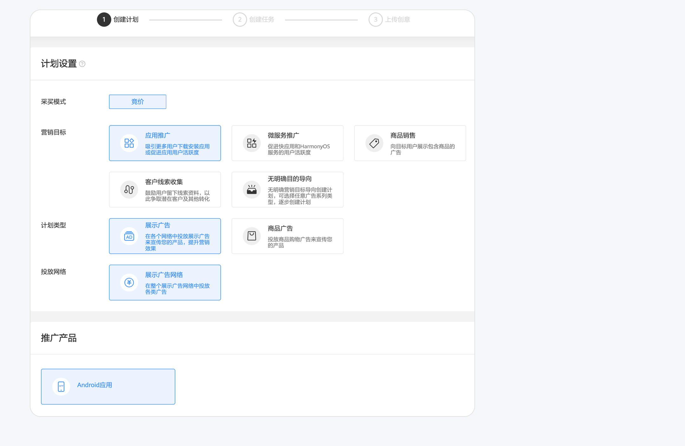
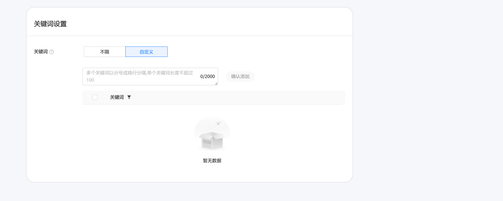
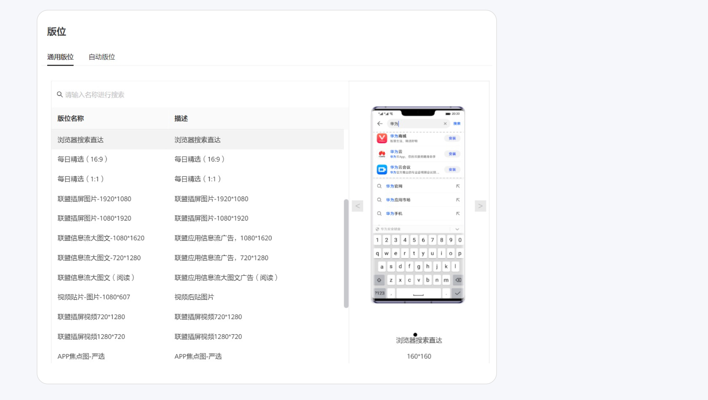
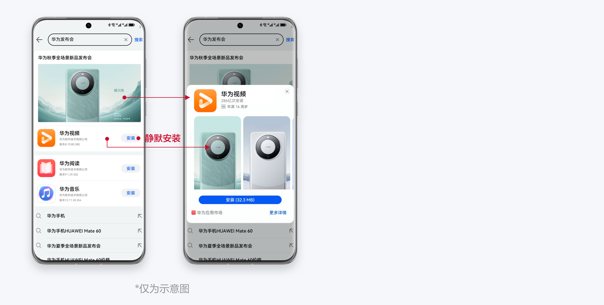
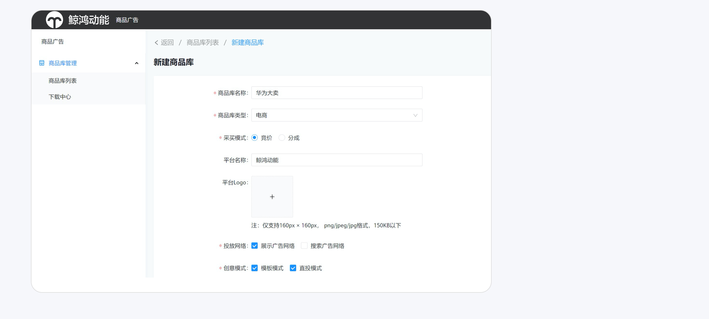
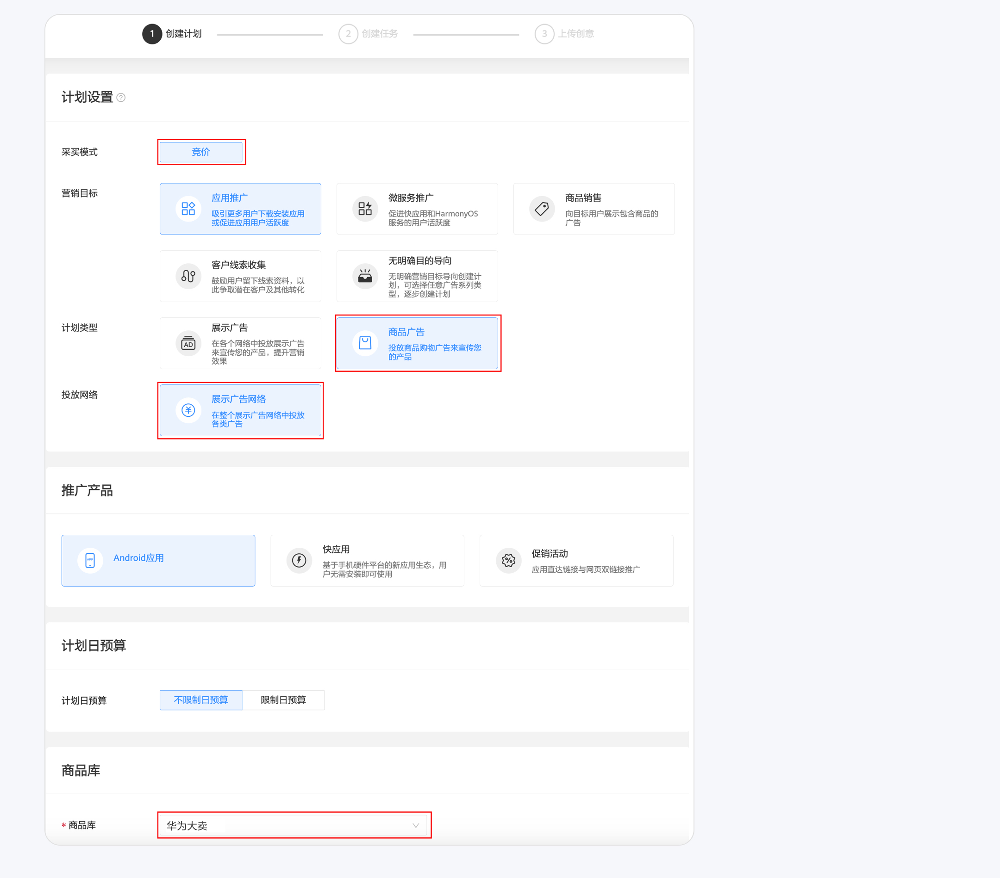
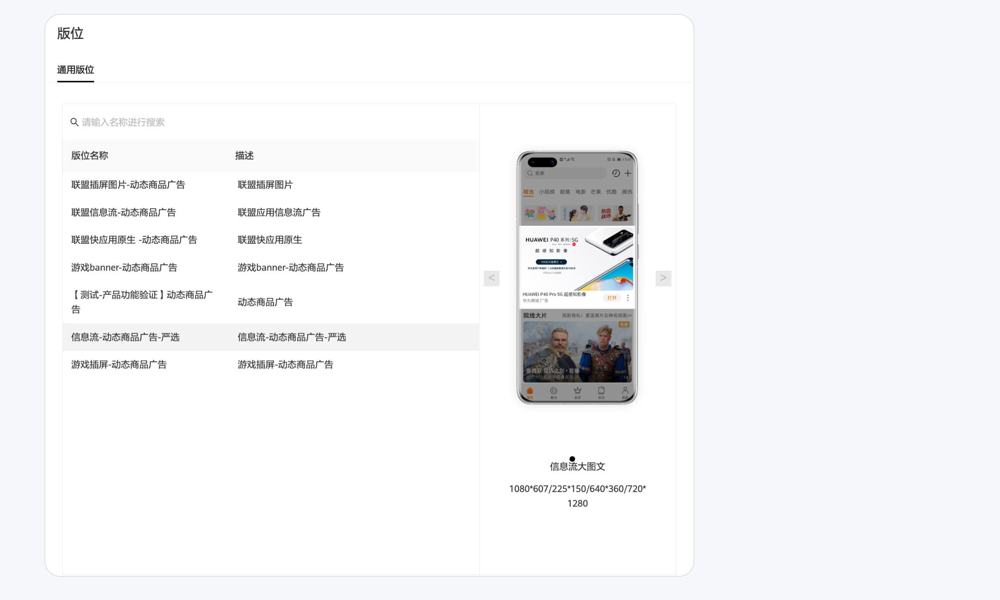
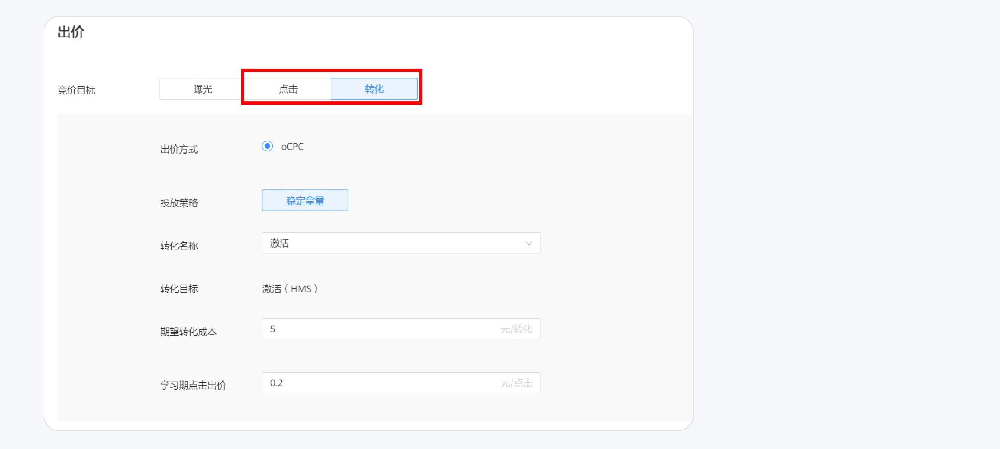
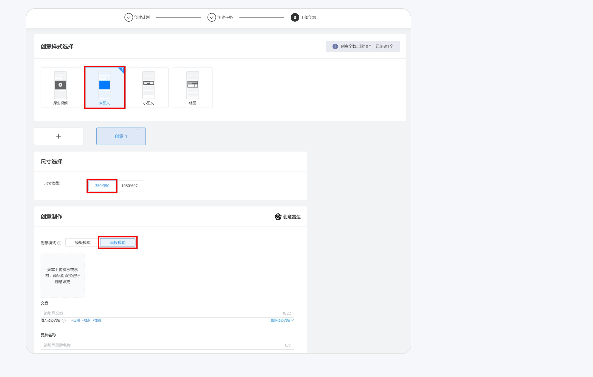

# 搜索广告投放指南

## <strong>Q</strong> <strong>：如何在鲸鸿动能投放搜索广告？</strong>

1. 开户：已拥有鲸鸿动能广告账户的客户可直接使用，无需重新开户；从未在鲸鸿动能广告平台投放广告的客户，需要新开户进行投放。
2. 建计划：在同一个计划内，可以创建多条任务。

   
3. 建任务：每条任务设置不同的出价、关键词，进行多广告组合投放、优化投放效果。

   
4. 选择“浏览器搜索直达”版位。

   
5. 上传创意：可选小图文、大图文（当前影音行业默认准入，其他行业白名单准入，素材要求详见下文）。

## <strong>Q</strong> <strong>：影音行业客户如何投放搜索大图样式广告？</strong>

搜索大图样式仅投放精准关键词，触达转化意向程度高的用户。

当前支持影音/电商行业客户投放，且仅支持投放APP拉新、促活广告。曝光量主要取决于素材的热度以及素材和搜索意图的相关性。

1. 关键词设置：

   a. 建议填写与该素材相关的关键词，提升曝光量。

   b. 影音行业关键词建议填剧名，电商行业关键词建议填商品名称、分类和品牌名，优先填精准词（如剧名、APP名、角色名、演员名、商品名称、分类、品牌名等），不支持填写不相关的剧名、竞品名等。
2. 创意样式选择：选择大图文（促活任务的按钮文案只能选“打开”）。
3. 创意制作：

a. 文案：文案中需包含剧名/商品名全称。

b. 素材：上传16:9图片剧照（暂不支持视频）。

c. 落地页：上传H5落地页，落地页中需展示该素材相关内容，如介绍等（当前版本暂不支持跳转H5，待后续版本迭代）。

## <strong>Q</strong> <strong>：如何投放搜索商品广告？</strong>

除上述直接上传创意投放外，还支持DPA投放。

1. 创建商品库，商品库类型选择“电商”，采买模式选择“竞价”，投放网络选择“展示广告网络”，创意模式当前仅支持“直投模式”。建议上传平台名称和平台Logo。

2. 创建计划，采买模式选择“竞价”，计划类型选择“商品广告”，投放网络默认选择“展示广告网络”。

3. 创建任务，版位选择“信息流-动态商品广告-严选”。

4. 出价选择“点击”或者“转化”。

5. 上传创意，创意尺寸选择“350\*350”，创意模式选择“直投模式”。

6. 其他内容根据实际诉求填写即可。
