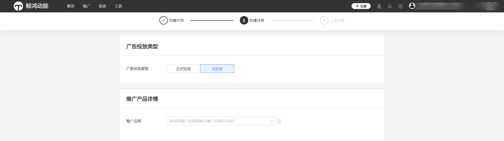
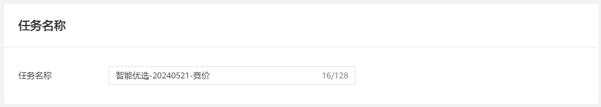
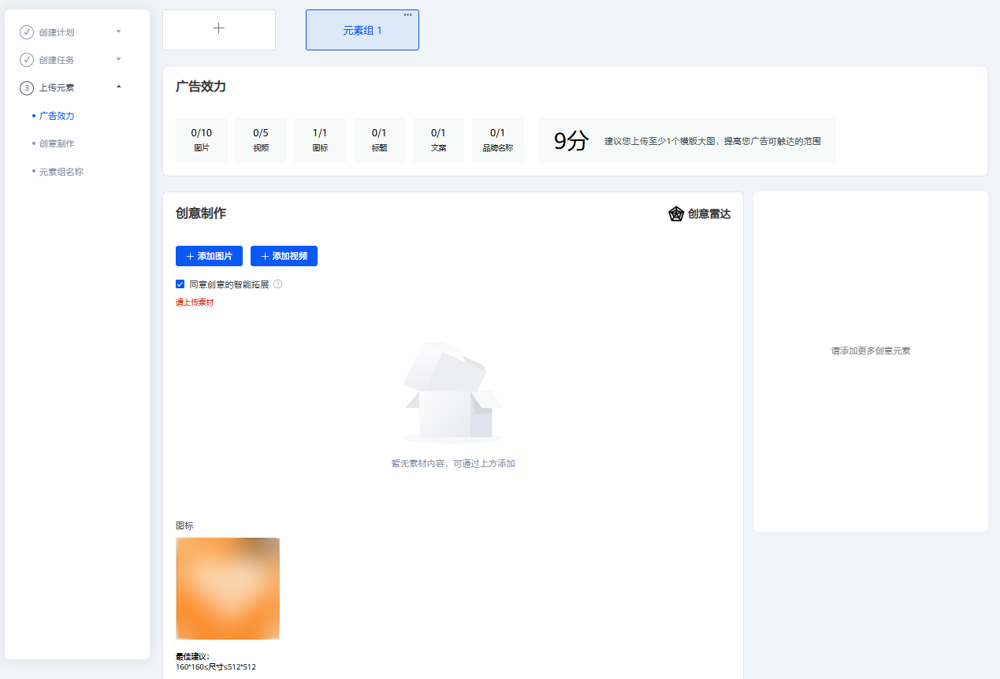
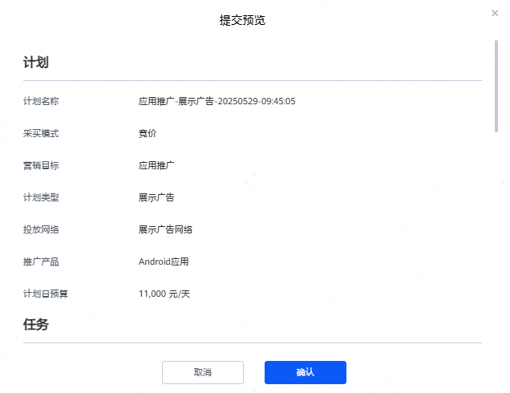

# 创建试投放任务

## 概述

在正式进行展示广告网络投放之前，您可能希望确认广告展示是否和预期一致、落地页是否可以正常展示、转化跟踪等是否工作正常。您可以通过创建试投放任务来实现。试投放任务只会展示到您在任务中指定的测试设备上，且试投放不会消耗账户余额。

试投放任务只支持展示广告网络。

## 操作步骤

1. 选择<strong>“广告投放类型”</strong>：“试投放”。

   
2. 设置<strong>“推广产品详情”</strong>。
   - 若推广产品为网页，输入自定义的HTTPS访问地址，即您需要推广的落地页，落地页默认使用webview打开。
   - 若推广产品为Android应用，请确保您的应用已在华为应用市场发布。
3. 设置<strong>“定向”</strong>参数。（下面以推广产品为“Android应用为例”）
   - <strong>App安装</strong>：若您的推广产品为应用，您需要选择用户的应用状态，广告根据已安装和未安装该Android App的用户进行匹配。
     - 当选择已安装时，测试手机设备也必须已安装应用，否则广告将不会投放到测试设备上。
     - 当选择未安装时，测试手机设备也必须未安装应用，否则广告将不会投放到测试设备上。
   - <strong>设备：</strong>填入测试手机设备的OAID或者GAID。OAID或者GAID指的是一种非永久性设备标识符，可在保护用户个人数据隐私安全的前提下，向用户提供个性化广告。HMS手机一般用OAID，GMS手机一般用GAID。
     - HMS手机OAID获取方式：打开手机的设置，找到隐私功能，单击广告和隐私，单击更多信息，获取OAID。请注意因手机型号不一致，广告标识符所处的位置有所差别。

       
     - GMS手机GAID获取方式：打开手机的设置，找到谷歌，单击隐私，找到广告，获取GAID。请注意因手机型号不一致，广告标识符所处的位置有所差别。
4. 选择<strong>“版位”：</strong>在版位选择中，您可以决定广告出现在什么位置。在选中某个版位后，右侧会出现对应的版位预览。
5. 设置<strong>“投放日期”：</strong>支持特定时间段和多个时间段投放，建议投放日期设置久一些，投放时间选择全天投放。
6. 设置<strong>“任务名称</strong> <strong>”</strong>。

   
7. 添加广告创意。

   当您版位选择通用版位时，根据您需求可以创建元素组，最多创建10个。

   - <strong>广告效力：</strong>广告效力用来衡量您的广告的多样性。在添加素材资源时，您可参考广告效力分数，添加更多的广告样式，广告效力分数越高，广告触达的范围就越大，建议您上传至少一个横版大图，提高您广告的可触达范围。
   - <strong>创意制作：</strong>您需要先选择创意样式及尺寸，并添加对应的创意图片或视频、设置品牌名称和描述信息等，详情参见[版位规则](https://developer.huawei.com/consumer/cn/doc/promotion/ads-bwgz-0000002505500133)。

     同意创意的智能拓展：如果您勾选了该选项，创意智能拓展会在您上传的原素材基础上，系统基于模板自动生成新创意的能力，增加创意多样性，有助于提升任务曝光和消耗。

     

     您可以通过素材库或本地上传素材，请确保您上传的图片或视频素材符合以下要求：

     - <strong>普通图片</strong>：（图片类型：JPG, PNG, JPEG）
       - 横版大图: 宽高比(16:9)，1280\*720px&lt;=尺寸&lt;=2560\*1440px；大小&lt;=512KB
       - 竖版大图: 宽高比(2:3)，720\*1080px&lt;=尺寸&lt;=1440\*2160px；大小&lt;=1MB
       - 竖版大图: 宽高比(9:16)，720\*1280px&lt;=尺寸&lt;=1440\*2560px；大小&lt;=512KB
       - 竖版大图: 宽高比(3:4)，720\*960px&lt;=尺寸&lt;=1440\*1920px；大小&lt;=500KB
       - 方图: 宽高比(1:1)，900\*900px&lt;=尺寸&lt;=2560\*2560px；大小&lt;=1MB
       - 小图: 宽高比(3:2)，456\*300px&lt;=尺寸&lt;=1368\*900px；大小&lt;=500KB
       - 横幅: 宽高比(6.35:1)，1080\*170px&lt;=尺寸&lt;=2160\*340px；大小&lt;=1MB
     - <strong>开屏图片</strong>：（图片类型：JPG, PNG, JPEG）
       - 横版大图: 宽高比(16:9)，1280\*720px&lt;=尺寸&lt;=2560\*1440px；大小&lt;=512KB
       - 竖版大图: 宽高比(2:3)，720\*1080px&lt;=尺寸&lt;=1440\*2160px；大小&lt;=1MB
       - 竖版大图: 宽高比(9:16)，720\*1280px&lt;=尺寸&lt;=1440\*2560px；大小&lt;=512KB
     - <strong>视频：</strong>为了保证您的广告覆盖率以及广告美观度，建议您上传的视频素材包含下表尺寸。

       视频类型：MP4

       - 比例2:3，640\*960&lt;=尺寸&lt;=1080\*1620；5s ~ 30s ；大小&lt;=5MB
       - 比例1:1，640\*640&lt;=尺寸&lt;=640\*640；2s ~ 60s ；大小&lt;=10MB
       - 比例16:9，640\*360&lt;=尺寸&lt;=1920\*1080；5s ~ 120s ；大小&lt;=2MB
       - 比例16:9，640\*360&lt;=尺寸&lt;=1920\*1080；5s ~ 30s ；大小&lt;=5MB
       - 比例16:9，640\*360&lt;=尺寸&lt;=1920\*1080；1s ~ 120s ；大小&lt;=50MB
       - 比例9:16，720\*1280&lt;=尺寸&lt;=1080\*1920；3s ~ 120s ；大小&lt;=50MB
       - 比例9:16，720\*1280&lt;=尺寸&lt;=1080\*1920；5s ~ 30s ；大小&lt;=5MB
       - 比例2:3，720\*1080&lt;=尺寸&lt;=720\*1080；1s ~ 120s ；大小&lt;=10MB
   - <strong>图标：</strong>最佳建议尺寸为160\*160&lt;=尺寸&lt;=512\*512，上传比例：1:1 JPEG/PNG/JPG/GIF不超过150KB。
   - <strong>标题：</strong>标题是最关键的广告文字信息，将与其他素材资源组合以投放广告，最多可以填写22个字。
   - <strong>文案：</strong>文案是对标题的补充，可提供更多背景信息或详情，最多可以填写24个字。
   - <strong>动态词包</strong>：动态词包支持插入以下元素，词包内的内容可以根据所投放的用户实际情况进行动态替换。

     |  |
     | --- |
     | 地点：目前仅支持精确到市级别动态替换，如市级定位偏差则用省级代替。 |
     | 日期：目前仅支持X月X日形式，替换当前日期。 |
     | 性别：目前支持男生、女生文案替换。 |

     其他更多智能文案创意正在筹备中。
   - <strong>卖点：</strong>直观在投放端展示的产品优势信息，辅助提升转化效果，可添加1-3个卖点，每个1-7个字，可用英文逗号隔开。
   - <strong>品牌名称：</strong>必填，请如实填写您所投放应用的品牌名称，最长不超过7个字。
   - <strong>创意行业：</strong>您所选择的行业将用于广告推荐，请按实际情况填写；若您选择的行业与实际情况不符，系统将无法精准推荐。
   - <strong>创意标签：</strong>您所选择的标签将用于广告推荐，请按实际情况填写；若您选择的标签与实际情况不符，系统将无法精准推荐。
   - <strong>落地页链接：</strong>落地页链接是您想要推广内容的信息承载页面，用户点击广告创意时，会优先打开落地页，再进行下载安装。如果您选择了默认落地页，则使用平台默认的落地页链接针对全网通投任务。

     | 类型 | 解释 |
     | --- | --- |
     | 系统默认落地页 | 默认展示系统生成的落地页，您可修改为自定义落地页或通过维纳斯工具制作的落地页。 |
     | 自定义落地页 | Webview在安全方面加入了以下限制：禁止使用Dom存储即localStorage、混合内容和非法证书，请您注意。自定义落地页支持拼接宏变量 \_\_ HWCID \_\_，\_\_HWPPSLOGID\_\_，\_\_PRODUCTID\_\_，\_\_CALLBACK\_\_，系统会将真实创意ID、日志ID、商品ID、转化回传参数替换在此处。 |
     | 维纳斯落地页 | 可以前往维纳斯创作所需要的落地页，进行选择。 |
   - <strong>应用直达链接：</strong>请按实际填写应用直达链接，用户点击后可直接跳转至应用内的落地页，支持拼接宏变量 \_\_ HWCID \_\_，\_\_HWPPSLOGID\_\_，\_\_PRODUCTID\_\_，\_\_CALLBACK\_\_，系统会将真实创意ID、日志ID、商品ID、转化回传参数替换在此处
   - <strong>监测配置（非必填）：</strong>在广告推广过程中，通过第三方监测（需手动拼接宏参数），客户可获得由客观公正的第三方监测公司提供认证的广告数据，监测目标广告的曝光、点击等关键指标。更多详情可查看[第三方监测](https://developer.huawei.com/consumer/cn/doc/promotion/ads_sanfangjiance-0000001055414456)。
   - <strong>元素组名称：</strong>您可以编辑方便区分不同元素组的名称，如版位+序号等。
8. 提交预览，如确认无误单击确认即可完成创意创建。

   
9. 试投放创建成功后自动审核通过。
