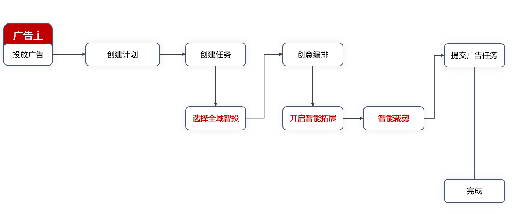
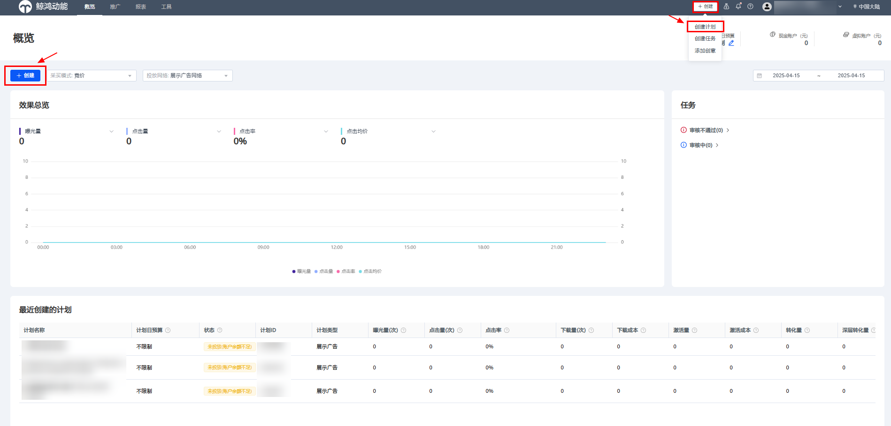
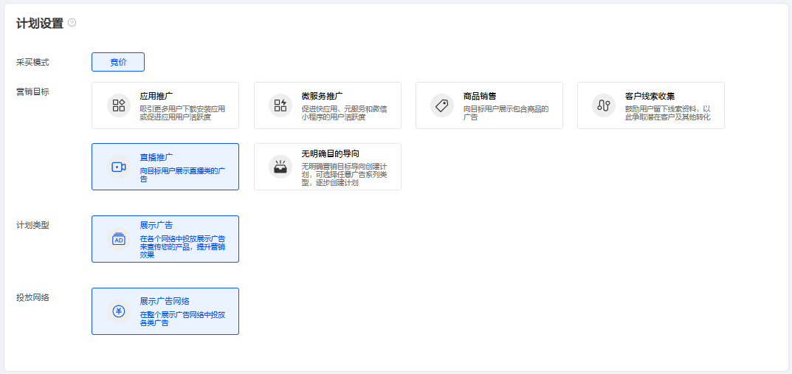
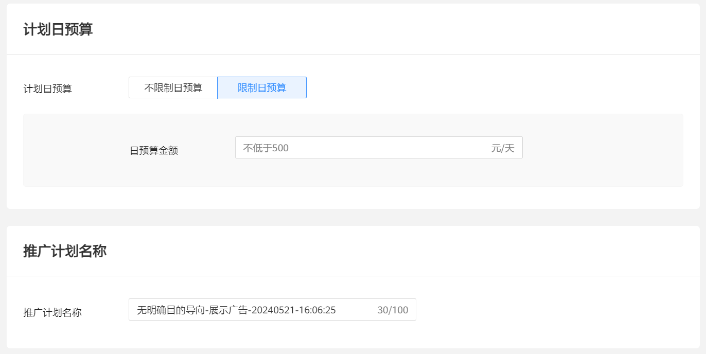

# 创建推广计划

## 概述

创建全域智投广告仅需三步：“创建计划”、“创建任务”以及“上传创意”，具体创建流程如下。

“创建计划”主要包含营销目标选择、推广产品选择以及计划日预算设置。

鲸鸿动能投放平台支持的营销目标包含应用推广、微服务推广、商品销售、客户线索收集、直播推广、无明确目的导向，不同营销目标支持的推广产品如下：

| 营销目标 | 推广产品 |
| --- | --- |
| 无明确目的导向 | 网页、Android应用、快应用/快游戏以及促销活动 |
| 应用推广 | Android应用、鸿蒙应用 |
| 微服务推广 | 快应用/快游戏、HarmonyOS服务、微信小程序、元服务 |
| 商品销售 | 网页、促销活动 |
| 客户线索收集 | 网页 |
| 直播推广 | 向目标用户展示直播类的广告 |

 

推广产品中，“鸿蒙应用”和“元服务”需要联系运营开通权限。

## 操作步骤

1. 登录鲸鸿动能投放平台，单击“创建”，选择“创建计划”。

   
2. 选择<strong>营销目标。</strong>当前支持的营销目标包含“应用推广”、“微服务推广”、“商品销售”、“客户线索收集”、“直播推广”和“无明确目的导向”。

   
3. 选择<strong>推广产品。</strong>包括“网页”、“Android应用”、“快应用”、“HarmonyOS服务”、“小程序”以及“促销活动”。

   | 投放能力 | 介绍 |
   | --- | --- |
   | 网页 | 支持使用[维纳斯落地页](https://developer.huawei.com/consumer/cn/doc/promotion/ads_api50-0000001058726522)或自定义落地页。 |
   | Android应用 | - 应用下载：可以指定某应用，通过投放H5落地页链接，将客户引导至应用下载页面。 - 应用促活：可以投放某应用的直达链接，若用户已安装该应用，可跳转至应用内指定页面。 |
   | 快应用/快游戏 | 用户单击广告时，可直接跳转至快应用/快游戏内的详情页，默认开放给已安装快应用中心的用户。 |
   | HarmonyOS服务 | 适用于推广HarmonyOS服务，基于HarmonyOS的新生态，用户无需安装即可使用。 |
   | 促销活动 | 适用于电商应用推广促销活动，需同时填写Deeplink和H5落地页链接。当用户单击广告时，若已安装该应用，则拉起应用；若未安装该应用，则跳转H5落地页链接。 |
   | 微信小程序 | 基于微信平台的新应用生态，用户单击后即可跳转微信小程序。 |
4. 设置<strong>“计划日预算”。</strong>推广“计划日预算”若选择“限制日预算”，则需不低于500元/天。
5. 设置<strong>“推广计划名称”。</strong>

   
6. 单击<strong>“下一步”</strong>进入“<strong>创建任务</strong>”层级<strong>。</strong>

    

   - 账户日预算最多修改20次。
