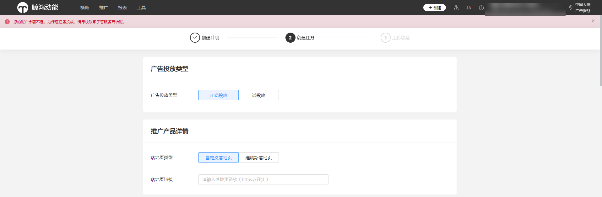
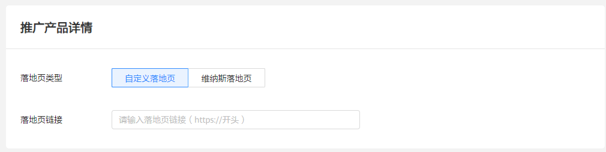
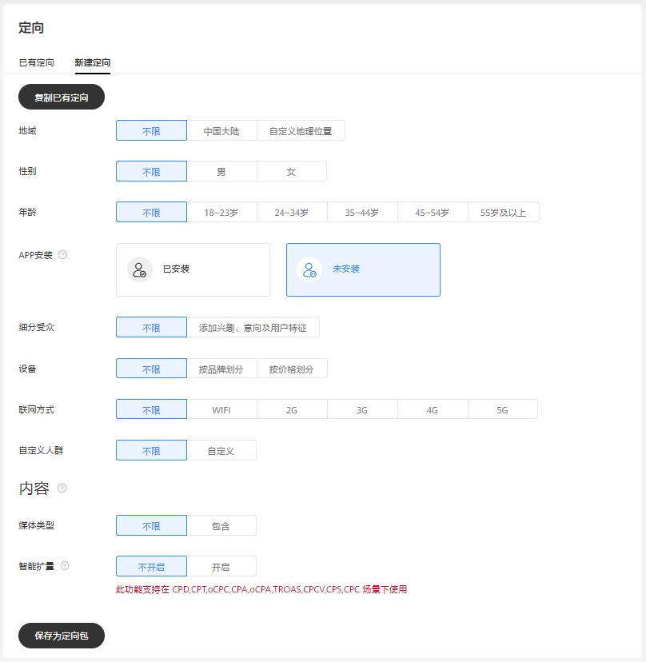
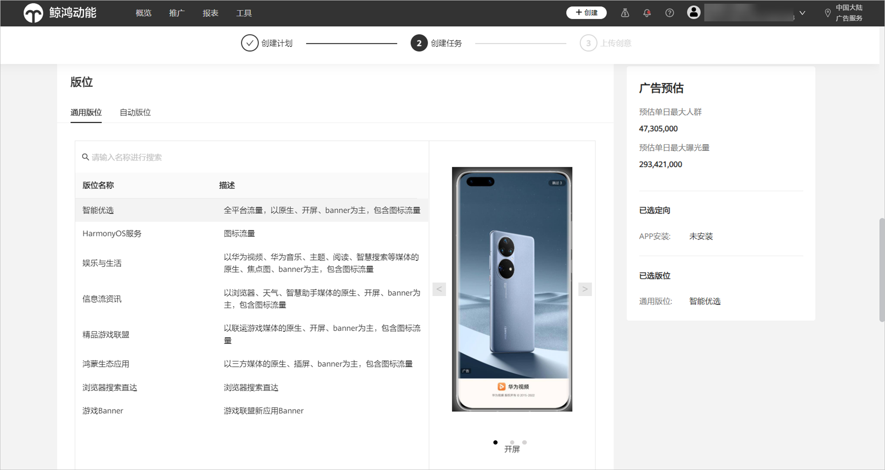
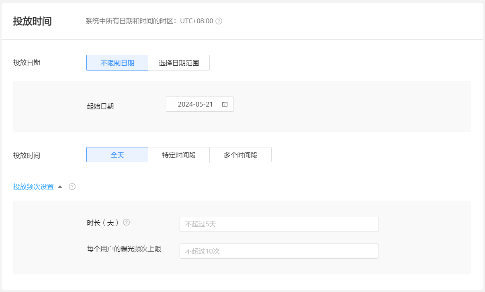
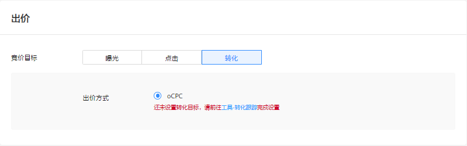
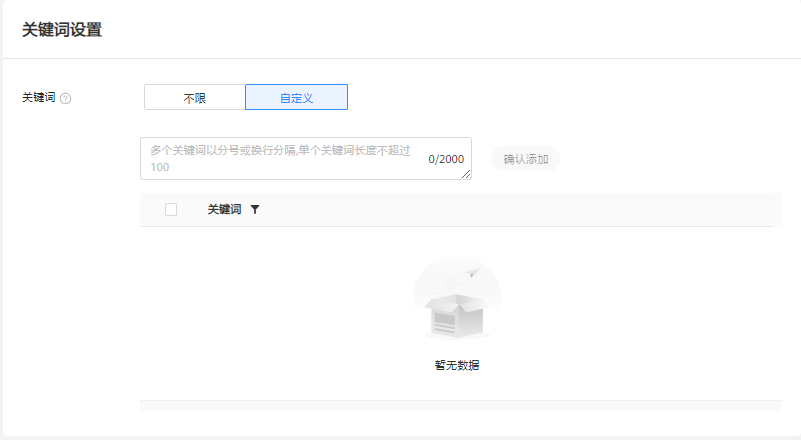
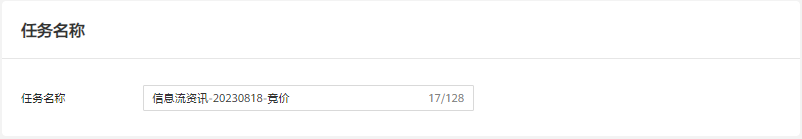

# 创建正式投放任务

## 概述

在“计划”创建完成后，即进入推广任务设置阶段。本阶段主要包含“推广产品详情”“定向”“版位”以及“投放时间”“出价”等参数。

“推广产品详情”根据创建推广计划中选择的推广产品类型判断，不同类型要求有所不同：

- 网页：需选择落地页类型。如选择自定义落地页，需输入落地页链接；如选择维纳斯落地页，可直接选择已通过审核的维纳斯落地页。
- Android应用：需输入推广应用ID/包名。（应用ID格式：Cxxxxxxxx，请前往华为应用市场页面查看。例如：应用地址为&lt;https://appgallery.huawei.com/&gt;app/C12345678，则其ID为“C12345678”。应用包名例如：com.huawei.xxxxx。）
- 快应用/快游戏：输入快应用/快游戏包名。例如：com.huawei.appmarket，系统可根据快应用/快游戏包名自动生成快应用/快游戏链接，默认跳转快应用/快游戏首页；您也可修改为指定的快应用/快游戏内详情页面，链接支持的格式为hap://app/&lt;package&gt;/[path][?key=value]/。
- 促销活动：无。
- 微信小程序: 输入微信小程序名称、小程序链接地址及小程序ID。
- 鸿蒙应用：应用ID格式：Cxxxxxxxxxxxxxxxxxxx，请联系应用开发者通过AppGallery Connect平台获取鸿蒙原生应用APP ID（例如：1234567890987654321），然后加上字母“C”前缀（例如：C1234567890987654321）。
- 元服务：应用ID格式：Cxxxxxxxxxxxxxxxxxxx，请联系应用开发者通过AppGallery Connect平台获取元服务APP ID（例如：1234567890987654321），然后加上字母“C”前缀（例如：C1234567890987654321）。

## 操作步骤

1. 选择<strong>“广告投放类型”</strong>:“正式投放”。

   
2. 设置<strong>“推广产品详情”</strong>。根据推广产品类型填写产品详情内容。

   
3. 设置<strong>“定向”</strong>参数，分为人群定向与内容定向两个模块。
   - 人群定向分为地域、性别、年龄等维度。若选择推广产品为Android应用，在定向层级需选择“APP安装”：选择“已安装”表示投放“应用促活”，将针对已安装该App的用户进行推广；选择“未安装”表示投放“应用下载”，将针对未安装该App的用户进行推广。
   - 内容定向即您希望自己的广告在什么内容上展示，利用主题或媒体类型定位，更有针对性地覆盖受众群体。分为媒体类型和智能扩量。
   - 智能扩量可在计划达到一定转化后放开您选定的定向条件，自动扩展人群，提升跑量。此功能支持在 CPD,CPT,oCPC,CPA,oCPA,TROAS,CPCV,CPS,CPC 场景下使用。
   - 您设置好定向条件后，可直接“保存定向包”，后续设置定向时可选择“已有定向”，直接选择“定向包”复用之前已设置的定向条件。

   
4. 选择<strong>“版位”</strong>，您可选择智能优选、HarmonyOS服务、娱乐与生活、信息流资讯、精品游戏联盟、鸿蒙生态应用、浏览器搜索直达、游戏Banner等全域智投版位，您可在页面右侧看到该版位的广告预估单日最大人群数量及预估单日最大曝光量。

   
5. 设置<strong>“投放时间”</strong>，支持特定时间段和多个时间段投放。您还可设置投放频次，设置针对单一用户在指定时长内的广告展示次数上限（在搜索广告场景不生效）。

   
6. 设置<strong>“出价”，</strong>选择竞价目标，支持按照曝光、点击和转化目标进行出价，计费方式可选CPM、CPC、oCPC、CPD、CPA。
7. 设置<strong>“关键词”</strong>，根据搜索、浏览等行为的内容关键词进行用户匹配，增加广告曝光。

   关键词定向开启后，原先设置的定向条件（除地域，语言和App安装状态外）会失效，系统自动根据广告主设置的关键词寻找优质流量。

   
8. 设置<strong>“任务名称</strong> <strong>”</strong>。

   

    

   - <strong>CPA</strong> <strong>出价</strong>当前仅支持表单提交类广告，使用前需联系运营开通白名单，权限开通后，配置转化跟踪-线索跟踪，创建客户线索收集类广告，出价方式选择 CPA，转化目标选择表单提交。
   - 若推广目的为“应用下载”，出价方式支持<strong>智能出价</strong>。系统会寻找更有可能促成转化的曝光机会，适当提高出价以增加广告竞争力，为您争取更多的转化数量，每次出价不超过设定的上限值，同时尽量保持转化成本不变。

## 相关链接

[维纳斯落地页介绍](https://developer.huawei.com/consumer/cn/doc/promotion/ads_gongju14-0000001458996609)
