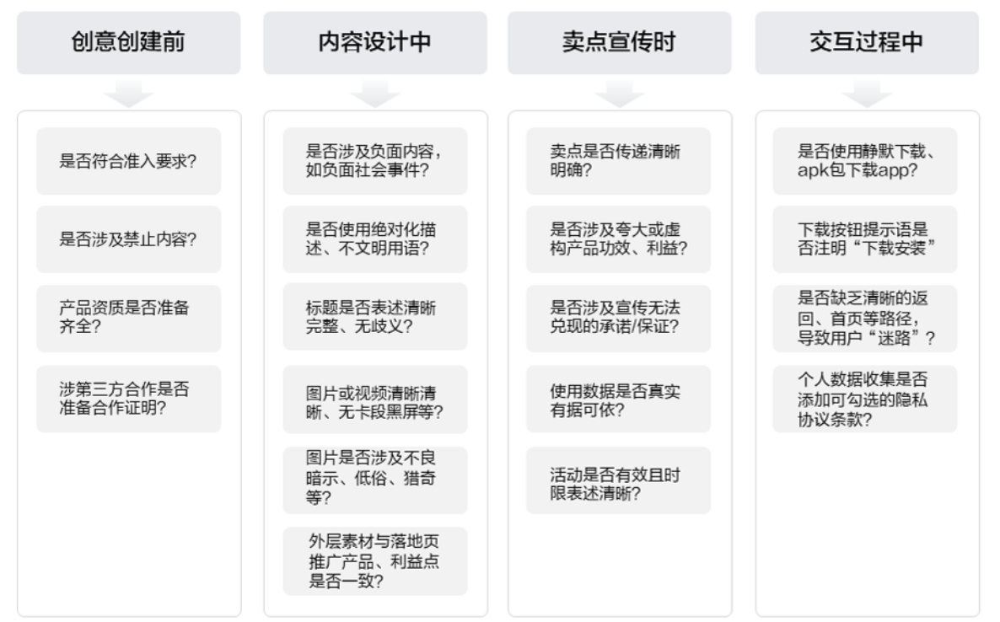

# 创意投放指引

## 使用说明：

建议广告主在提交广告前，将此清单作为必经流程进行自查，对任何一项存疑，都应立即修改或准备相应证明文件。这能最大程度地避免驳回，确保广告顺利投放。

|  |  |  |
| --- | --- | --- |
| <strong>实用创意审核合规检查清单</strong> | | |
| 类别 | 检查项 | 具体说明与要求 |
| 一、资质与基础信息 | 1. 行业资质完备性 | 1、检查所属开户行业是否需特殊资质如：涉及特殊材质需要质检报告、涉及强制性认证产品需要3C证、涉及星级酒店需要等级证书、涉及三品一械/医疗广告需要广审表。  2、确保资质在有效期内。  3、涉及需在广告素材中体现的批号信息，需与资质文件内的信息保持一致。  如：房地产售房广告素材中需体现预（现）售许可证号；如三品一械/医疗广告需素材中需体现广审批号。 |
| 2. 行业一致性 | 开户成功后，账户推广内容需与开户主体、所属行业保持一致，如：“开户为A行业，素材内容必须是A行业；不得出现B行业。 |
| 3. 第三方品牌授权 | 若广告涉及第三方品牌（如使用第三方商标、联合营销），需准备好书面授权证明上传至投放端“广告资质”处，以备查验。 |
| 二、广告内容合规性 | 4. 绝对禁止内容 | 确保无以下内容：涉黄、赌、毒、暴力、恐怖、政治敏感、国家领导人形象、伪造证件、侵犯隐私、影响未成年人身心健康等任何违法违纪内容。 |
| 5.绝对化用语 | 直接禁用词汇：包括但不限于“国家级”“最高级”“最佳”以及含义相同或近似的用语。  常见近似词汇：如“顶级”“极品”“极致”“第一”“唯一”“首选”“全能”等。  限制的核心：绝对化用语是否指向商品或服务的性能、质量、效果、行业地位等，并可能产生误导或贬低其他经营者。 |
| 6.真实客观性要求 | 严禁作出夸大或根本无法保证的承诺，如“无效退款”、“一天见效”、“百分百安全/收益”。  所有关于效果的描述都应谨慎、客观，并注明个体差异等前提条件。  【核心原则】：在传递产品/服务价值时，请务必遵循真实性、有据性、规范性三大原则，确保广告内容可验证、不夸大、不误导。在无法确定时，优先选择更保守、更客观的表达方式。 |
| 7.价格与促销规范 | 促销活动需明确活动时限、条件；价格标注清晰，不得有误导性价格标识（如虚假原价）；若涉及抽奖，需明确奖品、数量、中奖概率。 |
| 8.不良价值观审查 | 广告内容需积极向上，符合广告法要求，遵守社会公序良俗，不得出现有价值观不正确引导的文案，如：  身心健康：杜绝宣扬“娘炮”、“耽美”等畸形审美；杜绝自残、厌食等不良行为。  行为得当：避免展示不文明、危险或违法行为（如闯红灯、高空危险动作）。  妨碍社会公共秩序：禁止恶搞经典、恶俗营销、无底线炒作、禁止煽动奢侈浪费、炫富、卖惨、 禁止制造或宣扬“健康焦虑”、“容貌焦虑”、“成绩焦虑”、“性别、阶级对立”等。 |
| 9. 同业对比与贬低 | 不得直接或间接对比、贬低其他品牌或产品。 |
| 10.行业特定规则 | 广告法中行业特定规则核心摘要；  <strong>1. 医疗、药品、医疗器械广告</strong>  监管最严格的领域，医疗广告发布前，必须由省级卫生行政部门（卫生健康委员会）对广告内容进行审查，并取得 《医疗广告审查证明》 。未经审查，不得发布。  <strong>2. 保健食品广告</strong>  明确保健品身份，不能冒充药品，禁止夸大功效。广告内容必须与国务院卫生行政部门批准的保健功能目录保持一致，不得超范围宣传。  <strong>3. 金融理财类广告</strong>  做好风险提示，禁止承诺收益、不能夸大收益、隐瞒风险。同时必须对风险有提示： 如“理财有风险，投资需谨慎”。  <strong>4. 教育培训类广告</strong>  禁止保证教学结果、夸大师资和实力，禁止贩卖焦虑。  <strong>5. 房地产广告</strong>  宣传项目时需信息真实、准确，不得误导；  不能对升值或投资回报作承诺；  不能对规划或建设中的交通、商业、文化教育设施作误导宣传；  必须标明开发企业名称、预售/销售许可证号。 |
| 三、创意素材规范 | 11. 视觉质量 | 素材需保证清晰度高，无拉伸、马赛克、画面截断等影响观感的问题。画风美观，不低俗。 |
| 12. 版权与肖像权 | 广告中使用知名人物/IP的名义或形象进行宣传，包括但不限于文字描述、图片展示、明星同款等，须提供名人本人或其经纪公司与品牌方签订的肖像授权书或代言合同，或者提供IP权利人（公司或个人）的合法授权或合作协议。 |
| 13. 诱导元素 | 不得欺骗、误诱导用户点击广告，严禁在素材中出现欺骗性视觉诱导、虚假的交互设计、模仿系统消息的虚假通知描述，  如虚假的“播放按钮”、“通知提醒”、“虚假关闭按钮”等。 |
| 14.风险提示语 | 所有涉及具体利益或潜在风险的广告，必须外层素材清晰、明确地添加相应的风险提示语，以告知用户活动条件、奖金限额、风险或免责声明。  具体可参考通用审核规则-提示语要求模块。 |
| 15. 文字清晰可识别 | 广告文案必须规范、文明、无歧义。语句需通顺、完整、符合逻辑。可使用网络用语，但禁止使用粗俗、引起歧义、或导向不良的描述。  标题须使用规范简体汉字，禁止使用繁体字、方言、少数民族文字等。如使用外文，必须同时附上中文翻译。 |
| 四、落地页与转化路径 | 16. 落地页跳转与导航逻辑 | 链接（URL）正确且能正常打开，无404错误、无限循环跳转或强制下载App后才能浏览的情况。  不得设置无法关闭的弹窗或全屏覆盖，强制用户完成特定操作（如留下电话）才能继续浏览 。  不得涉及点击页面空白处或“返回”按钮时，非自愿地跳转到其他无关页面（如另一个广告页）。  不得涉及 页面导航逻辑混乱，缺乏清晰的返回、首页等路径，导致用户“迷路”。  【核心原则】：一个合规、健康的落地页交互设计应遵循 “真实、透明、尊重、自主” 的原则。即：  真实地展示内容。  透明地告知规则和数据用途。  尊重用户的选择权和操作权。  保障用户自主决策的流畅体验。 |
| 17. 内容一致性 | 落地页的产品、服务、品牌、促销信息必须与广告创意完全一致，不得出现“货不对板”的情况。 |
| 18. 数据收集与授权 | 落地页涉及个人数据收集，须说明获取信息的原因和用途，并添加隐私协议、个人信息保护相关协议等内容，且不得默认勾选同意，需由用户自主勾选确认。 |
| 最终检查 | 19. 试投放预览效果 | 合约类创意建议在投放端创建试投放，使用真机全面检查广告从展示到点击、再到落地页浏览和转化的全流程体验是否流畅、合规。 |
