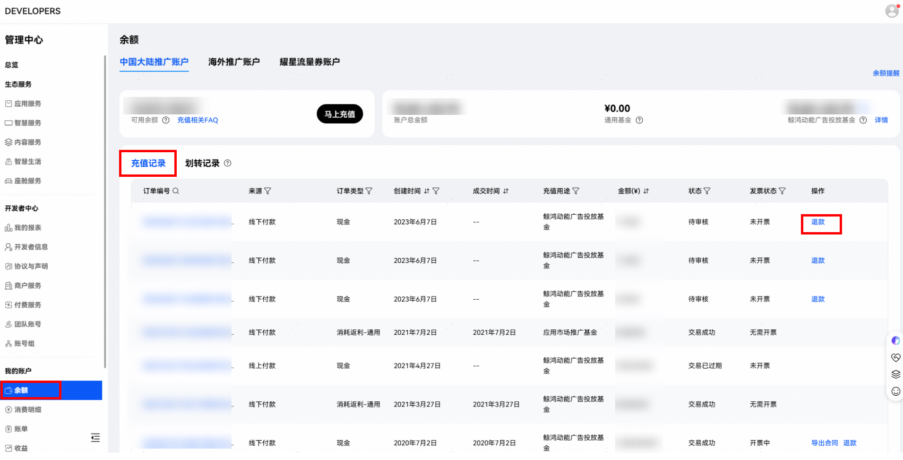
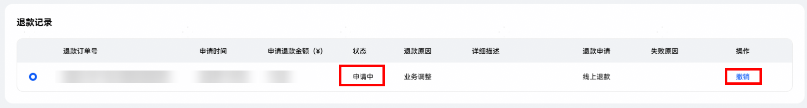
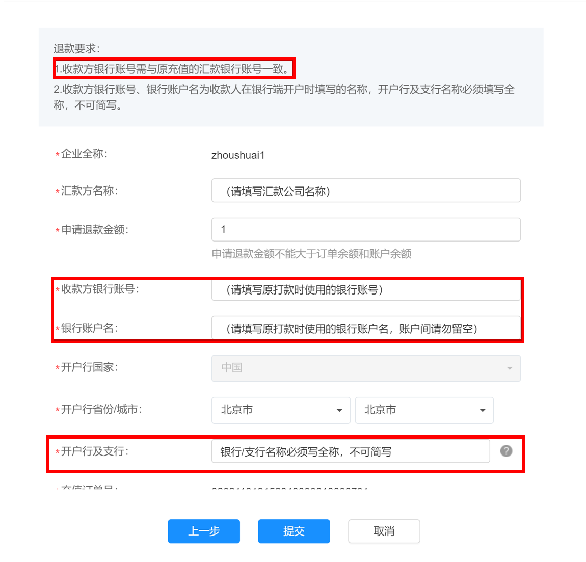
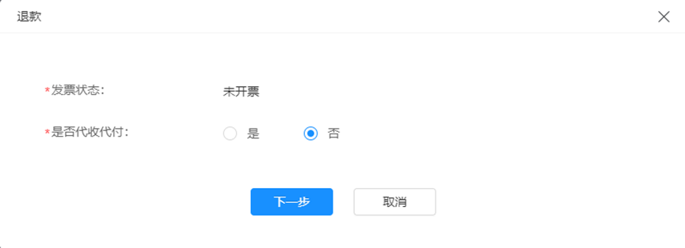
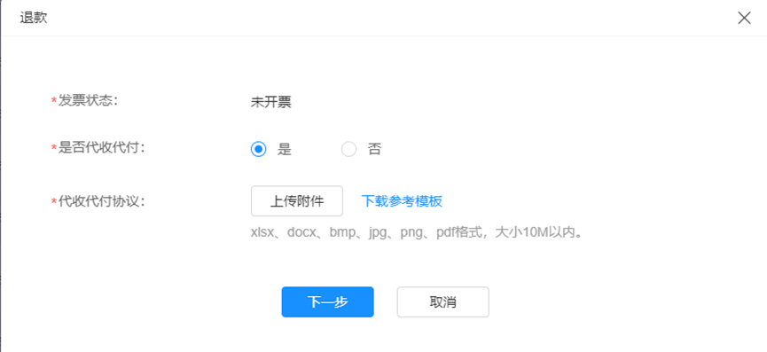
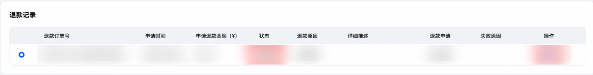
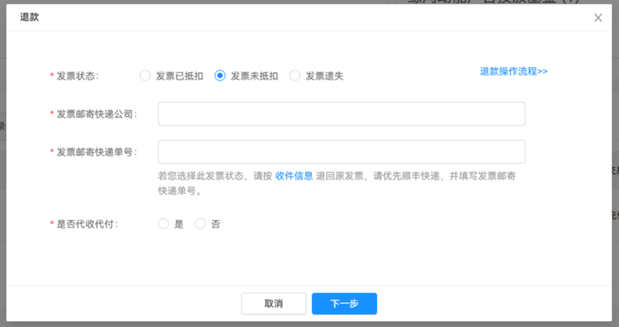
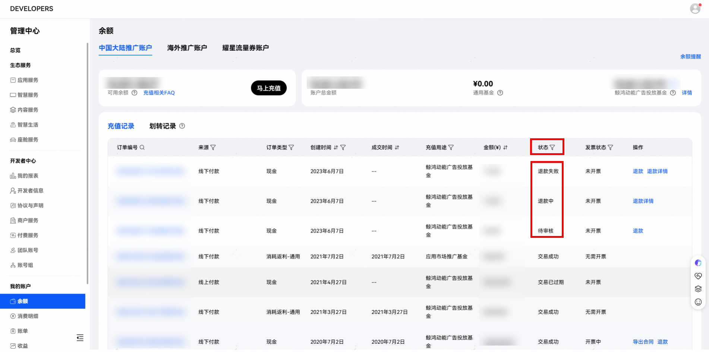
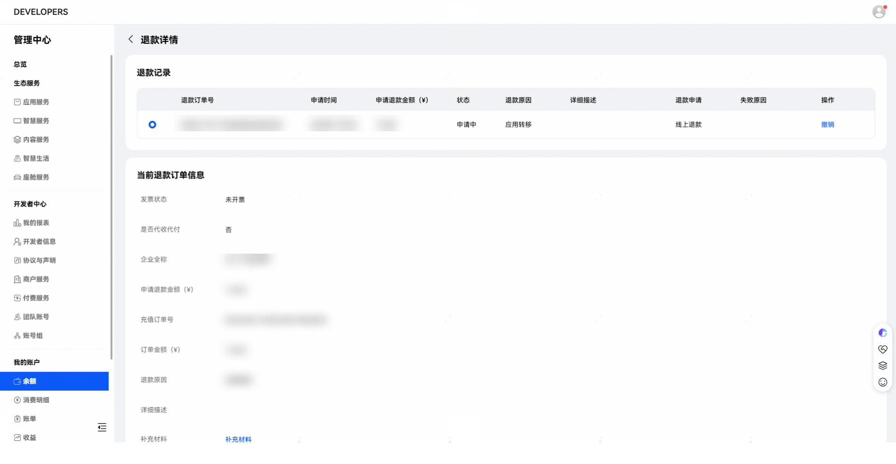

# 服务商账户线上退款流程

线上退款遵循原路退回原则，需保持退款接收账户与打款时的银行账户一致。

目前线上退款仅适用于原路退款，如因原打款银行账号注销、公司注销等特殊情况请发邮件至联盟邮箱&lt;devConnect@huawei.com&gt;咨询线下退款流程。

<strong>可退款前提条件：</strong>

1. 现金充值（注：赠送金及返利金等非现金充值余额不可申请退款）；

2. 充值订单状态：<strong>待审核、审核不通过、交易成功、退款失败。</strong>

 

<strong>如需退款，为了防止您的资金被系统预留，请在退款前自行检查：</strong>

1）退款时余额所在账户需要和充值的账户保持一致（可前往管理中心-我的账户-余额-划转：如充值给应用市场推广基金/通用基金，退款时需要将资金划转到应用市场推广基金/通用基金；如充值给鲸鸿动能广告投放基金/通用基金，退款时需要将资金划转到鲸鸿动能广告投放基金/通用基金）;

<strong>退款入口：</strong>“[开发者联盟后台](https://developer.huawei.com/consumer/cn/console#/serviceCards/AppService)”-&gt;“我的账户”-&gt;“余额”-&gt;“充值记录”-&gt;找到对应需要退款的订单编号单击“退款”。

<strong>撤销退款：</strong>若您计划有变需要中止退款或误提交，请在退款详情页进行撤销，如下图。已经开始审核（退款订单状态为“审核中”）的退款订单无法自行撤销，请谨慎操作。

## 1. 常见退款场景及操作流程

### 1.1 线上退款-充值不成功退款

 

1. 收款方银行账号需与原充值的汇款银行账号一致，账号之间数字请勿留空；

2. 开户行及支行信息必须填写完整，不可简写，否则会导致打款失败，严重影响退款时长。

适用于使用个人账户进行充值、打款账户主体错误等导致订单状态为充值不成功的情形。订单状态一般为：审核不通过。发票状态为：未开票。

<strong>操作流程：</strong>单击退款”按钮-&gt;填写汇款方名称、收款方银行账户等信息，（标有红色星号（\*）的项目是必填项）-&gt;提交。

### 1.2 线上退款-充值成功退款（未开票&开票中）

适用于充值成功，但因业务调整，产品下架等原因需要暂停推广申请将余额退回的情形。订单状态一般为：交易成功。发票状态为：未开票或开票中。

操作步骤：单击“退款”按钮-&gt;选择“是否代收代付”-&gt;填写汇款方名称、申请退款金额及收款银行账户等信息（标有红色星号（\*）的项目是必填项）-&gt;提交（注：此处需填写申请退款金额不能大于订单金额和账户可用余额）。

<strong>涉及代收代付情形填写指引</strong>

（1）不属于代收代付情形。请在“是否代收代付”选项中选“否”，单击下一步，填写完必填选项后提交。

（2）属于代收代付情形。请在“是否代收代付”选项中选“是”，并上传代收代付协议（模板可自行下载），上传完成后单击下一步，填写完必填项后提交。

### 1.3 线上退款-充值成功退款（已开票）

适用于充值成功，但因业务调整，产品下架等原因需要暂停推广申请将余额退回的情形。订单状态一般为：交易成功。发票状态为：已开票或已退票。

操作步骤：单击“退款”按钮-&gt;选择“发票状态选择”（选项填写指引如1.3.1）-&gt;选择“是否代收代付”-&gt;填写汇款方名称、申请退款金额及收款银行账户等信息（标有红色星号（\*）的项目是必填项）-&gt;提交<strong>（注：此处需填写申请退款金额不能大于订单金额和账户可用余额；当选择发票丢失时，系统会对可退款金额进行重新计算，可退款金额为"申请退款金额"/106\*100）</strong>。

当发票状态为已开票状态时需要进行发票处理，发票状态选择指引如下文。代收代付选项选择同[1.2.1涉及代收代付情形填写指引](https://developer.huawei.com/consumer/cn/doc/0010011#h3-1650770349960-3)。

<strong>发票状态选项填写指引</strong>

（1）发票状态：已开票且发票已抵扣

请您在发票状态选项中选择“已退票/已抵扣”并提供红字发票通知单上传附件

 

<strong>1</strong> <strong>、红字通知单需要开发票号对应的全额红字，不能只开退款的部分，否则系统无法审批处理。</strong>

<strong>2</strong> <strong>、红字通知单开具时，可在税务系统中填写原发票号，即可带出税号和公司名称相关信息。</strong>

<strong>3</strong> <strong>、待退款电子流生成后，原订单和退款订单会合并开出正常消耗的发票，并于退款订单成功的次月寄出。</strong>

如涉及鲸鸿动能展示广告网络服务商账户的电子发票开红字信息单，请开具红字信息单并提交退款申请后，及时发送至邮箱petalads@huawei.com告知，以便平台确认。

（温馨提示：据税局要求，红字信息单超过72小时不确认则过期失效，因此建议您在工作日周五以及节假日前一天，先不要开具红字信息单编码）

<strong>邮件模板如下：</strong>

标题：企业全称+已开具红字信息单请华为及时确认

内容：红字信息单编码+退款订单号+对应退款的服务商账户ID（请提供文字并附截图：下列图示相关信息）

（2）发票状态：已开票，但发票未抵扣

纸质发票未抵扣：退回原发票，并出示一份退款说明，写明发票号、发票金额及退票原因，与原发票一起邮寄，并在下框中填写相应的快递公司及快递单号。（建议顺丰京东，因其他快递未妥投，自行承担）

数电发票未抵扣：在快递公司处写：数电发票，快递单号处写：数电发票号

退票接收地址：江苏省南京市雨花台区华为路北侧华为二期

退票接收人：谢支娟

退票收件人联系电话：025-56622212

（3）发票状态：已开票，但发票遗失。

如发票已抵扣，且发票丢失，发票状态选择“发票遗失/已抵扣”，并按前述要求提供发票全额红字通知单；

如发票未抵扣，且发票丢失，发票状态选择“发票遗失/未抵扣”，并提供发票丢失说明，需写明发票号及丢失原因并加盖公章，上传至红字发票通知单附件处。

## 2. 查看退款进度

查看订单的退款进度，可通过“[开发者联盟后台](https://developer.huawei.com/consumer/cn/console#/serviceCards/AppService)”-&gt;“我的账户”-&gt;“余额”-&gt;“充值记录”的状态列查看订单状态。

订单退款进度详情可单击操作列的“退款详情”进行了解。

退款订单状态一般为：

（1）驳回。请查看驳回建议尽快修改退款信息后重提；

（2）已退款。退款已完成，请自行查看收款银行账号到款情况；

（3）退款审核中。当前退款审核中，请耐心等待；

（4）申请中。已提交申请，审核人员还未开始审核，可自行操作撤销退款；

（5）已撤销。已撤销退款申请，退款订单暂停审核，如需继续退款请检查退款信息后重提。

## 3. 团队账号

支持团队账号操作退款和查看退款详情。
