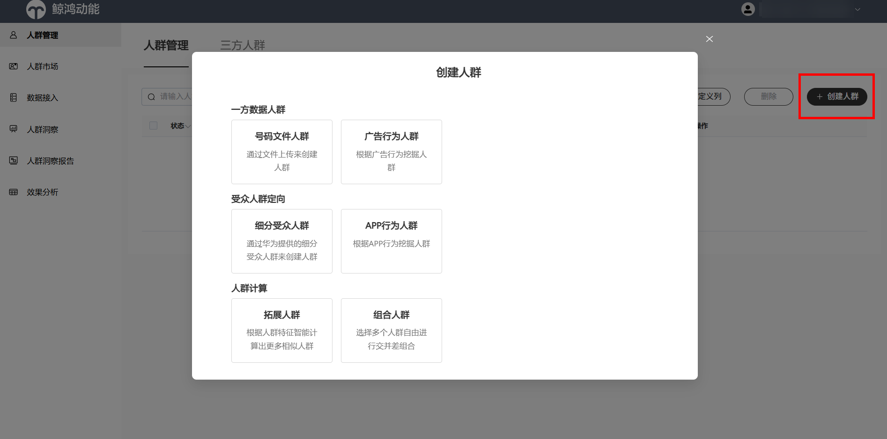
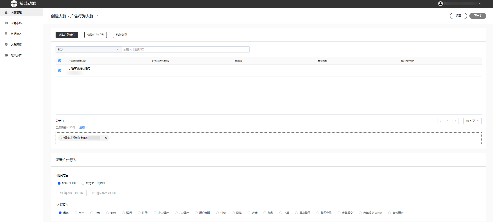
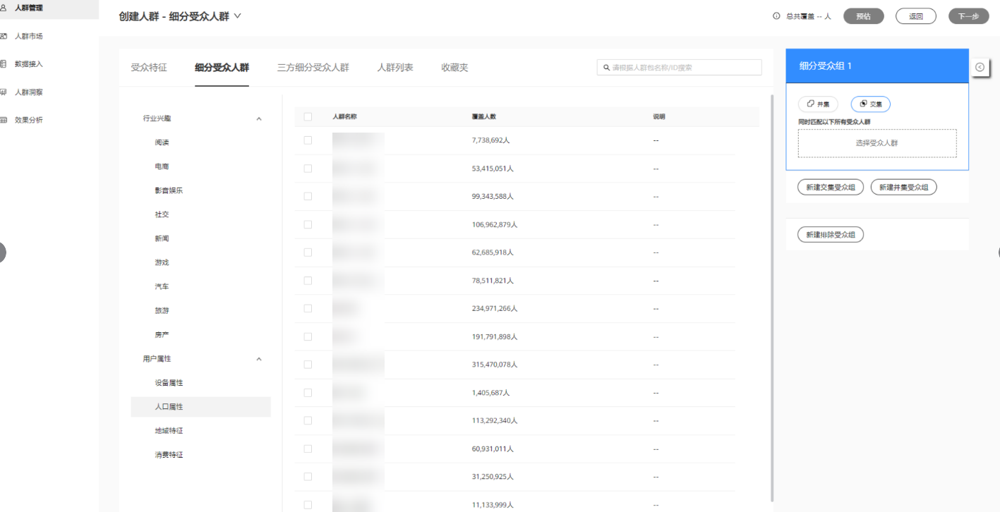
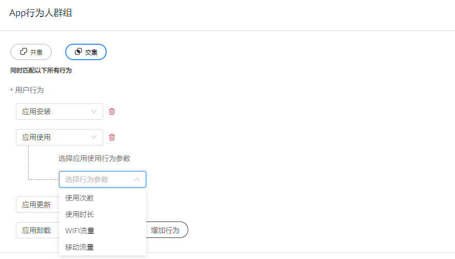
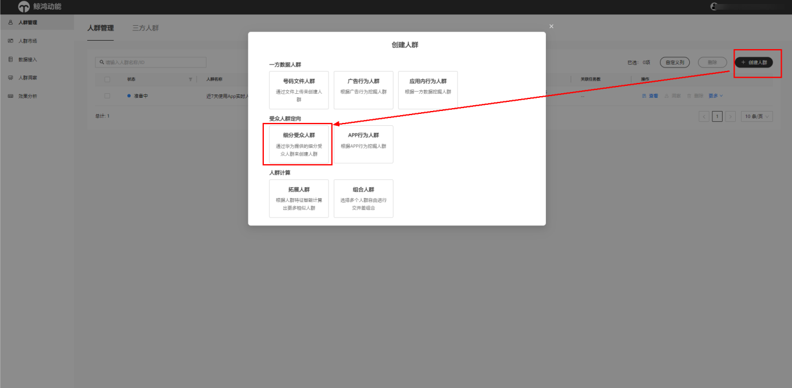
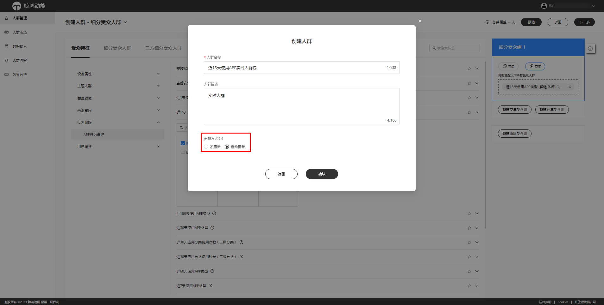
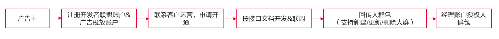
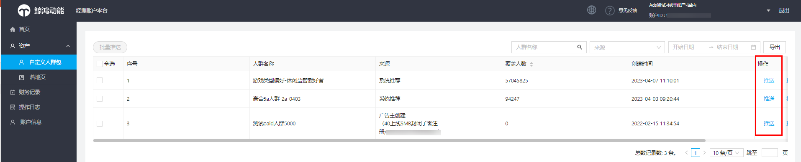

# 人群管理

 

如需使用人群管理功能，请联系运营开通权限。

## 平台创建人群包

## 操作步骤

<strong>功能入口：</strong>登录投放平台，单击“<strong>工具</strong>”-&gt;“<strong>资产管理</strong>”-&gt;“<strong>人群管理</strong>”，进入DMP人群管理。

1. 在人群管理界面右侧，单击<strong>“创建人群”</strong>，可创建下列类型人群：

   

   - 号码文件人群：广告主自有人群号码数据，通过txt文件格式上传，内容支持支持多种用户数据格式，详情可登录鲸鸿动能平台查看。
   - 广告行为人群：支持按广告计划、选取创意、广告任务维度，对该计划/任务/创意投放带来的曝光、点击、下载、激活、表单提交等多种行为创建人群包。

   

   - 细分受众人群（标签人群）：提供设备属性、用户属性、行为偏好、兴趣意向、主题人群等多维度海量标签，支持对多种维度进行并集或交集运算。

   

   App行为人群：根据App行为挖掘人群，可针对App整个生命周期（安装、使用、更新、卸载）的用户人群，做二次营销。

   

   - 拓展人群：根据人群特征智能计算出更多相似的新人群，如与被推广应用的访问者或现有用户有相似兴趣的新用户。
     - 您可以选择一个已经就绪的人群包（人群量级&gt;=1000且&lt;=200万）作为种子人群进行拓展，也可以选择系统推荐种子人群进行智能拓展。
     - 拓展方式支持根据行业定制模型或通用模型进行拓展，可选拓展人群是否包含种子人群。
   - 组合人群：支持人群包取交并差计算，即交集、并集和排除人群。

    

   1. 号码文件人群上传格式要求：
      - 上传的自有人群包格式登录鲸鸿动能平台查看，并按照平台格式要求上传，否则可能会出现匹配错误，无法计算人群；
   2. 创建App行为人群时，搜索选择的应用必须是该账户已创建任务中选择过的应用，您可通过应用名称或者应用包名搜索。
   3. 拓展人群时，拓展量级越小，拓展的人群相似度越高；拓展量级需大于等于5万人且小于等于1000万人。
2. 人群包创建成功后系统将进行计算，最晚次日上午12点生效，生效后显示为“就绪”状态即可用于广告投放，您可查看该人群包覆盖的用户数。

## 创建实时人群

## 功能简介

广告主在人群管理中可创建实时人群；目前支持下列标签创建实时人群：近7天使用App 、近15天使用App 、近30天使用App 、近60天使用App 、安装状态App。

## 操作步骤

1. 在人群管理中“创建人群”，选择“细分受众人群”。

   
2. 受众特征选择“行为偏好-App行为偏好”，可选择“近7天使用App 、近15天使用App 、近30天使用App 、近60天使用App 、安装状态App”任一标签创建实时人群包。
3. 选好标签进入下一步，选择“更新方式-自动更新”，自动更新的频率为一天一次，确定好人群包创建完成。

   

   4.在人群列表页，通过实时人群字段，可查看人群包是否为实时人群。

## 在线API创建人群包

## 功能简介

鲸鸿动能平台现在提供更安全的在线API方式回传一方人群包，既能满足您的人群包创建需求，又能保护您的数据安全。

## 操作步骤

整体接入流程如下:

 

该功能属于白名单功能，如需使用请联系客户运营申请开通权限。

1. 如您已开通经理账户，可通过API接口把人群包回传至经理账户所关联的任一账户上。您可通过经理账户把回传的人群包授权给其他关联的账户使用。
2. 您可通过API接口新建/更新/删除人群包，接口文档请联系客户运营获取。参考文档：[人群管理-OpenDmpAPI接入指导](https://alliance-communityfile-drcn.dbankcdn.com/FileServer/getFile/cmtyPub/011/111/111/0000000000011111111.20260529160219.69480512867182301981170401543637:20260531101408:2800:5124A6C3859C692731822D4727328CEFB05377509C467BB3045EE7D167AA80AB.pdf?needInitFileName=true)

## DMP人群自动清理说明

- 人群冻结周期：冻结-14天，即将过期-21天，已过期-28天。
- 人群列表中，已过期人群支持一键复制按照相同规则，重新创建新人群。

备注：

①人群包被使用定义：人群包被用于投放、组合或者拓展。

②冻结：人群包连续14天未被使用，进入冻结状态（人群停止更新），仅支持解冻、查看、洞察、删除。

③即将过期：人群包连续21天未被使用进入，即将过期状态（人群停止更新），仅支持续期、查看、洞察、删除。

④已过期：人群包连续28天未被使用，进入已过期状态（人群数据删除），仅支持复制、查看、删除（删除人群包的记录）。

⑤手动解冻：任意运营有解冻任意现网已创建的人群包的权限。
