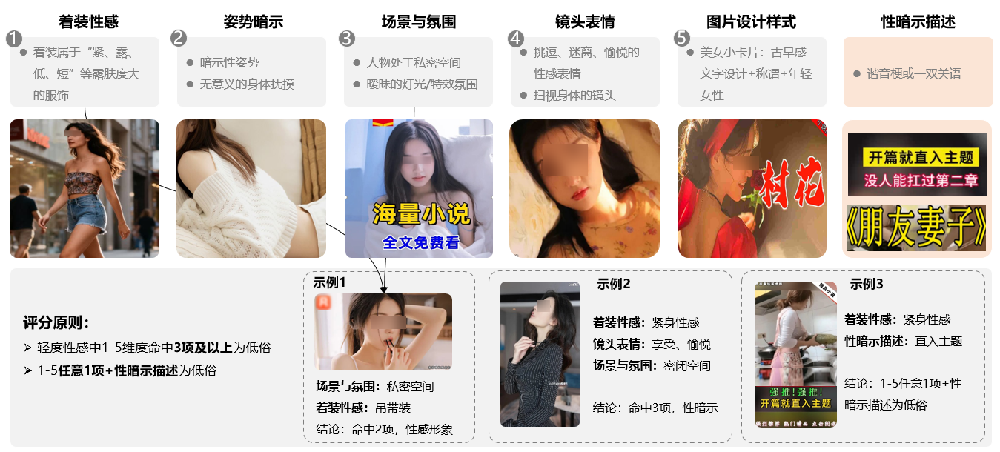

# 低俗性暗示专题解读

<strong>《广告法》第三条</strong>

广告应当真实、合法，以健康的表现形式表达广告内容，符合社会主义精神文明建设和弘扬中华民族优秀传统文化的要求。

<strong>《广告法》第九条</strong>

第九条、广告不得有下列情形：（八）含有淫秽、色情、赌博、迷信、恐怖、暴力的内容；

根据官方指南，互联网低俗性、暗示内容是指以撩起性兴奋为目的，而展示或描述人类身体或人类性行为的一种表现，表现方式包括不限于：

<strong>直接/隐晦表现性行为：</strong>包括直接暴露描写、表现性行为、使用带有性暗示或性挑逗的语言描述性相关内容。

<strong>以身体特征为噱头的低俗宣传：</strong>如未着衣物仅用肢体掩盖隐私部位，或发布走光、偷拍等内容。

<strong>以低俗方式吸引流量：</strong>使用庸俗挑逗的标题，或传播一夜情、换妻等有害信息。

<strong>相关案例仅用于展示审核规则，并不代表鲸鸿动能广告对此持认可态度</strong>。

## 一、广告不得展示低俗、恶俗、含有不良暗示的画面/内容/文案

| <strong>❌违规素材</strong> | <strong>违规解读</strong> | <strong>修改要点</strong> |
| --- | --- | --- |
|  | - 聚焦展示隐私部位   禁止图片主视觉刻意特写胸部、臀部、大腿根部、裆部、等隐私部位轮廓 | 避开隐私部位的聚焦展示，建议使用全身或半身素材 |
|  | - 走光露底或敏感部位暴露过多   禁止真空或胸线暴露超过1/2。  禁止臀线走光露底，包括不限于：侧乳走光、底裤露出、大腿根露出 | 避开隐私部位的暴露 |
|  | - 大尺度服装或着装不雅观   禁止内衣上身展示  禁止半脱展示裤袜  禁止肤色装 | 避免大尺度服装或着装不雅观 |
|  | 其他限制场景补充  禁止身着透视装、情趣服、比基尼、敏感部位激凸等大尺度服装 |
|  | - 姿势表情不雅或像形映射   禁止模仿性爱表情或动作  禁止使用像形映射女性私处 | 避免姿势表情不雅或像形映射 |
|  | 其他限制场景补充  禁止自行或他人抚摸、抓捏隐私部位，拉扯露出隐私部位 |
|  | - 不良视角   禁止使用“偷拍”视角，包括不限于：镜头从下至上“仰拍”女性裙底或男性凝视女性敏感部位等。 | 避免使用不良视角 |
|  | - 夸张的丰乳肥臀   禁止展示过于夸张的身体部位，并将其作为核心卖点，包括不限于：E杯、肥臀 | 避免夸张的丰乳肥臀，如模特身材优异，建议使用全身素材且非露肤度高的紧身素材 |
|  | - 两性暧昧   禁止使用密闭空间的男女面部潮红对视素材  禁止使用男女亲吻素材 | 使用两性人物避开亲吻、近距离对视、面部潮红等易产生性暧昧的氛围场景 |
|  | - 未成年性感风   禁止未成年人物以性感风格展示 | 未成年形象应以朴实、避免性感风 |

## 二、广告不得出现性暗示、暧昧场景等易引发不良联想的画面

<strong>性暗示/性联想评分维度</strong>

