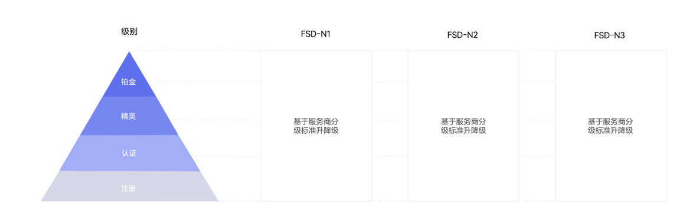

# 服务商体系简介

## 概述

 

以下均为推广类型选择“展示广告网络”权限的服务商的内容，推广范围权限选择“应用市场应用推广”的服务商内容请参考：[服务商账户管理（应用市场应用推广）](/docs/monetize/promotion/ads-fwszhglyysc-0000002474766464)

鲸鸿动能秉承“资源共享、技术共创、合作共赢” 的理念面向业内招募服务商，目前鲸鸿动能服务商分为 <strong>FSD-N1、FSD-N2、FSD-N3</strong>三大类型，依据升降级规则又分为<strong>铂金</strong>、<strong>精英</strong>、<strong>认证</strong>和<strong>注册</strong>四种级别。

服务商体系结构如下：

<strong>各领域的行业划分参考如下：</strong>

| 服务商类型 | 行业 |
| --- | --- |
| FSD-N1 | 电商、影音、阅读、房产家居、生活服务、社交、在线教育、工具、汽车出行服务、旅游、在线金融、新闻资讯、游戏。 |
| FSD-N2 | 日化美妆、食品饮料、服饰箱包、电子电器、母婴用品、运动户外、玩具乐器、汽车出行、教育培训、地产家居家装、金融、便民生活、其它。 |
| FSD-N3 | 直投电商、招商加盟、美容植发、本地服务、本地房产。 |
| 以上行业仅供参考，若有疑问请联系[在线客服](https://smartrobot-drcn.platform.dbankcloud.cn/?appId=31000)。 | |

## 服务商分级标准

|  | FSD-N1 | | FSD-N2 | | FSD-N3 | |
| --- | --- | --- | --- | --- | --- | --- |
| 服务商级别 | 门槛流水  RMB/年 | 鲸鸿动能  认证人数 | 门槛流水  RMB/年 | 鲸鸿动能  认证人数 | 门槛流水  RMB/年 | 鲸鸿动能  认证人数 |
| 铂金 | 5亿 | 10 | 5000万 | 3 | 1000万 | 3 |
| 精英 | 1亿 | 3 | 1000万 | 2 | 500万 | 2 |
| 认证 | 0.1亿 | 1 | 100万 | 1 | 50万 | 1 |
| 注册 | - | 0 | - | 0 | - | 0 |

## 服务商准入标准

若您的企业符合以下条件，即可向鲸鸿动能申请成为<strong>相对应的服务商</strong>类别，审核通过后，在合作过程中根据[服务商分级标准](https://developer.huawei.com/consumer/cn/partner/petalads)升降级。

- 资质：具有广告代理资质。
- 注册资本：100万及以上。
- 成立年限：1年及以上（\*含母公司或控股公司具备广告资质、且成立时间超一年)。

## 服务商激励政策

<strong>针对服务商，鲸鸿动能推出了相应的激励政策：</strong>

| 激励政策名称 | 面向对象 |
| --- | --- |
| [鲸鸿动能互联网行业星火计划](/docs/monetize/promotion/ads-xhjh-0000002139646894) | FSD-N1&N2模式下新客（2026年开始消耗之日起，前180天在鲸鸿动能无消耗的产品），单产品维度，产品覆盖安卓应用，快应用，鸿蒙原生应用，元服务，网页（不含维纳斯落地页）。 |
| [oCPC产品激励政策](/docs/monetize/promotion/ads_jlzc_ocpc2-0000001880794312) | 所有投放oCPC的客户，无需申请。 |
| [2026年鲸鸿动能游戏行业激励政策](/docs/monetize/promotion/ads-yxhyydjl-0000002160474788) | 游戏行业客户（仅限标准联运HMS游戏参加）。 |

详情请关注[激励政策](https://developer.huawei.com/consumer/cn/doc/promotion/ads_jlzc07-0000001409614493)内容。
