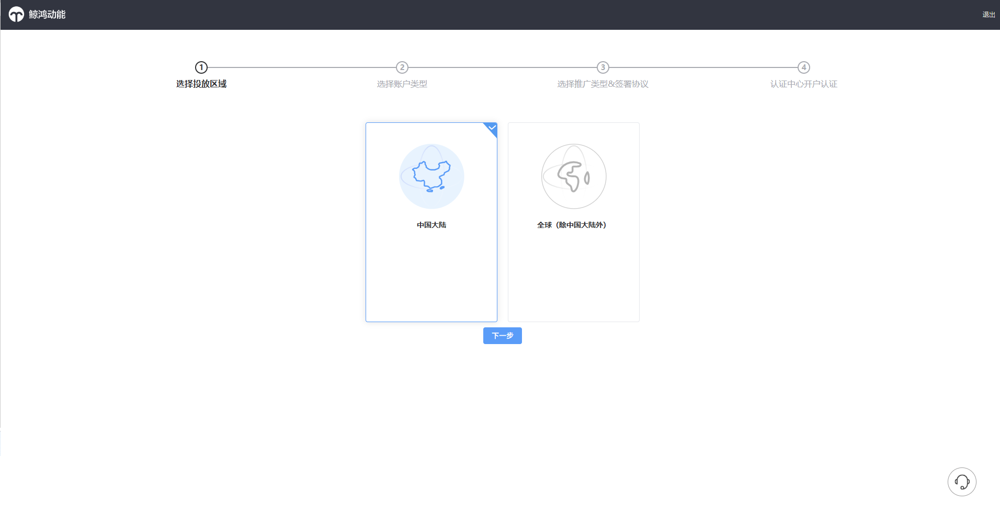
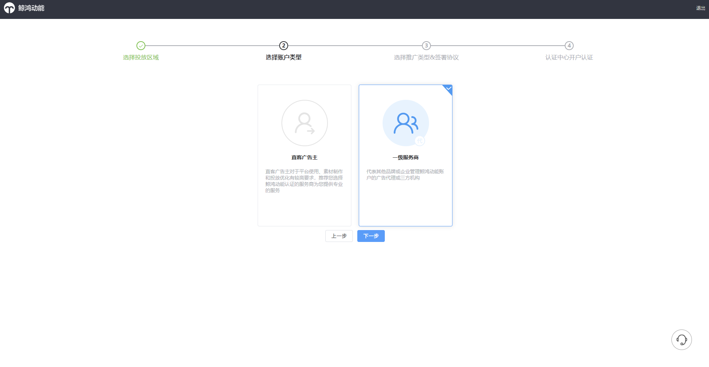
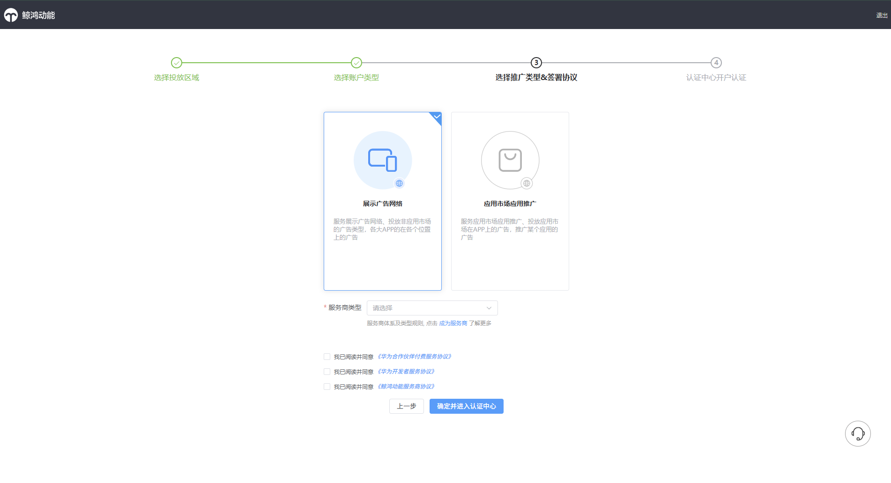
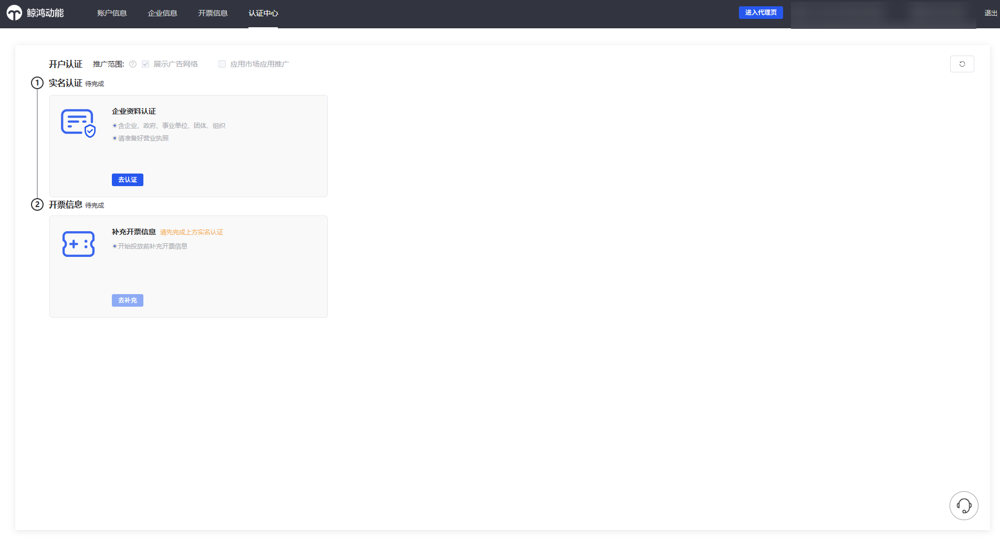
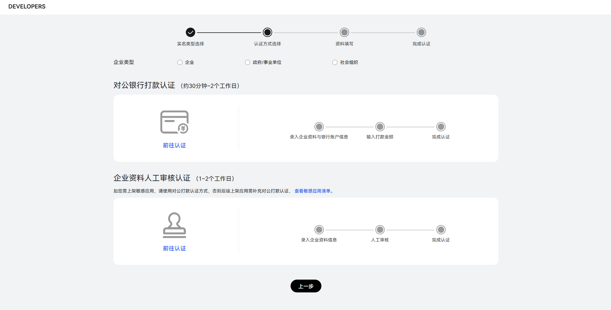
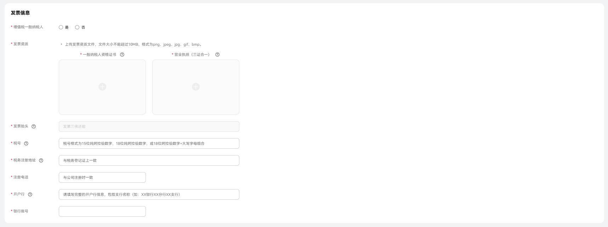
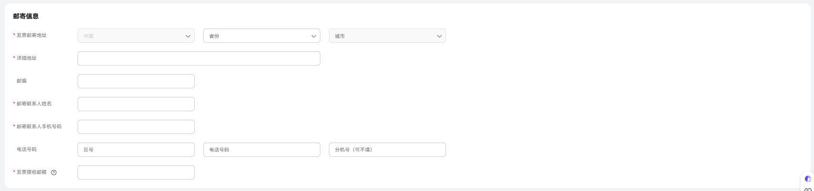

# 服务商账户注册

鲸鸿动能秉承“资源共享、技术共创、合作共赢” 的理念面向业内招募服务商，各级服务商的服务范围和权益请参考[官网&gt;服务商](https://ads.huawei.com/usermgtportal/home/index.html#/agent)页面。

鲸鸿动能平台服务商账户结构如下：

## 开户步骤

 

以下为“展示广告网络”服务商注册流程。

1. <strong>注册华为账号</strong>

   1）登录鲸鸿动能官网[https://ads.huawei.com](https://ads.huawei.com/)（建议您使用Chrome浏览器），单击页面右上角“<strong>立即开始</strong>”。

   

   2）进入华为账号注册界面，可选择手机号注册或者邮箱地址注册方式，注册完成后跳转至登录界面，登录该账号。

   若您的手机号此前已经注册过华为账号，输入验证码之后将会弹出“<strong>此号码已被注册，请登录</strong>”弹窗，此时请单击弹窗中的<strong>“登录”。</strong>

   

   3）账号登录成功后，跳转至“<strong>选择投放区域</strong>”界面，请选择“<strong>中国大陆</strong>”区域 。

   

   4）区域选择完成后，跳转至“<strong>选择账户类</strong> <strong>型</strong>”界面，请选择“<strong>一级服务商</strong>”账户类型

   

   5）选择推广类型&签署协议，选择“展示广告网络”类型的服务商，根据实际情况勾选服务商类型，完成后勾选相关协议，单击“确定进入认证中心”

   

    

   服务商分类以及相关申请条件请参考[服务商简介](/docs/monetize/promotion/ads-fuwushangjianjie-0000001815794722)。
2. <strong>实名认证</strong>

   完成华为账号注册之后，需要进行实名认证，单击“去认证”进行企业资料认证流程，认证方式可选“对公银行打款认证”或“企业资料人工审核认证”，详细步骤可参考[对公银行打款认证](/docs/monetize/promotion/ads-zkzhzcyygg-0000002507044685#ZH-CN_TOPIC_0000002507044685__li104282122617)、[企业资料人工审核认证](/docs/monetize/promotion/ads-zkzhzcyygg-0000002507044685#ZH-CN_TOPIC_0000002507044685__li11630210122615)。

   

   
3. <strong>开票信息</strong>，<strong>投放前需要补充开票信息。</strong>
   - 发票信息

   根据实际情况，填写发票信息。

   

   - 邮寄信息

   根据页面信息，填写邮寄信息。

   
