# 简介

## 概述

鲸鸿动能广告服务商管理平台是鲸鸿动能广告为服务商提供的用于管理子客服务商及子客的系统，为用户提供了[下载中心](/docs/monetize/promotion/ads-xzzx-0000002518317035)、[推广统计](/docs/monetize/promotion/ads-tuiguangtongji-0000001901067241)、[财务管理](/docs/monetize/promotion/ads-caiwuguanli-0000001854907186)、[账号管理](/docs/monetize/promotion/ads-zhanghaoguanli-0000001900947773)和[政策活动](/docs/monetize/promotion/ads-zhglzchd-0000002477598272)功能。您可以通过[鲸鸿动能官网](https://ads.huawei.com)（建议使用谷歌浏览器）登录服务商账户或子客服务商账户。

## 账户总览

<strong>一级服务商账户首页界面如图所示：</strong>

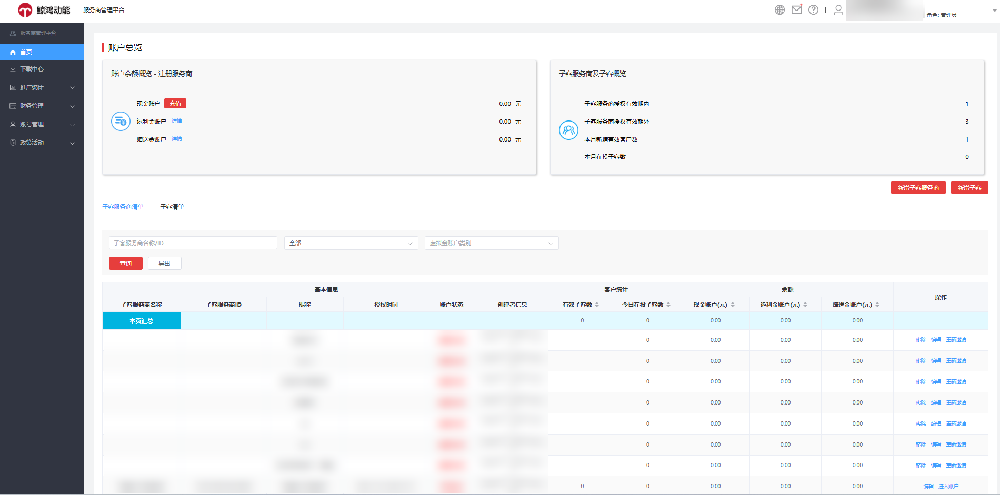

<strong>子客服务商账户首页界面如图所示：</strong>

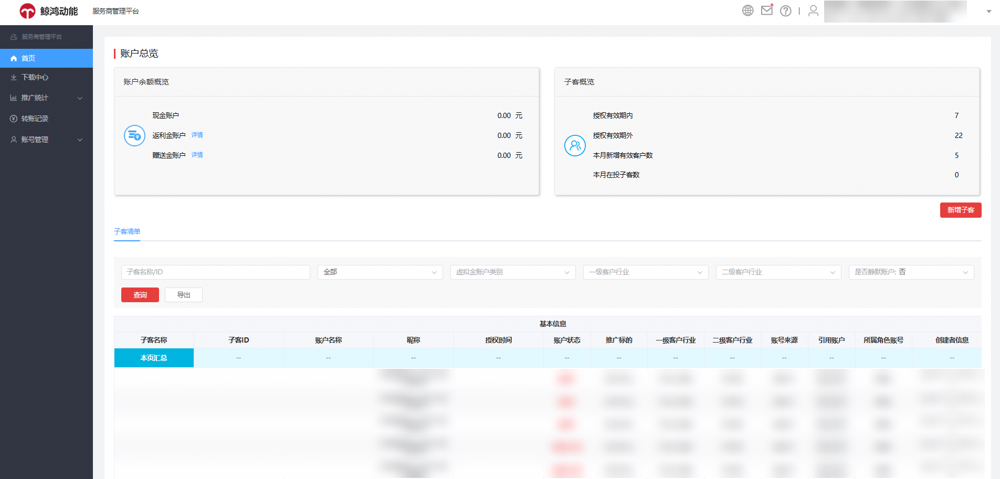

### 账户余额概览

登录服务商账户后，在账户余额概览模块，您可直观看到现金账户、返利金账户、赠送金账户的余额数据，一目了然。其中返利金或赠送金账户可以单击“详情”查看余额、开始有效期和结束有效期；赠送金可区分查看华为自有媒体和通用两个类别的详情。

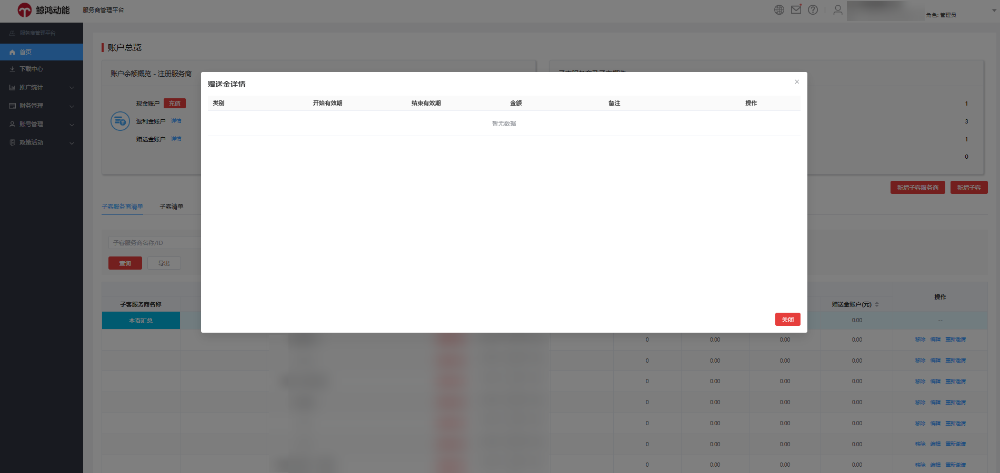

### 关联账户概览

- 如您是一级服务商，您可看到“子客服务商及子客概览”。在概览数据中，您可以看到子客服务商授权有效期内外的账户数、本月新增有效客户数和本月在投子客数。

  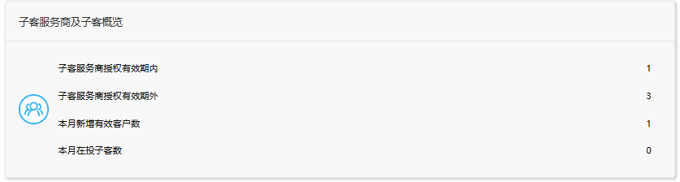

- 如您是子客服务商，您可看到“子客概览”。在概览数据中，您可以看到在授权有效期内外的子客账户数、授权有效期外的子客账户数、本月新增有效客户数和本月在投子客数。

  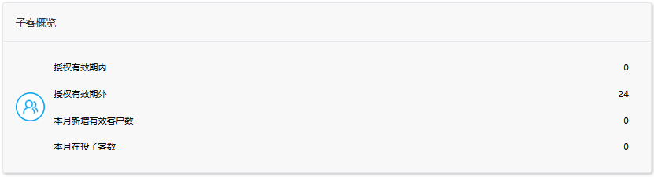

### 新增子客服务商

如您登录一级服务商账户，可在首页单击“新增子客服务商”添加下属子客服务商账户。按要求填写信息即可发送邀请，等待成员接受邀请即完成添加。

需填写的子客服务商成员信息如下：

- 邮箱：用于接收华为邮件信息。
- 昵称：输入账号昵称。
- 华为账号：请填写注册华为账号的手机（需带国家码）或邮箱。
- 邀请邮件的语言：中/英/俄其中一种语言。

  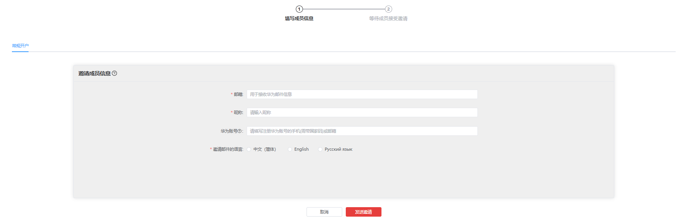

### 新增子客

如您登录一级服务商或子客服务商账户，可在首页单击“新增子客”添加下属子客账户。按要求填写信息即可发送邀请，等待成员接受邀请即完成添加。

需填写的子客成员信息如下：

- 广告主预算来源：请选择广告主预算来源
- 企业名称:请输入企业名称。
- 邮箱：用于接收华为邮件信息。
- 昵称：输入账号昵称。
- 华为账号：请填写注册华为账号的手机（需带国家码）或邮箱。
- 推广标的：请填写推广标的。
- 客户行业：请选择一二级客户行业。
- 开户个数：批量开户时支持一个华为账号最多绑定5个广告账户，支持通过一个邀请链接登录一个华为账号快速注册最多5个广告账户。
- 邀请邮件的语言：中/英/俄其中一种语言。

  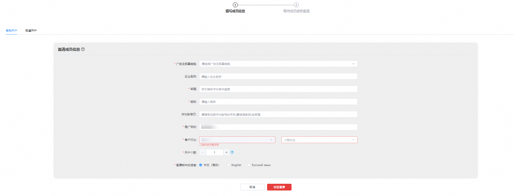

### 子客服务商清单

如您登录一级服务商账户，在首页下方，您可以看到该服务商账户下的子客服务商详细信息。

<strong>查询条件</strong>

在子客服务商清单中，您可以通过输入子客服务商名称/ID、选择账户状态、虚拟金账户类型进行账户查询，

<strong>导出方式</strong>

子客服务商清单支持导出，现已支持直接导出与异步导出两种模式。您可根据数据量灵活选择，当数据量少于5000条时使用直接导出以快速获取；当处理超出5000条数据时，请选用异步导出，有效避免任务超时。导出成功后可在下载中心统一查看并下载结果，全面保障数据调取的效率。

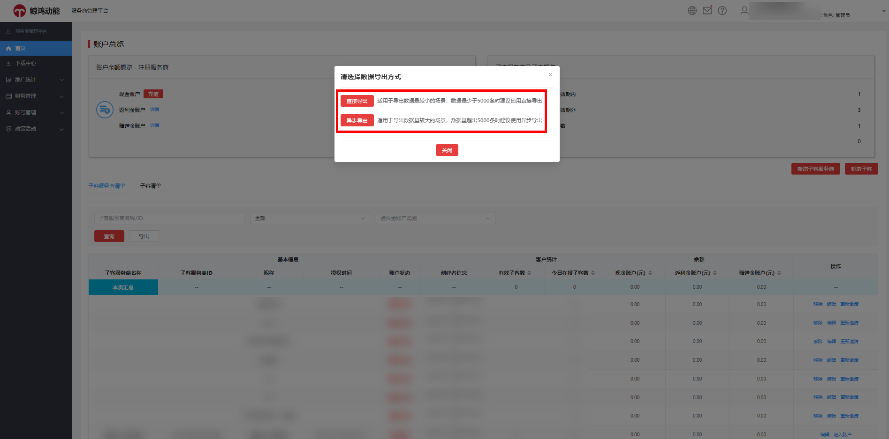

<strong>账户的详细信息</strong>

账户的详细信息如下展示；针对选定的账户可进行转账、编辑账户信息、进入账户、移除子客服务商、重新邀请子客服务商等操作。

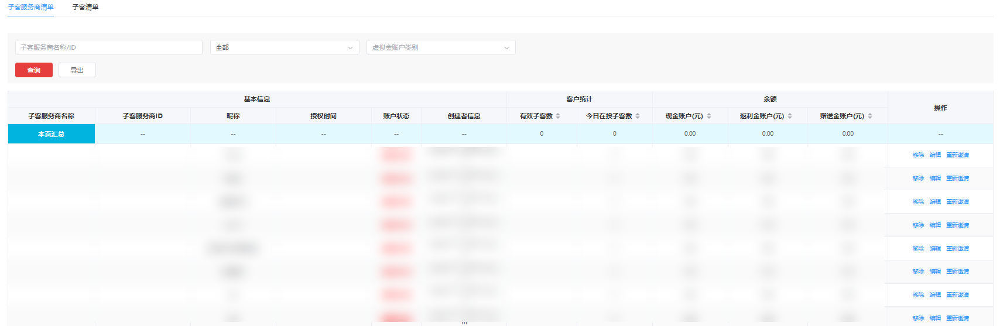

### 子客清单

一级服务商账户与子客服务商账户均可在首页下方，看到该服务商账户下的子客账户详细信息。

<strong>查询条件</strong>

您可以通过输入子客名称/ID、选择账户状态、虚拟金账户类型、一/二级客户行业和是否静默账户等条件查询子客账户，并支持导出子客清单信息。

 

静默状态判定规则：若账户（含一级服务商、子客服务商及子客账户，不含直客账户）持续一年未登录、未产生消耗且账户余额为零，则自动进入静默状态。此状态仅作用于数据筛选优化，不影响账户本身的使用功能；当重新登录时，账户状态将自动刷新恢复。

<strong>导出方式</strong>

子客清单支持导出，现已支持直接导出与异步导出两种模式。您可根据数据量灵活选择，当数据量少于5000条时使用直接导出以快速获取；当处理超出5000条数据时，请选用异步导出，有效避免任务超时。导出成功后可在下载中心统一查看并下载结果，全面保障数据调取的效率。

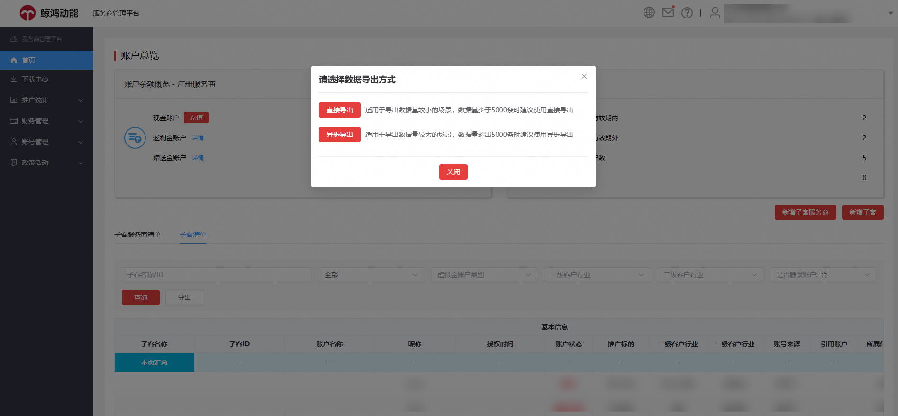

<strong>账户详细信息</strong>

账户的详细信息如下展示；针对选定账户支持删除、编辑和进入账户等操作。

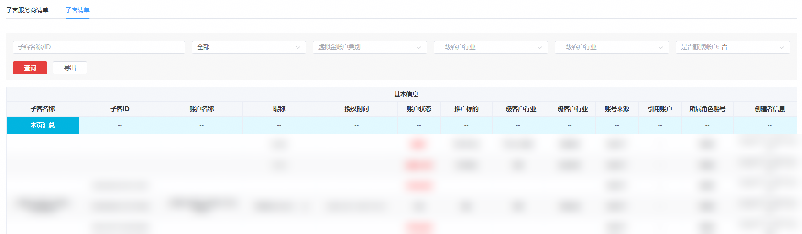

 

<strong>为保障平台内投放环境的有序性，从 2024 年 8 月 12 日起，小艺建议竞价版位（包括首页促活和非首页促活）将升级为按投放期间实际产生的点击数据结算进行扣费处理，当账户余额不足时，超投部分会记入欠费金额进行延迟扣费，待账户充值后系统自动扣除欠费金额。</strong>

子客服务商账户可在服务商管理平台首页的子客清单列表中的“现金账户（元）”列，查看到账户下的子客账户是否存在欠费金额，当子客账户有欠费时才会展示欠费金额。

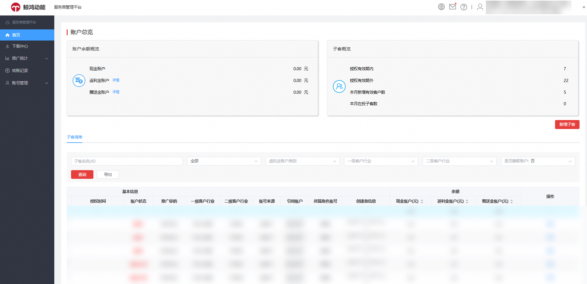

<strong>延迟扣费的规则详情如下：</strong>

|  |  |
| --- | --- |
| <strong>场景</strong> | <strong>规则</strong> |
| 充值后自动补扣 | 当账户可用余额充值大于或等于任意一个有待补扣花费的任务中任意一次点击计费金额时，系统优先自动使用账户可用余额进行欠费补扣，并将补扣成功点击量、补扣成功花费字段进行刷新。 |
| 返利消耗累计 | 补扣成功花费的返利消耗累计以及返利规则，按照补扣成功花费上报的时间为准（如任务在 24 年 12 月投放，补扣成功花费在 25 年 1 月份上报，该部分补扣成功花费按照 1 月份的返现规则进行累计计算）。 |
| 补扣数据累计 | 超投补扣产生的花费数据不计入当天的日限额和计划限额数据中。 |

<strong>延迟扣费场景举例：</strong>

2024/7/8：某个广告投放账户余额 1000 元，当日实际产生的广告花费为 1100 元，那么账户欠费 100 元，账户现金余额为-100。

2024/7/9：该广告投放账户充值 1000 元，系统补扣 100 元，那么账户现金余额为 900 元。

<strong>延迟扣费相关政策说明如下：</strong>

1. 针对延迟扣费版位产生的子客欠费金额，如子客账户欠费后未及时充值还款，可由所属子客服务商、一级服务商通过给相应欠费子客账户转账进行还款。
   - 如某子客服务商名下同一客户（如有多个欠费账户，按所有账户欠费总额计算）欠费达 万元后仍未还款，鲸鸿动能有权扣除该子客服务商对应一级服务商相等金额的保证金，并将限制该子客服务商邀请该客户开新账户。
2. 一级服务商可决策名下子客服务商和子客是否继续投放小艺建议竞价版位。如果决定不投放该版位，可给鲸鸿动能平台客户运营发送邮件反馈，邮件需说明限制投放的子客服务商、子客清单，含账户名称与账户 ID，收到有效反馈后，鲸鸿动能将会据此进行相应投放限制。
3. 如某个子客账户有欠费金额待补扣时，鲸鸿动能将暂停该账户下所有任务的 oCPC 超成本返利金的发放，待子客账户完成欠款还款后再补发返利金。

<strong>转账</strong> <strong>功能</strong>

- 如您登录的是一级服务商账户，在子客服务商清单中，您可以单击相应的账户操作列表里的“转账”，进入转账页面，子客服务商账户转账业务类型可以选择“一级服务商转入子客”或“子客转出一级服务商”。

  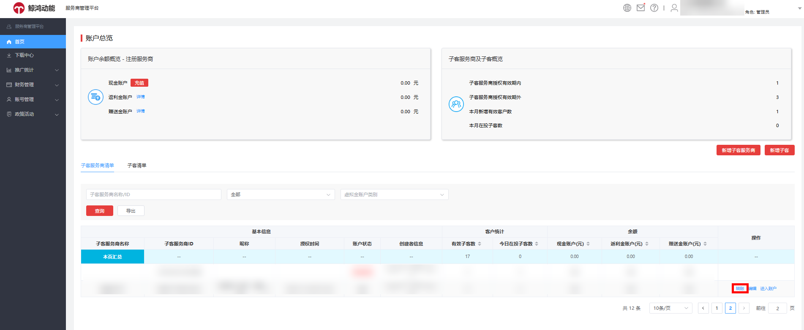

  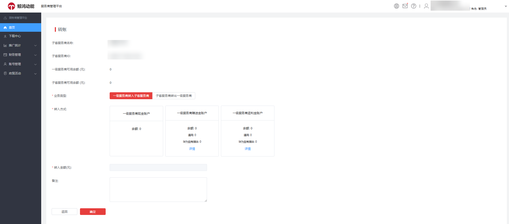

  在子客清单中，同样您可以单击相应的账户操作列表里的“转账”，进入转账页面，子客账户转账业务类型可以选择“一级服务商转入子客”或“子客转入一级服务商”。

  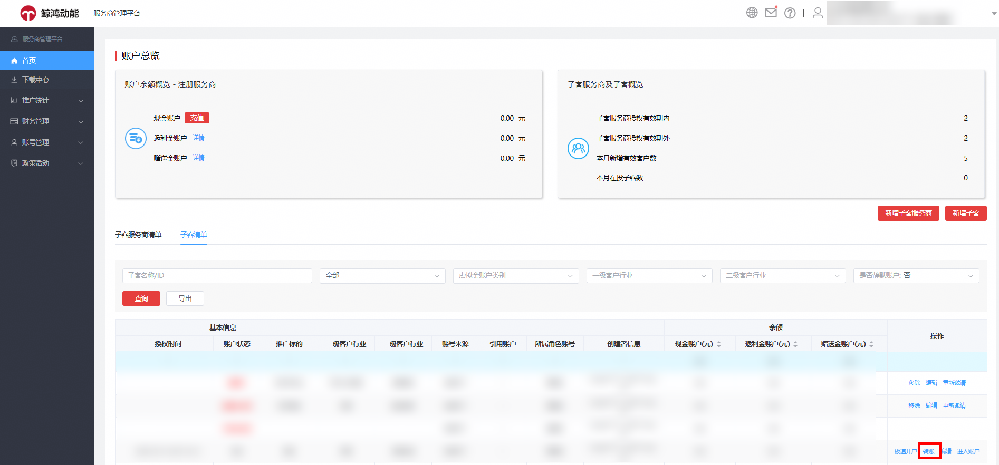

  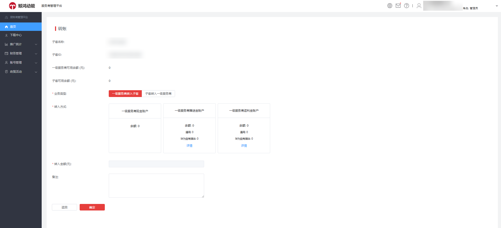
- 如您登录的是子客服务商账户，在子客清单中，您可以单击相应的账户操作列表里的“转账”，进入转账页面，子客账户转账业务类型可以选择“子客服务商转入子客”或“子客转出子客服务商”，转入方式您可选择现金账户、赠送金账户、返利金账户。

  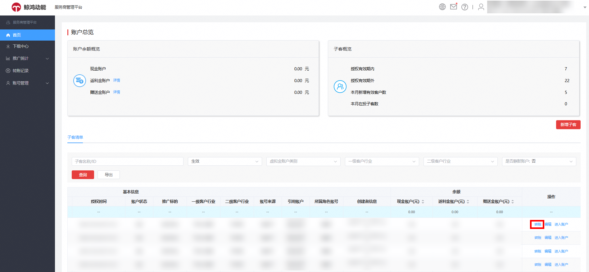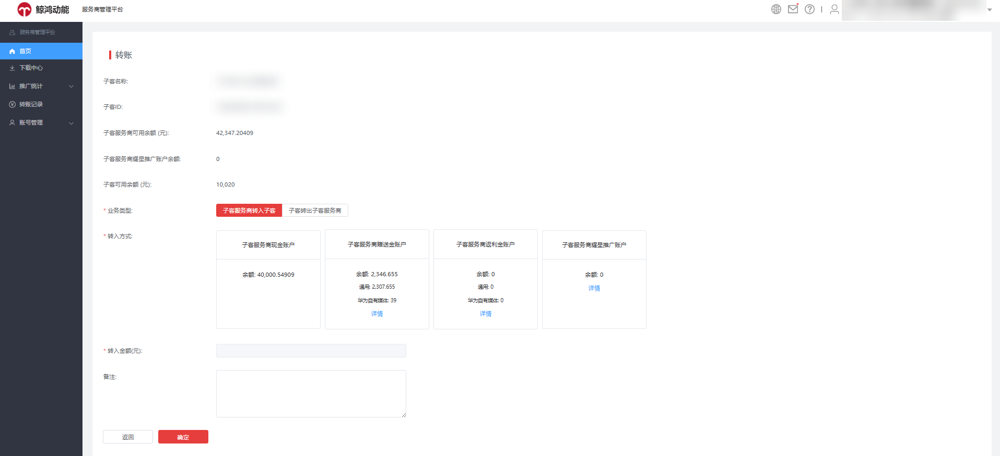
- 当您选择赠送金转账时，可单击“详情”设置转账的虚拟金账户类别、资金划转方式以及转入金额。
  - “虚拟金账户类别”区分“通用”和“华为自有媒体”，“资金划转方式”区分“自动分配”和“自定义”，其中“自定义”资金划转方式，可在列表类别中查看该笔资金可消耗范围是“通用”还是“华为自有媒体”。

    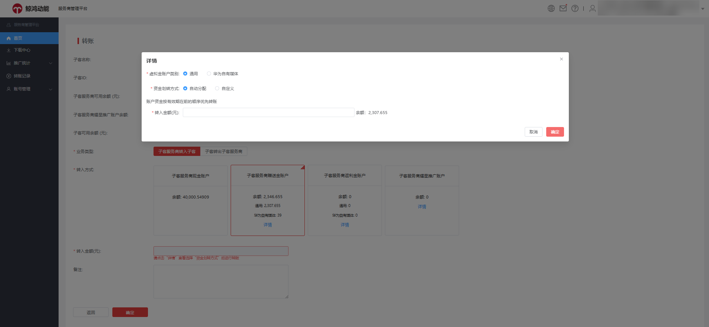
  - 当您进行“子客转入一级服务商”或“子客转出子客服务商”的赠送金转账操作时，如果您账户的虚拟资金中有部分订单 “限制转出”， 会出现下列两种情况。

1.若资金划转方式为“自动分配”，赠送金不同虚拟金账户类别的资金余额显示“其中XX限制转出”，此时您输入的“转出金额”应小于等于“总余额-限制转出余额”。

2.若资金划转方式为“自定义”时，资金明细表中的余额标识显示“限制转出”，此时该订单不可被勾选划转。

 

赠送金-华为自有媒体的资金仅可在投放华为自有媒体时使用。

- 当您选择返利金转账时，可单击“详情”设置转账的虚拟金账户类别、资金划转方式以及转入金额。
  - 当您进行“子客转入一级服务商”或“子客转出子客服务商”的返利金转账操作时，如果您账户的返利金中有部分订单 “限制转出”， 会出现下列两种情况。

1. 若资金划转方式为“自动分配”，返利金的资金余额显示“其中XX限制转出”，此时您输入的“转出金额”应小于等于“总余额-限制转出余额”。

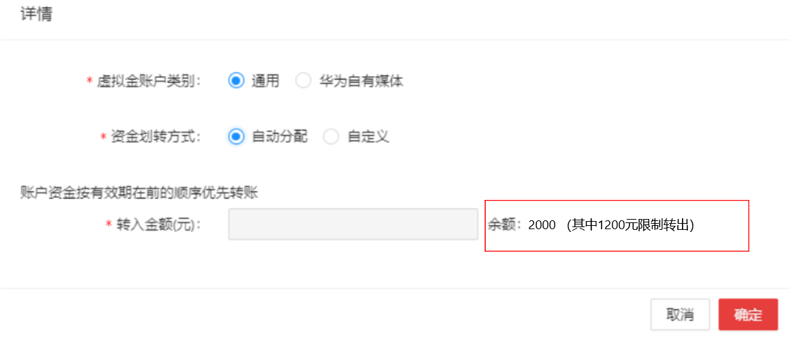

2. 若资金划转方式为“自定义”时，资金明细表中的余额标识显示“限制转出”，此时该订单，不可被勾选划转。”

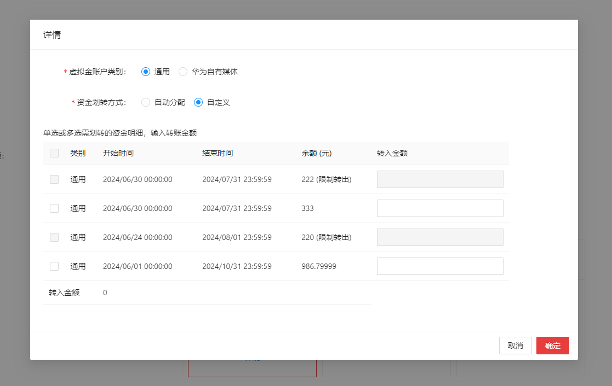

## 站内信

您可单击“”查看账户的系统消息、审核消息、账户消息和财务消息。如有未读消息图标会显示小红点，未读消息会显示在“未读”列，单击标题即可阅读通知内容。您可单击“消息通知设置”进入消息设置页面。

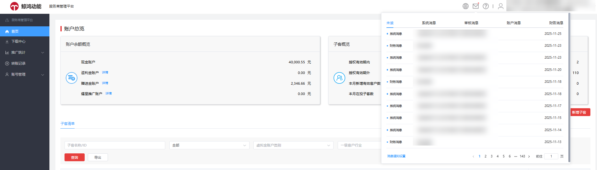
