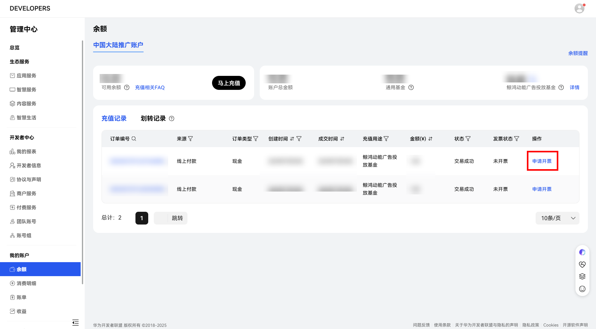
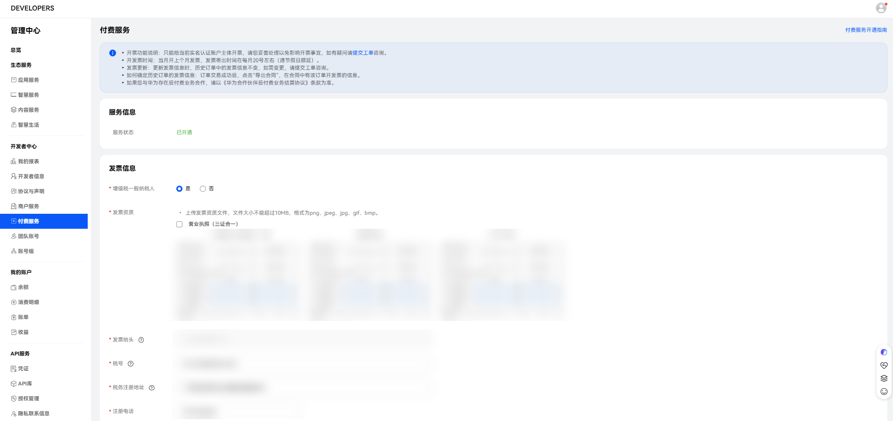
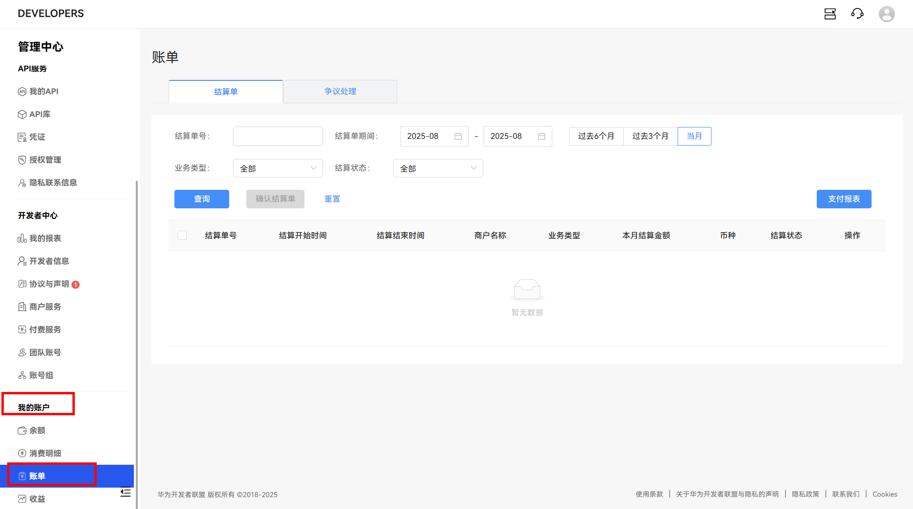

# 服务商账户开票流程

## 按照充值金额开具发票

<strong>在华为开发者联盟管理中心操作。</strong>

操作步骤：使用您鲸鸿动能广告的主账号登录[华为开发者联盟管理中心](https://developer.huawei.com/consumer/cn/console#/serviceCards/)-&gt;“<strong>我的账户</strong>”-&gt;“<strong>余额</strong>”，单击“<strong>申请发票</strong>”。

<strong>首次开票申请。</strong>

请在联盟后台付费服务中，根据页面内容填写发票信息，确保开票信息准确无误，如果因为开发者问题填写错误的发票将暂无法开票。

<strong>申请发票。</strong>

充值推广基金时需确认发票信息，根据选择的发票类型（数电票增值税专用发票、数电票增值税普通发票）填写对应内容（一般纳税人信息选择是或否）。

- 开票发票抬头/内容

  抬头默认为企业认证名称，发票内容为信息费服务费。
- 开票时间

  订单充值成功后，开发者可点击“申请开票”或等系统于15个工作日后自动触发开票申请。如果开发者有多条订单，当月订单会进行合并开票。开票周期为当月充值次月开出发票。
- 发票信息更新

  如果出现公司主体变更、三证合一营业执照更换、发票类型变更等特殊情况，请在联盟后台立即刷新发票信息，将之前未触发开票申请的订单内开票信息同步更新，已触发开票申请的订单则按旧的开票信息开票，如果因为开发者问题填写错误的发票将暂无法开票。

<strong>发票接收。</strong>

2025年上线数电发票，不再进行纸质发票的邮寄。已开具的数电发票将通过电子发票服务平台自动交付。开发者登录自己的电子发票服务平台后，可进行发票查验以及用途勾选等系列操作。（发票业务-发票查询统计-全量发票查询-查询类型：取得发票，可通过开票日期或数电票号码等进行查询下载）

## 查看&修改发票信息

<strong>在华为开发者联盟管理中心查看&修改发票信息</strong>：使用鲸鸿动能广告的主账号登录[华为开发者联盟管理中心](https://developer.huawei.com/consumer/cn/console)-&gt;“<strong>开发者中心</strong>”-&gt;“<strong>付费服务</strong>”中，维护税务信息，鲸鸿动能广告平台根据此处的税务信息为您开具发票。

## 查看充值后的发票

<strong>方式一：</strong>

可在[开发者联盟](https://developer.huawei.com/consumer/cn/)后台“我的账户-账单” 中查看对应的发票情况。在这里获取到开票日期+发票号后，可前往电子税务平台查看数电发票情况。

<strong>方式二：</strong>

2025年2月份之后开的数电发票，会发送到系统维护的邮箱中（若需要修改接收邮箱，可在开发者联盟后台中进行修改后并及时同步至运营/客服），可直接进行查看。
