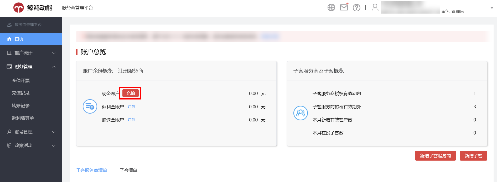
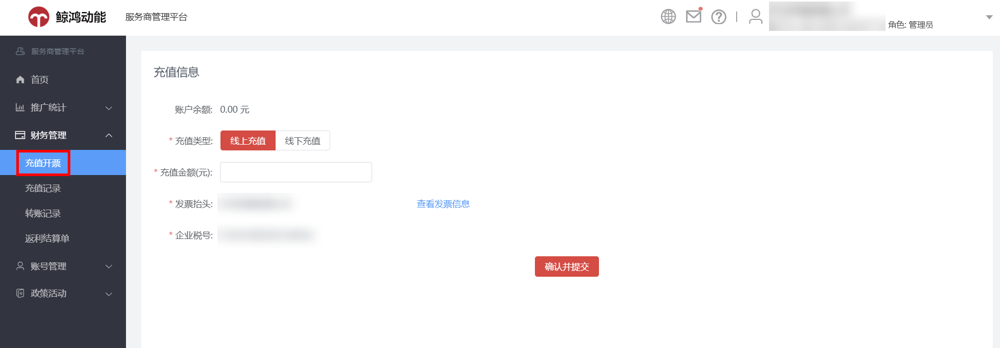
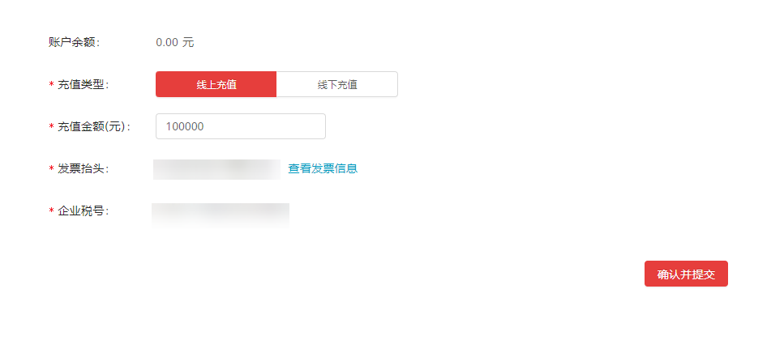
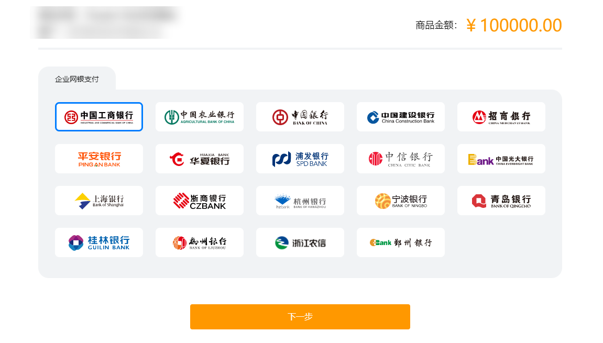
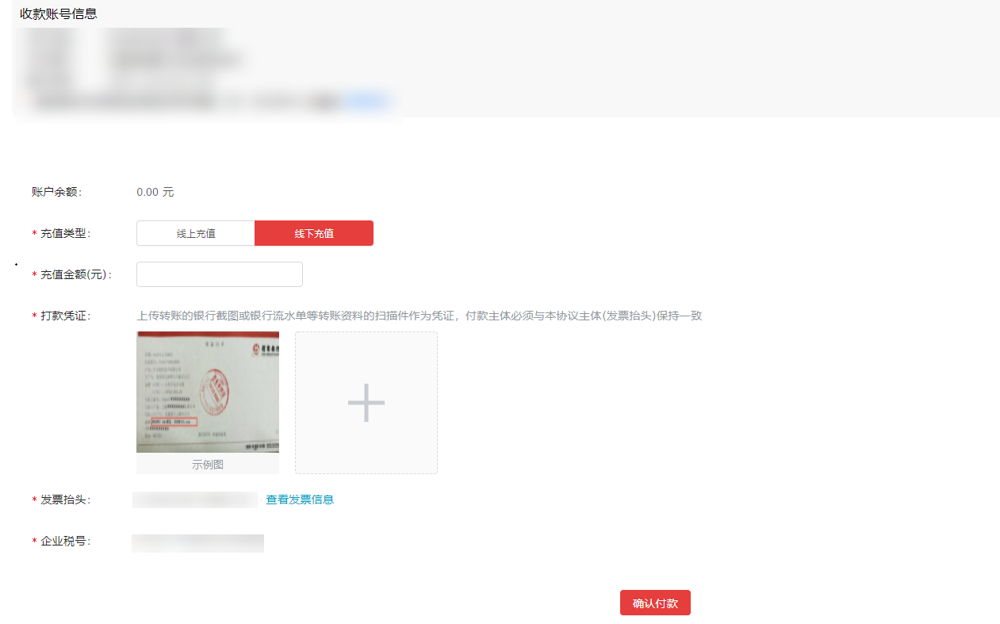
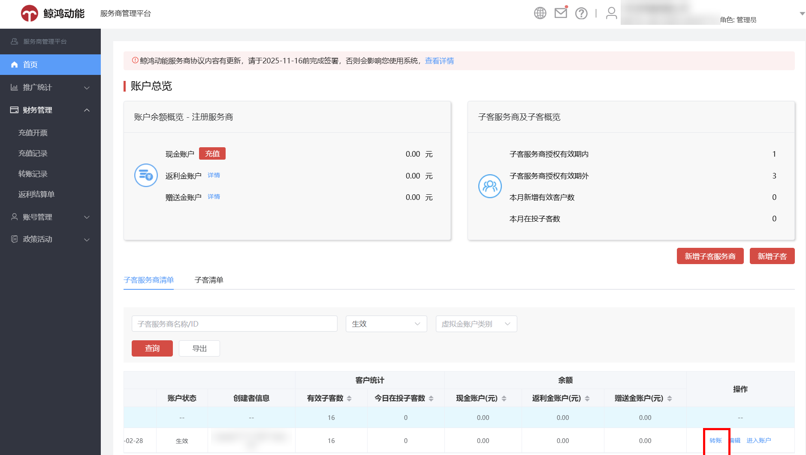
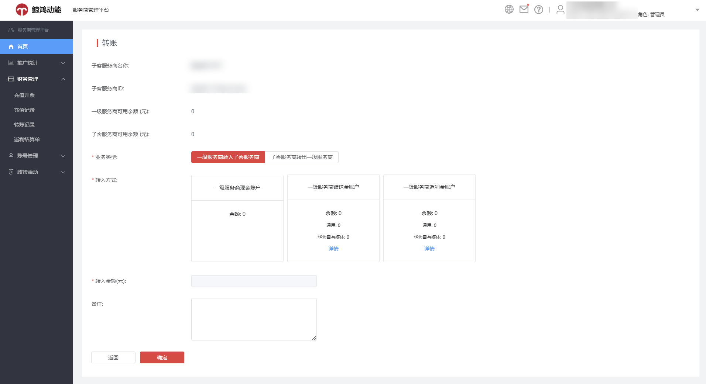
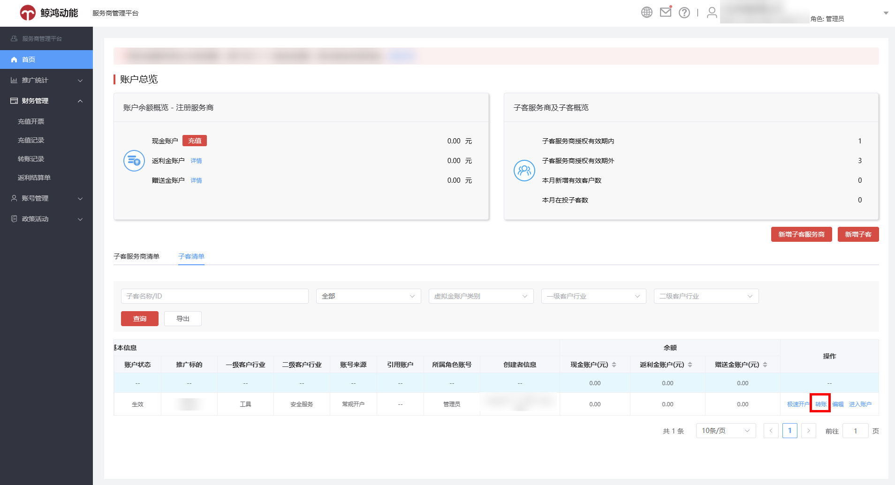
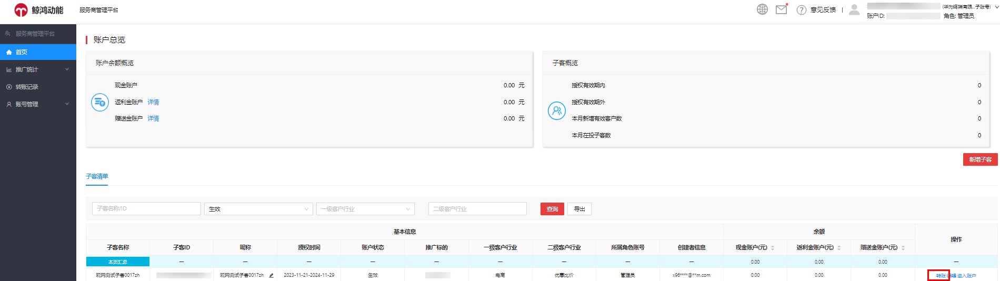
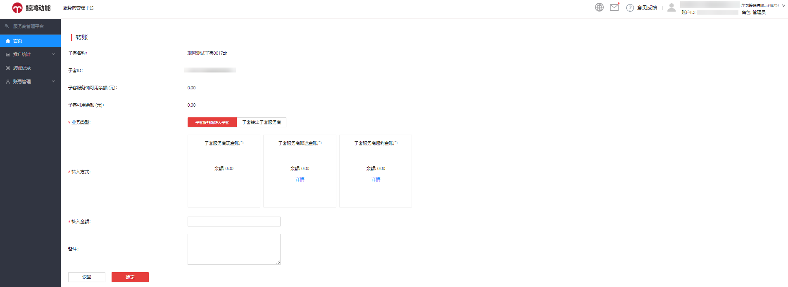

# 服务商账户充值流程

## 概述

一级服务商账户后台支持充值操作，充值方式有“线上充值”与“线下充值”两种，充值入口如下：

- 服务商账户后台首页-&gt;账户总览-&gt;充值

- 服务商账户后台首页-&gt;财务管理-&gt;充值开票

## 操作步骤

若您选择“线上充值”方式，操作步骤如下：

1. <strong>选择充值类型为“线上充值”</strong>，输入充值金额并确认发票信息，单击确认并提交。

   
2. <strong>跳转至企业网银支付页面，</strong>选择支付银行并确认付款，付款金额实时到账。

   

若您选择“线下充值”方式，操作步骤如下：

1. <strong>选择充值类型为“线下充值”</strong>，按照页面提示的收款账号信息进行对公打款。

   
2. <strong>输入充值金额，上传打款凭证</strong>（银行转账截图或者银行流水单等转账资料）。
3. <strong>确认发票信息，</strong>单击确认并付款，经财务审核后充值到账（2个工作日内）。

 

单笔最大充值金额为20亿元，最小充值金额为1元。

线下银行转账请提前与银行确认转账时效（公对公跨行转账到账时间一般为1-3个工作日）。

充值成功后，如您单击“申请开票”，系统将于30个工作日内寄出发票，如您未单击“申请开票”，系统将于15个工作日后自动触发开票申请，于开票申请触发后30个工作日内寄出发票。

如线下付款2笔，需分别建立2个订单对应2笔充值金额，每笔订单充值金额应与实际打款金额相同。

不支持代付款，付款主体需与发票抬头保持一致。

## 一级服务商转账到子客服务商操作流程

1. 登录一级服务商账户后台首页，在“子客服务商清单”中选中需要转账的子客服务商账户，单击“转账”。

   
2. 转账业务类型可以选择“一级服务商转入子客服务商”和“子客服务商转出一级服务商”，输入“金额”，单击“确认”即可。

   

 

只有生效账户才能进行转账。

## 一级服务商转账到子客账户操作流程

1. 登录一级服务商账户后台首页，在“子客清单”中选中需要转账的子客账户，单击“转账”。

   
2. 转账业务类型可以选择“一级服务商转入子客”和“子客转出一级服务商”，输入“金额”，单击“确认”即可。

   

 

只有生效账户才能进行转账。

## 子客服务商转账到子客操作流程

1. 登录子客服务商账户后台首页，在“子客清单”中选中需要转账的子客账户，单击“转账”。

   
2. 转账业务类型可以选择“子客服务商转入子客”和“子客转出子客服务商”，选择转入方式，输入“金额”，单击“确认”即可。

 

只有生效账户才能进行转账。
