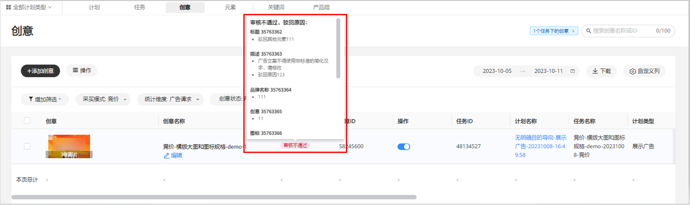
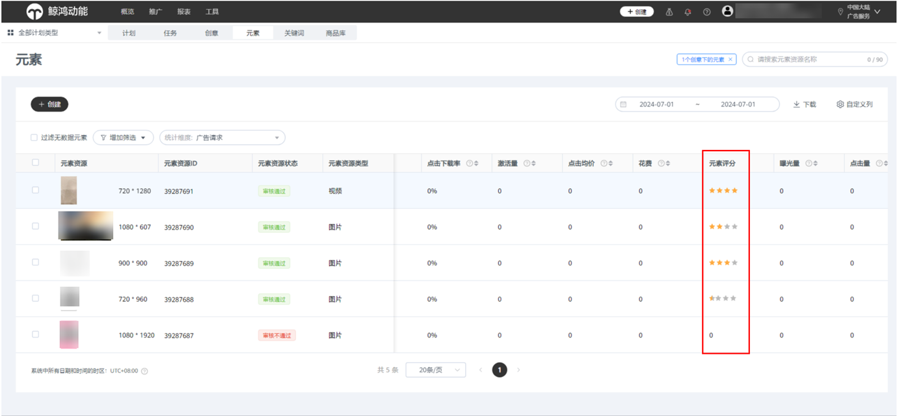
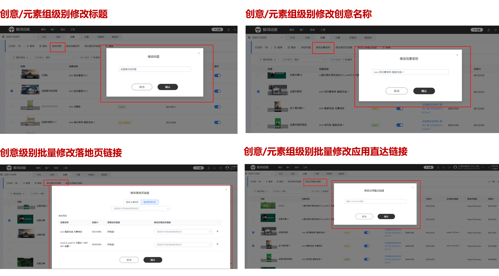

# 管理全域智投任务

创意提交审核后，您可在“推广”-&gt;“创意”列表中查看元素组的概览与审核结果。元素组包含标题、图片、视频等元素，在创意页面中元素组显示几图几视频的提示，可查看整个元素组的审核意见。单击元素组可跳转到该组下的所有元素界面，且可查看每个元素的审核意见。

您可在上传元素页面编辑管理元素组名称。

您可在“推广”-&gt;“元素”列表中查看创意元素的审核结果，同时可以查看到不同元素的推广数据，以及元素评分，您可根据元素评分针对性优化素材。

您可以通过“元素资源类型”进行筛选，筛选完成后勾选元素资源，单击“下载”，可下载元素数据；如果您的广告任务引用了相同的元素，那么列表中的各个元素会将账户内多个相同元素跨任务合并统计数据。

您可在“推广”-&gt;“创意”页面修改标题、名称，且支持您批量修改落地页、应用直达链接。

