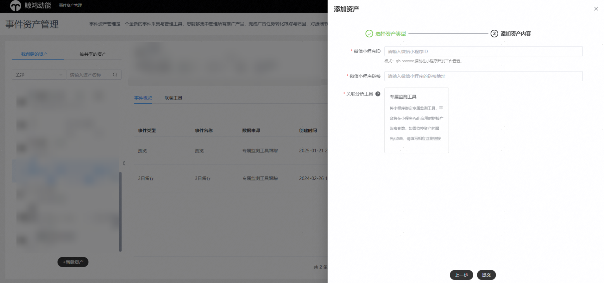
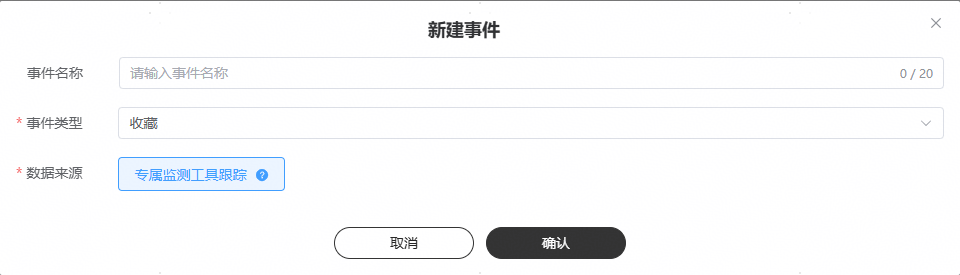

# 专属监测工具跟踪

## 基本原理

小程序专属监测工具上报数据的跟踪方式，通俗来说就是您将发生转化行为的用户信息按照回调地址格式回传给鲸鸿动能服务器，鲸鸿动能会将转化用户与广告计划关联，跟踪每个广告计划的转化效果。

采用该方式追踪时，需要开发者填写小程序链接地址，鲸鸿动能会在您的小程序启动链接上拼接广告参数发给您，这些参数的值可以在落地页打开的时候获取，参数内带有唯一识别一次转化行为的callback值，具体参数广告主可在新建指标时自由配置。广告主需要在用户行为满足转化条件时，将获得的广告参数与该用户的转化事件拼接在一起回传给指定接口，实现callback与转化事件的匹配与转化上报。

当资产创建完成后，当该资产（一级域名+path，链接问号前）发生任何广告任务推广（试投放、CPC、oCPC）时，每次落地页启动都将按照您在事件资产管理平台配置的参数，进行宏替换并下发。如您填写了曝光点击监测链接，曝光与点击数据也将同步下发。 

## 配置链接

客户端：鲸鸿动能服务器

服务端：广告主服务器

请求协议：HTTPS

请求方式：GET

接口示例：

<strong>https://www.advertiser.com/feedback?</strong>param1=param1\_value&param2=param2\_value&content\_id=\\{content\_id\\}&adgroup\_id=\\{adgroup\_id\\}&campaign\_id=\\{campaign\_id\\}&oaid=\\{oaid\\}&trace\_time=\\{trace\_time\\}&callback=\\{callback\\}&corp\_id=\\{ corp\_id \\}&app\_id=\\{ app\_id \\}

其中加粗部分URL由广告主提供的小程序path地址，红色字体即为广告主提供的小程序path中的参数，并且广告主定义参数不能与下述定义的参数名称相同，灰色部分参数为鲸鸿动能根据您账号配置拼接在上，无需手工填写。

|  |  |  |  |
| --- | --- | --- | --- |
| <strong>参数名称</strong> | <strong>类型</strong> | <strong>是否必然携带</strong> | <strong>描述</strong> |
| content\_id | string | 可选 | 创意id |
| adgroup\_id | string | 可选 | 任务id |
| campaign\_id | string | 可选 | 计划id |
| oaid | string | 是 | 设备OAID标识符，明文 |
| tracking\_enabled | string | 可选 | 0：不允许跟踪，此时不能对用户进行画像、精准推荐和精准营销  1：允许跟踪 |
| ip | string | 是 | 点击时的IP地址 |
| callback | string | 是 | 回调参数，需要在回传的转化行为数据中携带 |
| corp\_id | string | 可选 | 广告主标识 |
| campaign\_name | string | 可选 | 广告计划名称 |
| adgroup\_name | string | 可选 | 广告任务名称 |
| content\_name | string | 可选 | 广告创意名称 |
| os\_version | string | 可选 | 系统版本 |
| emui\_version | string | 可选 | emui版本号 |
| transunique\_id | string | 可选 | 统一跟踪ID |
| publisher\_type | int | 可选 | 1：内部站点 2：外部站点 |
| log\_id | string | 是 | 日志ID（一次请求下发生的日志ID，可对应点击ID） |
| referrer | string | 可选 | 广告跟踪标识符 |
| channel | string | 可选 | 媒体渠道流量入口 |
| exp\_id | string | 可选 | 实验ID |

## 操作步骤

1. <strong>新建资产</strong>

   操作入口：“新建资产”-&gt;"选择资产类型"-&gt;"微信小程序"

   - 小程序id：请手动输入小程序原始id。
   - 小程序链接：请手动输入小程序path。
   - 关联分析工具：将推广的小程序绑定专属监测工具，平台将在小程序启用时拼接广告宏参数，如需监控资产的曝光/点击、请填写相应监测链接，无论哪种方式您都需要通过转化跟踪API回传的归因后的事件数据。
   - 智能跟踪：智能跟踪将为您的资产下自动创建事件。

   如果您勾选智能跟踪，在创建资产后，不需要手动创建事件。您通过转化跟踪API数据回传到鲸鸿动能广告平台，系统收到回传数据后将解析具体事件类型（conversion\_type），后为您自动创建事件且将事件状态变为“已启用”。

   如果您未勾选智能跟踪，在创建资产后，您需要手动创建事件，并且完成手动联调，系统收到回传数据后将解析具体事件类型（conversion\_type），后将事件状态变为“已启用”。

   - 监测链接：监测链接由广告主提供，用于鲸鸿动能将用户的广告点击行为发送给广告主，主要由广告主自定义的URL和鲸鸿动能拼接的参数组成。<strong>监测链接可以选填，如您填写后宏参数会在小程序链接和监测链接后双拼双发</strong>。

   曝光监测链接：选填，用于监测曝光数据。一个资产有且仅能绑定一个曝光监测地址，资产下新建/编辑监测地址不会触发手动联调，立即生效。

   有效触点监测链接：选填，用于监测点击数据。一个资产有且仅能绑定一个有效触点监测地址，手动/自动联调后生效；如后续资产下发生监测地址编辑，手动联调通过后，新的点击监测地址生效。广告主收到点击数据并返回正确的返回值后，鲸鸿动能即认为此次点击发送成功。如您配置了“有效触点监测链接”并向客户运营申请开通“应用监测链接全量发送”白名单，鲸鸿动能将会给您发送全量曝光、点击、安装数据。

    

   对于视频广告而言，有效触点为点击和有效播放（用户看了5秒以上或者看完了整个视频广告），其他情况有效触点仅为点击。

   如实际广告投放中只有点击没有视频有效播放，有效触点量为1；没有点击有视频有效播放，有效触点量为1；有点击同时也有视频有效播放，有效触点量为2。

   

    

   （1）填写监测链接，您可用于归因，当用于归因时，请确保您能够采集到oaid进行归因，并且在可选字段勾选上oaid参数。同时您也通过监测地址仅用于监控广告的曝光与点击。（2）监测链接/小程序链接（path）的填写中广告主定义参数不能与可选字段的参数默认名称相同，否则会导致宏替换失败。例如经宏替换后出现两个callback=xxx1&callback=xxx2的情况。

   （3）监测链接/小程序链接（path）不支持手动在监测链接后拼接宏参数，宏参数配置仅允许从页面可选字段配置。
2. <strong>新建事件</strong>

   操作入口：“选择资产”-&gt;"新建事件"

   - 事件名称：选填，转化名称长度应在20字符内，只能包含中英文、数字、下划线和空格。如果不填事件名称默认为事件类型。
   - 事件类型：见[鲸鸿动能转化跟踪接口对接说明](https://alliance-communityfile-drcn.dbankcdn.com/FileServer/getFile/cmtyPub/011/111/111/0000000000011111111.20260529160257.28169101399336067757073639253257:20260531101417:2800:0161D19DE9C6B0779792C1C87953F47432C41EAE08FEB02541519BEFB5940BDF.pdf?needInitFileName=true)文档附录处，广告主可以多选。
   - 数据来源：选择专属监测工具跟踪，此数据来源通常是广告主归因后，通过转化跟踪API回传的事件数据。
   - 纳入优化目标：对于此事件，请选择是否将此事件用于出价的优化目标，还是仅用于在报表中查看此事件的转化回传量。

   

    

   同一个资产下每个事件有且仅能被添加一次，不允许重复添加。
3. <strong>手动联调</strong>

   微信小程序的联调请手动创建一条试投放任务或直接投放，当平台收到您回传的转化数据，会把您的事件状态变为启用。

## 数据回传

为验证端到端数据链路，建议广告主在正式投放之前都进行试投放（搭配[智能跟踪](/docs/monetize/promotion/ads_gongju08-0000001469108293#相关名词定义详解)与[自动激活](/docs/monetize/promotion/ads_gongju08-0000001469108293#相关名词定义详解)），确保数据回传无误。

请参考[鲸鸿动能转化跟踪接口对接说明(中国大陆)v2.1.6](https://alliance-communityfile-drcn.dbankcdn.com/FileServer/getFile/cmtyPub/011/111/111/0000000000011111111.20260529160257.01972236509982451053624945144299:20260531101417:2800:95020910EC03B9F2F2CC5D7FD2F90E7B72CCA3F55901E0099BEE6ACB6A5B156F.pdf?needInitFileName=true)
