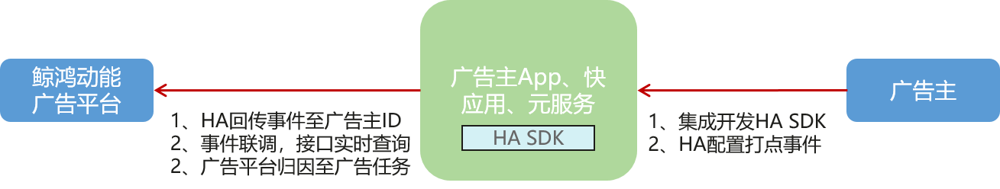
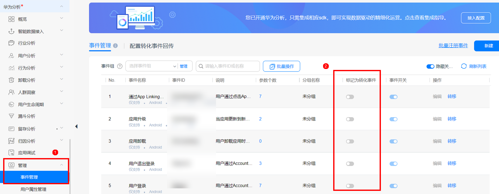
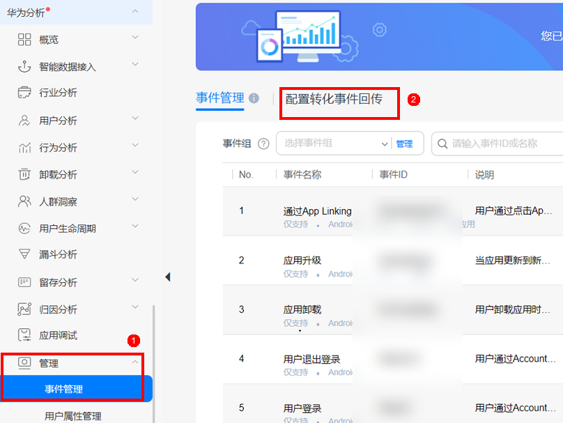
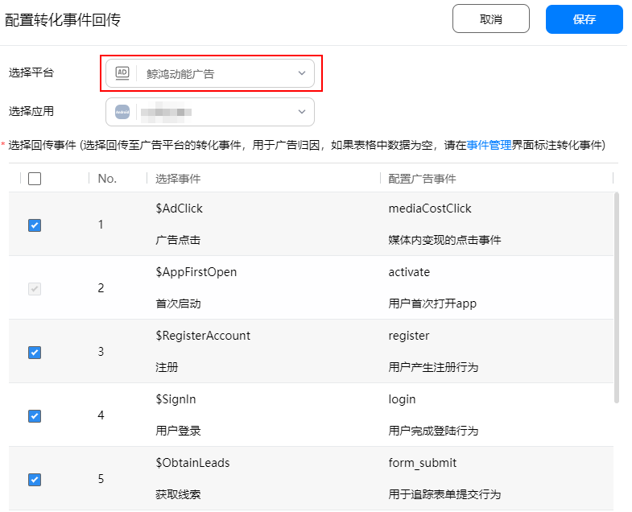
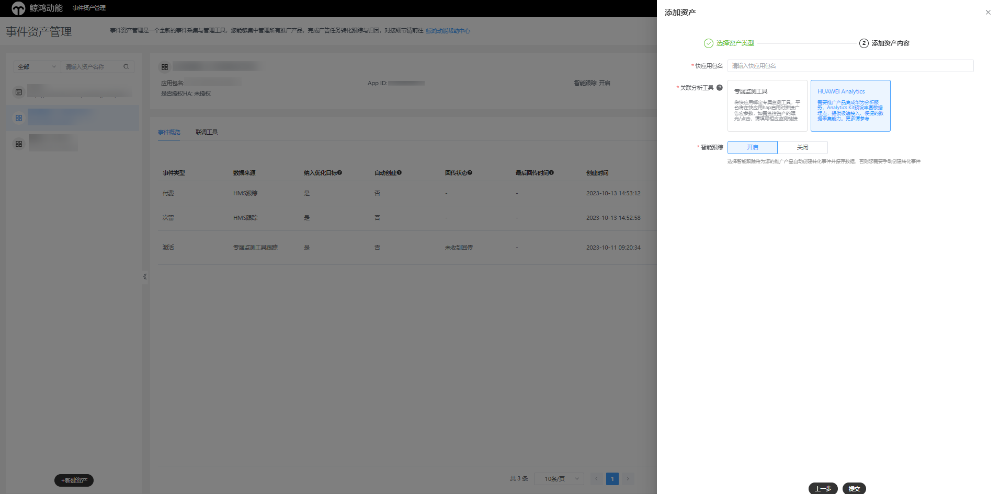
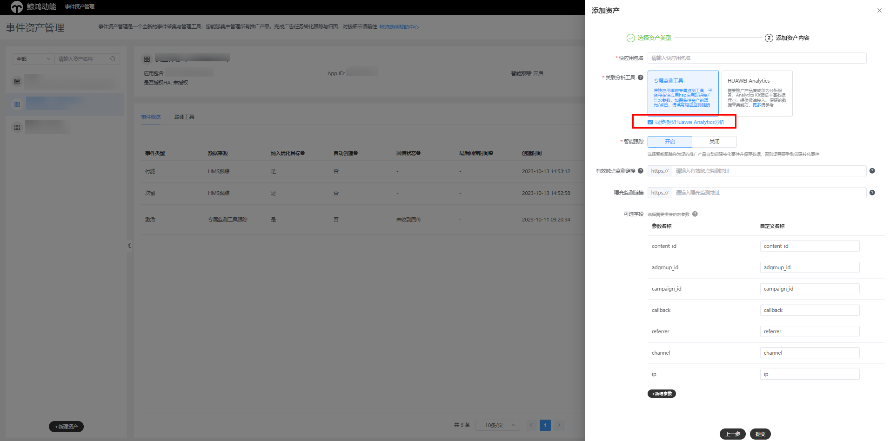
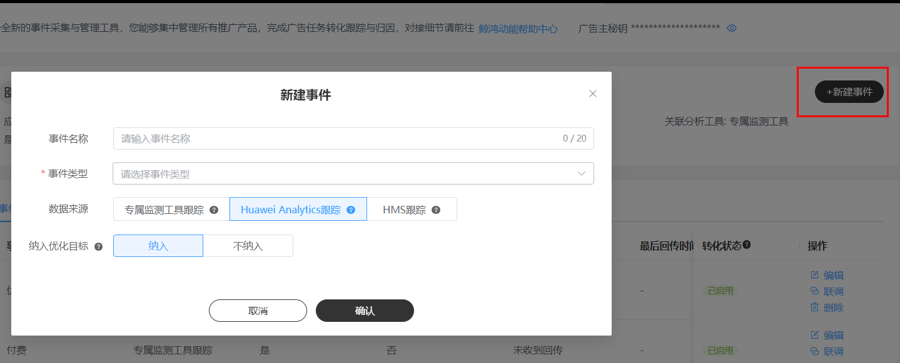
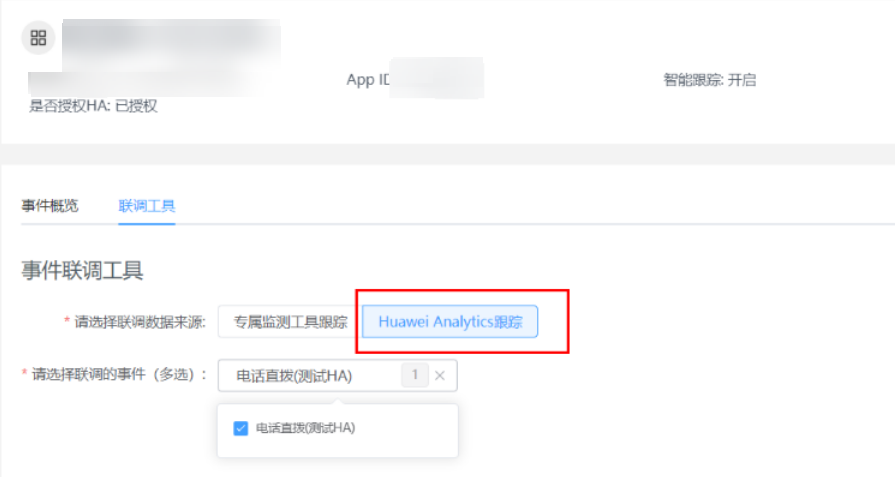
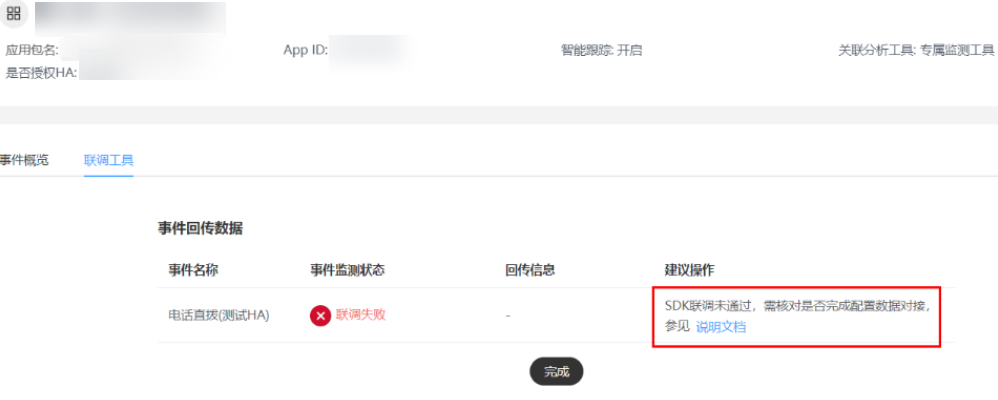

# Huawei Analytics跟踪

 

由于业务调整，我们将于2024年6月30日关闭华为分析的开通入口，不再支持新用户注册。已开通华为分析服务的项目的开发者不受影响，仍可继续使用华为分析服务，如有变更，我们会另行通知。感谢您的支持！

## 基本原理

通过在快应用内开通并集成华为分析Huawei Analytics SDK，您可以将快应用内的关键行为事件回传，将这些数据关联广告投放，以用户关键行为作为转化目标，探索到更优质的用户，使用SDK前您需要申请集成并完成数据检测，具体流程及相关信息请参考以下说明：

## 配置Huawei Analytics：

1、开通华为分析服务并集成、初始化SDK。

（1）开通华为分析服务详情请参见[开通服务](https://developer.huawei.com/consumer/cn/doc/development/HMSCore-Guides/service-enabling-0000001050745155)。

（2）集成Android SDK详情请参见[集成SDK](https://developer.huawei.com/consumer/cn/doc/development/HMSCore-Guides/android-integrating-sdk-0000001050161876)。

（3）初始化Android SDK详情请参见[初始化Analytics SDK](https://developer.huawei.com/consumer/cn/doc/development/HMSCore-Guides/android-accessing-0000001050161888#section1713572355712)。

2、在事件管理平台新建关联Huawei Analytics的资产，并且在该资产下新建具体事件，具体参考操作流程。

3、在华为分析服务侧注册并标记转化事件。

（1）选择“华为分析”&gt;“管理”&gt;“事件管理”。

（2）将需要回传的事件标记为转化事件。

（3）注册并埋点需要回传的预置事件（可选），自采集事件无需此操作。

1. 预置事件注册方法请参考[新建预置事件或自定义事件](https://developer.huawei.com/consumer/cn/doc/development/HMSCore-Guides/meta-manage-0000001050985177)。
2. 预置事件在SDK侧的埋点方法请参考[预置事件使用指导](https://developer.huawei.com/consumer/cn/doc/development/HMSCore-Guides/android-usage-guide-0000001135571462)。

4、在华为分析服务侧配置转化事件回传。

选择“配置转化事件回传”，配置回传转化事件相关信息。

（1）选择平台：选择“鲸鸿动能广告”。

（2）选择应用：选择需要配置回传事件的快应用的名称。

（3）配置分析服务事件与广告事件的映射关系。

Huawei Analytics分析服务与鲸鸿动能广告部分事件已有默认映射关系，无需再次配置，且已默认勾选回传。如果默认映射的事件不能满足您的需求，您也可以手动配置华为分析服务与鲸鸿动能广告事件的映射关系，无默认映射关系的事件，可在“配置广告事件”列选择广告事件，配置分析服务与鲸鸿动能广告事件的映射关系。

（4）勾选需要回传的事件前面的复选框（仅无默认映射关系的需要手动勾选，有默认映射关系的已自动勾选）。

（5）点击保存，完成配置。

 

Huawei Analytics分析服务与鲸鸿动能广告事件已有默认映射关系的事件如下表所示，除了$ClickNotification均会被默认勾选回传。

| <strong>华为分析服务回传事件ID</strong> | <strong>华为分析事件描述</strong> | <strong>鲸鸿动能广告事件</strong> | <strong>鲸鸿动能广告事件描述</strong> |
| --- | --- | --- | --- |
| $AppFirstOpen | 首次启动应用时上报。 | activate | 用户首次打开App。 |
| $ObtainAchievement | 达成某项新成就时上报。 | achievementUnlocked | 追踪用户成就解锁的事件。 |
| $AddProduct2Cart | 加入购物车时上报。 | addToCart | 用户产生加入购物车行为。 |
| $AddProduct2WishList | 加入收藏夹时上报。 | addToWishlist | 添加到心愿清单。 |
| $ContactCustomService | 联系客服时上报。 | phoneDialing | 电话直拨。 |
| $ViewContent | 点击内容时上报。 | contentView | 用于追踪内容视图事件。 |
| $ObtainVoucher | 领取优惠券时上报。 | coupon | 用户点击卡券领取按钮。 |
| $CreateRole | 创建角色时上报。 | createRole | 创建角色。 |
| $ObtainLeads | 获取到销售线索时上报。 | form\_submit | 用于追踪表单提交行为。 |
| $StartCheckout | 开始结算时上报。 | initiatedCheckout | 用于追踪结账事件。 |
| $Invite | 在应用内邀请其他用户时上报。 | invite | 用户产生邀请（社交）行为。 |
| $SignIn | 登录时上报。 | login | 用户完成登录行为。 |
| $ClickNotification | 点击Push通知时上报。（该事件不会被默认勾选回传。） | openedFromPushNotification | 用于追踪从推送通知打开应用的事件。 |
| $CreateOrder | 创建订单时上报。 | preOrder | 用户产生下单行为。 |
| $RegisterAccount | 注册账号时上报。 | register | 用户产生注册行为。 |
| $Search | 搜索时上报。 | search | 用户产生搜索行为。 |
| $ShareContent | 分享商品或内容时上报。 | share | 用户产生分享行为。 |
| $CompletePurchase | 支付完成时上报。 | paid | 用户产生付费行为。 |
| $AddQuickApp | 应用添加到桌面时上报。（仅快应用使用） | addQuickApp | 用户通过广告打开快应用，并将快应用添加到桌面的行为。 |
| $ReserveService | 预约了某项服务时上报。 | reservation | 用户预约了某项服务。 |
| $CompleteOrder | 确认收货后时上报。 | orderSigning | 用户产生下单行为后签收。 |
| $Rate | 评论App、服务、商品时上报。 | rate | 用于追踪商品/应用评级事件。 |
| $Lottery | 参与抽奖活动时上报。 | lottery | 用户点击抽奖按钮。 |
| $Vote | 参与投票时上报。 | vote | 用户点击投票按钮。 |
| $Redeem | 使用兑换码成功兑换礼包后上报。 | gamePackageRedemption | 用户兑换礼包。 |
| $ClaimGift | 领取礼包时上报。 | gamePackageClaiming | 用户领取礼包。 |
| $ConsumeVirtualCoin | 消费虚拟币时上报。 | spentCredits | 用于追踪用户积分花费的事件。 |
| $FollowContent | 关注内容时上报。 | follow | 用户关注。 |
| $LikeContent | 点赞相关内容时上报。 | like | 被用户点赞。 |
| $CommentContent | 评论相关内容时上报。 | comment | 被用户评论。 |
| $LaunchApp | 用户打开应用时上报。 | openApp | 打开应用。 |
| $AdDisplay | 展示广告。 | mediaCostImp | 媒体变现曝光。 |
| $AdClick | 点击广告。 | mediaCostClick | 媒体变现点击。 |
| $CreatePaymentInfo | 添加支付信息。 | addPaymentInfo | 添加付款信息。 |
| $NoviceGuideEnd | 完成新手引导页。 | tutorialCompletion | 完成新手教程。 |
| $UpgradeLevel | 等级提升。 | levelAchieved | 达到级别。 |

## 操作步骤

1. <strong>新建资产</strong>

   操作入口：“工具”-&gt;"事件资产管理"-&gt;"新建资产"

   - 推广应用：请输入快应用包名，例如：com.huawei.appmarket。
   - 关联分析工具：将推广的应用关联到具体的分析工具，此处选择关联Huawei Analytics；同时您也可以关联专属监测工具，同时勾选授权Huawei Analytics分析。无论哪种方式，请确保您选择的推广应用已经集成并配置了HA SDK。配置步骤请参照[配置Huawei Analytics](/docs/monetize/promotion/ads-gongju-kyy-hagz-0000001688019437)<strong>。</strong>
   - 智能跟踪：

     如果您勾选智能跟踪，在创建资产后，不需要手动创建事件。通过Huawei Analytics数据回传到鲸鸿动能广告平台，系统收到回传数据后将解析具体事件类型（conversion\_type），后为您自动创建事件且将事件状态变为“已启用”。

     如果您未勾选智能跟踪，在创建资产后，您需要手动创建事件，并且完成手动联调。每次手动联调，平台将实时查询您在HA配置的事件情况，通过解析具体事件类型（conversion\_type），后将事件状态变为“已启用”。

     注意：在仅关联Huawei Analytics情况下生效；智能跟踪在同步授权Huawei Analytics情况下，智能跟踪优先专属监测工具（广告主回传）的，由HA上报的事件将无法智能跟踪。
   - 监测链接：

     当仅关联Huawei Analytics情况下，不会存在监测链接填写框，也不需要填写。如选择同步授权Huawei Analytics时，监测链接配置指导请参考应用资产[专属监测工具跟踪](/docs/monetize/promotion/ads-gongju-kyy-jiance-0000001688138613)。
   - 可选字段：

     当仅关联Huawei Analytics情况下，不会存在监测链接填写框，也不需要填写。如选择同步授权Huawei Analytics时，监测链接配置指导请参考应用资产[专属监测工具跟踪](/docs/monetize/promotion/ads-gongju-kyy-jiance-0000001688138613)。

   

   
2. <strong>新建事件</strong>

   操作入口：“选择资产”-&gt;"新建事件"

   - 事件名称：选填，转化名称长度应在20字符内，只能包含中英文、数字、下划线和空格。如果不填事件名称默认为事件类型。
   - 事件类型：见 [事件类型表格](#ZH-CN_TOPIC_0000001688019437__table335863785119)，广告主可以多选。
   - 数据来源：选择专属监测工具跟踪，您在新建资产时绑定的点击/曝光监测链接，通常来说这是由点击监测下发的设备ID，由广告完成归因后，回传的事件数据。
   - 纳入优化目标：对于此事件，请选择是否将此事件用于出价的优化目标，还是仅用于在报表中查看此事件的转化回传量。

   

    

   （1）同一个资产下每个事件有且仅能被添加一次，不允许重复添加。

   （2）资产下的一个事件仅可能存在一个数据来源，不支持多选数据来源。
3. <strong>手动联调</strong>
   - 选择数据来源：此数据来源选择范围为该资产下具体存在哪几类数据来源，此时请选择Huawei Analytics跟踪。
   - 选择事件类型：选择您需要手动联调的事件。

   

   - 开始联调：请在页面等待联调结果，联调结束前，请不要进行任何操作，等待Huawei Analytics返回联调数据。

    

   对于数据来源为Huawei Analytics的事件联调，不支持联动激活 ，即对于每一个事件都需要进行一次联调，不会存在该资产下一个事件联调成功，资产下其他事件的事件状态联动更新为已启用。

## 数据回传

对于数据来源为Huawei Analytics的事件数据回传，请参考[配置Huawei Analytics](/docs/monetize/promotion/ads-gongju-kyy-hagz-0000001688019437)，将具体事件数据推送到鲸鸿动能广告账户。
