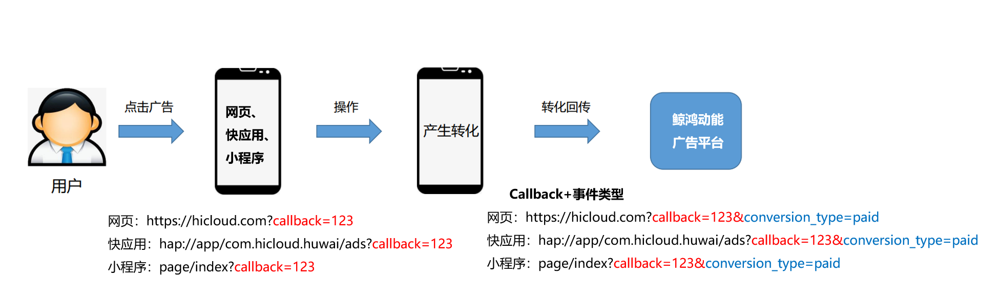
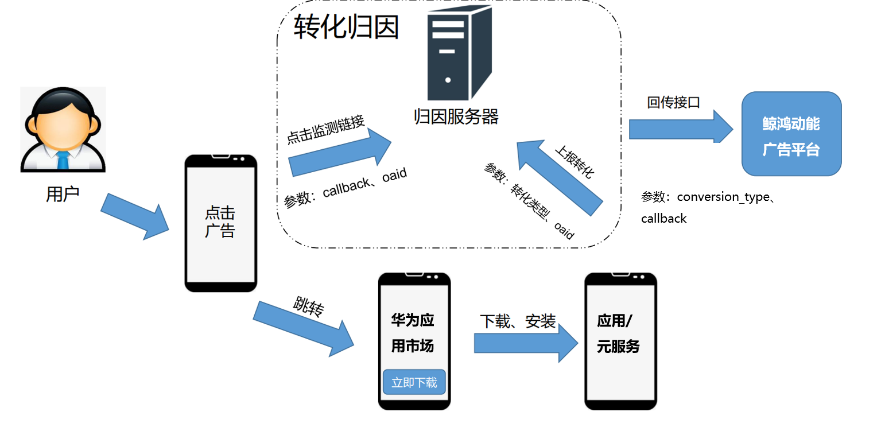
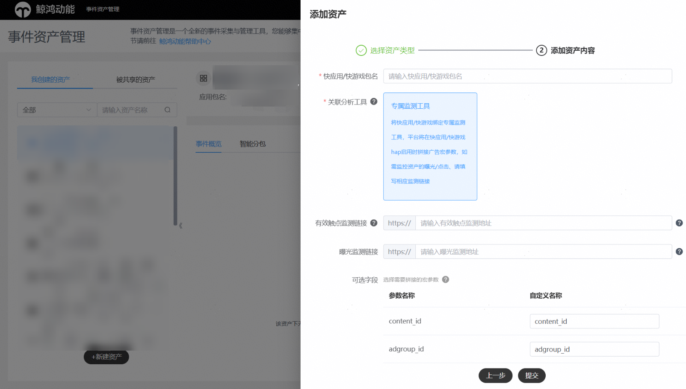
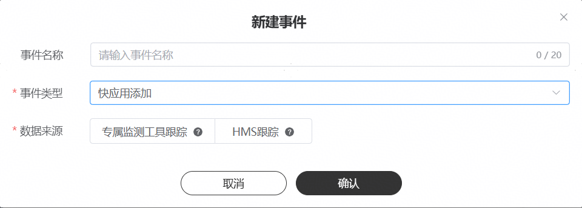
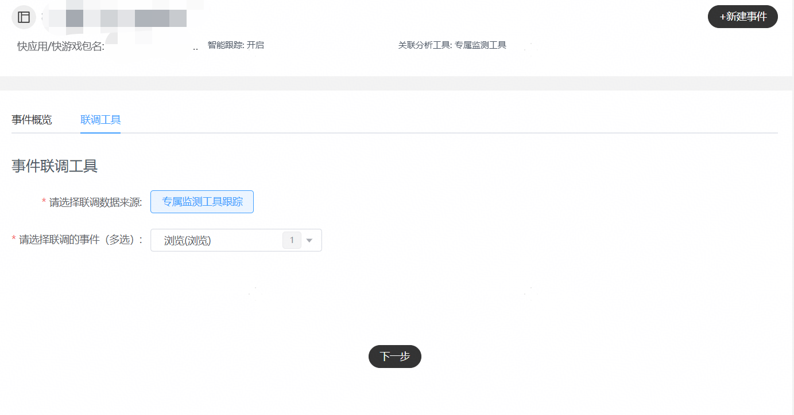
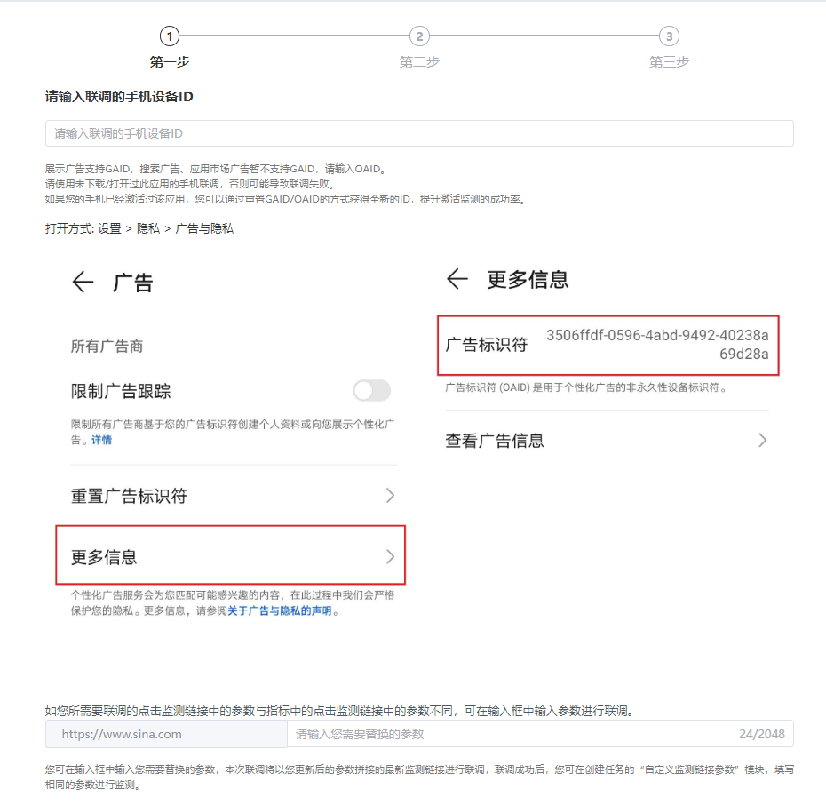
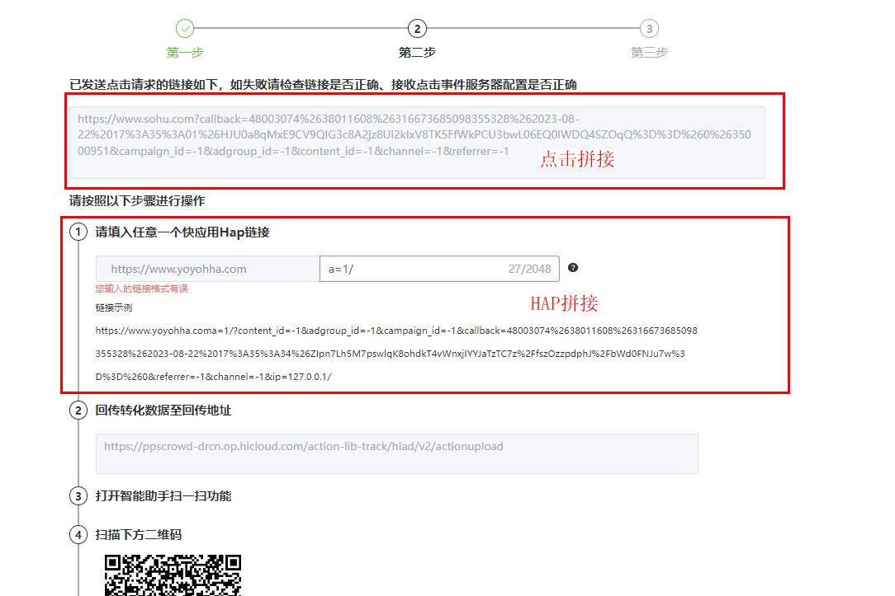
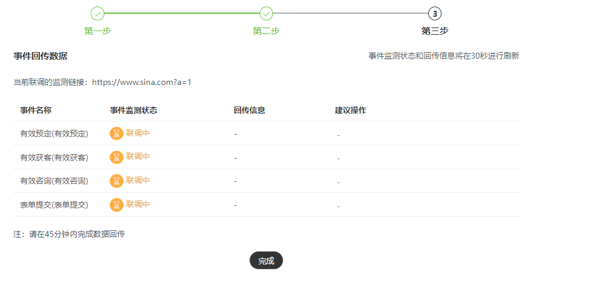

# 专属监测工具跟踪

## 基本原理

（1）快应用拼接：快应用专属监测工具上报数据的跟踪方式，通俗来说就是您将发生转化行为的用户信息按照回调地址格式回传给鲸鸿动能服务器，鲸鸿动能会将转化用户与广告计划关联，跟踪每个广告计划的转化效果。

采用该方式追踪时，需要开发者填写具体的快应用包名，鲸鸿动能会在该包名下的hap启动链接上拼接广告参数，这些参数的值可以在hap打开的时候获取，参数内带有唯一识别一次转化行为的callback值，具体参数广告主可在新建指标时自由配置。广告主需要在用户行为满足转化条件时，将获得的广告参数与该用户的转化事件拼接在一起回传给指定接口，实现callback与转化事件的匹配与转化上报，快应用、网页、小程序的跟踪方案需要区分落地页拼参数和点击监测，避免混淆可提供两种方案的接入和联调。

（2）设备ID归因：通过专属监测工具上报事件数据，可以实现鲸鸿动能端和广告主端的信息互通，完成广告效果的归因，从而提高广告的优化效果，提高广告投放效率。广告主在鲸鸿动能的事件资产管理平台创建资产时，选择专属监测工具，后填写监测链接。点击监测链接是广告主的API，用来接受鲸鸿动能发送的广告点击信息。点击信息中会包含终端用户关键的设备ID字段。同时，点击监测中还有一个关键的宏参数\_CALLBACK\_，这是鲸鸿动能的点击标识，随每次广告点击都会进行宏替换，原则上每次广告点击被替换后的callback都不一样。

广告主收到点击监测后，需要将设备ID和callback的对应关系缓存起来。当广告主自己的 快应用内发生转化行为时，广告主可以在自己的 快应用内采集设备ID，并在收到的点击中逐一匹配，如果命中，就将对应的 callback 回传给鲸鸿动能广告平台的回传接口，完成一次转化上报。请匹配30天内的转化，如果广告主监测到的某种转化行为是在广告点击行为的30天后，该次转化将不会被视为有效转化。

 

若您在绑定资产时填写了点击监测链接，以上两种转化跟踪可以同时存在，若同时回传，广告平台会按照callback去重。

## 配置链接

客户端：鲸鸿动能服务器

服务端：广告主服务器

请求协议：HTTPS

请求方式：GET

接口示例：

<strong>hap://www.advertiser.com/feedback?</strong>param1=param1\_value&param2=param2\_value&content\_id=\\{content\_id\\}&adgroup\_id=\\{adgroup\_id\\}&campaign\_id=\\{campaign\_id\\}&oaid=\\{oaid\\}&trace\_time=\\{trace\_time\\}&callback=\\{callback\\}&corp\_id=\\{ corp\_id \\}&app\_id=\\{ app\_id \\}

其中加粗部分URL由广告主提供的落地页地址，红色字体即为广告主提供的hap中的参数，并且广告主定义参数不能与下述定义的参数名称相同，灰色部分参数为鲸鸿动能根据您账号配置拼接在上，无需手工填写。

|  |  |  |  |
| --- | --- | --- | --- |
| <strong>参数名称</strong> | <strong>类型</strong> | <strong>是否必然携带</strong> | <strong>描述</strong> |
| content\_id | string | 是 | 创意id |
| adgroup\_id | string | 是 | 任务id |
| campaign\_id | string | 是 | 计划id |
| oaid | string | 可选 | 设备OAID标识符，明文 |
| tracking\_enabled | string | 可选 | 0：不允许跟踪，此时不能对用户进行画像、精准推荐和精准营销  1：允许跟踪 |
| ip | string | 是 | 点击时的IP地址 |
| callback | string | 是 | 回调参数，需要在回传的转化行为数据中携带 |
| corp\_id | string | 可选 | 广告主标识 |
| campaign\_name | string | 可选 | 广告计划名称 |
| adgroup\_name | string | 可选 | 广告任务名称 |
| content\_name | string | 可选 | 广告创意名称 |
| os\_version | string | 可选 | 系统版本 |
| emui\_version | string | 可选 | emui版本号 |
| transunique\_id | string | 可选 | 统一跟踪ID |
| publisher\_type | int | 可选 | 1：内部站点 2：外部站点 |
| log\_id | string | 可选 | 日志ID（一次请求下发生的日志ID，可对应点击ID） |
| referrer | string | 是 | 广告跟踪标识符 |
| channel | string | 是 | 媒体渠道流量入口 |
| exp\_id | string | 可选 | 实验ID |

## 操作步骤

1. <strong>新建资产</strong>

   操作入口：“新建资产”-&gt;"选择资产类型"-&gt;"快应用"

   - 推广快应用：请输入快应用包名，例如：com.huawei.appmarket。
   - 关联分析工具：将推广的快应用绑定专属监测工具，平台将在快应用启用时在hap拼接广告宏参数，如需监控资产的曝光/点击、请填写相应监测链接，无论哪种方式您都需要通过转化跟踪API回传的数据。
   - 智能跟踪：智能跟踪将为您的资产下自动创建事件。

   如果您勾选智能跟踪，在创建资产后，不需要手动创建事件。您通过转化跟踪API数据回传到鲸鸿动能广告平台，系统收到回传数据后将解析具体事件类型（conversion\_type），后为您自动创建事件且将事件状态变为“已启用”。

   如果您未勾选智能跟踪，在创建资产后，您需要手动创建事件，并且完成手动联调，系统收到回传数据后将解析具体事件类型（conversion\_type），后将事件状态变为“已启用”。

   - 监测链接：监测链接由广告主提供，用于鲸鸿动能将用户的广告点击行为发送给广告主，主要由广告主自定义的URL和鲸鸿动能拼接的参数组成。<strong>监测链接可以选填，如您填写后宏参数会在网页链接和监测链接后双拼双发。</strong>

   曝光监测链接：选填，用于监测曝光数据。一个资产有且仅能绑定一个曝光监测地址，资产下新建/编辑监测地址不会触发手动联调，立即生效。

   有效触点监测链接：选填，用于监测点击数据。一个资产有且仅能绑定一个有效触点监测地址，手动/自动联调后生效；如后续资产下发生监测地址编辑，手动联调通过后，新的点击监测地址生效。广告主收到点击数据并返回正确的返回值后，鲸鸿动能即认为此次点击发送成功。如您配置了“有效触点监测链接”并向客户运营申请开通“应用监测链接全量发送”白名单，鲸鸿动能将会给您发送全量曝光、点击、安装数据。

    

   对于视频广告而言，有效触点为点击和有效播放（用户看了5秒以上或者看完了整个视频广告），其他情况有效触点仅为点击。

   如实际广告投放中只有点击没有视频有效播放，有效触点量为1；没有点击有视频有效播放，有效触点量为1；有点击同时也有视频有效播放，有效触点量为2。

   - 可选字段：

     您可以自定义宏参数名称，宏参数的明细字段，请参照[配置链接](#section82271643193112)<strong>。</strong>

   

    

   （1）填写监测链接，您可用于归因，当用于归因时，请确保您能够采集到oaid进行归因，并且在可选字段勾选上oaid参数。同时您也通过监测地址仅用于监控广告的曝光与点击。

   （2）监测链接的填写中广告主定义参数不能与可选字段的参数默认名称相同，否则会导致宏替换失败。例如经宏替换后出现两个callback=xxx1&callback=xxx2的情况。

   （3）监测链接不支持手动在监测链接后拼接宏参数，宏参数配置仅允许从页面可选字段配置。
2. <strong>新建事件</strong>

   操作入口：“选择资产”-&gt;"新建事件"

   - 事件名称：选填，转化名称长度应在20字符内，只能包含中英文、数字、下划线和空格。如果不填事件名称默认为事件类型。
   - 事件类型：见[鲸鸿动能转化跟踪接口对接说明](https://alliance-communityfile-drcn.dbankcdn.com/FileServer/getFile/cmtyPub/011/111/111/0000000000011111111.20260529160256.02757981179161034808038291578000:20260531101413:2800:F6EBEEAC5D51118E63F4622BDA7F231CCBEC0895CBBAA4CCFE6ED606C7BA4403.pdf?needInitFileName=true)文档附录处，广告主可以多选。
   - 数据来源：选择专属监测工具跟踪，此数据来源通常是广告主归因后，通过转化跟踪API回传的事件数据。

   

    

   （1）同一个资产下每个事件有且仅能被添加一次，不允许重复添加。

   （2）资产下的一个事件仅可能存在一个数据来源，不支持多选数据来源。
3. <strong>手动联调</strong>
   - 选择数据来源：此数据来源选择范围为该资产下具体存在哪几类数据来源，此时请选择专属监测工具跟踪。
   - 选择事件类型：选择您需要手动联调的事件。

   

   - 开始联调

   （1）输入OAID

   有且仅在您填写了点击监测链接才会出现此页面，请输入手机的OAID，OAID不进行校验，请确保输入正确。

   

   （2）请输入任何一个该包名下的任意一个hap链接，宏参数将完成替换拼接到落地页地址后，请使用手机二维码完成扫描打开落地页地址。如您填写了点击监测链接，宏参数也将同时拼接在点击监测链接后。

   

   （3）等待结果，事件状态和回传信息将在每30秒进行刷新，平台收到回传后将刷新事件监测状态，请在45分钟内完成数据回传，超时事件状态将进行刷新与迭代。

   

    

   对于数据来源来源都为专属监测工具跟踪的事件，该资产下任何一个事件联调成功，该资产所有事件状态都将更新为已启用。但您仍可以手动发起再次联调，回传记录可以在事件列表中的回传状态刷新。

## 数据回传

为验证端到端数据链路，建议广告主在正式投放之前都进行试投放（搭配[智能跟踪](/docs/monetize/promotion/ads_gongju08-0000001469108293#section8351192033415)与[自动激活](/docs/monetize/promotion/ads_gongju08-0000001469108293#section8351192033415)），确保数据回传无误。

请参考[鲸鸿动能转化跟踪接口对接说明(中国大陆)v2.1.6](https://alliance-communityfile-drcn.dbankcdn.com/FileServer/getFile/cmtyPub/011/111/111/0000000000011111111.20260529160256.26168173196407750164587369980807:20260531101413:2800:1738823982CB7B609769F666EDBC33E1A4194EDFD368DC156EB7E2F28B14C74C.pdf?needInitFileName=true)
