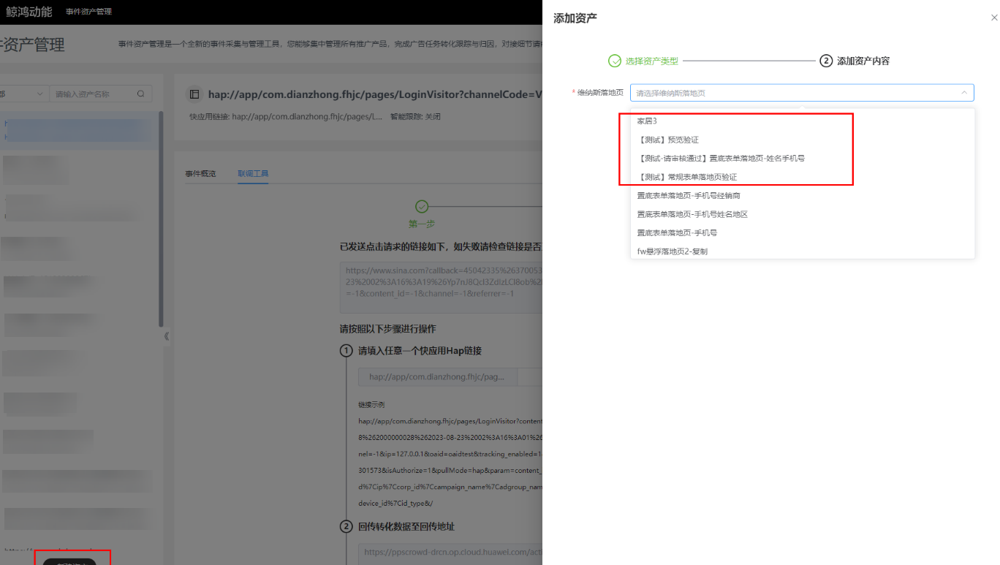
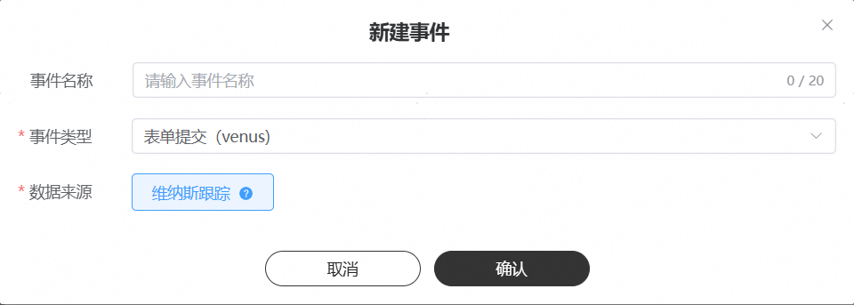

# 维纳斯落地页资产

## 基本原理

如果您投放的是维纳斯网页，想要对用户在网页中的表单行为进行跟踪，您可以在维纳斯网页内设置组件，将您的用户转化数据回传给鲸鸿动能广告平台，鲸鸿动能广告平台将您的回传数据归因到相应任务和创意上，便于您进行数据分析和广告优化。

## 操作步骤

1. <strong>新建资产</strong>

   操作入口：“新建资产”-&gt;"选择资产类型"-&gt;"维纳斯落地页"

   - 推广产品：请选择具体的维纳斯落地页

   
2. <strong>新建事件</strong>

   操作入口："选择资产"-&gt;"新建事件"

   - 事件名称：选填，转化名称长度应在20字符内，只能包含中英文、数字、下划线和空格。如果不填事件名称默认为事件类型。
   - 事件类型：仅限表单提交（venus）、有效线索、潜在客户线索、已经成单线索、申请企微好友、通过企微好友、企微首次开口。
   - 数据来源：选择维纳斯跟踪，维纳斯跟踪的事件数据来源于，您在维纳斯表单内创建的组件，无需集成开发，事件类型有限。
   - 纳入优化目标：对于此事件，请选择是否将此事件用于出价的优化目标，还是仅用于在报表中查看此事件的转化回传量。

   

    

   （1）同一个资产下每个事件有且仅能被添加一次，不允许重复添加。

   （2）资产下的一个事件仅可能存在一个数据来源，不支持多选数据来源。
3. <strong>手动联调</strong>

   维纳斯不存在联调动作，创建事件后所有事件会默认已启用。
