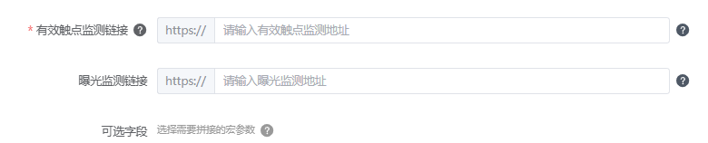

# 2026年1月高频问题Q&A

<strong>Q1：当推广产品涉及以营利为目的时，需要提供《增值电信业务经营许可证》，该许可证需要包含的业务种类是？</strong>

<strong>A：</strong>请根据您的业务场景及相关法律法规要求提供对应类型的业务许可，例如：B25信息服务业务。如有疑问可详询相关监管部门或专业机构。（具体资质示例可查看文档：[增值电信业务经营许可证](https://developer.huawei.com/consumer/cn/doc/promotion/ads-zhizizhenzhaoshilishuoming-0000002021275500#section73121358184418)）。

<strong>Q2：在使用转化跟踪API进行联调时，可选字段的参数是由系统自动拼接，还是需要在填写有效触点监测链接时就手动拼接好并一同选择呢</strong> <strong>？</strong>

<strong>A：</strong>需要替换的宏参数在页面选中即可，不需要在监测链接后手动拼接，实际投放时下发的点击消息，会根据选择的宏参数，自动拼接在点击监测链接后面。

<strong>Q3：推广产品名称大于七个字怎么写品牌名称？</strong>

<strong>A：</strong>鲸鸿动能广告素材搭建对品牌名称的要求是7个字以内，在推广产品名称不超7个字的前提下，请使用对应产品名称；若推广产品名称超过7个字，可对产品名称进行缩写，建议对名称前面字符或后面字符缩减（不建议在名称中间进行缩减），缩减仅允许减少字数，请勿添加原产品名称中没有的文字，缩减后请务必在华为应用市场搜索缩写后的产品名，需要保证不要和其他APP撞名。

<strong>Q4：广告搭建时，任务层级的点击监测填写了之后，创意层级的点击监测还要写吗？</strong>

<strong>A：</strong>投放oCPC任务时可在“自定义监测链接参数”中填写有效触点监测链接，需先确认您的指标为已启用状态方可有填写框。创意层级的监测链接是给第三方监测平台使用，一般广告主不需要配置，如果要配置，需要填写和鲸鸿动能已合作的第三方监测平台的域名才可以，具体可使用域名在投放后台填写监测链接处，鼠标悬停"?"上会展示。

<strong>Q5：贷超或者助贷机构可以以纯表单的形式推广吗？</strong>

<strong>A：</strong>贷超或者助贷机构不支持无APP承接的纯表单形式投放。

<strong>Q6：如何更好的理解N1和N2客户行业的区别？</strong>

<strong>A：</strong>N1：以提供线上互联网运营服务、应用服务、信息服务为主的行业；

N2：以提供线下服务为主的行业、传统实业；

可以根据上述信息进行参考理解，具体还请以审核结果为准。

<strong>Q7：一个任务下可以创建多少个创意，多少个素材？</strong>

<strong>A：</strong>一个任务10个创意，一个创意里面最多10张图片素材，5个视频素材。

<strong>Q8：单账户下非删除状态的竞价试投放任务数是多少个？</strong>

<strong>A：</strong>当前单账户下非删除状态的竞价试投放任务数不得大于20个，如后台提示“试投放任务数已达上限”，请在任务列表页面筛选不需要的试投放任务进行删除。

<strong>Q9：鲸鸿动能支持投放外链APK包吗？</strong>

<strong>A：</strong>鲸鸿动能暂不支持投放外链APK包。

<strong>Q10：当账户提示授权到期需要续约时，如何修改账户的授权有效期？授权有效期需要设置多长时间？</strong>

<strong>A：</strong>如果需要修改账户授权有效期，可以在上一级服务商后台或账户后台修改即可。

① 登陆上一级服务商后台-对应账户点编辑-账户基本信息处（授权有效期）-提交；

② 如果需要修改子客账户授权有效期：登陆子客账户-工具-广告账户管理-企业信息-下拉最下方点编辑-授权信息（授权有效期）-提交；

③ 如果需要修改子客服务商授权有效期：登陆子客服务商后台-账号管理-账户信息-企业信息（授权有效期）-提交。

账户授权有效期是根据服务商和对应下属服务商/子客之间的实际合作情况来设置，可拉长时间选择。

<strong>Q11：使用管理式华为账号的成员账号开通的子客账户如何修改密码或邮箱信息？</strong>

<strong>A：</strong>需要用管理式华为账号的主账号登录管理式华为账号后台找到对应的成员账号去做修改。

<strong>Q12：</strong> <strong>鲸鸿动能平台支持通过自定义或维纳斯落地页推广跳转添加广告主企业微信吗？</strong>

<strong>A：</strong>推广链路是支持的，具体任务过审情况请以实际提交的素材审核情况为准。

<strong>Q13：没有上架华为应用市场的应用能进行转化跟踪API联调吗？</strong>

<strong>A：</strong>暂不支持未上架应用进行转化跟踪API联调。
