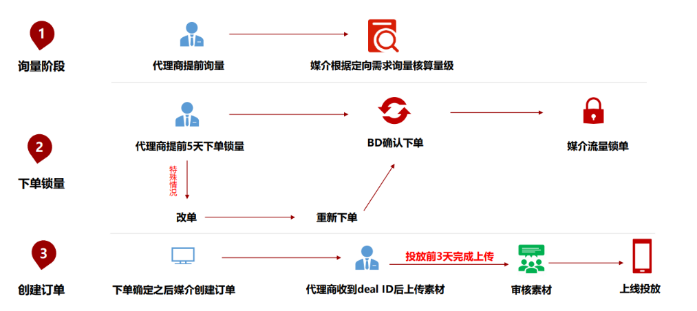
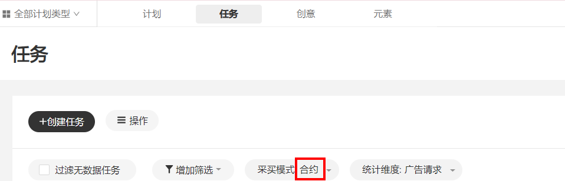

# 创建合约广告

## 投放流程

## 操作步骤

1. <strong>品牌询量</strong>

   由服务商/广告主提交询量需求邮件，询量表需按照要求填写清晰，比如预算、投放时间、定向需求等，详情请参考[询量表](https://alliance-communityfile-drcn.dbankcdn.com/FileServer/getFile/cmtyPub/011/111/111/0000000000011111111.20260529160003.13638217983961891163655272376582:20260531101313:2800:7FB9A057FD1B18BFCFC71B02691FE43E8E1B9FBDDAB3F5C5E2F5E63C7FE0A4FB.xlsx?needInitFileName=true)。鲸鸿动能媒介收到询量邮件后，会按照询量需求回复询量结果。

    

   - 合约广告应于投放前5天下单锁定排期，投放前3天完成素材审核，如未能按时下单及提交广告素材，鲸鸿动能不保证广告准时上线和广告曝光量，由此导致的风险及损失由客户自行承担。
   - 询量仅为参考，具体以实际投放数据为准。
   - 若询量的定向涉及人群打包，请提前2天将人群要求提供给鲸鸿动能运营，由鲸鸿动能运营进行打包，避免因为人群包打包不及时，影响询量。

   邮件可按照以下要求进行发送：

   - 邮件主送：鲸鸿动能媒介（具体可咨询鲸鸿动能商务）。
   - 抄送：petaladscnt@huawei.com、鲸鸿动能侧对应的商务、运营、相关领导（具体可咨询鲸鸿动能商务）；服务商/广告主侧的渠道商务、直客商务、运营、媒介等相关同事。
2. <strong>下单锁量</strong>

   服务商/广告主可以根据询量结果向鲸鸿动能商务进行下单，鲸鸿动能商务确认后，即下单成功。

   邮件按照以下要求进行发送：

   - 下单邮件内容：
     - 客户确认下单邮件，邮件需附带下单的资源与金额等。
     - 询量回复邮件。
     - 可供下载的[下单表](https://alliance-communityfile-drcn.dbankcdn.com/FileServer/getFile/cmtyPub/011/111/111/0000000000011111111.20260529160003.47375504502692201299218530211329:20260531101313:2800:42934D97F94F67A344458FC28C2735EE415F3FEE7C71E93F74015B68C1CF7F8F.xlsx?needInitFileName=true)和[任务表](https://alliance-communityfile-drcn.dbankcdn.com/FileServer/getFile/cmtyPub/011/111/111/0000000000011111111.20260529160003.22919344349238142029913813879495:20260531101313:2800:923B714537FD6BEF7944CD3B618A2386894B66ABF3097A5DFFC1C53423BCF88E.xlsx?needInitFileName=true)。
   - 邮件主送：鲸鸿动能商务。
   - 抄送：petaladscnt@huawei.com、鲸鸿动能侧运营、媒介、相关责任人（具体可咨询鲸鸿动能商务）；服务商/广告主侧的渠道商务、直客商务、运营、媒介等相关同事。

   鲸鸿动能媒介会根据下单表与任务表创建任务，若是通过三方DSP投放，则反馈订单ID；若是通过华为DSP投放，则同步任务状态。
3. <strong>素材预审</strong>

   服务商/广告主需要邮件提交广告投放素材给鲸鸿动能行业运营进行预审，以便于提前修改素材，避免影响正式任务投放，素材详细要求请看[刊例资源](/docs/monetize/promotion/ads-heyuejianjie-0000001789911665)，同时部分版位有安全区要求，详情可查看[素材安全区尺寸要求](/docs/monetize/promotion/ads_shenhe035-0000001347509912)。

   邮件按照以下要求进行发送：

   - 邮件主送：鲸鸿动能行业运营。
   - 抄送：petaladscnt@huawei.com、鲸鸿动能侧对应的商务、相关责任人（具体可咨询鲸鸿动能商务）；服务商/广告主侧的渠道商务、直客商务、运营、媒介等相关同事。

    

   该步骤可以与步骤1和步骤2同步进行。
4. <strong>上传素材</strong>

   若通过华为DSP进行投放广告，则需要服务商/广告主登录广告主账户，在“推广”-&gt;“任务”页面筛选“采买模式：合约”，找到对应合约任务并上传素材。上传完毕后，您需同步任务ID给鲸鸿动能运营，鲸鸿动能行业运营需提交最后一层创意审核。示例：

   

   若通过三方DSP进行投放广告，则需要服务商/广告主返回广告素材，具体如何返回可咨询您公司的研发同事。
5. <strong>广告投放</strong>

   任务审核通过后，将会按照约定时间进行投放，请观察数据。

## FAQ

<strong>Q1:合约广告是怎么溢价的？</strong>

答：定向溢价可参考[刊例资源](/docs/monetize/promotion/ads-heyuejianjie-0000001789911665)，如有不确定溢价标准可咨询鲸鸿动能商务/媒介。

<strong>Q2:合约广告投放，中途要变更定向怎么办？</strong>

答：需要进行改单处理，在原有“确认下单的邮件”上进行改单，更改部分突出显示；改单邮件发出后，需由鲸鸿动能商务确认下单，鲸鸿动能媒介再根据确认下单的内容进行调整/新建任务。

<strong>Q3：大屏开机广告/锁屏广告需要提前几天上传素材？</strong>

答：需要提前3-5天上传创意并审核，否则会影响任务的实际曝光速度和量级，在投放中的任务不允许暂停、提前结束和更换素材。
